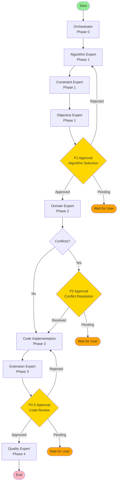

# BMAD LangGraph Workflow Architecture

## Overview

This document describes the LangGraph StateGraph architecture for the BMAD Eight-Agent System. The workflow orchestrates eight specialized agents across five phases (P0-P4) with human-in-the-loop (HITL) checkpoints.

## StateGraph Flow



## Phase Descriptions

### Phase 0: Problem Analysis

- **Agent**: Orchestrator
- **Purpose**: Analyze the problem, plan workflow, assign tasks
- **Output**: Workflow plan and task assignments
- **Next**: Automatically transition to Phase 1

### Phase 1: Algorithm & Constraints Analysis

- **Agents**: Algorithm Expert, Constraint Expert, Objective Expert
- **Purpose**:
  - Select appropriate algorithms
  - Identify and analyze constraints
  - Define optimization objectives
- **Output**: Algorithm recommendations, constraints list, objective definitions
- **HITL**: P1 Approval - User confirms algorithm selection
- **Next**: If approved → Phase 2, If rejected → Regenerate algorithm

### Phase 2: Domain Knowledge Integration

- **Agent**: Domain Expert
- **Purpose**: Provide domain-specific context and best practices
- **Output**: Domain knowledge and recommendations
- **HITL**: P2 Conflict Resolution (if conflicts detected)
- **Next**: Phase 3

### Phase 3: Code Generation

- **Agents**: Code Implementation Expert, Extension Expert
- **Purpose**:
  - Generate executable Python code
  - Analyze code extensibility
- **Output**: Python code, unit tests, extension suggestions
- **HITL**: P2.5 Approval - Code review checkpoint
- **Next**: If approved → Phase 4, If rejected → Regenerate code

### Phase 4: Quality Assessment

- **Agent**: Quality Expert
- **Purpose**: Evaluate overall quality and completeness
- **Output**: Quality report and improvement suggestions
- **Next**: Workflow complete

## State Structure

```python
class WorkflowState(TypedDict):
    # Input Data
    problem_description: str
    domain: Optional[str]
    constraints: List[str]

    # Workflow Control
    current_phase: Literal['P0', 'P1', 'P2', 'P3', 'P4']
    thread_id: str

    # Agent Outputs (8 agents)
    orchestrator_output: Dict[str, Any]
    algorithm_output: Dict[str, Any]
    constraint_output: Dict[str, Any]
    objective_output: Dict[str, Any]
    domain_output: Dict[str, Any]
    code_output: Dict[str, Any]
    extension_output: Dict[str, Any]
    quality_output: Dict[str, Any]

    # LLM Interaction
    messages: List[BaseMessage]  # With add_messages reducer

    # HITL Control
    pending_approval: bool
    approval_point: Optional[Literal['P1', 'P2', 'P2.5']]
    approval_decision: Optional[Literal['approved', 'rejected', 'modified']]
    approval_feedback: str

    # Error Handling & Metrics
    errors: List[str]
    retry_count: int
    total_tokens: int
    total_cost: float
```

## Node Types

### Agent Nodes

Each agent node:

1. Reads relevant data from `state`
2. Calls LLM via Model Adapter
3. Parses LLM response
4. Updates state with agent output
5. Tracks tokens and cost
6. Handles errors with retry logic

### Approval Nodes (HITL)

Approval nodes:

1. Set `pending_approval = True`
2. Store context in `approval_point`
3. Return state to trigger checkpoint save
4. Workflow pauses (returns `__end__`)
5. Resume via API with user's `approval_decision`

### Router Functions

Conditional edge routers:

- `route_after_p1_approval`: Routes based on P1 approval decision
- `route_after_domain`: Checks for conflicts (P2 checkpoint)
- `route_after_p25_approval`: Routes based on code review decision
- `route_after_quality`: Always ends workflow

## Checkpoint Persistence

- **Backend**: PostgreSQL (AsyncPostgresSaver)
- **Auto-save**: After every node execution
- **HITL**: Checkpoints enable pause/resume at approval points
- **Recovery**: Automatic recovery from failures using last checkpoint

## Error Handling

- **LLM Call Failures**: Automatic retry up to 3 times (tenacity)
- **Timeout**: 30-second timeout per agent call
- **Parse Errors**: Fallback to retry with adjusted prompt
- **State Validation**: Pydantic validation on agent outputs

## Security Considerations

- **Thread ID**: UUID format to prevent enumeration
- **User Auth**: JWT required for workflow operations
- **Sensitive Data**: Excluded from logs
- **API Keys**: Encrypted storage via crypto.py

## Performance Targets

- **Single Agent Response**: < 10 seconds
- **Full Workflow**: < 60 minutes
- **Concurrent Workflows**: Support 10+ simultaneous executions
- **Checkpoint Overhead**: < 100ms per save

## Extension Points

1. **Add New Agent**: Create new node file in `agents/`, add to workflow.py
2. **Custom Approval Logic**: Modify router functions in `routers/phase_routers.py`
3. **New Phase**: Update `WorkflowState`, add nodes, define routes
4. **Alternative Models**: Configure via Model Adapter Service

## Related Files

- `state.py`: WorkflowState definition
- `workflow.py`: StateGraph construction and compilation
- `routers/phase_routers.py`: Conditional routing logic
- `agents/*.py`: Individual agent node implementations
- `prompts/*.md`: Agent prompt templates
