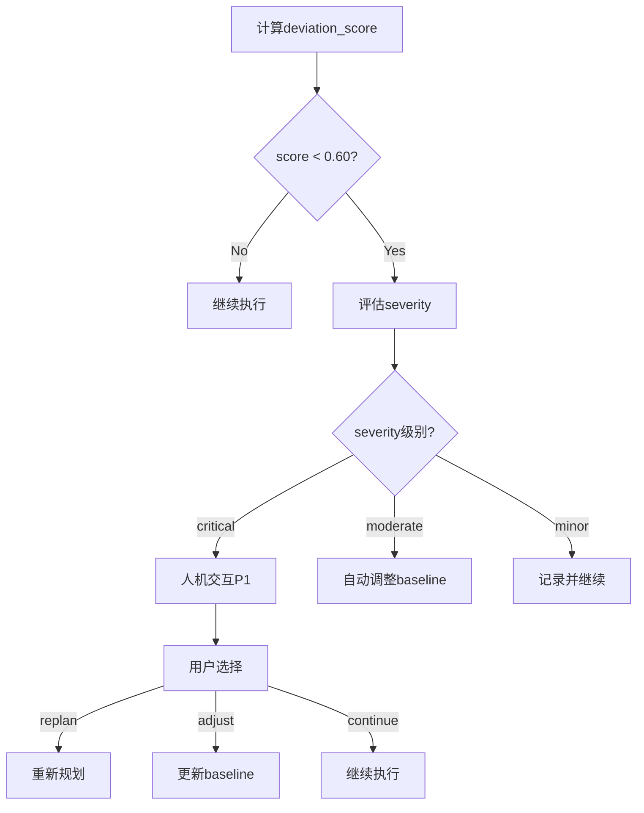

# Task: Check Todo Deviation

**任务ID**: `check-todo-deviation`
**版本**: V4.3
**用途**: 实时检测执行偏离，触发告警或重新规划

## 输入

```yaml
inputs:
  - baseline_contract: 用户确认的原始Todo List（执行合同）
  - current_execution_log: 当前执行日志和已完成任务
  - updated_tracker_state: 最新的TodoTracker状态
```

## 处理逻辑

### 步骤1: 提取比对特征

从baseline和current提取可比对的特征向量：

```python
baseline_features = extract_features(baseline_contract)
  ├─ planned_tasks: 计划任务列表
  ├─ planned_sequence: 任务执行顺序
  ├─ planned_scope: 计划覆盖范围
  └─ planned_deliverables: 计划交付物

current_features = extract_features(current_execution_log)
  ├─ actual_tasks: 实际执行任务
  ├─ actual_sequence: 实际执行顺序
  ├─ actual_scope: 实际覆盖范围
  └─ actual_deliverables: 实际交付物
```

### 步骤2: 计算相似度

使用余弦相似度计算偏离程度：

```python
deviation_score = cosine_similarity(baseline_features, current_features)

# 阈值：0.60
# deviation_score >= 0.60: 在合理范围内
# deviation_score < 0.60: 触发偏离告警
```

### 步骤3: 识别偏离项

对比baseline和current，识别具体偏离：

```yaml
deviation_types:
  - type: 'task_addition'
    description: '新增了baseline中没有的任务'
    items: [...]
    severity: 'moderate'

  - type: 'task_omission'
    description: '跳过了baseline中的计划任务'
    items: [...]
    severity: 'high'

  - type: 'sequence_change'
    description: '任务执行顺序改变'
    items: [...]
    severity: 'low'

  - type: 'scope_expansion'
    description: '范围扩大，超出原计划'
    items: [...]
    severity: 'critical'
```

### 步骤4: 评估偏离严重性

```python
def assess_severity(deviation_items):
    severity_score = 0

    for item in deviation_items:
        if item.type == "scope_expansion":
            severity_score += 10
        elif item.type == "task_omission":
            severity_score += 7
        elif item.type == "task_addition":
            severity_score += 5
        elif item.type == "sequence_change":
            severity_score += 2

    if severity_score >= 15:
        return "critical"
    elif severity_score >= 8:
        return "moderate"
    else:
        return "minor"
```

### 步骤5: 生成偏离报告

```yaml
deviation_report:
  deviation_score: 0.55 # < 0.60阈值
  deviation_detected: true
  severity: 'moderate'

  summary:
    total_deviations: 5
    critical_count: 1
    moderate_count: 2
    minor_count: 2

  details:
    - deviation_id: 'dev-001'
      type: 'scope_expansion'
      description: '在Phase 2添加了额外的专家调用'
      baseline_task: null
      actual_task: '调用性能优化专家'
      severity: 'critical'
      justification_required: true

    - deviation_id: 'dev-002'
      type: 'task_omission'
      description: '跳过了用户确认步骤'
      baseline_task: '用户确认约束模型'
      actual_task: null
      severity: 'high'
      justification_required: true
```

### 步骤6: 决定处理动作

```python
if deviation_score < 0.60:
    if severity == "critical":
        action = "human_confirmation"  # 触发P1级别用户确认
        options = ["replan", "adjust_baseline", "continue_with_justification"]

    elif severity == "moderate":
        action = "auto_adjust"  # 自动调整baseline
        notify_user = true

    elif severity == "minor":
        action = "log_and_continue"  # 记录但继续执行
        alert_level = "info"
```

## 输出

```yaml
outputs:
  deviation_score:
    type: float
    range: [0.0, 1.0]
    description: "与baseline的相似度分数"

  deviation_detected:
    type: boolean
    description: "是否检测到偏离（score < 0.60）"

  deviation_items:
    type: array
    description: "具体偏离项列表"
    structure:
      - deviation_id: string
        type: string
        description: string
        baseline_task: string | null
        actual_task: string | null
        severity: "critical" | "high" | "moderate" | "minor"
        justification_required: boolean

  deviation_severity:
    type: string
    enum: ["critical", "moderate", "minor", "none"]

  recommended_action:
    type: string
    enum: ["human_confirmation", "auto_adjust", "log_and_continue", "none"]

  alert_message:
    type: string
    description: "给用户的告警信息"
```

## 示例输出

```json
{
  "deviation_score": 0.55,
  "deviation_detected": true,
  "deviation_items": [
    {
      "deviation_id": "dev-001",
      "type": "scope_expansion",
      "description": "添加了额外的性能分析任务",
      "baseline_task": null,
      "actual_task": "性能瓶颈分析",
      "severity": "critical",
      "justification_required": true
    }
  ],
  "deviation_severity": "moderate",
  "recommended_action": "auto_adjust",
  "alert_message": "⚠️ 检测到执行偏离（相似度：0.55 < 0.60）\n- 新增任务：性能瓶颈分析\n建议：调整baseline或继续执行并记录偏离原因"
}
```

## 触发条件

此任务在以下时机执行：

1. **Phase完成时**: 每个Phase结束后检查
2. **关键决策点**: 重大任务变更前
3. **用户请求**: 用户要求查看进度
4. **定时检查**: 长时间运行的workflow定期检查

## 处理流程



## 质量检查

- [ ] 相似度计算方法合理
- [ ] 阈值0.60经过验证
- [ ] 偏离项分类准确
- [ ] 严重性评估符合实际
- [ ] 推荐动作可执行

## 引用

- @编排协调专家库/偏离检测算法
- @知识模块库/相似度计算方法
- V4.3架构规范: deviation_threshold = 0.60

---

**创建**: 2025-10-20
**BMAD版本**: v6-alpha
**核心机制**: Todo List偏离检测，V4.3关键创新
