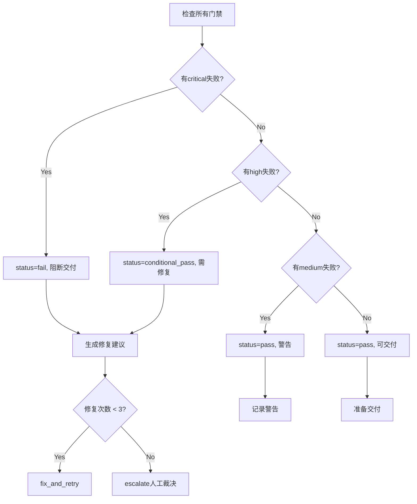

# Task: Quality Gate Check

**任务ID**: `quality-gate-check`
**版本**: V4.3
**用途**: Phase 4 - 质量门禁判断，决定是否可交付

## 输入

```yaml
inputs:
  - quality_report: 质量评测智能体的完整验证报告
  - ten_element_model: TenElementModel基线
  - complete_code: 生成的完整代码
```

## 质量门禁标准

### 门禁1: 引用合规性 🔴 CRITICAL

```yaml
gate_id: 'citation_compliance'
severity: 'critical'
blocking: true

criteria:
  - name: '所有元素有@引用'
    check: 'quality_report.citation_check.all_cited == true'
    required: true

  - name: '引用路径有效'
    check: 'quality_report.citation_check.valid_paths == true'
    required: true

  - name: '禁止未经引用的推断'
    check: 'quality_report.hallucination_check.no_fabrication == true'
    required: true

pass_criteria: '所有criteria为true'
fail_action: 'block_delivery'
```

### 门禁2: 语法正确性 🔴 CRITICAL

```yaml
gate_id: 'syntax_validity'
severity: 'critical'
blocking: true

criteria:
  - name: 'Python语法检查'
    check: 'quality_report.syntax_check.python_valid == true'
    tool: 'ast.parse()'

  - name: '无语法错误'
    check: 'quality_report.syntax_check.error_count == 0'

  - name: '编码规范符合'
    check: 'quality_report.syntax_check.style_compliant == true'
    tool: 'pylint/flake8'

pass_criteria: '所有criteria为true'
fail_action: 'request_syntax_fix'
```

### 门禁3: 逻辑完整性 🟡 HIGH

```yaml
gate_id: 'logic_integrity'
severity: 'high'
blocking: true

criteria:
  - name: '所有函数可调用'
    check: 'quality_report.logic_check.all_callable == true'

  - name: '无逻辑死循环'
    check: 'quality_report.logic_check.no_infinite_loops == true'

  - name: '异常处理完整'
    check: 'quality_report.logic_check.exception_handled == true'

  - name: '边界条件覆盖'
    check: 'quality_report.logic_check.edge_cases_covered >= 0.80'

pass_criteria: '所有criteria为true OR 可justified_skip'
fail_action: 'request_logic_fix'
```

### 门禁4: 约束一致性 🟡 HIGH

```yaml
gate_id: 'constraint_consistency'
severity: 'high'
blocking: true

criteria:
  - name: '代码实现与TenElementModel一致'
    check: 'quality_report.consistency_check.model_match == true'

  - name: '所有约束已实现'
    check: 'quality_report.consistency_check.all_constraints_impl == true'

  - name: '目标函数正确'
    check: 'quality_report.consistency_check.objective_correct == true'

  - name: '算法匹配'
    check: 'quality_report.consistency_check.algorithm_match == true'

pass_criteria: '所有criteria为true'
fail_action: 'request_consistency_fix'
```

### 门禁5: 基准评测 🟢 MEDIUM

```yaml
gate_id: 'benchmark_performance'
severity: 'medium'
blocking: false

criteria:
  - name: '小规模用例通过'
    check: 'quality_report.benchmark.small_case_pass == true'

  - name: '性能可接受'
    check: 'quality_report.benchmark.performance_acceptable == true'
    threshold: '< 10x baseline'

  - name: '解质量合理'
    check: 'quality_report.benchmark.solution_quality >= 0.70'

pass_criteria: '至少2个criteria为true'
fail_action: 'warning_only'
```

### 门禁6: 交付物持久化 🔴 CRITICAL

```yaml
gate_id: 'deliverable_persistence'
severity: 'critical'
blocking: true

criteria:
  - name: '所有交付物已保存到输出目录'
    check: 'quality_report.deliverable_check.all_saved == true'
    required: true
    description: '验证所有交付物（代码、模型、文档、报告）已保存到{output_folder}'

  - name: '文件路径有效且可访问'
    check: 'quality_report.deliverable_check.all_paths_accessible == true'
    required: true
    description: '验证所有保存的文件路径真实存在且可读取'

  - name: '交付物完整性检查'
    check: 'quality_report.deliverable_check.completeness == true'
    required: true
    description: '验证文件非空，包含预期内容'

  - name: '文件命名规范符合'
    check: 'quality_report.deliverable_check.naming_compliant == true'
    description: '验证文件命名符合规范和可追溯性要求'

required_deliverables:
  - ten_element_model:
      path: '{output_folder}/models/ten_element_model_*.yaml'
      min_size: 1024 # bytes
      required: true

  - complete_code:
      path: '{output_folder}/models/scheduling_solution_*.py'
      min_size: 2048
      required: true

  - code_documentation:
      path: '{output_folder}/docs/solution_documentation_*.md'
      min_size: 512
      required: true

  - quality_report:
      path: '{output_folder}/reports/quality_report_*.json'
      min_size: 256
      required: true

  - todo_completion_report:
      path: '{output_folder}/reports/todo_completion_*.json'
      min_size: 128
      required: false

pass_criteria: '所有required=true的criteria为true'
fail_action: 'block_delivery_and_save_files'
```

## 处理逻辑

### 步骤1: 解析质量报告

```python
def parse_quality_report(report):
    return {
        "citation_check": report.get("citation_compliance", {}),
        "syntax_check": report.get("syntax_validation", {}),
        "logic_check": report.get("logic_verification", {}),
        "consistency_check": report.get("constraint_consistency", {}),
        "benchmark": report.get("benchmark_evaluation", {}),
        "deliverable_check": report.get("deliverable_persistence", {})
    }
```

### 步骤2: 逐个门禁检查

```python
def check_gate(gate_config, report_data):
    gate_result = {
        "gate_id": gate_config["gate_id"],
        "severity": gate_config["severity"],
        "status": "checking"
    }

    passed_criteria = 0
    total_criteria = len(gate_config["criteria"])
    failed_items = []

    for criterion in gate_config["criteria"]:
        check_result = evaluate_criterion(criterion, report_data)

        if check_result:
            passed_criteria += 1
        else:
            failed_items.append({
                "criterion": criterion["name"],
                "check": criterion["check"],
                "required": criterion.get("required", False)
            })

    # 判断门禁通过
    if gate_config["pass_criteria"] == "所有criteria为true":
        gate_passed = (passed_criteria == total_criteria)
    else:
        # 解析其他通过标准
        gate_passed = evaluate_pass_criteria(
            gate_config["pass_criteria"],
            passed_criteria,
            total_criteria
        )

    gate_result["status"] = "passed" if gate_passed else "failed"
    gate_result["passed_criteria"] = passed_criteria
    gate_result["total_criteria"] = total_criteria
    gate_result["failed_items"] = failed_items

    return gate_result
```

### 步骤3: 聚合门禁结果

```python
def aggregate_gate_results(gate_results):
    critical_failed = any(
        r["severity"] == "critical" and r["status"] == "failed"
        for r in gate_results
    )

    high_failed = any(
        r["severity"] == "high" and r["status"] == "failed"
        for r in gate_results
    )

    if critical_failed:
        overall_status = "fail"
        level = "fail"
        can_deliver = False
    elif high_failed:
        overall_status = "conditional_pass"
        level = "warning"
        can_deliver = False  # 需要修复
    else:
        overall_status = "pass"
        level = "pass"
        can_deliver = True

    return {
        "overall_status": overall_status,
        "level": level,
        "can_deliver": can_deliver,
        "gate_results": gate_results
    }
```

### 步骤4: 生成修复建议

```python
def generate_fix_suggestions(gate_results):
    suggestions = []

    for gate in gate_results:
        if gate["status"] == "failed":
            if gate["gate_id"] == "citation_compliance":
                suggestions.append({
                    "priority": "P0",
                    "gate": gate["gate_id"],
                    "action": "添加@引用路径到所有元素",
                    "details": gate["failed_items"]
                })

            elif gate["gate_id"] == "syntax_validity":
                suggestions.append({
                    "priority": "P0",
                    "gate": gate["gate_id"],
                    "action": "修复语法错误",
                    "tool": "运行 pylint/flake8",
                    "details": gate["failed_items"]
                })

            elif gate["gate_id"] == "constraint_consistency":
                suggestions.append({
                    "priority": "P1",
                    "gate": gate["gate_id"],
                    "action": "调整代码以匹配TenElementModel",
                    "details": gate["failed_items"]
                })

            elif gate["gate_id"] == "deliverable_persistence":
                suggestions.append({
                    "priority": "P0",
                    "gate": gate["gate_id"],
                    "action": "保存所有交付物到{output_folder}目录",
                    "required_actions": [
                        "创建输出目录结构（models/, docs/, reports/）",
                        "保存 TenElementModel 到 models/ten_element_model_[timestamp].yaml",
                        "保存完整代码到 models/scheduling_solution_[timestamp].py",
                        "保存代码文档到 docs/solution_documentation_[timestamp].md",
                        "保存质量报告到 reports/quality_report_[timestamp].json",
                        "验证所有文件可访问且非空"
                    ],
                    "details": gate["failed_items"]
                })

    return suggestions
```

## 输出

```yaml
outputs:
  gate_status:
    type: object
    structure:
      overall_status: "pass" | "conditional_pass" | "fail"
      level: "pass" | "warning" | "fail"
      can_deliver: boolean
      summary:
        total_gates: integer
        passed_gates: integer
        failed_gates: integer
      gate_results: array

  issues:
    type: array
    description: "所有未通过的门禁和失败项"

  fix_suggestions:
    type: array
    description: "修复建议列表"

  next_action:
    type: string
    enum:
      - "deliver"  # 可以交付
      - "fix_and_retry"  # 修复后重试
      - "escalate"  # 升级裁决
```

## 示例输出

```json
{
  "gate_status": {
    "overall_status": "conditional_pass",
    "level": "warning",
    "can_deliver": false,
    "summary": {
      "total_gates": 5,
      "passed_gates": 3,
      "failed_gates": 2
    },
    "gate_results": [
      {
        "gate_id": "citation_compliance",
        "severity": "critical",
        "status": "failed",
        "passed_criteria": 2,
        "total_criteria": 3,
        "failed_items": [
          {
            "criterion": "禁止未经引用的推断",
            "check": "no_fabrication == true",
            "required": true
          }
        ]
      },
      {
        "gate_id": "syntax_validity",
        "severity": "critical",
        "status": "passed",
        "passed_criteria": 3,
        "total_criteria": 3
      }
    ]
  },
  "issues": [
    {
      "gate": "citation_compliance",
      "severity": "critical",
      "message": "检测到未经引用的算法推断"
    }
  ],
  "fix_suggestions": [
    {
      "priority": "P0",
      "gate": "citation_compliance",
      "action": "为算法选择添加@algorithm_library引用",
      "details": ["genetic_algorithm需要引用@专家库/算法库/启发式/遗传算法.md"]
    }
  ],
  "next_action": "fix_and_retry"
}
```

## 决策逻辑



## 质量检查

- [ ] 所有6个门禁定义清晰
- [ ] 严重性级别合理（3个CRITICAL + 1个HIGH + 2个MEDIUM）
- [ ] 通过标准明确
- [ ] 修复建议可执行
- [ ] 决策逻辑无漏洞
- [ ] 交付物持久化验证完整

## 引用

- @质量评测专家库/质量门禁标准
- @编排协调专家库/交付决策流程
- V4.3架构规范: 质量门禁机制
- @输出管理规范/交付物持久化要求

---

**创建**: 2025-10-20
**更新**: 2025-10-21 - 添加门禁6：交付物持久化验证
**BMAD版本**: v6-alpha
**核心机制**: 6重质量门禁，确保可交付性与持久化
