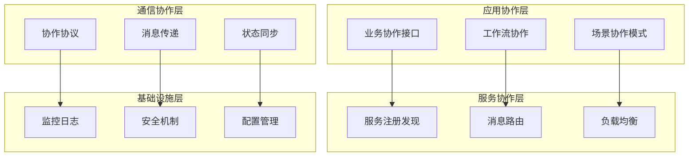
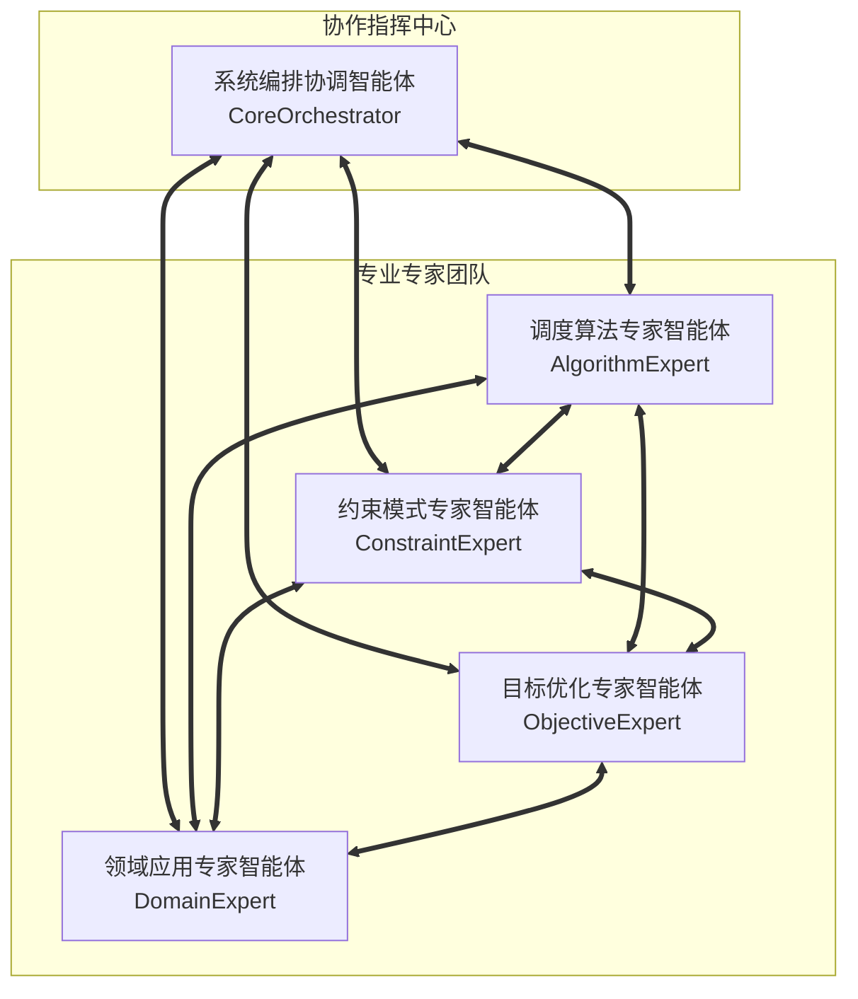

<!-- Powered by BMAD-CORE™ -->
<!-- Module ID: bmad/aps/templates/collaboration/agent-collaboration-protocol.md -->
<!-- Aliases: @专家库/协作机制/agent-collaboration-protocol.md, @专家库/协作机制/智能体协作协议.md -->
<!-- Version: v1.0 -->
<!-- Category: 协作机制 -->

# 智能体协作协议 - V3.0模板化协作框架

## 🎯 协议设计理念

### 核心原则

基于**V3.0模板化智能体架构**的"Agent as Doc"设计理念，建立标准化、可扩展、高效率的智能体协作协议，实现五大专家智能体的无缝协作和动态组合。

### 设计目标

```yaml
协作效率: 比独立工作提升50%以上
协作质量: 协作产出质量比单体提升40%以上
协作稳定性: 99.5%以上的协作成功率
协作扩展性: 支持新智能体的无缝接入
协作智能性: 自适应协作模式和策略优化
```

## 📋 协议架构总览

### 协作层次架构



### 智能体协作关系图



## 🔗 统一协作接口标准

### 消息协议规范

#### 消息格式标准

```yaml
消息结构:
  header:
    messageId: 消息唯一标识
    timestamp: 消息时间戳
    sender: 发送方智能体标识
    receiver: 接收方智能体标识
    messageType: 消息类型
    priority: 优先级(1-5)
    version: 协议版本

  payload:
    requestType: 请求类型
    context: 上下文信息
    data: 业务数据
    requirements: 需求描述
    constraints: 约束条件

  metadata:
    correlationId: 关联消息ID
    sessionId: 会话标识
    workflowId: 工作流标识
    timeout: 超时时间
    retryCount: 重试次数

消息类型定义:
  REQUEST: 请求消息
  RESPONSE: 响应消息
  NOTIFICATION: 通知消息
  HEARTBEAT: 心跳消息
  ERROR: 错误消息
  SYNC: 同步消息

优先级定义:
  CRITICAL(1): 关键任务，立即处理
  HIGH(2): 高优先级，优先处理
  NORMAL(3): 正常优先级，按序处理
  LOW(4): 低优先级，空闲时处理
  BACKGROUND(5): 后台任务，资源充足时处理
```

#### 标准接口契约

```yaml
服务发现接口:
  register_service:
    描述: 智能体注册服务能力
    输入:
      - agent_id: 智能体唯一标识
      - capabilities: 能力清单
      - interfaces: 接口定义
      - metadata: 元数据信息
    输出:
      - registration_status: 注册状态
      - assigned_endpoints: 分配的端点

  discover_services:
    描述: 发现可用的智能体服务
    输入:
      - capability_requirements: 能力需求
      - filters: 过滤条件
    输出:
      - available_agents: 可用智能体清单
      - capability_matches: 能力匹配度

协作请求接口:
  send_collaboration_request:
    描述: 发送协作请求
    输入:
      - target_agent: 目标智能体
      - request_details: 请求详情
      - expected_response_time: 期望响应时间
    输出:
      - request_id: 请求标识
      - estimated_completion_time: 预估完成时间

  handle_collaboration_request:
    描述: 处理协作请求
    输入:
      - request_data: 请求数据
      - context: 上下文信息
    输出:
      - response_data: 响应数据
      - status: 处理状态
      - next_steps: 后续步骤

状态同步接口:
  sync_state:
    描述: 同步智能体状态
    输入:
      - state_data: 状态数据
      - sync_scope: 同步范围
    输出:
      - sync_result: 同步结果
      - conflicts: 冲突信息

  get_agent_status:
    描述: 获取智能体状态
    输入:
      - agent_id: 智能体标识
    输出:
      - current_status: 当前状态
      - performance_metrics: 性能指标
      - health_status: 健康状态
```

## 🎼 协作工作流程规范

### 标准协作模式

#### 1. 并行协作模式 (Parallel Collaboration)

```yaml
适用场景:
  - 时间紧迫，需要快速响应
  - 各专家任务相对独立
  - 需要多角度同时分析

工作流程:
  阶段1_任务分发:
    - 编排智能体解析需求
    - 同时向多个专家分发子任务
    - 设定统一的完成期限

  阶段2_并行处理:
    - 各专家独立分析和处理
    - 定期进度同步和状态报告
    - 异常情况及时上报

  阶段3_结果汇聚:
    - 收集各专家的分析结果
    - 检查结果的一致性和完整性
    - 识别和标记冲突点

  阶段4_协调整合:
    - 解决专家间的意见冲突
    - 整合优化最终方案
    - 验证方案的可行性

协作协议:
  消息流:
    编排者 → 各专家: PARALLEL_TASK_REQUEST
    各专家 → 编排者: PROGRESS_UPDATE (定期)
    各专家 → 编排者: RESULT_SUBMISSION
    编排者 → 各专家: INTEGRATION_FEEDBACK

  同步机制:
    - 15分钟间隔的进度同步
    - 关键节点的状态确认
    - 异常情况的实时通知

性能指标:
  - 并行效率: >80%
  - 时间节省: >40%
  - 结果一致性: >85%
```

#### 2. 串行协作模式 (Sequential Collaboration)

```yaml
适用场景:
  - 质量要求极高
  - 任务间存在强依赖关系
  - 需要深度验证每个环节

工作流程:
  阶段1_领域分析:
    - 领域专家首先分析业务场景
    - 确定行业特征和应用模式
    - 提供领域知识和最佳实践

  阶段2_约束建模:
    - 基于领域分析结果
    - 约束专家建立约束模型
    - 验证约束的合理性和完整性

  阶段3_算法设计:
    - 基于约束模型
    - 算法专家设计求解方案
    - 评估算法性能和复杂度

  阶段4_目标优化:
    - 基于算法方案
    - 目标专家优化目标函数
    - 平衡多目标冲突

协作协议:
  消息流:
    编排者 → 领域专家: DOMAIN_ANALYSIS_REQUEST
    领域专家 → 约束专家: DOMAIN_CONTEXT_TRANSFER
    约束专家 → 算法专家: CONSTRAINT_MODEL_TRANSFER
    算法专家 → 目标专家: ALGORITHM_SOLUTION_TRANSFER
    目标专家 → 编排者: OPTIMIZED_SOLUTION_DELIVERY

  验证机制:
    - 每阶段完成后的质量验证
    - 前后阶段的一致性检查
    - 关键决策点的确认机制

质量保证:
  - 阶段间无缝衔接: >95
  - 信息传递准确性: >98
  - 最终方案质量: >90
```

#### 3. 混合协作模式 (Hybrid Collaboration)

```yaml
适用场景:
  - 复杂度中等的综合性问题
  - 既需要效率又需要质量
  - 部分任务可并行，部分需串行

工作流程:
  阶段1_快速分析:
    - 领域专家和算法专家并行分析
    - 领域专家识别场景特征
    - 算法专家评估算法可行性

  阶段2_深度建模:
    - 基于初步分析结果
    - 约束专家建立详细约束模型
    - 与领域专家协作验证业务合理性

  阶段3_方案优化:
    - 算法专家和目标专家并行工作
    - 算法专家优化算法实现
    - 目标专家设计评估体系

  阶段4_集成验证:
    - 所有专家协作验证整体方案
    - 编排智能体协调最终集成

协作特点:
  - 灵活的并行串行组合
  - 动态的协作模式调整
  - 智能的负载均衡
  - 高效的质量保证
```

### 异常协作处理

#### 异常类型与处理策略

```yaml
专家不可用异常:
  检测机制:
    - 心跳监控超时
    - 响应时间异常
    - 错误率突增

  处理策略:
    - 自动切换到备用专家
    - 降级到简化处理模式
    - 上报异常等待人工介入

  恢复机制:
    - 专家恢复后自动重新接入
    - 状态数据同步和一致性检查
    - 工作负载的平滑迁移

协作冲突异常:
  冲突类型:
    - 专家建议相互矛盾
    - 资源竞争冲突
    - 优先级冲突

  解决策略:
    - 编排智能体权威仲裁
    - 专家协商和妥协
    - 分阶段实施避免冲突

  预防机制:
    - 事前冲突风险评估
    - 协作规则的明确定义
    - 冲突早期发现和预警

性能异常:
  监控指标:
    - 响应时间超过阈值
    - 资源使用率过高
    - 错误率超过预期

  优化策略:
    - 动态负载重分配
    - 协作模式自动调整
    - 资源扩展和优化

  预防措施:
    - 性能基准的建立
    - 容量规划和预测
    - 预防性的性能优化
```

## 🛡️ 协作安全与质量保证

### 安全机制

#### 身份认证与授权

```yaml
身份认证:
  智能体身份验证:
    - 基于公钥的数字签名
    - 智能体身份证书管理
    - 定期的身份验证更新

  会话管理:
    - 安全会话的建立和维护
    - 会话超时和自动续期
    - 会话状态的安全存储

访问控制:
  权限管理:
    - 基于角色的访问控制(RBAC)
    - 细粒度的功能权限控制
    - 动态权限调整和审计

  资源保护:
    - 敏感数据的访问控制
    - 关键操作的多重验证
    - 资源使用的配额管理

数据安全:
  传输安全:
    - TLS/SSL加密传输
    - 消息完整性验证
    - 防重放攻击机制

  存储安全:
    - 敏感数据加密存储
    - 数据备份和恢复
    - 数据访问审计日志
```

#### 隐私保护

```yaml
数据隐私:
  数据分类:
    - 公开数据: 无需特殊保护
    - 敏感数据: 需要加密和访问控制
    - 机密数据: 最高级别保护

  隐私保护技术:
    - 数据匿名化和去识别
    - 差分隐私技术应用
    - 同态加密计算

  合规管理:
    - GDPR等法规的合规性
    - 数据跨境传输控制
    - 个人数据权利保护

协作隐私:
  信息隔离:
    - 专家间的信息隔离
    - 按需知情原则
    - 最小权限原则

  隐私计算:
    - 联邦学习应用
    - 安全多方计算
    - 隐私保护的协作分析
```

### 质量保证体系

#### 协作质量监控

```yaml
质量指标:
  协作效率指标:
    - 协作完成时间
    - 资源利用效率
    - 并行度和吞吐量

  协作质量指标:
    - 结果准确性
    - 一致性水平
    - 用户满意度

  协作稳定性指标:
    - 协作成功率
    - 错误恢复时间
    - 系统可用性

监控机制:
  实时监控:
    - 协作过程的实时跟踪
    - 性能指标的实时采集
    - 异常事件的实时告警

  定期评估:
    - 协作质量的定期评估
    - 改进建议的提出
    - 最佳实践的总结

质量改进:
  持续优化:
    - 基于监控数据的优化
    - 协作模式的持续改进
    - 智能体能力的提升

  学习机制:
    - 从协作经验中学习
    - 最佳协作模式的识别
    - 协作策略的智能优化
```

#### 结果验证机制

```yaml
多层验证:
  L1_格式验证:
    - 数据格式的正确性
    - 接口规范的遵循
    - 必要字段的完整性

  L2_逻辑验证:
    - 业务逻辑的正确性
    - 数据关系的一致性
    - 约束条件的满足

  L3_质量验证:
    - 解决方案的可行性
    - 性能指标的达成
    - 用户需求的满足

  L4_集成验证:
    - 整体方案的协调性
    - 系统集成的完整性
    - 端到端的功能验证

验证流程:
  自动验证:
    - 规则引擎的自动检查
    - 机器学习的质量评估
    - 统计分析的异常检测

  人工审核:
    - 关键结果的人工审核
    - 复杂情况的专家判断
    - 质量标准的定期校准

纠错机制:
  错误检测:
    - 多维度的错误检测
    - 早期错误的发现
    - 错误影响的评估

  错误修复:
    - 自动修复机制
    - 协作重试策略
    - 人工干预机制
```

## 📊 协作性能优化

### 性能监控体系

#### 关键性能指标 (KPIs)

```yaml
响应性能:
  - 平均响应时间: <3秒(简单协作), <15秒(复杂协作)
  - 95th分位响应时间: <10秒(简单协作), <45秒(复杂协作)
  - 协作建立时间: <1秒
  - 消息传递延迟: <100ms

吞吐性能:
  - 并发协作数: >100个
  - 消息处理能力: >1000条/秒
  - 专家利用率: >80%
  - 系统整体吞吐量: >50个协作任务/分钟

质量性能:
  - 协作成功率: >95%
  - 结果准确率: >90%
  - 一致性达成率: >85%
  - 用户满意度: >88%

稳定性能:
  - 系统可用性: >99.5%
  - 平均故障恢复时间: <5分钟
  - 数据一致性: >99.9%
  - 协作完整性: >99%
```

#### 性能瓶颈识别

```yaml
瓶颈类型:
  计算瓶颈:
    - CPU使用率过高
    - 内存不足
    - 算法复杂度过高

  通信瓶颈:
    - 网络带宽不足
    - 消息队列积压
    - 序列化/反序列化开销

  协调瓶颈:
    - 编排智能体过载
    - 同步等待时间过长
    - 冲突解决效率低

优化策略:
  缓存优化:
    - 结果缓存和复用
    - 智能缓存策略
    - 分布式缓存应用

  并行优化:
    - 任务并行度提升
    - 数据并行处理
    - 流水线并行执行

  算法优化:
    - 算法复杂度优化
    - 启发式算法应用
    - 近似算法使用
```

### 自适应优化机制

#### 动态负载均衡

```yaml
负载监控:
  - 实时监控各智能体负载
  - 预测负载趋势变化
  - 识别负载不均衡情况

均衡策略:
  轮询均衡:
    - 简单轮询分配
    - 加权轮询分配
    - 平滑轮询分配

  负载均衡:
    - 最少连接分配
    - 最快响应分配
    - 资源使用率分配

  智能均衡:
    - 基于历史性能的分配
    - 基于任务特征的分配
    - 机器学习优化分配

自动扩缩容:
  水平扩展:
    - 智能体实例的动态增减
    - 负载变化的自动响应
    - 成本效益的平衡

  垂直扩展:
    - 计算资源的动态调整
    - 内存容量的自动扩展
    - 存储空间的弹性分配
```

#### 协作模式自优化

```yaml
模式学习:
  历史分析:
    - 协作历史数据分析
    - 成功模式的识别
    - 失败原因的总结

  模式挖掘:
    - 高效协作模式挖掘
    - 协作规律的发现
    - 最佳实践的提取

自动优化:
  参数调优:
    - 协作参数的自动调优
    - 超参数的智能搜索
    - 多目标优化平衡

  策略演进:
    - 协作策略的持续演进
    - A/B测试验证改进
    - 渐进式策略升级

智能推荐:
  模式推荐:
    - 基于场景的模式推荐
    - 基于历史的策略建议
    - 基于预测的优化建议

  参数推荐:
    - 最优参数配置推荐
    - 个性化配置建议
    - 场景适配参数调整
```

## 🔧 部署与运维规范

### 部署架构

#### 分布式部署方案

```yaml
架构模式:
  微服务架构:
    - 智能体独立部署
    - 服务网格管理
    - 容器化部署

  集群部署:
    - 多节点集群
    - 负载均衡配置
    - 高可用保证

  云原生部署:
    - Kubernetes编排
    - 自动扩缩容
    - 服务发现和配置

网络架构:
  内网通信:
    - 高速内网连接
    - 专用通信通道
    - 网络隔离和安全

  外网接入:
    - API网关统一接入
    - 负载均衡和限流
    - 安全认证和授权

数据架构:
  分布式存储:
    - 数据分片和复制
    - 一致性保证
    - 备份和恢复

  缓存架构:
    - 多级缓存体系
    - 分布式缓存
    - 缓存一致性管理
```

#### 配置管理

```yaml
配置分类:
  系统配置:
    - 基础设施配置
    - 网络和安全配置
    - 资源限制配置

  业务配置:
    - 协作模式配置
    - 智能体能力配置
    - 业务规则配置

  运行时配置:
    - 性能参数配置
    - 监控告警配置
    - 日志级别配置

配置管理:
  集中管理:
    - 配置中心统一管理
    - 版本控制和回滚
    - 环境隔离管理

  动态更新:
    - 热更新机制
    - 配置变更通知
    - 一致性保证

  安全管理:
    - 敏感配置加密
    - 访问权限控制
    - 配置审计日志
```

### 监控运维

#### 全方位监控体系

```yaml
基础设施监控:
  硬件监控:
    - CPU、内存、磁盘使用率
    - 网络流量和延迟
    - 硬件故障检测

  系统监控:
    - 操作系统性能
    - 进程和服务状态
    - 系统日志分析

应用监控:
  性能监控:
    - 应用响应时间
    - 吞吐量和并发数
    - 错误率和成功率

  业务监控:
    - 协作任务执行情况
    - 智能体工作状态
    - 用户体验指标

用户体验监控:
  前端监控:
    - 页面加载时间
    - 用户操作响应
    - 前端错误追踪

  API监控:
    - API调用次数
    - API响应时间
    - API错误统计
```

#### 故障处理机制

```yaml
故障检测:
  主动检测:
    - 健康检查机制
    - 性能基线对比
    - 异常模式识别

  被动检测:
    - 用户反馈收集
    - 错误日志分析
    - 第三方监控告警

故障响应:
  自动恢复:
    - 自动重启机制
    - 故障转移机制
    - 降级服务机制

  人工介入:
    - 告警通知机制
    - 故障升级流程
    - 应急响应团队

故障分析:
  根因分析:
    - 故障时间线重建
    - 多维度数据关联
    - 根本原因识别

  改进措施:
    - 故障预防措施
    - 系统改进建议
    - 流程优化建议
```

## 📈 协作框架演进规划

### 技术演进路径

#### V3.1 增强版协作框架

```yaml
计划时间: 6个月后

主要改进:
  协作智能化:
    - 协作模式智能推荐
    - 协作参数自动优化
    - 协作效果预测分析

  性能优化:
    - 协作响应时间减少30%
    - 并发协作能力提升50%
    - 资源利用效率提升20%

  功能增强:
    - 跨语言协作支持
    - 可视化协作监控
    - 协作结果可解释性

技术特性:
  - 基于机器学习的协作优化
  - 图神经网络的协作建模
  - 强化学习的策略优化
  - 联邦学习的隐私保护协作
```

#### V3.5 智能协作平台

```yaml
计划时间: 12个月后

主要特性:
  认知协作:
    - 协作意图理解
    - 协作知识推理
    - 协作创新能力

  自适应协作:
    - 环境变化自适应
    - 协作模式自演进
    - 协作策略自优化

  生态协作:
    - 外部智能体接入
    - 跨平台协作能力
    - 开放协作生态

技术架构:
  - 基于Transformer的协作理解
  - 图注意力网络的协作推理
  - 多智能体强化学习
  - 知识图谱增强的协作决策
```

#### V4.0 认知协作生态

```yaml
计划时间: 24个月后

愿景目标:
  协作智能:
    - 类人协作智能
    - 创造性协作能力
    - 情感协作交互

  协作生态:
    - 全球协作网络
    - 跨组织协作
    - 人机协作融合

  协作价值:
    - 协作价值最大化
    - 协作效益优化
    - 协作创新驱动

技术前瞻:
  - 量子计算加速协作
  - 脑机接口协作交互
  - 元宇宙协作环境
  - AGI级别的协作智能
```

### 标准化建设

#### 协作标准制定

```yaml
技术标准:
  协议标准:
    - 协作通信协议标准
    - 数据交换格式标准
    - 安全认证标准

  接口标准:
    - RESTful API标准
    - GraphQL接口标准
    - 消息队列接口标准

  质量标准:
    - 协作质量评估标准
    - 性能基准标准
    - 安全合规标准

行业标准:
  领域标准:
    - 调度优化领域标准
    - 人工智能协作标准
    - 多智能体系统标准

  应用标准:
    - 企业级应用标准
    - 云原生部署标准
    - 数据治理标准

国际标准:
  参与制定:
    - IEEE协作标准
    - ISO智能体标准
    - W3C语义标准

  标准推广:
    - 开源社区推广
    - 学术会议发表
    - 产业联盟合作
```

#### 生态建设规划

```yaml
开发者生态:
  SDK开发:
    - 多语言SDK支持
    - 开发文档完善
    - 示例代码丰富

  工具链:
    - 开发调试工具
    - 测试验证工具
    - 部署运维工具

  社区建设:
    - 开发者社区
    - 技术交流平台
    - 培训认证体系

合作伙伴生态:
  技术合作:
    - 技术集成合作
    - 联合创新项目
    - 标准制定合作

  商业合作:
    - 解决方案合作
    - 市场推广合作
    - 渠道合作伙伴

  学术合作:
    - 高校合作项目
    - 研究院合作
    - 学术会议合作

用户生态:
  用户社区:
    - 用户交流平台
    - 最佳实践分享
    - 用户反馈收集

  培训体系:
    - 用户培训课程
    - 认证考试体系
    - 专家咨询服务

  支持服务:
    - 技术支持服务
    - 实施咨询服务
    - 定制开发服务
```

---

**文档版本**: V3.0-Template
**创建日期**: 2024-09-19
**对应架构**: V3.0模板化智能体协作架构
**维护团队**: 智能调度专家库团队
**适用范围**: 五大智能体协作体系
