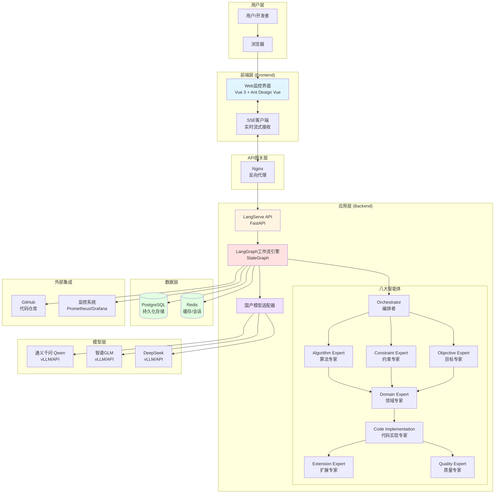

# 2. High Level Architecture

## 2.1 Technical Summary

本架构采用**基于LangGraph 1.0的微服务架构**，结合LangServe实现自动化API生成。后端使用Python 3.11+构建智能体编排服务，通过LangGraph的StateGraph管理八大智能体的工作流执行。前端采用Vue 3构建监控界面，使用SSE（Server-Sent Events）实现实时流式传输。数据持久化基于PostgreSQL和Redis，支持工作流状态的自动保存和恢复。部署采用Docker容器化方案，支持本地开发、预生产和生产环境的统一管理。整体架构遵循"轻量级适配器"原则，最小化对现有BMAD V4.4.1架构的侵入性变更。

## 2.2 Platform and Infrastructure Choice

**选定平台**: Docker容器化 + 自托管

**核心服务**:

- **LangGraph工作流服务**: Python 3.11 + LangServe + FastAPI
- **国产模型适配服务**: 轻量级抽象层支持多模型切换
- **前端监控界面**: Vue 3 + Ant Design Vue + SSE客户端
- **数据持久化**: PostgreSQL 16+ + Redis 7+
- **反向代理**: Nginx（API网关和前端静态资源）

**部署区域**:

- 开发环境: 本地Docker Compose
- 生产环境: 私有云/IDC自托管

**选择理由**：

1. PRD明确要求支持本地部署（vLLM/Ollama）和云端API两种模式
2. 棕地项目已有基础设施，增量投入最小
3. 数据本地化需求和成本控制是核心关切
4. Docker Compose可快速搭建开发环境

## 2.3 Repository Structure

**结构选择**: Monorepo（不使用专门工具，保持简单）

**包组织策略**:

```
BMAD-METHOD/                      # Monorepo根目录
├── backend/                      # 后端服务（Python）
│   ├── langgraph_service/        # LangGraph工作流服务
│   ├── model_adapters/           # 国产模型适配器
│   └── shared/                   # 后端共享代码
├── frontend/                     # 前端应用（Vue）
│   ├── web/                      # 监控界面
│   └── shared/                   # 前端共享组件
├── shared/                       # 全栈共享（类型定义、常量）
├── docs/                         # 文档
├── scripts/                      # 部署和构建脚本
└── docker/                       # Docker配置文件
```

## 2.4 High Level Architecture Diagram



## 2.5 Architectural Patterns

**1. 微服务架构（Microservices）**

- **描述**: LangGraph工作流服务、模型适配服务、前端界面作为独立服务部署
- **理由**: 支持独立扩展和部署，服务间通过HTTP/SSE通信，降低耦合度

**2. 事件驱动架构（Event-Driven）**

- **描述**: LangGraph的StateGraph基于状态转换事件驱动智能体执行
- **理由**: 天然支持异步执行和并行处理，符合智能体协作场景

**3. 适配器模式（Adapter Pattern）**

- **描述**: 国产模型适配器提供统一接口，屏蔽不同模型API差异
- **理由**: 支持模型热切换，降低模型替换成本，Phase 1核心模式

**4. 仓储模式（Repository Pattern）**

- **描述**: 数据访问层抽象，统一管理PostgreSQL和Redis的数据操作
- **理由**: 便于未来数据库迁移，提供清晰的数据访问接口

**5. BFF模式（Backend For Frontend）**

- **描述**: LangServe API专门为前端监控界面设计，提供优化的数据格式
- **理由**: 前端SSE流式传输需要特定的数据格式和事件流

**6. Human-in-the-Loop模式**

- **描述**: 利用LangGraph 1.0的interrupt机制实现人工确认点（P1/P2/P2.5）
- **理由**: 关键决策需要人工介入，提高智能体输出的可控性和质量

**7. 持久化状态模式（Durable State）**

- **描述**: LangGraph 1.0内置的checkpoint机制自动保存工作流状态
- **理由**: 支持工作流中断和恢复，服务器重启不丢失进度

**8. 组件化UI模式（Component-Based UI）**

- **描述**: Vue 3组件化开发，智能体状态和输出作为独立组件
- **理由**: 提高前端可维护性，支持智能体界面的复用和定制

---
