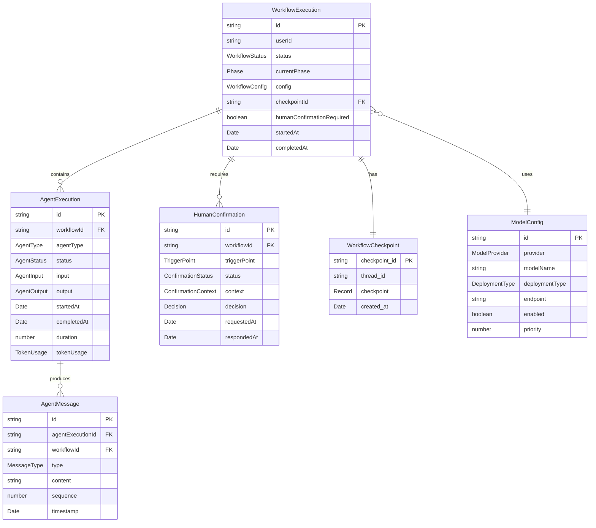

# 4. Data Models

基于PRD的功能需求和LangGraph 1.0工作流特性，定义核心数据模型。这些模型将在前后端共享，使用TypeScript接口定义。

## 4.1 WorkflowExecution（工作流执行）

**目的**: 记录完整的APS工作流执行实例，跟踪从Phase 0到Phase 4的整个智能体协作过程

```typescript
// shared/types/workflow.ts
export enum WorkflowStatus {
  PENDING = 'pending',
  RUNNING = 'running',
  PAUSED = 'paused', // Human-in-Loop暂停
  COMPLETED = 'completed',
  FAILED = 'failed',
}

export enum Phase {
  P0 = 'P0', // 问题理解
  P1 = 'P1', // 算法推荐
  P2 = 'P2', // 约束和目标分析
  P2_5 = 'P2.5', // 代码实现
  P3 = 'P3', // 扩展和质量保证
  P4 = 'P4', // 最终交付
}

export interface WorkflowConfig {
  modelProvider: 'qwen' | 'glm' | 'deepseek';
  modelName: string;
  temperature: number;
  maxTokens: number;
  enableHumanInLoop: boolean;
}

export interface ErrorInfo {
  code: string;
  message: string;
  details?: Record<string, any>;
  timestamp: Date;
}

export interface WorkflowExecution {
  id: string;
  userId: string;
  status: WorkflowStatus;
  currentPhase: Phase;
  config: WorkflowConfig;
  checkpointId: string | null;
  humanConfirmationRequired: boolean;
  startedAt: Date;
  completedAt: Date | null;
  error: ErrorInfo | null;
  metadata: Record<string, any>;
}
```

**关系**:

- **一对多** → `AgentExecution`: 一个工作流包含多个智能体执行
- **一对多** → `HumanConfirmation`: 一个工作流可能有多个人工确认点
- **一对一** → `WorkflowCheckpoint`: LangGraph管理的持久化状态

## 4.2 AgentExecution（智能体执行）

**目的**: 记录单个智能体的执行过程和输出结果，支持八大智能体的独立追踪

```typescript
// shared/types/agent.ts
export enum AgentType {
  ORCHESTRATOR = 'orchestrator',
  ALGORITHM = 'algorithm',
  CONSTRAINT = 'constraint',
  OBJECTIVE = 'objective',
  DOMAIN = 'domain',
  CODE_IMPLEMENTATION = 'code_implementation',
  EXTENSION = 'extension',
  QUALITY = 'quality',
}

export enum AgentStatus {
  PENDING = 'pending',
  RUNNING = 'running',
  COMPLETED = 'completed',
  FAILED = 'failed',
  SKIPPED = 'skipped',
}

export interface AgentInput {
  prompt: string;
  context: Record<string, any>;
  previousOutputs?: Record<AgentType, any>;
}

export interface AgentOutput {
  content: string;
  structured?: Record<string, any>;
  confidence?: number;
  reasoning?: string[];
}

export interface TokenUsage {
  promptTokens: number;
  completionTokens: number;
  totalTokens: number;
  cost?: number;
}

export interface AgentExecution {
  id: string;
  workflowId: string;
  agentType: AgentType;
  status: AgentStatus;
  input: AgentInput;
  output: AgentOutput | null;
  startedAt: Date;
  completedAt: Date | null;
  duration: number | null;
  tokenUsage: TokenUsage | null;
  error: ErrorInfo | null;
}
```

## 4.3 AgentMessage（智能体消息）

**目的**: 记录智能体执行过程中的流式输出消息，支持SSE实时传输到前端

```typescript
// shared/types/message.ts
export enum MessageType {
  TEXT = 'text',
  THOUGHT = 'thought',
  RESULT = 'result',
  ERROR = 'error',
  SYSTEM = 'system',
}

export interface AgentMessage {
  id: string;
  agentExecutionId: string;
  workflowId: string;
  type: MessageType;
  content: string;
  sequence: number;
  timestamp: Date;
  metadata?: Record<string, any>;
}
```

## 4.4 HumanConfirmation（人工确认）

**目的**: 记录Human-in-Loop触发点的人工确认和决策过程（P1/P2/P2.5）

```typescript
// shared/types/confirmation.ts
export enum TriggerPoint {
  P1 = 'P1',
  P2 = 'P2',
  P2_5 = 'P2.5',
}

export enum ConfirmationStatus {
  PENDING = 'pending',
  APPROVED = 'approved',
  REJECTED = 'rejected',
  MODIFIED = 'modified',
  TIMEOUT = 'timeout',
}

export interface ConfirmationContext {
  title: string;
  description: string;
  options: ConfirmationOption[];
  data: Record<string, any>;
}

export interface ConfirmationOption {
  id: string;
  label: string;
  description?: string;
  risk?: 'low' | 'medium' | 'high';
}

export interface Decision {
  action: 'approve' | 'reject' | 'modify' | 'regenerate';
  selectedOptionId?: string;
  feedback?: string;
  modifications?: Record<string, any>;
}

export interface HumanConfirmation {
  id: string;
  workflowId: string;
  triggerPoint: TriggerPoint;
  status: ConfirmationStatus;
  context: ConfirmationContext;
  decision: Decision | null;
  requestedAt: Date;
  respondedAt: Date | null;
  timeout: number;
}
```

## 4.5 ModelConfig（模型配置）

**目的**: 管理国产大模型的配置信息，支持模型热切换

```typescript
// shared/types/model.ts
export enum ModelProvider {
  QWEN = 'qwen',
  GLM = 'glm',
  DEEPSEEK = 'deepseek',
}

export enum DeploymentType {
  LOCAL_VLLM = 'local_vllm',
  LOCAL_OLLAMA = 'local_ollama',
  CLOUD_API = 'cloud_api',
}

export interface ModelConfig {
  id: string;
  provider: ModelProvider;
  modelName: string;
  deploymentType: DeploymentType;
  endpoint: string;
  apiKey: string | null;
  enabled: boolean;
  priority: number;
  config: ModelParameters;
  createdAt: Date;
  updatedAt: Date;
}

export interface ModelParameters {
  temperature: number;
  topP: number;
  maxTokens: number;
  timeout: number;
  retryAttempts: number;
}
```

## 4.6 Data Model Relationships



---

由于文档非常长，我会继续在下一条消息中完成剩余部分。让我先保存这部分内容。
