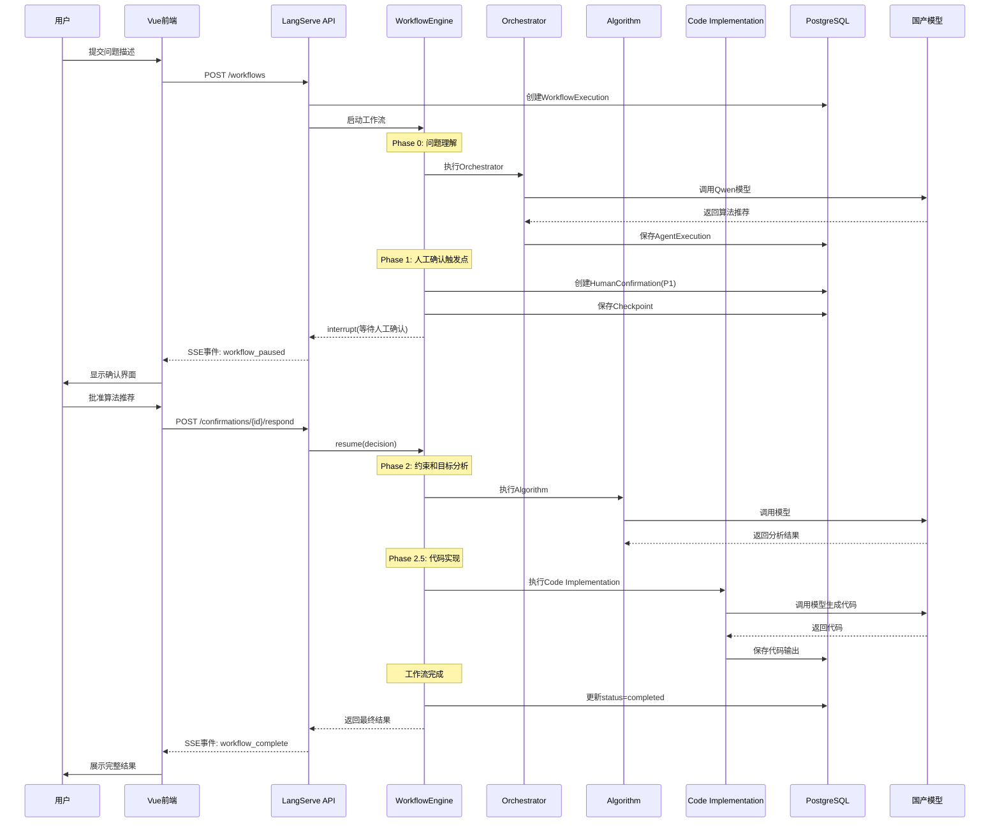

# 8. Core Workflows

## 8.1 完整APS工作流执行（含Human-in-Loop）

```mermaid
sequenceDiagram
    participant User as 用户
    participant Frontend as Vue前端
    participant API as LangServe API
    participant WF as WorkflowEngine
    participant Orch as Orchestrator
    participant Algo as Algorithm
    participant Code as Code Implementation
    participant DB as PostgreSQL
    participant Model as 国产模型

    User->>Frontend: 提交问题描述
    Frontend->>API: POST /workflows
    API->>DB: 创建WorkflowExecution
    API->>WF: 启动工作流

    Note over WF: Phase 0: 问题理解
    WF->>Orch: 执行Orchestrator
    Orch->>Model: 调用Qwen模型
    Model-->>Orch: 返回算法推荐
    Orch->>DB: 保存AgentExecution

    Note over WF: Phase 1: 人工确认触发点
    WF->>DB: 创建HumanConfirmation(P1)
    WF->>DB: 保存Checkpoint
    WF-->>API: interrupt(等待人工确认)
    API-->>Frontend: SSE事件: workflow_paused

    Frontend->>User: 显示确认界面
    User->>Frontend: 批准算法推荐
    Frontend->>API: POST /confirmations/{id}/respond
    API->>WF: resume(decision)

    Note over WF: Phase 2: 约束和目标分析
    WF->>Algo: 执行Algorithm
    Algo->>Model: 调用模型
    Model-->>Algo: 返回分析结果

    Note over WF: Phase 2.5: 代码实现
    WF->>Code: 执行Code Implementation
    Code->>Model: 调用模型生成代码
    Model-->>Code: 返回代码
    Code->>DB: 保存代码输出

    Note over WF: 工作流完成
    WF->>DB: 更新status=completed
    WF-->>API: 返回最终结果
    API-->>Frontend: SSE事件: workflow_complete
    Frontend->>User: 展示完整结果
```

---
