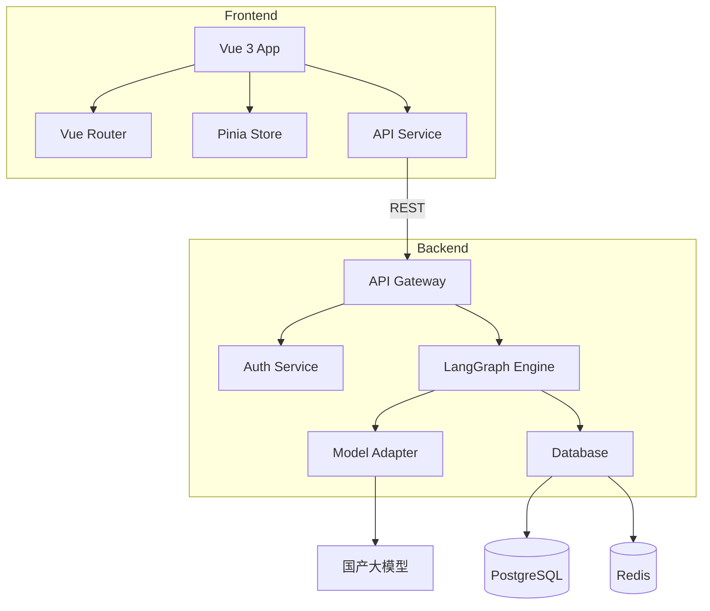

# Components

系统被划分为以下主要逻辑组件，遵循单一职责原则和低耦合高内聚原则。

## 后端组件

### API Gateway Component

**Responsibility:** 提供统一的HTTP API入口，处理请求路由、认证授权、限流和错误处理

**实现位置**: `backend/app/api/v1/`

**Technology Stack:**

- FastAPI 0.115.12
- Pydantic 2.11
- slowapi 0.1.9
- uvicorn 0.34

---

### LangGraph Workflow Engine

**Responsibility:** 编排BMAD八大智能体工作流，管理StateGraph状态流转和checkpoint持久化

**Key Interfaces:**

- `create_workflow(input_data)` - 创建新工作流
- `resume_workflow(thread_id, user_input)` - 恢复暂停的工作流
- `interrupt_workflow(thread_id, approval_point)` - 暂停工作流等待人工确认

**实现位置**: `backend/app/core/langgraph/`

**Technology Stack:**

- LangGraph 0.4.1
- langgraph-checkpoint-postgres 2.0.19
- langchain-core 0.3.58

---

### Model Adapter Service

**Responsibility:** 提供统一的国产大模型调用接口，支持Qwen、GLM、DeepSeek等模型的热切换

**实现位置**: `backend/model_adapters/`（待Story 1.4实现）

---

### Database Service

**Responsibility:** 管理数据库连接、事务和ORM操作

**实现位置**: `backend/app/services/database.py`

**Technology Stack:**

- SQLModel 0.0.24
- psycopg2-binary 2.9.10

---

### Logging & Monitoring Service

**Responsibility:** 结构化日志记录、Prometheus指标导出、Langfuse LLM追踪

**实现位置**:

- `backend/app/core/logging.py`
- `backend/app/core/metrics.py`
- `backend/app/core/middleware.py`

**Technology Stack:**

- structlog 25.2.0
- langfuse 3.0.3
- prometheus-client 0.19.0

---

## 前端组件

### Application Shell

**Responsibility:** 应用主框架，包含顶部导航、侧边栏、底部栏和路由出口

**实现位置**: `frontend/web/src/layouts/`

**Technology Stack:**

- Vue 3.5 Composition API
- Ant Design Vue 4.2

---

### Page Views

**Responsibility:** 各功能页面的顶层视图组件

**实现位置**: `frontend/web/src/views/`

- `Dashboard.vue` - 工作流概览仪表盘
- `WorkflowMonitor.vue` - 实时工作流监控
- `Settings.vue` - 用户设置和模型配置

---

### API Service Layer

**Responsibility:** 封装所有HTTP API调用，提供类型安全的接口

**实现位置**: `frontend/web/src/services/`

**Technology Stack:**

- Axios 1.13.2
- TypeScript 5.9

---

### State Management Stores

**Responsibility:** 管理全局应用状态

**实现位置**: `frontend/web/src/stores/`

- `user.ts` - 用户登录状态、Token、权限
- `app.ts` - 全局UI状态（侧边栏折叠、主题等）

**Technology Stack:**

- Pinia 2.3.1

---

## Component Interaction Diagram

---
