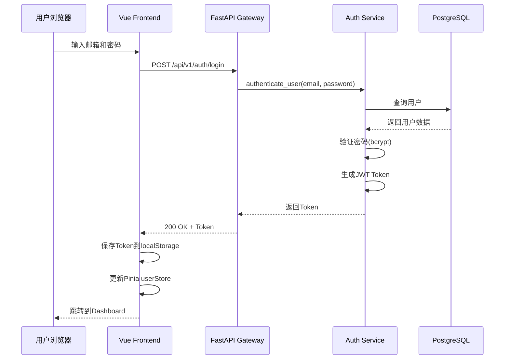
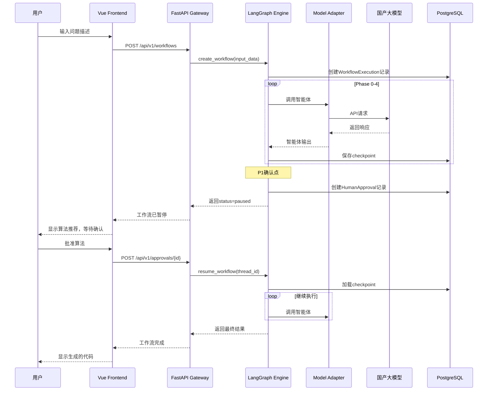

# Core Workflows

## 工作流1: 用户登录和Token获取

```mermaid
sequenceDiagram
    participant U as 用户浏览器
    participant FE as Vue Frontend
    participant API as FastAPI Gateway
    participant Auth as Auth Service
    participant DB as PostgreSQL

    U->>FE: 输入邮箱和密码
    FE->>API: POST /api/v1/auth/login
    API->>Auth: authenticate_user(email, password)
    Auth->>DB: 查询用户
    DB-->>Auth: 返回用户数据
    Auth->>Auth: 验证密码(bcrypt)
    Auth->>Auth: 生成JWT Token
    Auth-->>API: 返回Token
    API-->>FE: 200 OK + Token
    FE->>FE: 保存Token到localStorage
    FE->>FE: 更新Pinia userStore
    FE-->>U: 跳转到Dashboard
```

---

## 工作流2: 创建和执行BMAD工作流（含HITL）

```mermaid
sequenceDiagram
    participant U as 用户
    participant FE as Vue Frontend
    participant API as FastAPI Gateway
    participant LG as LangGraph Engine
    participant MA as Model Adapter
    participant LLM as 国产大模型
    participant DB as PostgreSQL

    U->>FE: 输入问题描述
    FE->>API: POST /api/v1/workflows
    API->>LG: create_workflow(input_data)
    LG->>DB: 创建WorkflowExecution记录

    loop Phase 0-4
        LG->>MA: 调用智能体
        MA->>LLM: API请求
        LLM-->>MA: 返回响应
        MA-->>LG: 智能体输出
        LG->>DB: 保存checkpoint
    end

    Note over LG: P1确认点
    LG->>DB: 创建HumanApproval记录
    LG-->>API: 返回status=paused
    API-->>FE: 工作流已暂停
    FE-->>U: 显示算法推荐，等待确认

    U->>FE: 批准算法
    FE->>API: POST /api/v1/approvals/{id}
    API->>LG: resume_workflow(thread_id)
    LG->>DB: 加载checkpoint

    loop 继续执行
        LG->>MA: 调用智能体
    end

    LG-->>API: 返回最终结果
    API-->>FE: 工作流完成
    FE-->>U: 显示生成的代码
```

---
