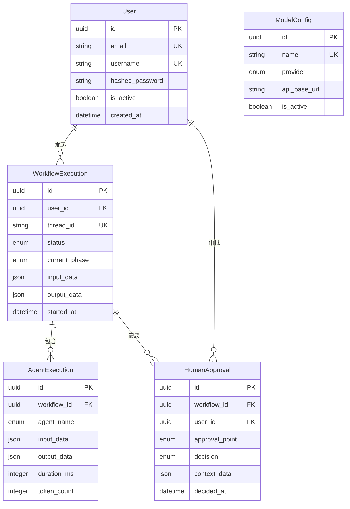

# Data Models

基于PRD需求和LangGraph 0.4.1架构，以下是系统核心数据模型。这些模型在后端使用SQLModel定义，通过OpenAPI自动生成TypeScript接口供前端使用。

## Model: User

**Purpose:** 用户账户管理，支持JWT认证和RBAC权限控制

**Key Attributes:**

- `id`: UUID - 用户唯一标识符
- `email`: String - 用户邮箱（唯一，用于登录）
- `username`: String - 用户名（唯一）
- `hashed_password`: String - bcrypt加密的密码哈希
- `is_active`: Boolean - 账户是否激活
- `is_superuser`: Boolean - 是否为超级管理员
- `created_at`: DateTime - 账户创建时间
- `last_login`: DateTime - 最后登录时间

**TypeScript Interface:**

```typescript
interface User {
  id: string;
  email: string;
  username: string;
  is_active: boolean;
  is_superuser: boolean;
  created_at: string; // ISO 8601
  last_login: string | null; // ISO 8601
}

interface UserCreate {
  email: string;
  username: string;
  password: string;
}

interface TokenResponse {
  access_token: string;
  token_type: 'bearer';
  expires_in: number;
}
```

**Relationships:**

- 一对多 → WorkflowExecution
- 一对多 → HumanApproval

---

## Model: WorkflowExecution

**Purpose:** 记录完整的BMAD工作流执行过程，包括Phase 0-4的状态流转

**Key Attributes:**

- `id`: UUID - 工作流执行唯一标识符
- `user_id`: UUID - 发起用户ID
- `thread_id`: String - LangGraph线程ID
- `status`: Enum - 执行状态（pending/running/paused/completed/failed）
- `current_phase`: String - 当前执行阶段
- `input_data`: JSON - 用户输入
- `output_data`: JSON - 最终输出
- `started_at`: DateTime - 开始时间
- `completed_at`: DateTime - 完成时间
- `total_tokens`: Integer - 总token消耗
- `total_cost`: Decimal - 总成本

**TypeScript Interface:**

```typescript
type WorkflowStatus = 'pending' | 'running' | 'paused' | 'completed' | 'failed';
type WorkflowPhase = 'P0' | 'P1' | 'P2' | 'P2.5' | 'P3' | 'P4';

interface WorkflowExecution {
  id: string;
  user_id: string;
  thread_id: string;
  status: WorkflowStatus;
  current_phase: WorkflowPhase;
  input_data: {
    problem_description: string;
    domain?: string;
    constraints?: string[];
  };
  output_data: {
    algorithm?: string;
    code?: string;
    documentation?: string;
  } | null;
  started_at: string;
  completed_at: string | null;
  error_message: string | null;
  total_tokens: number;
  total_cost: number;
}
```

**Relationships:**

- 多对一 → User
- 一对多 → AgentExecution
- 一对多 → HumanApproval

---

## Model: AgentExecution

**Purpose:** 记录单个智能体的执行详情

**TypeScript Interface:**

```typescript
type AgentName = 'orchestrator' | 'algorithm' | 'constraint' | 'objective' | 'domain' | 'code_implementation' | 'extension' | 'quality';

interface AgentExecution {
  id: string;
  workflow_id: string;
  agent_name: AgentName;
  input_data: Record<string, any>;
  output_data: Record<string, any> | null;
  started_at: string;
  completed_at: string | null;
  duration_ms: number;
  token_count: number;
  model_used: string;
  status: 'success' | 'failed' | 'skipped';
  error_message: string | null;
}
```

---

## Model: HumanApproval

**Purpose:** 记录Human-in-the-Loop确认点的人工决策

**TypeScript Interface:**

```typescript
type ApprovalPoint = 'P1' | 'P2' | 'P2.5';
type ApprovalDecision = 'approved' | 'rejected' | 'modified';

interface HumanApproval {
  id: string;
  workflow_id: string;
  user_id: string;
  approval_point: ApprovalPoint;
  context_data: Record<string, any>;
  decision: ApprovalDecision;
  feedback: string;
  modified_data: Record<string, any> | null;
  created_at: string;
  decided_at: string | null;
}
```

---

## Model: ModelConfig

**Purpose:** 管理国产大模型配置

**TypeScript Interface:**

```typescript
type ModelProvider = 'qwen' | 'glm' | 'deepseek' | 'local';

interface ModelConfig {
  id: string;
  name: string;
  provider: ModelProvider;
  api_base_url: string;
  model_version: string;
  max_tokens: number;
  temperature: number;
  is_active: boolean;
  priority: number;
}
```

---

**数据模型关系图**：



---
