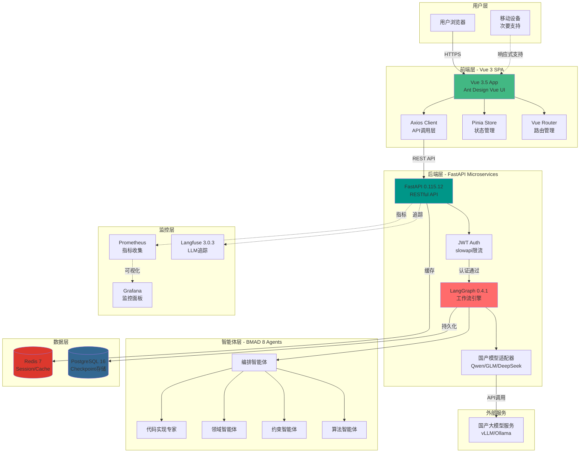

# High Level Architecture

## Technical Summary

BMAD-METHOD LangGraph集成方案采用**现代化微服务架构**，结合容器化部署和云原生可观测性。后端基于FastAPI 0.115.12和LangGraph 0.4.1构建，利用Python 3.13.2的最新特性实现八大智能体工作流编排，通过PostgreSQL持久化checkpoint状态，Redis提供会话缓存。前端采用Vue 3.5 Composition API + TypeScript 5.9，使用Ant Design Vue 4.2构建响应式监控界面，通过Axios与后端RESTful API通信，Pinia管理全局状态。整个系统通过Docker Compose实现一键启动的本地开发环境，集成Langfuse进行LLM调用追踪，Prometheus + Grafana提供实时监控和告警，支持国产大模型（Qwen/GLM/DeepSeek）的即插即用。架构设计遵循"轻适配器"原则，Phase 1优先实现核心价值（2-3周），为后续YAML编译器（Phase 2）和智能体工厂（Phase 3）预留扩展空间。

## Platform and Infrastructure Choice

经过对比分析，我们选择了**混合云 + 容器化**的基础设施方案：

**推荐方案（已实施）**：

- **主平台**：Docker + Docker Compose（本地开发和生产环境）
- **数据库**：PostgreSQL 16（LangGraph checkpoint后端）+ Redis 7（会话/缓存）
- **监控可观测性**：Langfuse 3.0.3（LLM追踪）+ Prometheus 2.48+（指标收集）+ Grafana 10.0+（可视化）
- **安全认证**：JWT Token + slowapi 0.1.9（API限流）
- **部署方式**：容器化部署，支持私有云和公有云

**最终选择**：

- **平台**：Docker + Docker Compose
- **关键服务**：FastAPI、PostgreSQL、Redis、Langfuse、Prometheus、Grafana
- **部署主机和区域**：支持本地开发环境和私有云部署（具体区域待Phase 1完成后根据实际需求确定）

## Repository Structure

本项目采用**Monorepo**结构，所有代码集中在单一仓库管理：

**结构选择**：Monorepo（单一仓库）
**Monorepo工具**：Git子目录（轻量级，无需额外工具如Nx/Turborepo）
**包组织策略**：按功能模块划分（backend、frontend/web、docs）

**实际仓库结构**：

```
BMAD-METHOD/
├── backend/                    # FastAPI + LangGraph后端
│   ├── app/                   # 应用代码
│   ├── docker-compose.yml     # 本地开发环境
│   ├── pyproject.toml         # Python依赖（uv管理）
│   └── README.md              # 后端文档
├── frontend/web/              # Vue 3前端
│   ├── src/                   # 源代码
│   ├── package.json           # npm依赖
│   └── README.md              # 前端文档
├── docs/                      # 项目文档
│   ├── langgraph集成方案.md   # PRD v1.2
│   ├── stories/               # 用户故事
│   └── architecture.md        # 本架构文档
├── .bmad-core/                # BMAD工具链
└── README.md                  # 项目总览
```

## High Level Architecture Diagram



## Architectural Patterns

以下是指导全栈开发的关键架构模式：

- **微服务架构（Microservices）**：后端采用FastAPI微服务架构，LangGraph工作流引擎作为独立服务运行，支持水平扩展 - _理由：_ 符合云原生最佳实践，便于未来Phase 3的智能体工厂横向扩展

- **事件驱动架构（Event-Driven）**：LangGraph工作流基于StateGraph的事件驱动模型，智能体间通过状态变更触发执行 - _理由：_ 支持复杂的人机协作和异步工作流，提升系统响应性

- **单页应用（SPA）**：前端采用Vue 3 SPA架构，通过Vue Router实现客户端路由 - _理由：_ 提供流畅的用户体验，减少页面刷新，适合实时监控界面

- **组件化UI（Component-Based UI）**：使用Vue 3 Composition API + Ant Design Vue构建可复用组件 - _理由：_ 提升开发效率，保证UI一致性，便于团队协作和代码维护

- **Repository模式（Repository Pattern）**：后端数据访问通过SQLModel抽象数据库操作 - _理由：_ 解耦业务逻辑和数据访问，便于测试和未来数据库迁移

- **API Gateway模式（API Gateway）**：FastAPI作为单一入口点，集中处理认证、限流、日志 - _理由：_ 统一安全策略，简化前端调用，便于监控和审计

- **断路器模式（Circuit Breaker）**：LLM调用失败时自动降级和重试 - _理由：_ 提升系统韧性，避免外部服务故障影响整体可用性

- **轻适配器模式（Lightweight Adapter）**：国产模型适配器最小化侵入，复用LangChain生态 - _理由：_ 降低维护成本，保持与上游社区同步，快速支持新模型

- **Human-in-the-Loop（HITL）**：基于LangGraph 0.4.1的interrupt机制实现人工确认点（P1/P2/P2.5） - _理由：_ 提升AI决策透明度，在关键节点保留人类控制权

---
