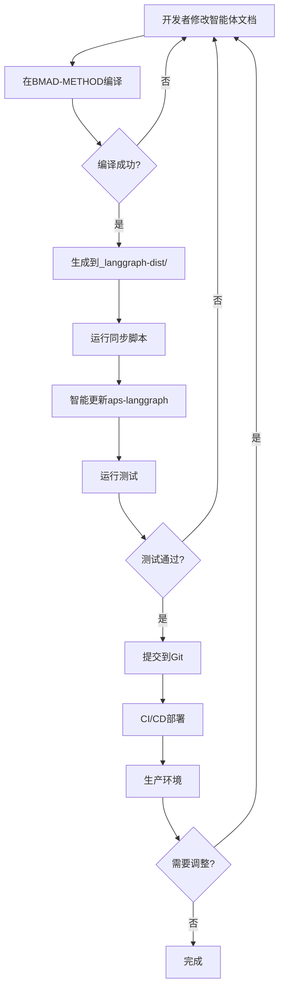

# BMAD-METHOD 集成 LangGraph 架构设计总览

> 版本: 1.0.0
> 日期: 2025-10-31
> 作者: Claude Code
> 状态: 设计完成，待实施

## 文档索引

1. **[01-架构设计总览.md](./01-架构设计总览.md)** - 本文档
2. **[02-编译器设计详解.md](./02-编译器设计详解.md)** - 编译器实现细节
3. **[03-独立项目结构.md](./03-独立项目结构.md)** - aps-langgraph项目详解
4. **[04-工作流与最佳实践.md](./04-工作流与最佳实践.md)** - 开发工作流和最佳实践
5. **[05-实施计划.md](./05-实施计划.md)** - 分阶段实施计划

---

## 📋 执行摘要

本文档描述了一个完整的架构方案，使 BMAD-METHOD 框架支持编译生成独立的 LangGraph 应用项目。

### 核心目标

- ✅ 保留 BMAD-METHOD 的"Agent as Doc"理念
- ✅ 支持生成生产级 LangGraph 应用
- ✅ 实现双重部署能力（IDE + 应用）
- ✅ 支持持续迭代开发模式

### 关键特性

| 特性             | 说明                                               |
| ---------------- | -------------------------------------------------- |
| **编译器模式**   | 将 Markdown 智能体文档编译为 Python LangGraph 节点 |
| **双项目架构**   | BMAD-METHOD（源）+ aps-langgraph（目标）           |
| **代码分层保护** | 生成代码 vs 自定义代码隔离                         |
| **智能同步**     | 支持反复编译和同步，不破坏自定义代码               |
| **版本管理**     | 完整的版本追踪和兼容性检查                         |

---

## 🏗️ 整体架构

### 架构图

```
┌─────────────────────────────────────────────────────────────┐
│                    BMAD-METHOD 项目                          │
│                   (智能体文档源头)                            │
│  ┌──────────────────────────────────────────────────────┐   │
│  │  bmad/aps/                                           │   │
│  │  ├── agents/           (Markdown智能体文档)          │   │
│  │  │   ├── orchestrator.md                            │   │
│  │  │   ├── algorithm-expert.md                        │   │
│  │  │   └── ...                                         │   │
│  │  ├── workflows/        (YAML工作流定义)              │   │
│  │  ├── templates/        (知识库)                      │   │
│  │  └── _module-compiler/ ⭐ 编译器（新增）              │   │
│  │      ├── compiler.py                                 │   │
│  │      ├── parsers/      (解析器)                      │   │
│  │      ├── generators/   (代码生成器)                  │   │
│  │      └── templates/    (Jinja2模板)                  │   │
│  └──────────────────────────────────────────────────────┘   │
│                          │                                   │
│                          │ bmad compile aps --target lg      │
│                          ▼                                   │
│  ┌──────────────────────────────────────────────────────┐   │
│  │  _langgraph-dist/     (编译输出)                     │   │
│  │  ├── src/generated/   (生成的Python代码)             │   │
│  │  ├── knowledge/       (知识库副本)                   │   │
│  │  ├── requirements.txt                                │   │
│  │  ├── pyproject.toml                                  │   │
│  │  └── .bmad-manifest.json (元数据)                    │   │
│  └──────────────────────────────────────────────────────┘   │
└─────────────────────────────────────────────────────────────┘
                          │
                          │ scripts/sync_from_bmad.sh
                          ▼
┌─────────────────────────────────────────────────────────────┐
│              APS-LANGGRAPH 独立项目                          │
│                (独立 Git 仓库)                               │
│  ┌──────────────────────────────────────────────────────┐   │
│  │  aps-langgraph/                                      │   │
│  │  ├── src/                                            │   │
│  │  │   ├── generated/   (自动生成，会被覆盖)           │   │
│  │  │   ├── custom/      (手动编写，永不覆盖)           │   │
│  │  │   ├── app.py       (首次生成，后续保护)           │   │
│  │  │   └── config.py    (手动管理)                     │   │
│  │  ├── knowledge/       (自动同步)                     │   │
│  │  ├── tests/           (手动编写)                     │   │
│  │  ├── docker/          (部署配置)                     │   │
│  │  ├── .bmad-sync-config.yml (同步规则)               │   │
│  │  └── scripts/         (辅助脚本)                     │   │
│  └──────────────────────────────────────────────────────┘   │
│                          │                                   │
│                          │ python -m src.app                 │
│                          ▼                                   │
│                    LangGraph 运行时                          │
│                    (PostgreSQL + Anthropic API)              │
└─────────────────────────────────────────────────────────────┘
```

### 三层代码架构

```
aps-langgraph/src/
├── generated/              # 第1层：自动生成（每次覆盖）
│   ├── agents/
│   │   ├── orchestrator.py
│   │   ├── algorithm_expert.py
│   │   └── ...
│   ├── workflows/
│   └── state/
│
├── app.py                  # 第2层：首次生成（后续保护）
├── config.py               #
│
└── custom/                 # 第3层：完全手动（永不覆盖）
    ├── extensions/
    ├── middleware/
    ├── hooks/
    └── integrations/
```

---

## 🔄 核心工作流

### 开发循环



### 命令流程

```bash
# 步骤1: 在 BMAD-METHOD 中修改
cd BMAD-METHOD
vim bmad/aps/agents/algorithm-expert.md

# 步骤2: 编译
bmad compile aps --target langgraph --output ../_langgraph-dist

# 步骤3: 同步到独立项目
cd ../aps-langgraph
bash scripts/sync_from_bmad.sh

# 步骤4: 测试
pytest tests/

# 步骤5: 提交
git add .
git commit -m "sync: 更新算法专家逻辑"
git push

# 步骤6: 自动部署（CI/CD）
```

---

## 🎯 设计原则

### 1. 关注点分离

| 关注点         | 位置                         | 管理方式           |
| -------------- | ---------------------------- | ------------------ |
| **智能体定义** | BMAD-METHOD/agents/          | Markdown文档       |
| **工作流编排** | BMAD-METHOD/workflows/       | YAML配置           |
| **知识库**     | BMAD-METHOD/templates/       | Markdown文档       |
| **运行时逻辑** | aps-langgraph/src/generated/ | Python代码（生成） |
| **自定义扩展** | aps-langgraph/src/custom/    | Python代码（手动） |
| **部署配置**   | aps-langgraph/docker/        | Docker配置（手动） |

### 2. 单一数据源原则

- **智能体定义的唯一真相源**: BMAD-METHOD 的 Markdown 文档
- **不在 aps-langgraph 中直接修改生成的代码**
- **所有智能体逻辑变更都从 BMAD-METHOD 开始**

### 3. 渐进式增强

- **第1层（生成层）**: 纯自动生成，提供基础功能
- **第2层（应用层）**: 首次生成后保护，允许集成自定义
- **第3层（扩展层）**: 完全手动，实现特定需求

### 4. 版本可追溯

- 每次编译生成 `.bmad-manifest.json`
- 记录编译时间、源文件、编译器版本
- 支持回滚到任意历史版本

---

## 🔑 关键组件

### 1. 编译器 (BMAD-METHOD/\_module-compiler/)

**职责**: 将 BMAD 文档转换为 LangGraph 代码

**核心模块**:

- `parsers/` - 解析 Markdown、YAML、知识库
- `generators/` - 生成 Python 代码
- `templates/` - Jinja2 代码模板
- `compiler.py` - 主编译逻辑

### 2. 同步系统 (aps-langgraph/scripts/)

**职责**: 安全地将编译产物同步到独立项目

**核心脚本**:

- `sync_from_bmad.sh` - 主同步脚本
- `check_version_compatibility.py` - 版本检查
- `merge_requirements.py` - 依赖合并
- `generate_sync_report.py` - 变更报告

### 3. 保护机制 (.bmad-sync-config.yml)

**职责**: 定义哪些文件可以覆盖，哪些需要保护

**规则类型**:

- `auto_managed` - 每次覆盖
- `generate_once` - 首次生成
- `never_sync` - 永不同步
- `merge` - 智能合并

---

## 💡 技术优势

### 对比传统方式

| 维度           | 传统方式           | BMAD 编译模式      |
| -------------- | ------------------ | ------------------ |
| **智能体定义** | 直接写 Python 代码 | Markdown 文档      |
| **维护性**     | 代码分散，难以理解 | 文档化，易于维护   |
| **复用性**     | 仅应用层可用       | IDE + 应用双重部署 |
| **知识管理**   | 嵌入代码中         | 独立知识库         |
| **迭代速度**   | 修改代码后重新部署 | 修改文档后编译同步 |
| **可追溯性**   | 依赖 Git           | Git + 编译清单     |

### 双重部署能力

```
BMAD/APS 智能体文档
        │
        ├──────────────────┬──────────────────┐
        │                  │                  │
        ▼                  ▼                  ▼
    IDE 模式         LangGraph 模式      其他框架
   (现有能力)         (新增能力)        (未来扩展)
        │                  │                  │
    Claude Code      Python 应用         AutoGen
    Cursor          生产级部署          CrewAI
    Cline           API 服务            ...
```

---

## 📊 可行性分析

### ✅ 技术可行性

| 方面           | 评估    | 说明                                   |
| -------------- | ------- | -------------------------------------- |
| **架构兼容性** | ✅ 高   | BMAD 和 LangGraph 都是多智能体系统     |
| **状态映射**   | ✅ 可行 | Phase State 可映射到 StateGraph        |
| **工作流转换** | ✅ 可行 | YAML 工作流可转换为 StateGraph 定义    |
| **知识库集成** | ✅ 可行 | 文件引用可转为运行时加载               |
| **持久化**     | ✅ 兼容 | BMAD 状态文件 → LangGraph Checkpointer |

### 🎯 业务价值

| 价值             | 说明                            |
| ---------------- | ------------------------------- |
| **扩大应用场景** | 从 IDE 对话扩展到生产应用       |
| **降低门槛**     | 业务人员编写文档，自动生成代码  |
| **提升效率**     | 一次定义，双重部署              |
| **技术领先**     | 首个支持 IDE + 应用的智能体框架 |

### ⏱️ 开发周期估算

| 阶段                    | 工作量     | 说明               |
| ----------------------- | ---------- | ------------------ |
| **Phase 1: 编译器基础** | 2-3周      | 解析器、模板系统   |
| **Phase 2: 代码生成**   | 3-4周      | 生成器、测试       |
| **Phase 3: CLI集成**    | 1-2周      | bmad compile 命令  |
| **Phase 4: 同步系统**   | 2-3周      | 智能同步、版本管理 |
| **总计**                | **8-12周** | 约 2-3 个月        |

---

## 🚀 下一步行动

### 立即可做

1. **阅读完整设计文档** (本文档及后续4个文档)
2. **评审架构方案** - 确认是否符合需求
3. **决定实施时间** - 规划到产品路线图

### 实施准备

1. **创建编译器目录结构**

   ```bash
   mkdir -p bmad/aps/_module-compiler/{parsers,generators,templates,utils}
   ```

2. **实现第一个原型** - 编译 orchestrator.md
3. **验证可行性** - 在 LangGraph 中运行
4. **迭代扩展** - 支持所有智能体

### 长期规划

- **v1.0**: 支持 APS 模块编译到 LangGraph
- **v2.0**: 支持其他模块（BMM、CIS）
- **v3.0**: 支持其他框架（AutoGen、CrewAI）
- **v4.0**: 可视化编译器 Studio

---

## 📚 文档清单

完整的设计文档包含以下5个文件：

1. ✅ **01-架构设计总览.md** (本文档)
2. ⏳ **02-编译器设计详解.md** - 待创建
3. ⏳ **03-独立项目结构.md** - 待创建
4. ⏳ **04-工作流与最佳实践.md** - 待创建
5. ⏳ **05-实施计划.md** - 待创建

---

## 📞 联系方式

如有疑问或建议，请通过以下方式联系：

- **GitHub Issues**: https://github.com/your-org/bmad-method/issues
- **文档维护者**: Claude Code
- **最后更新**: 2025-10-31

---

**版权声明**: 本设计文档属于 BMAD-METHOD 项目，遵循 MIT 许可证。
