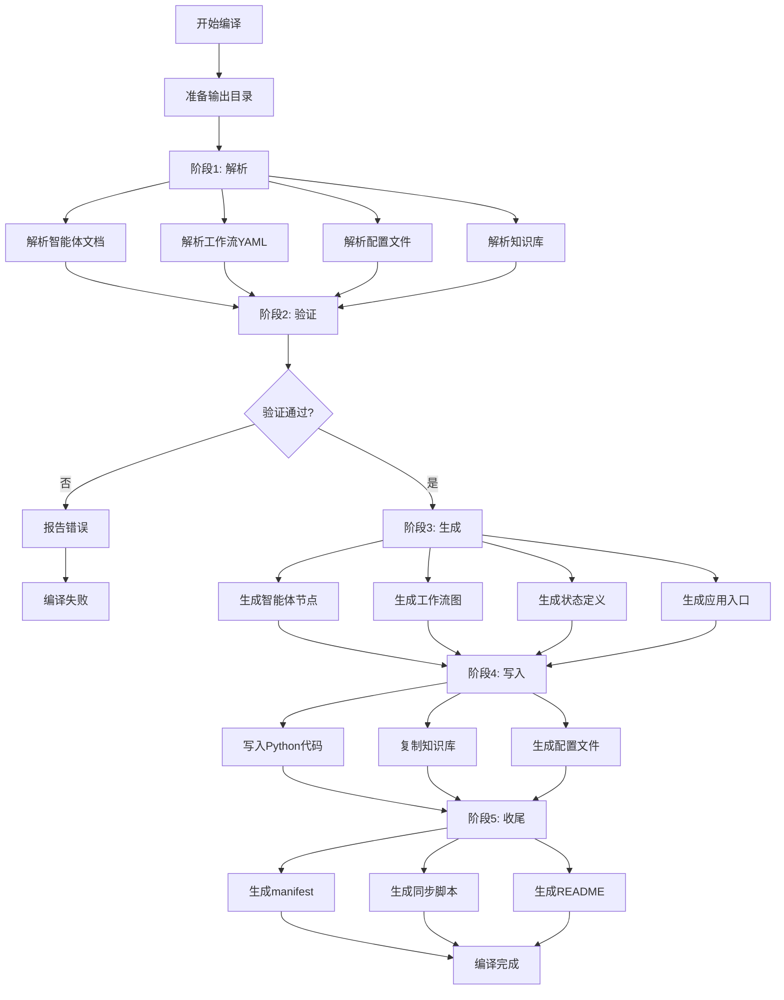

# 编译器设计详解

> 文档: 02/05
> 版本: 1.0.0
> 日期: 2025-10-31

## 📋 目录

- [编译器架构](#编译器架构)
- [目录结构](#目录结构)
- [核心模块](#核心模块)
- [编译流程](#编译流程)
- [代码生成模板](#代码生成模板)
- [CLI集成](#cli集成)

---

## 编译器架构

### 设计理念

编译器采用**管道模式**（Pipeline Pattern），将编译过程分解为多个独立的阶段：

```
Markdown/YAML 文档
    ↓
解析器 (Parsers)
    ↓
中间表示 (IR)
    ↓
代码生成器 (Generators)
    ↓
Python 代码 + 配置文件
```

### 技术选型

| 组件             | 技术                      | 理由                       |
| ---------------- | ------------------------- | -------------------------- |
| **模板引擎**     | Jinja2                    | 强大、灵活、Python生态标准 |
| **YAML解析**     | PyYAML                    | 官方推荐                   |
| **Markdown解析** | 正则表达式 + 自定义解析器 | 特定格式，自定义更灵活     |
| **文件操作**     | pathlib + fs-extra        | 跨平台兼容                 |
| **CLI**          | Node.js (集成现有CLI)     | 保持一致性                 |

---

## 目录结构

```
bmad/aps/_module-compiler/
├── __init__.py
├── cli.py                      # Python CLI入口
├── compiler.py                 # 主编译器类
│
├── parsers/                    # 解析器模块
│   ├── __init__.py
│   ├── agent_parser.py         # 智能体文档解析器
│   ├── workflow_parser.py      # 工作流解析器
│   ├── knowledge_parser.py     # 知识库解析器
│   └── config_parser.py        # 配置文件解析器
│
├── generators/                 # 代码生成器模块
│   ├── __init__.py
│   ├── agent_generator.py      # 智能体节点生成器
│   ├── workflow_generator.py   # 工作流图生成器
│   ├── state_generator.py      # 状态定义生成器
│   ├── app_generator.py        # 应用入口生成器
│   └── project_generator.py    # 项目配置生成器
│
├── templates/                  # Jinja2 模板
│   ├── agent_node.py.jinja2
│   ├── workflow_graph.py.jinja2
│   ├── state_schema.py.jinja2
│   ├── app.py.jinja2
│   ├── config.py.jinja2
│   ├── pyproject.toml.jinja2
│   ├── requirements.txt.jinja2
│   ├── docker-compose.yml.jinja2
│   └── README.md.jinja2
│
├── utils/                      # 工具函数
│   ├── __init__.py
│   ├── file_writer.py          # 文件写入工具
│   ├── manifest_builder.py     # 清单构建器
│   └── validation.py           # 验证工具
│
└── tests/                      # 编译器测试
    ├── test_parsers.py
    ├── test_generators.py
    └── fixtures/               # 测试数据
```

---

## 核心模块

### 1. 主编译器 (compiler.py)

```python
"""
主编译器
负责协调整个编译流程
"""
from pathlib import Path
from typing import Dict, List
from jinja2 import Environment, FileSystemLoader

from .parsers import AgentParser, WorkflowParser, KnowledgeParser
from .generators import (
    AgentGenerator,
    WorkflowGenerator,
    StateGenerator,
    AppGenerator,
    ProjectGenerator
)
from .utils import FileWriter, ManifestBuilder

class APSLangGraphCompiler:
    """
    APS模块到LangGraph的编译器
    """

    def __init__(self, source_dir: str, output_dir: str, config: Dict = None):
        """
        初始化编译器

        Args:
            source_dir: 源目录 (bmad/aps)
            output_dir: 输出目录 (_langgraph-dist)
            config: 编译配置
        """
        self.source_dir = Path(source_dir)
        self.output_dir = Path(output_dir)
        self.config = config or {}

        # 初始化Jinja2环境
        template_dir = Path(__file__).parent / "templates"
        self.jinja_env = Environment(
            loader=FileSystemLoader(template_dir),
            trim_blocks=True,
            lstrip_blocks=True,
            keep_trailing_newline=True
        )

        # 初始化解析器
        self.agent_parser = AgentParser()
        self.workflow_parser = WorkflowParser()
        self.knowledge_parser = KnowledgeParser()

        # 初始化生成器
        self.agent_gen = AgentGenerator(self.jinja_env)
        self.workflow_gen = WorkflowGenerator(self.jinja_env)
        self.state_gen = StateGenerator(self.jinja_env)
        self.app_gen = AppGenerator(self.jinja_env)
        self.project_gen = ProjectGenerator(self.jinja_env)

        # 初始化工具
        self.file_writer = FileWriter()
        self.manifest_builder = ManifestBuilder()

    def compile(self) -> Dict:
        """
        执行完整编译流程

        Returns:
            编译结果字典
        """
        print("🚀 开始编译APS模块到LangGraph...")

        # 清理输出目录
        self._prepare_output_dir()

        # 阶段1: 解析
        print("\n📖 阶段1: 解析源文件...")
        parse_result = self._parse_phase()

        # 阶段2: 验证
        print("\n✅ 阶段2: 验证解析结果...")
        self._validate_phase(parse_result)

        # 阶段3: 生成
        print("\n⚙️  阶段3: 生成代码...")
        generate_result = self._generate_phase(parse_result)

        # 阶段4: 写入
        print("\n💾 阶段4: 写入文件...")
        write_result = self._write_phase(generate_result)

        # 阶段5: 收尾
        print("\n🎁 阶段5: 生成项目配置...")
        self._finalize_phase(parse_result, write_result)

        print("\n✅ 编译完成!")
        return self._build_result(parse_result, write_result)

    def _parse_phase(self) -> Dict:
        """解析阶段"""
        agents = self._parse_agents()
        workflows = self._parse_workflows()
        config = self._parse_config()
        knowledge = self._parse_knowledge()

        return {
            "agents": agents,
            "workflows": workflows,
            "config": config,
            "knowledge": knowledge
        }

    def _parse_agents(self) -> List[Dict]:
        """解析所有智能体文档"""
        agents_dir = self.source_dir / "agents"
        agents = []

        for agent_file in sorted(agents_dir.glob("*.md")):
            try:
                agent_def = self.agent_parser.parse(agent_file)
                agents.append(agent_def)
                print(f"  ✓ 解析智能体: {agent_def['name']}")
            except Exception as e:
                print(f"  ✗ 解析失败 {agent_file.name}: {e}")
                raise

        return agents

    def _parse_workflows(self) -> List[Dict]:
        """解析所有工作流定义"""
        workflows_dir = self.source_dir / "workflows"
        workflows = []

        for workflow_dir in sorted(workflows_dir.iterdir()):
            if workflow_dir.is_dir():
                workflow_file = workflow_dir / "workflow.yaml"
                if workflow_file.exists():
                    try:
                        workflow_def = self.workflow_parser.parse(workflow_file)
                        workflows.append(workflow_def)
                        print(f"  ✓ 解析工作流: {workflow_def['name']}")
                    except Exception as e:
                        print(f"  ✗ 解析失败 {workflow_dir.name}: {e}")
                        raise

        return workflows

    def _parse_config(self) -> Dict:
        """解析配置文件"""
        import yaml
        config_file = self.source_dir / "config.yaml"

        with open(config_file, 'r', encoding='utf-8') as f:
            config = yaml.safe_load(f)

        print(f"  ✓ 解析配置: {config['module_name']}")
        return config

    def _parse_knowledge(self) -> List[Dict]:
        """解析知识库"""
        templates_dir = self.source_dir / "templates"
        knowledge_files = []

        for md_file in templates_dir.rglob("*.md"):
            rel_path = md_file.relative_to(templates_dir)
            knowledge_files.append({
                "path": str(rel_path),
                "full_path": str(md_file)
            })

        print(f"  ✓ 发现知识库文件: {len(knowledge_files)} 个")
        return knowledge_files

    # ... 其他方法实现见完整代码
```

### 2. 智能体解析器 (agent_parser.py)

```python
"""
智能体文档解析器
解析 Markdown 格式的智能体定义
"""
import re
from pathlib import Path
from typing import Dict, List

class AgentParser:
    """解析智能体Markdown文档"""

    def parse(self, agent_file: Path) -> Dict:
        """
        解析智能体文档

        Args:
            agent_file: 智能体Markdown文件路径

        Returns:
            智能体定义字典
        """
        with open(agent_file, 'r', encoding='utf-8') as f:
            content = f.read()

        return {
            "id": self._extract_id(agent_file, content),
            "name": self._extract_name(content),
            "source_file": str(agent_file),
            "description": self._extract_description(content),
            "persona": self._extract_persona(content),
            "system_prompt": self._extract_system_prompt(content),
            "libraries": self._extract_libraries(content),
            "guardrails": self._extract_guardrails(content),
            "activation": self._extract_activation(content)
        }

    def _extract_id(self, file_path: Path, content: str) -> str:
        """提取智能体ID"""
        # 方法1: 从XML标签提取
        match = re.search(r'<agent\s+id="([^"]+)"', content)
        if match:
            return match.group(1)

        # 方法2: 从文件名生成
        return file_path.stem.replace('-', '_')

    def _extract_name(self, content: str) -> str:
        """提取智能体名称"""
        match = re.search(r'<agent[^>]*name="([^"]+)"', content)
        if match:
            return match.group(1)

        # 从标题提取
        match = re.search(r'^#\s+(.+)$', content, re.MULTILINE)
        if match:
            return match.group(1).strip()

        return "Unknown Agent"

    def _extract_description(self, content: str) -> str:
        """提取描述信息"""
        # 提取第一个段落作为描述
        lines = content.split('\n')
        for line in lines:
            line = line.strip()
            if line and not line.startswith('#') and not line.startswith('<'):
                return line
        return ""

    def _extract_persona(self, content: str) -> str:
        """提取Persona定义"""
        # 查找 ## Persona 或类似章节
        match = re.search(
            r'##\s*(?:Persona|角色定义|身份).*?\n(.*?)(?=\n##|\Z)',
            content,
            re.DOTALL | re.IGNORECASE
        )
        if match:
            return match.group(1).strip()

        # 查找 YAML 格式的 persona
        match = re.search(r'persona:\s*\|\n((?:\s{2,}.+\n)+)', content)
        if match:
            return match.group(1).strip()

        return ""

    def _extract_system_prompt(self, content: str) -> str:
        """提取系统提示模板"""
        # 从persona、职责、约束等章节组合生成
        persona = self._extract_persona(content)
        responsibilities = self._extract_section(content, "职责|Responsibilities")
        constraints = self._extract_section(content, "约束|Constraints")

        prompt = f"""你是 {self._extract_name(content)}。

{persona}

## 核心职责
{responsibilities}

## 工作约束
{constraints}
"""
        return prompt.strip()

    def _extract_section(self, content: str, section_name: str) -> str:
        """提取指定章节内容"""
        pattern = rf'##\s*(?:{section_name}).*?\n(.*?)(?=\n##|\Z)'
        match = re.search(pattern, content, re.DOTALL | re.IGNORECASE)
        if match:
            return match.group(1).strip()
        return ""

    def _extract_libraries(self, content: str) -> List[str]:
        """提取专家知识库引用"""
        libraries = []

        # 查找 expert_libraries 配置
        match = re.search(
            r'expert_libraries:\s*\n((?:\s+-\s+.+\n)+)',
            content
        )
        if match:
            lib_text = match.group(1)
            libraries = re.findall(r'-\s+(.+)', lib_text)

        # 查找 @引用
        references = re.findall(r'@([a-zA-Z0-9/_-]+)', content)
        libraries.extend(references)

        return list(set(libraries))  # 去重

    def _extract_guardrails(self, content: str) -> Dict:
        """提取Guardrails约束"""
        guardrails = {
            "citation_required": True,
            "allowed_sources": [],
            "forbidden_actions": []
        }

        # 查找约束规则章节
        constraints = self._extract_section(content, "Guardrails|强约束|约束规则")

        if "必须引用" in constraints or "citation" in constraints.lower():
            guardrails["citation_required"] = True

        # 提取允许的来源
        if "allowed_sources" in content:
            match = re.search(
                r'allowed_sources:\s*\n((?:\s+-\s+.+\n)+)',
                content
            )
            if match:
                sources = re.findall(r'-\s+(.+)', match.group(1))
                guardrails["allowed_sources"] = sources

        return guardrails

    def _extract_activation(self, content: str) -> Dict:
        """提取activation指令"""
        activation = {
            "steps": [],
            "critical": False
        }

        # 查找 <activation> 标签
        match = re.search(
            r'<activation[^>]*>(.*?)</activation>',
            content,
            re.DOTALL
        )

        if match:
            activation_content = match.group(1)

            # 检查是否为关键步骤
            if 'critical="MANDATORY"' in content:
                activation["critical"] = True

            # 提取步骤
            steps = re.findall(
                r'<step\s+n="(\d+)">(.+?)</step>',
                activation_content
            )
            activation["steps"] = [
                {"number": int(n), "action": action.strip()}
                for n, action in steps
            ]

        return activation
```

### 3. 智能体代码生成器 (agent_generator.py)

```python
"""
智能体节点代码生成器
"""
from typing import Dict, List
from jinja2 import Environment

class AgentGenerator:
    """生成智能体节点Python代码"""

    def __init__(self, jinja_env: Environment):
        self.jinja_env = jinja_env

    def generate_node(self, agent: Dict) -> str:
        """
        生成单个智能体节点代码

        Args:
            agent: 智能体定义字典

        Returns:
            Python代码字符串
        """
        template = self.jinja_env.get_template("agent_node.py.jinja2")

        # 准备模板数据
        template_data = {
            "agent": agent,
            "timestamp": self._get_timestamp(),
            "imports": self._generate_imports(agent),
            "constants": self._generate_constants(agent),
            "node_function": self._generate_node_function(agent)
        }

        return template.render(**template_data)

    def generate_init(self, agents: List[Dict]) -> str:
        """生成agents/__init__.py"""
        imports = []
        exports = []

        for agent in agents:
            agent_id = agent["id"]
            imports.append(f"from .{agent_id} import {agent_id}_node")
            exports.append(f'    "{agent_id}_node",')

        init_code = f"""\"\"\"
自动生成的智能体节点模块
\"\"\"

{chr(10).join(imports)}

__all__ = [
{chr(10).join(exports)}
]
"""
        return init_code

    def _generate_imports(self, agent: Dict) -> List[str]:
        """生成import语句"""
        imports = [
            "from typing import Dict, Any",
            "from langchain_core.messages import SystemMessage, AIMessage",
            "from langchain_anthropic import ChatAnthropic",
            "from ..state import APSState",
            "from ..utils.knowledge_loader import load_knowledge_library",
            "from ..utils.guardrails import apply_guardrails"
        ]
        return imports

    def _generate_constants(self, agent: Dict) -> Dict:
        """生成常量定义"""
        return {
            "AGENT_ID": agent["id"],
            "AGENT_NAME": agent["name"],
            "KNOWLEDGE_LIBRARIES": agent.get("libraries", []),
            "GUARDRAILS": agent.get("guardrails", {})
        }

    def _generate_node_function(self, agent: Dict) -> Dict:
        """生成节点函数的各个部分"""
        return {
            "name": f"{agent['id']}_node",
            "docstring": f"\\n    {agent['name']}节点函数\\n    \\n    职责:\\n    {agent.get('description', '')}\\n    ",
            "load_library_code": self._gen_load_library_code(agent),
            "build_prompt_code": self._gen_build_prompt_code(agent),
            "invoke_llm_code": self._gen_invoke_llm_code(agent),
            "apply_guardrails_code": self._gen_apply_guardrails_code(agent),
            "return_code": self._gen_return_code(agent)
        }

    def _gen_load_library_code(self, agent: Dict) -> str:
        """生成加载知识库的代码"""
        if not agent.get("libraries"):
            return "    library_content = ''"

        return "    library_content = load_knowledge_library(KNOWLEDGE_LIBRARIES)"

    def _gen_build_prompt_code(self, agent: Dict) -> str:
        """生成构建提示的代码"""
        return """    full_prompt = SYSTEM_PROMPT.format(library_content=library_content)"""

    def _gen_invoke_llm_code(self, agent: Dict) -> str:
        """生成调用LLM的代码"""
        return """    messages = [SystemMessage(content=full_prompt)] + state.get("messages", [])
    response = llm.invoke(messages)"""

    def _gen_apply_guardrails_code(self, agent: Dict) -> str:
        """生成应用约束的代码"""
        if not agent.get("guardrails"):
            return "    validated_response = response"

        return "    validated_response = apply_guardrails(response, GUARDRAILS)"

    def _gen_return_code(self, agent: Dict) -> str:
        """生成返回语句的代码"""
        agent_id = agent["id"]
        return f"""    return {{
        "messages": [validated_response],
        "{agent_id}_analysis": validated_response.content
    }}"""

    def _get_timestamp(self) -> str:
        """获取时间戳"""
        from datetime import datetime
        return datetime.now().strftime("%Y-%m-%d %H:%M:%S")
```

---

## 编译流程

### 完整流程图



### 阶段详解

#### 阶段1: 解析 (Parse)

**目标**: 将源文件转换为中间表示（IR）

**输入**:

- `bmad/aps/agents/*.md`
- `bmad/aps/workflows/*/workflow.yaml`
- `bmad/aps/config.yaml`
- `bmad/aps/templates/**/*.md`

**输出**:

```python
{
    "agents": [
        {
            "id": "orchestrator",
            "name": "系统编排协调",
            "persona": "...",
            "libraries": [...],
            "guardrails": {...}
        },
        ...
    ],
    "workflows": [...],
    "config": {...},
    "knowledge": [...]
}
```

#### 阶段2: 验证 (Validate)

**目标**: 确保解析结果的正确性和完整性

**检查项**:

- [ ] 所有智能体都有唯一ID
- [ ] 工作流引用的节点都存在
- [ ] 知识库路径都有效
- [ ] 配置文件格式正确
- [ ] 没有循环依赖

#### 阶段3: 生成 (Generate)

**目标**: 使用模板生成Python代码

**生成内容**:

- 智能体节点代码 (`src/generated/agents/*.py`)
- 工作流图定义 (`src/generated/workflows/*.py`)
- 状态模式 (`src/generated/state/*.py`)
- 应用入口 (`src/app.py`)

#### 阶段4: 写入 (Write)

**目标**: 将生成的内容写入文件系统

**写入规则**:

- 覆盖模式: `src/generated/`
- 首次模式: `src/app.py`
- 复制模式: `knowledge/`

#### 阶段5: 收尾 (Finalize)

**目标**: 生成辅助文件和元数据

**生成文件**:

- `.bmad-manifest.json`
- `scripts/sync_from_bmad.sh`
- `README.md`
- `pyproject.toml`
- `requirements.txt`

---

## 代码生成模板

### agent_node.py.jinja2

```jinja2
"""
{{ agent.name }} - LangGraph节点
自动生成自: {{ agent.source_file }}
生成时间: {{ timestamp }}

⚠️  警告: 此文件由编译器自动生成，请勿手动修改！
如需修改智能体逻辑，请编辑源文档: {{ agent.source_file }}
"""

from typing import Dict, Any
from langchain_core.messages import SystemMessage, AIMessage, HumanMessage
from langchain_anthropic import ChatAnthropic
from ..state import APSState
from ..utils.knowledge_loader import load_knowledge_library
from ..utils.guardrails import apply_guardrails

# ============================================================================
# 智能体配置
# ============================================================================

AGENT_ID = "{{ agent.id }}"
AGENT_NAME = "{{ agent.name }}"

# 专家知识库路径
KNOWLEDGE_LIBRARIES = {{ agent.libraries | tojson }}

# Guardrails约束
GUARDRAILS = {{ agent.guardrails | tojson }}

# 系统提示模板
SYSTEM_PROMPT = """{{ agent.system_prompt }}

## 专家知识库
{library_content}

## 强约束规则

- 允许来源: {{ rule }}


- ⚠️  所有输出必须引用专家库（@路径）

"""

# ============================================================================
# LLM 配置
# ============================================================================

llm = ChatAnthropic(
    model="claude-3-5-sonnet-20241022",
    temperature=0.7,
    max_tokens=4096
)

# ============================================================================
# 节点函数
# ============================================================================

def {{ agent.id }}_node(state: APSState) -> Dict[str, Any]:
    """
    {{ agent.name }}节点函数

    职责:
    {{ agent.description | indent(4) }}

    Args:
        state: 当前工作流状态

    Returns:
        状态更新字典
    """

    # 步骤1: 加载专家知识库
    library_content = ""
    if KNOWLEDGE_LIBRARIES:
        try:
            library_content = load_knowledge_library(KNOWLEDGE_LIBRARIES)
        except Exception as e:
            print(f"⚠️  警告: 加载知识库失败: {e}")

    # 步骤2: 构建完整系统提示
    full_prompt = SYSTEM_PROMPT.format(library_content=library_content)

    # 步骤3: 准备消息列表
    messages = [SystemMessage(content=full_prompt)]

    # 添加历史消息
    if "messages" in state:
        messages.extend(state["messages"])

    # 步骤4: 调用LLM
    try:
        response = llm.invoke(messages)
    except Exception as e:
        print(f"❌ 错误: LLM调用失败: {e}")
        # 返回错误消息
        error_message = AIMessage(
            content=f"抱歉，{AGENT_NAME}遇到错误：{str(e)}"
        )
        return {
            "messages": [error_message],
            "{{ agent.id }}_analysis": None,
            "error": str(e)
        }

    # 步骤5: 应用Guardrails验证
    validated_response = response
    if GUARDRAILS:
        try:
            validated_response = apply_guardrails(response, GUARDRAILS)
        except Exception as e:
            print(f"⚠️  警告: Guardrails验证失败: {e}")

    # 步骤6: 返回状态更新
    return {
        "messages": [validated_response],
        "{{ agent.id }}_analysis": validated_response.content,
        "last_agent": AGENT_ID
    }


# ============================================================================
# 辅助函数
# ============================================================================

def get_agent_info() -> Dict[str, Any]:
    """获取智能体信息"""
    return {
        "id": AGENT_ID,
        "name": AGENT_NAME,
        "libraries": KNOWLEDGE_LIBRARIES,
        "guardrails": GUARDRAILS
    }
```

### workflow_graph.py.jinja2

```jinja2
"""
{{ workflow.name }} - LangGraph工作流图
自动生成时间: {{ timestamp }}

⚠️  警告: 此文件由编译器自动生成，请勿手动修改！
"""

from typing import Literal
from langgraph.graph import StateGraph, START, END
from langgraph.types import Command

from ..state import APSState

from ..agents.{{ agent_id }} import {{ agent_id }}_node


# ============================================================================
# 工作流配置
# ============================================================================

WORKFLOW_NAME = "{{ workflow.name }}"
WORKFLOW_ID = "{{ workflow.id }}"

# ============================================================================
# 路由函数
# ============================================================================


def {{ route.name }}(state: APSState) -> Literal[{{ route.targets | map('tojson') | join(', ') }}]:
    """
    {{ route.description }}
    """
    # 路由逻辑
    
    if {{ route.condition }}:
        return "{{ route.if_true }}"
    else:
        return "{{ route.if_false }}"
    
    # 默认路由
    return "{{ route.default }}"
    


# ============================================================================
# 构建工作流图
# ============================================================================

def build_{{ workflow.id }}_graph() -> StateGraph:
    """
    构建{{ workflow.name }}工作流图

    Returns:
        编译后的StateGraph
    """
    builder = StateGraph(APSState)

    # 添加节点
    
    builder.add_node("{{ node.id }}", {{ node.function }})
    

    # 添加边
    
    
    builder.add_edge("{{ edge.source }}", "{{ edge.target }}")
    
    builder.add_conditional_edges(
        "{{ edge.source }}",
        {{ edge.condition_function }},
        {{ edge.targets | tojson }}
    )
    
    

    # 设置入口
    builder.add_edge(START, "{{ workflow.entry_node }}")

    return builder


# ============================================================================
# 导出
# ============================================================================

__all__ = ["build_{{ workflow.id }}_graph"]
```

---

## CLI集成

### Node.js CLI命令

```javascript
// tools/cli/commands/compile.js
const chalk = require('chalk');
const { spawn } = require('child_process');
const path = require('path');

module.exports = {
  command: 'compile <module>',
  description: 'Compile BMAD module to target framework',

  options: [
    {
      flags: '-t, --target <target>',
      description: 'Target framework (langgraph, autogen, crewai)',
      default: 'langgraph',
    },
    {
      flags: '-o, --output <path>',
      description: 'Output directory path',
      default: '../_langgraph-dist',
    },
    {
      flags: '-c, --config <path>',
      description: 'Custom configuration file',
      default: null,
    },
    {
      flags: '-w, --watch',
      description: 'Watch mode - recompile on file changes',
      default: false,
    },
    {
      flags: '--dry-run',
      description: 'Dry run - show what would be generated',
      default: false,
    },
    {
      flags: '-v, --verbose',
      description: 'Verbose output',
      default: false,
    },
  ],

  action: async (module, options) => {
    console.log(chalk.blue(`\n🔨 编译 ${module} 到 ${options.target}...\n`));

    // 构建Python编译器路径
    const compilerPath = path.join(__dirname, '../../..', 'bmad', module, '_module-compiler', 'cli.py');

    // 检查编译器是否存在
    const fs = require('fs');
    if (!fs.existsSync(compilerPath)) {
      console.error(chalk.red(`❌ 错误: 编译器不存在: ${compilerPath}`));
      console.error(chalk.yellow(`\n💡 提示: 请先实现 ${module} 模块的编译器`));
      process.exit(1);
    }

    // 构建Python命令参数
    const args = [compilerPath, '--target', options.target, '--output', path.resolve(options.output)];

    if (options.config) {
      args.push('--config', options.config);
    }

    if (options.watch) {
      args.push('--watch');
    }

    if (options.dryRun) {
      args.push('--dry-run');
    }

    if (options.verbose) {
      args.push('--verbose');
    }

    // 执行Python编译器
    const compiler = spawn('python3', args, {
      stdio: 'inherit',
      cwd: process.cwd(),
    });

    compiler.on('error', (err) => {
      console.error(chalk.red(`\n❌ 执行编译器失败: ${err.message}`));
      console.error(chalk.yellow('\n💡 请确保已安装Python 3.11+'));
      process.exit(1);
    });

    compiler.on('close', (code) => {
      if (code === 0) {
        console.log(chalk.green('\n✨ 编译成功!'));
        console.log(chalk.cyan(`📦 输出目录: ${path.resolve(options.output)}\n`));
      } else {
        console.log(chalk.red(`\n❌ 编译失败 (退出码: ${code})\n`));
        process.exit(code);
      }
    });
  },
};
```

### Python CLI入口

```python
# bmad/aps/_module-compiler/cli.py
"""
编译器CLI入口
"""
import argparse
import sys
from pathlib import Path

from .compiler import APSLangGraphCompiler

def main():
    """CLI主函数"""
    parser = argparse.ArgumentParser(
        description='BMAD-METHOD APS 模块编译器'
    )

    parser.add_argument(
        '--target',
        default='langgraph',
        choices=['langgraph', 'autogen', 'crewai'],
        help='目标框架'
    )

    parser.add_argument(
        '--output',
        required=True,
        help='输出目录路径'
    )

    parser.add_argument(
        '--config',
        help='自定义配置文件路径'
    )

    parser.add_argument(
        '--watch',
        action='store_true',
        help='监听模式'
    )

    parser.add_argument(
        '--dry-run',
        action='store_true',
        help='试运行（不写入文件）'
    )

    parser.add_argument(
        '--verbose',
        action='store_true',
        help='详细输出'
    )

    args = parser.parse_args()

    # 确定源目录
    source_dir = Path(__file__).parent.parent

    # 创建编译器
    compiler = APSLangGraphCompiler(
        source_dir=str(source_dir),
        output_dir=args.output,
        config={
            'target': args.target,
            'dry_run': args.dry_run,
            'verbose': args.verbose
        }
    )

    try:
        # 执行编译
        if args.watch:
            # TODO: 实现监听模式
            print("⚠️  监听模式尚未实现")
            sys.exit(1)
        else:
            result = compiler.compile()

            if result.get('success'):
                sys.exit(0)
            else:
                sys.exit(1)

    except Exception as e:
        print(f"❌ 编译失败: {e}")
        if args.verbose:
            import traceback
            traceback.print_exc()
        sys.exit(1)

if __name__ == '__main__':
    main()
```

---

## 使用示例

### 基本编译

```bash
# 编译APS模块到LangGraph
bmad compile aps --target langgraph --output ../_langgraph-dist

# 输出:
# 🔨 编译 aps 到 langgraph...
# 🚀 开始编译APS模块到LangGraph...
# 📖 阶段1: 解析源文件...
#   ✓ 解析智能体: 系统编排协调
#   ✓ 解析智能体: 调度算法专家
#   ...
# ✅ 阶段2: 验证解析结果...
# ⚙️  阶段3: 生成代码...
#   ✓ 生成智能体: orchestrator
#   ...
# 💾 阶段4: 写入文件...
# 🎁 阶段5: 生成项目配置...
# ✅ 编译完成!
# ✨ 编译成功!
# 📦 输出目录: /path/to/_langgraph-dist
```

### 监听模式（开发中）

```bash
# 监听文件变化，自动重新编译
bmad compile aps --target langgraph --watch
```

### 试运行

```bash
# 查看会生成什么，但不实际写入文件
bmad compile aps --target langgraph --dry-run
```

---

## 下一步

阅读下一份文档：**[03-独立项目结构.md](./03-独立项目结构.md)**

---

**文档维护者**: Claude Code
**最后更新**: 2025-10-31
