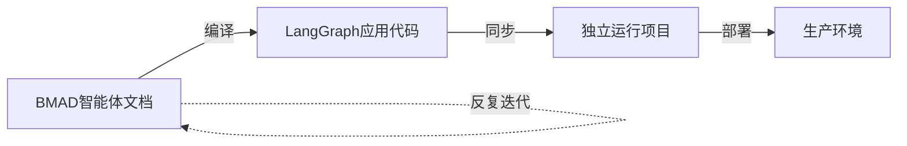

# BMAD-METHOD 集成 LangGraph 完整设计文档

> 最后更新: 2025-10-31
> 版本: 1.0.0
> 状态: ✅ 设计完成，待实施

---

## 📚 文档导航

本文档集包含了从 BMAD-METHOD 编译生成独立 LangGraph 应用的完整设计方案。

### 核心文档

| #   | 文档                                             | 内容概要                       | 适合读者             |
| --- | ------------------------------------------------ | ------------------------------ | -------------------- |
| 1   | **[架构设计总览](./01-架构设计总览.md)**         | 整体架构、设计原则、技术价值   | 所有人               |
| 2   | **[编译器设计详解](./02-编译器设计详解.md)**     | 编译器实现细节、代码生成模板   | 开发人员             |
| 3   | **[独立项目结构](./03-独立项目结构.md)**         | aps-langgraph 项目详解         | 开发人员、运维       |
| 4   | **[工作流与最佳实践](./04-工作流与最佳实践.md)** | 开发工作流、常见场景、故障排查 | 所有开发者           |
| 5   | **[实施计划](./05-实施计划.md)**                 | 分阶段实施计划、时间线、里程碑 | 项目经理、技术负责人 |

---

## 🎯 快速开始

### 5分钟了解方案



**核心价值**:

- ✅ 保留 BMAD "Agent as Doc" 理念
- ✅ 支持生成生产级 LangGraph 应用
- ✅ 双重部署能力（IDE + 应用）
- ✅ 支持持续迭代开发

### 阅读建议

#### 如果你是...

**项目经理**:

1. 先读 [01-架构设计总览](./01-架构设计总览.md) - 了解整体方案
2. 再读 [05-实施计划](./05-实施计划.md) - 了解工期和资源

**技术负责人**:

1. 先读 [01-架构设计总览](./01-架构设计总览.md) - 把握全局
2. 细读 [02-编译器设计详解](./02-编译器设计详解.md) - 理解技术细节
3. 浏览 [05-实施计划](./05-实施计划.md) - 评估可行性

**开发人员**:

1. 先读 [01-架构设计总览](./01-架构设计总览.md) - 理解背景
2. 细读 [02-编译器设计详解](./02-编译器设计详解.md) - 实现参考
3. 细读 [04-工作流与最佳实践](./04-工作流与最佳实践.md) - 日常开发指南
4. 参考 [03-独立项目结构](./03-独立项目结构.md) - 理解目标项目

**运维人员**:

1. 读 [03-独立项目结构](./03-独立项目结构.md) - 了解项目结构
2. 关注部署配置章节（Docker、K8s）

---

## 🏗️ 架构概览

### 双项目架构

```
┌─────────────────────────────────────┐
│      BMAD-METHOD (源项目)           │
│  - Markdown智能体文档                │
│  - YAML工作流定义                    │
│  - 编译器 ⭐                         │
└─────────┬───────────────────────────┘
          │ bmad compile aps --target lg
          ▼
┌─────────────────────────────────────┐
│   _langgraph-dist (编译输出)        │
│  - Python代码                        │
│  - 配置文件                          │
└─────────┬───────────────────────────┘
          │ sync_from_bmad.sh
          ▼
┌─────────────────────────────────────┐
│  aps-langgraph (独立Git仓库)        │
│  - 可运行的LangGraph应用             │
│  - Docker部署                        │
│  - 生产环境就绪                      │
└─────────────────────────────────────┘
```

### 代码分层保护

```
src/
├── generated/      # 自动生成（会被覆盖）⚠️
├── app.py          # 首次生成（后续保护）✋
└── custom/         # 手动编写（永不覆盖）✅
```

---

## 📊 关键指标

### 工期估算

```
总工期: 8-12周 (2-3个月)
团队: 2.5-3.5人

Week 1-3:   编译器基础
Week 4-7:   代码生成
Week 8-9:   CLI集成
Week 10-12: 同步系统 + 测试文档
```

### 技术栈

```yaml
语言:
  - Python 3.11+
  - Node.js 18+

核心依赖:
  - Jinja2 (模板引擎)
  - LangGraph (目标框架)
  - PyYAML (配置解析)
  - pytest (测试框架)
```

### 质量目标

| 指标       | 目标             |
| ---------- | ---------------- |
| 测试覆盖率 | > 85%            |
| 编译时间   | < 30秒           |
| 同步时间   | < 10秒           |
| 代码质量   | 通过所有lint检查 |

---

## 💡 核心特性

### 1. 持续开发模式

✅ **完全支持**反复从BMAD编译、同步到LangGraph项目

```bash
# 开发循环
修改BMAD文档 → 编译 → 同步 → 测试 → 部署
     ↑                                    ↓
     └────────────── 循环 ─────────────────┘
```

### 2. 代码保护机制

通过 `.bmad-sync-config.yml` 定义同步规则：

```yaml
sync_rules:
  auto_managed: # 完全覆盖
    - src/generated/**/*
    - knowledge/**/*

  generate_once: # 首次生成，后续保护
    - src/app.py
    - src/config.py

  never_sync: # 永不同步
    - src/custom/**/*
    - tests/**/*
```

### 3. 版本追踪

每次编译生成 `.bmad-manifest.json`：

```json
{
  "compiled_at": "2025-10-31T10:30:00Z",
  "compiler_version": "1.0.0",
  "source_commit": "750379b",
  "agents": ["orchestrator", "algorithm_expert", ...],
  "stats": {
    "total_files": 156,
    "lines_of_code": 4523
  }
}
```

### 4. 智能合并

`requirements.txt` 自动合并，保留自定义依赖：

```txt
# === BMAD生成的依赖 ===
langgraph>=0.6.0
langchain>=0.3.0

# === 自定义依赖 ===
sendgrid>=6.0.0     # 你添加的
redis>=5.0.0        # 你添加的
```

---

## 🔍 常见问题

### Q1: 生成的代码可以手动修改吗？

**A**: 不建议。`src/generated/` 下的代码会被覆盖。

**正确做法**:

- 在 `src/custom/` 中添加自定义功能
- 在 `src/app.py` 中集成自定义节点

### Q2: 如果我需要修改智能体逻辑怎么办？

**A**: 在 BMAD-METHOD 中修改 Markdown 文档，然后重新编译和同步。

```bash
# 在BMAD-METHOD
vim bmad/aps/agents/algorithm-expert.md

# 编译
bmad compile aps --target langgraph

# 在aps-langgraph
bash scripts/sync_from_bmad.sh
```

### Q3: 同步会不会覆盖我的自定义代码？

**A**: 不会。同步脚本会保护以下内容：

- `src/custom/` 目录
- `tests/` 目录
- `.env` 文件
- 自定义依赖

### Q4: 支持多个环境（开发、生产）吗？

**A**: 支持。使用不同的环境变量文件：

```bash
.env.development
.env.staging
.env.production
```

### Q5: 如何回滚到之前的版本？

**A**: 每次同步都会自动备份到 `backups/` 目录：

```bash
# 查看备份
ls backups/

# 恢复备份
cp -r backups/20251031_143000/src/generated src/
```

---

## 🚀 快速开始（预览）

虽然编译器尚未实现，但这是未来的使用流程：

### 步骤1: 编译BMAD模块

```bash
cd BMAD-METHOD

# 编译APS模块到LangGraph
bmad compile aps --target langgraph --output ../_langgraph-dist

# 输出:
# 🚀 开始编译APS模块到LangGraph...
# ✅ 编译完成!
# 📦 输出目录: ../_langgraph-dist
```

### 步骤2: 创建独立项目

```bash
# 复制编译产物
cp -r _langgraph-dist aps-langgraph
cd aps-langgraph

# 初始化Git仓库
git init
git add .
git commit -m "Initial commit from BMAD compilation"
```

### 步骤3: 配置和运行

```bash
# 配置环境变量
cp .env.example .env
vim .env  # 设置 ANTHROPIC_API_KEY 和 DATABASE_URL

# 启动数据库
docker-compose up -d postgres

# 初始化数据库
python scripts/setup_db.py

# 运行测试
pytest tests/

# 运行应用
python -m src.app "帮我设计一个车辆路径优化方案"
```

### 步骤4: 持续开发

```bash
# 在BMAD-METHOD中修改智能体
cd ../BMAD-METHOD
vim bmad/aps/agents/algorithm-expert.md

# 重新编译
bmad compile aps --target langgraph

# 同步到aps-langgraph
cd ../aps-langgraph
bash scripts/sync_from_bmad.sh

# 测试和提交
pytest tests/
git commit -am "sync: 更新算法专家逻辑"
```

---

## 📈 实施里程碑

| 里程碑             | 时间    | 验收标准             |
| ------------------ | ------- | -------------------- |
| **M1: 编译器原型** | Week 3  | 可以编译1个智能体    |
| **M2: 完整编译**   | Week 7  | 可以编译完整APS模块  |
| **M3: CLI集成**    | Week 9  | bmad compile命令可用 |
| **M4: 同步系统**   | Week 12 | 完整的双项目工作流   |
| **M5: 生产就绪**   | Week 12 | 测试、文档、部署就绪 |

---

## 🤝 贡献指南

### 如何参与

1. **阅读文档** - 仔细阅读5份设计文档
2. **提出建议** - 通过GitHub Issues提出改进建议
3. **参与开发** - Fork仓库，提交Pull Request

### 文档改进

如发现文档问题，请：

```bash
# Fork仓库
git clone https://github.com/your-org/bmad-method.git

# 修改文档
vim docs/langgraph-integration/01-架构设计总览.md

# 提交PR
git commit -am "docs: 修正架构图中的错误"
git push origin fix/architecture-diagram
```

---

## 📞 联系方式

- **GitHub Issues**: https://github.com/your-org/bmad-method/issues
- **文档维护者**: Claude Code
- **项目负责人**: TBD

---

## 📄 许可证

本设计文档属于 BMAD-METHOD 项目，遵循 MIT 许可证。

---

## 🎉 结语

这是一个完整的、经过深思熟虑的技术方案。通过这个架构：

1. ✅ **保留了BMAD的核心价值** - Agent as Doc、知识库管理
2. ✅ **获得了LangGraph的能力** - 生产级运行时、分布式部署
3. ✅ **支持持续迭代开发** - 反复编译、安全同步、代码保护
4. ✅ **提供双重部署模式** - IDE对话 + 应用程序

**现在，让我们开始实施吧！** 🚀

---

**最后更新**: 2025-10-31
**文档版本**: 1.0.0
**状态**: ✅ 设计完成
