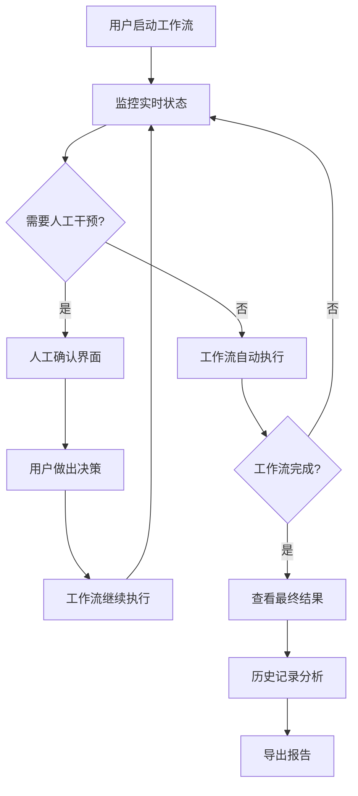

# LangGraph集成方案 UX设计 - 用户研究与信息架构

**设计版本**: v1.0
**创建日期**: 2025-11-04
**UX设计师**: Claude Code AI Assistant

---

## 👥 用户画像分析

### 主要用户群体

#### 1. 技术开发者 (Primary User - 70%)

**特征**:

- 软件工程师、算法工程师、系统架构师
- 熟悉API调用、调试工具、命令行操作
- 需要监控智能体执行状态、调试工作流、优化性能
- 使用场景: 开发环境、技术验证、性能调优

**核心需求**:

- "我需要看到每个智能体的具体输出内容"
- "工作流在哪里卡住了？哪个节点出错了？"
- "性能指标如何？响应时间是否正常？"
- "我需要修改某个智能体的参数并重新运行"

#### 2. 业务分析师 (Secondary User - 25%)

**特征**:

- 产品经理、业务分析师、项目经理
- 关注业务结果和决策质量
- 不需要技术细节，需要直观的决策支持
- 使用场景: 方案评审、业务决策、进度跟踪

**核心需求**:

- "算法推荐是否合理？我应该接受还是修改？"
- "不同专家的意见冲突时，我该如何选择？"
- "整个工作流程进展到哪一步了？"
- "我需要确认代码质量是否符合标准"

#### 3. 系统管理员 (Tertiary User - 5%)

**特征**:

- DevOps工程师、系统管理员
- 关注系统健康状态、资源使用、日志监控
- 需要系统级别的监控和告警
- 使用场景: 生产运维、故障排查、性能优化

**核心需求**:

- "系统整体运行状态如何？"
- "哪些工作流执行失败了？失败原因是什么？"
- "资源使用情况如何？是否需要扩容？"
- "我需要查看系统的运行日志"

---

## 📊 信息架构设计

### 1. 整体信息层次

```
Level 1: 系统概览 (Dashboard)
├── 实时状态总览
├── 关键性能指标
├── 活跃工作流数量
└── 系统健康状态

Level 2: 工作流监控 (Workflow Monitor)
├── 工作流拓扑图
├── 实时执行状态
├── 智能体输出展示
└── 进度和时间估算

Level 3: 交互操作 (Interaction)
├── 人工确认界面
├── 智能体直接对话
├── 参数调整配置
└── 决策支持工具

Level 4: 历史分析 (History & Analysis)
├── 执行历史记录
├── 性能统计分析
├── 决策回顾复盘
└── 结果导出功能
```

### 2. 数据信息模型

#### 工作流状态模型

```typescript
interface WorkflowState {
  id: string;
  name: string;
  status: 'idle' | 'running' | 'paused' | 'completed' | 'error';
  currentPhase: 'Phase 0' | 'Phase 1' | 'Phase 2' | 'Phase 3' | 'Phase 3.5' | 'Phase 4';
  currentAgent: string;
  progress: number;
  startTime: Date;
  estimatedCompletion?: Date;
  agents: AgentState[];
  humanInLoop: HumanInLoopState | null;
}
```

#### 智能体状态模型

```typescript
interface AgentState {
  id: string;
  name: string;
  role:
    | 'orchestrator'
    | 'algorithm_expert'
    | 'constraint_expert'
    | 'objective_expert'
    | 'domain_expert'
    | 'code_implementation_expert'
    | 'extension_expert'
    | 'quality_expert';
  status: 'idle' | 'running' | 'completed' | 'error' | 'waiting_human';
  input?: any;
  output?: any;
  executionTime?: number;
  error?: string;
}
```

#### 人机协作状态模型

```typescript
interface HumanInLoopState {
  type: 'P1' | 'P2' | 'P2.5';
  stage: 'pending' | 'reviewing' | 'completed';
  context: any;
  options?: any[];
  deadline?: Date;
  decision?: HumanDecision;
}
```

---

## 🔄 用户流程设计

### 1. 主要用户旅程图



### 2. 详细交互流程

#### 工作流启动流程

1. **输入项目描述** → 用户输入问题域描述
2. **选择配置参数** → 选择模型、设置参数
3. **启动工作流** → 点击开始执行
4. **进入监控界面** → 自动跳转到实时监控

#### 实时监控流程

1. **显示拓扑图** → 8个智能体的连接关系
2. **高亮当前节点** → 正在执行的智能体
3. **展示实时输出** → 流式显示智能体输出
4. **更新进度信息** → 进度条、时间估算
5. **检测触发点** → 自动检测Human-in-Loop

#### 人工确认流程

1. **触发中断** → 系统暂停执行
2. **展示上下文** → 相关的智能体输出和建议
3. **提供决策选项** → 接受/修改/重新生成
4. **收集用户反馈** → 记录决策理由
5. **继续执行** → 根据决策继续工作流

---

## 🎯 关键设计原则

### 1. 实时性优先 (Real-time First)

- 所有状态更新都是实时的，无需手动刷新
- 使用Server-Sent Events技术确保低延迟
- 动画和过渡效果流畅但不干扰信息

### 2. 信息密度平衡 (Information Density Balance)

- 默认显示核心信息，详细信息按需展开
- 技术用户可以看到详细数据，业务用户看到简化视图
- 支持个性化的显示配置

### 3. 状态可视化 (State Visualization)

- 使用颜色编码快速识别状态（绿色=正常，黄色=等待，红色=错误）
- 图标和动画增强状态的可识别性
- 工作流拓扑图直观展示执行路径

### 4. 决策支持 (Decision Support)

- 在关键决策点提供充分的上下文信息
- 突出显示不同选择的潜在影响
- 提供历史决策的参考和对比

### 5. 错误处理和恢复 (Error Handling & Recovery)

- 清晰的错误信息和解决建议
- 支持从错误点恢复或重新执行
- 详细的错误日志用于调试

---

## 📱 响应式设计策略

### 桌面端 (1200px+)

- **布局**: 三栏布局（工作流拓扑 + 实时输出 + 详细信息）
- **功能**: 完整功能，支持多窗口并排
- **交互**: 鼠标和键盘快捷键优化

### 平板端 (768px-1199px)

- **布局**: 两栏布局或标签页切换
- **功能**: 核心功能，简化详细信息显示
- **交互**: 触摸优化，保持核心交互

### 移动端 (320px-767px)

- **布局**: 单栏布局，垂直堆叠
- **功能**: 监控和基本决策功能
- **交互**: 大按钮设计，简化操作流程

---

## 🔧 技术约束与集成要求

### 前端技术栈

- **框架**: React 18+ (与现有技术栈一致)
- **状态管理**: Redux Toolkit + RTK Query
- **实时通信**: EventSource API (SSE)
- **图表库**: D3.js (拓扑图) + Recharts (统计图表)
- **UI组件**: Ant Design (与现有系统保持一致)

### 后端API集成

- **实时数据**: `POST /stream_events` - SSE流式数据
- **交互API**: `POST /invoke` - 人工干预操作
- **状态查询**: `GET /state` - 获取工作流状态
- **配置管理**: `PATCH /config` - 动态配置更新

### 性能要求

- **首屏加载**: < 2秒
- **状态更新延迟**: < 500ms
- **大数据处理**: 支持虚拟化滚动
- **内存使用**: < 100MB (单个标签页)

---

## 📋 设计交付清单

### Phase 1: 信息架构 (Week 1)

- [x] 用户画像分析
- [x] 信息架构设计
- [x] 用户流程设计
- [x] 设计原则定义
- [x] 技术约束分析

### Phase 2: 低保真设计 (Week 2)

- [ ] 线框图设计
- [ ] 交互流程图
- [ ] 原型制作
- [ ] 用户测试计划

### Phase 3: 高保真设计 (Week 3)

- [ ] UI设计系统
- [ ] 高保真界面
- [ ] 交互动效
- [ ] 响应式方案

### Phase 4: 设计交付 (Week 4)

- [ ] 设计规范文档
- [ ] 开发交接
- [ ] 用户指南
- [ ] 质量检查

---

**下一步**: 创建低保真线框图和交互原型设计
