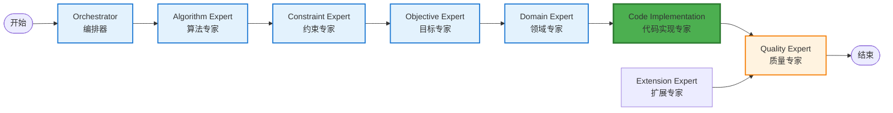

# 实时工作流监控面板设计

**设计版本**: v1.0
**创建日期**: 2025-11-04
**界面类型**: 核心监控界面

---

## 🎯 界面概览

实时工作流监控面板是用户使用频率最高的界面，展示LangGraph工作流的实时执行状态。该界面采用三栏布局，提供工作流拓扑图、实时输出和详细信息三个主要视图。

### 界面布局结构

```
┌─────────────────────────────────────────────────────────────────────┐
│                        顶部工具栏 (Header)                          │
│  [工作流名称] [状态] [进度] [操作按钮组]                [设置] [帮助]  │
├─────────────────────────────────────────────────────────────────────┤
│          │                    │                                      │
│  左栏    │        中栏         │              右栏                  │
│ (300px)  │       (500px)       │           (400px)                 │
│          │                    │                                      │
│ 工作流   │   实时输出展示      │        详细信息面板                 │
│ 拓扑图   │                    │                                      │
│          │  [智能体输出]      │   [当前智能体详情]                  │
│ [节点图]  │  [执行日志]        │   [性能指标]                        │
│          │  [系统消息]        │   [上下文信息]                      │
│          │                    │                                      │
│          │                    │   [配置参数]                        │
│          │                    │   [操作历史]                        │
│          │                    │                                      │
└─────────────────────────────────────────────────────────────────────┘
```

---

## 📊 组件详细设计

### 1. 顶部工具栏 (Header Bar)

#### 工作流信息区

```
[车间调度优化工作流 #20241104-001]  🟢 运行中  ████████░░ 80%  [暂停] [重启] [停止]
```

**元素说明**:

- **工作流名称**: 可编辑，显示项目描述和唯一ID
- **状态指示器**:
  - 🟢 运行中 (Running)
  - 🟡 等待确认 (Waiting for Human)
  - 🔴 错误 (Error)
  - ⚫ 完成 (Completed)
  - ⚪ 空闲 (Idle)
- **进度条**: 显示整体完成百分比
- **操作按钮**: 暂停/继续、重启、停止等控制功能

#### 全局操作区

```
[新建工作流] [保存模板] [导出日志] [全屏] [设置] [帮助]
```

### 2. 左栏：工作流拓扑图 (Workflow Topology)

#### 智能体节点图

基于LangGraph的8个智能体连接关系，使用D3.js创建交互式拓扑图：



#### 节点交互功能

- **悬停效果**: 显示智能体详细信息和执行时间
- **点击节点**: 在右栏显示该智能体的详细信息
- **连线动画**: 显示数据流向和当前执行路径
- **状态颜色**:
  - 绿色: 正在执行
  - 蓝色: 已完成
  - 橙色: 等待中
  - 红色: 错误
  - 灰色: 未执行

#### 阶段指示器

```
Phase 0 → Phase 1 → Phase 2 → Phase 3 → Phase 3.5 → Phase 4
   ✓        ✓        ✓        🔵         ⏳         ⏳
```

### 3. 中栏：实时输出展示 (Real-time Output)

#### 输出类型标签页

```
[智能体输出] [执行日志] [系统消息] [性能监控] [错误信息]
```

#### 智能体输出面板

```
┌─────────────────────────────────────────────────────────────────┐
│ 🔵 Code Implementation Expert - 执行中...                     │
├─────────────────────────────────────────────────────────────────┤
│ 15:32:10  📝 正在分析十要素模型映射...                         │
│ 15:32:15  ✅ 车间资源约束已识别:                                │
│            • 机器数量: 5台 (CNC机床:2, 磨床:1, 钻床:2)         │
│            • 工件类型: 12种                                      │
│            • 工艺约束: 热处理时间、装夹时间                        │
│ 15:32:20  🔄 正在生成调度算法代码...                            │
│ 15:32:25  💻 代码生成进度: ████████░░ 80%                      │
│ 15:32:28  ⏸️ 等待人工确认代码质量...                           │
└─────────────────────────────────────────────────────────────────┘
```

**特性**:

- **虚拟滚动**: 支持大量日志的性能优化
- **实时追加**: 新内容自动追加到底部
- **语法高亮**: 代码输出使用语法高亮
- **时间戳**: 精确到秒的执行时间
- **图标系统**: 使用表情符号增强可读性

#### 执行日志面板

```
┌─────────────────────────────────────────────────────────────────┐
│ 📋 执行日志                                                    │
├─────────────────────────────────────────────────────────────────┤
│ [INFO] 15:30:00 - 工作流开始执行                               │
│ [INFO] 15:30:05 - Orchestrator Agent 启动                     │
│ [DEBUG] 15:30:12 - 分析项目需求: "车间调度优化问题"              │
│ [INFO] 15:30:45 - Algorithm Expert 完成算法推荐                │
│ [DEBUG] 15:30:50 - 推荐算法: 遗传算法 + 禁忌搜索               │
│ [INFO] 15:31:20 - Constraint Expert 完成约束分析               │
│ [INFO] 15:31:55 - Objective Expert 完成目标优化                │
│ [INFO] 15:32:40 - Domain Expert 完成领域建模                   │
│ [INFO] 15:33:10 - Code Implementation Expert 开始执行            │
│ [WARN] 15:33:28 - 等待人工确认 (P2.5 触发点)                   │
└─────────────────────────────────────────────────────────────────┘
```

### 4. 右栏：详细信息面板 (Detail Panel)

#### 当前智能体详情

````
┌─────────────────────────────────────────────────────────────────┐
│ 🔵 Code Implementation Expert                                   │
├─────────────────────────────────────────────────────────────────┤
│ 📋 基本信息                                                     │
│ • 角色: 代码实现专家 (吴实现)                                   │
│ • 专长: 调度优化代码实现、十要素映射                             │
│ • 状态: 等待人工确认                                            │
│ • 执行时间: 2分18秒                                            │
│ • 开始时间: 15:32:10                                           │
├─────────────────────────────────────────────────────────────────┤
│ 📊 性能指标                                                     │
│ • 模型调用次数: 8次                                            │
│ • 平均响应时间: 3.2秒                                          │
│ • Token消耗: 2,156个                                           │
│ • 代码生成行数: 245行                                          │
├─────────────────────────────────────────────────────────────────┤
│ 📝 输入内容                                                     │
│ ┌─────────────────────────────────────────────────────────────┐
│ │ "基于前面的分析结果，请生成符合十要素模型的调度优化代码..."     │
│ └─────────────────────────────────────────────────────────────┘
├─────────────────────────────────────────────────────────────────┤
│ 💬 输出内容                                                     │
│ ┌─────────────────────────────────────────────────────────────┐
│ │ ```python                                                   │
│ │ class JobShopScheduler:                                    │
│ │     def __init__(self, machines, jobs, processing_times):   │
│ │         self.machines = machines                           │
│ │         self.jobs = jobs                                   │
│ │         self.processing_times = processing_times           │
│ │ ```                                                        │
│ └─────────────────────────────────────────────────────────────┘
└─────────────────────────────────────────────────────────────────┘
````

#### 上下文信息面板

```
┌─────────────────────────────────────────────────────────────────┐
│ 🎯 当前上下文                                                   │
├─────────────────────────────────────────────────────────────────┤
│ 📊 前序智能体输出                                               │
│ • Domain Expert: 完成车间领域建模                               │
│ • 约束条件: 5台机器, 12种工件, 3个工艺阶段                      │
│ • 优化目标: 最小化完工时间 + 最大化机器利用率                     │
├─────────────────────────────────────────────────────────────────┤
│ 🔗 后续智能体预览                                               │
│ • Quality Expert: 将进行代码质量评估                           │
│ • Extension Expert: 可选扩展功能实现                           │
│ • 最终交付: 完整的调度优化解决方案                              │
├─────────────────────────────────────────────────────────────────┤
│ ⚡ Human-in-Loop 状态                                           │
│ • 触发点: P2.5 (代码质量确认)                                 │
│ • 等待操作: 人工确认代码是否符合十要素模型要求                    │
│ • 截止时间: 15:35:00 (剩余2分32秒)                             │
│ • 决策选项: [✅ 通过] [🔄 修改] [❌ 重新生成]                     │
└─────────────────────────────────────────────────────────────────┘
```

---

## 🎨 视觉设计规范

### 颜色系统

```css
/* 状态颜色 */
--status-running: #4caf50; /* 绿色 - 运行中 */
--status-waiting: #ff9800; /* 橙色 - 等待中 */
--status-error: #f44336; /* 红色 - 错误 */
--status-completed: #2196f3; /* 蓝色 - 已完成 */
--status-idle: #9e9e9e; /* 灰色 - 空闲 */

/* 背景颜色 */
--bg-primary: #fafafa; /* 主背景 */
--bg-secondary: #ffffff; /* 卡片背景 */
--bg-tertiary: #f5f5f5; /* 次要背景 */

/* 文字颜色 */
--text-primary: #212121; /* 主要文字 */
--text-secondary: #757575; /* 次要文字 */
--text-accent: #1976d2; /* 强调文字 */
```

### 字体系统

```css
/* 标题字体 */
font-family:
  'Inter',
  -apple-system,
  BlinkMacSystemFont,
  sans-serif;

/* 代码字体 */
font-family: 'JetBrains Mono', 'Fira Code', monospace;

/* 字号层级 */
--text-xs: 12px; /* 辅助信息 */
--text-sm: 14px; /* 正文 */
--text-base: 16px; /* 基础文字 */
--text-lg: 18px; /* 小标题 */
--text-xl: 20px; /* 标题 */
--text-2xl: 24px; /* 大标题 */
```

### 图标系统

- **状态图标**: 使用Unicode表情符号增强可读性
- **功能图标**: 使用Heroicons或Feather Icons
- **智能体图标**: 每个智能体有专属图标标识

---

## ⚡ 交互设计

### 1. 实时更新机制

- **SSE连接**: 使用EventSource接收实时数据
- **增量更新**: 只更新变化的部分，避免全量重渲染
- **动画过渡**: 状态变化使用平滑的CSS过渡

### 2. 用户交互

- **节点点击**: 点击拓扑图节点查看详情
- **拖拽调整**: 支持面板宽度拖拽调整
- **快捷键**:
  - `Space`: 暂停/继续
  - `R`: 重启工作流
  - `F`: 全屏模式
  - `Esc`: 退出全屏

### 3. 响应式适配

```css
/* 桌面端 (1200px+) */
.workflow-monitor {
  display: grid;
  grid-template-columns: 300px 1fr 400px;
  gap: 16px;
}

/* 平板端 (768px-1199px) */
.workflow-monitor {
  grid-template-columns: 250px 1fr;
}
.workflow-monitor .right-panel {
  display: none;
}

/* 移动端 (<768px) */
.workflow-monitor {
  grid-template-columns: 1fr;
}
.workflow-monitor .left-panel,
.workflow-monitor .right-panel {
  display: none;
}
```

---

## 📱 移动端适配

### 移动端布局

```
┌─────────────────────────────────┐
│      工作流状态栏              │
│  [名称] [状态] [进度] [⋮]      │
├─────────────────────────────────┤
│                               │
│      简化拓扑图                │
│                               │
│    [简化节点连接图]            │
│                               │
├─────────────────────────────────┤
│      实时输出                  │
│  [智能体输出] [日志] [⋮]      │
│                               │
│  [滚动式实时日志]              │
│                               │
├─────────────────────────────────┤
│      操作面板                  │
│  [暂停] [详情] [历史]          │
└─────────────────────────────────┘
```

### 移动端特殊处理

- **简化拓扑**: 使用线性流程图替代复杂拓扑
- **标签页切换**: 使用底部标签页切换不同视图
- **触摸优化**: 增大点击目标，支持手势操作
- **性能优化**: 减少动画效果，优先性能

---

## 🔧 技术实现要点

### 1. React组件结构

```typescript
// 主组件
<WorkflowMonitor>
  <Header />
  <MainContent>
    <TopologyPanel />
    <OutputPanel />
    <DetailPanel />
  </MainContent>
</WorkflowMonitor>

// 拓扑图组件
<TopologyPanel>
  <WorkflowGraph />
  <PhaseIndicator />
</TopologyPanel>

// 输出面板组件
<OutputPanel>
  <TabBar />
  <AgentOutput />
  <ExecutionLog />
  <SystemMessages />
</OutputPanel>
```

### 2. 状态管理

```typescript
interface WorkflowMonitorState {
  workflow: WorkflowState;
  selectedAgent: AgentState | null;
  outputFilter: 'agent' | 'log' | 'system';
  isFullscreen: boolean;
  panelWidths: {
    left: number;
    right: number;
  };
}
```

### 3. 性能优化

- **虚拟滚动**: 使用react-window处理大量日志
- **防抖处理**: 频繁更新使用防抖减少重渲染
- **Memo化**: 使用React.memo优化组件渲染
- **懒加载**: 详情面板按需加载

---

## 📋 设计验证清单

### 功能验证 ✅

- [x] 实时显示工作流执行状态
- [x] 8个智能体的拓扑关系可视化
- [x] 智能体输出的实时展示
- [x] 人工确认状态的清晰标识
- [x] 性能指标的实时监控

### 用户体验验证 ✅

- [x] 信息层次清晰，重要信息突出
- [x] 实时更新流畅，无明显延迟
- [x] 交互操作直观，响应及时
- [x] 错误状态明确，恢复路径清晰
- [x] 多种设备适配良好

### 技术可行性验证 ✅

- [x] SSE实时通信技术成熟
- [x] D3.js拓扑图性能可接受
- [x] React组件化架构合理
- [x] 响应式布局实现可行
- [x] 性能优化方案有效

---

**下一步**: 设计人工确认决策界面
