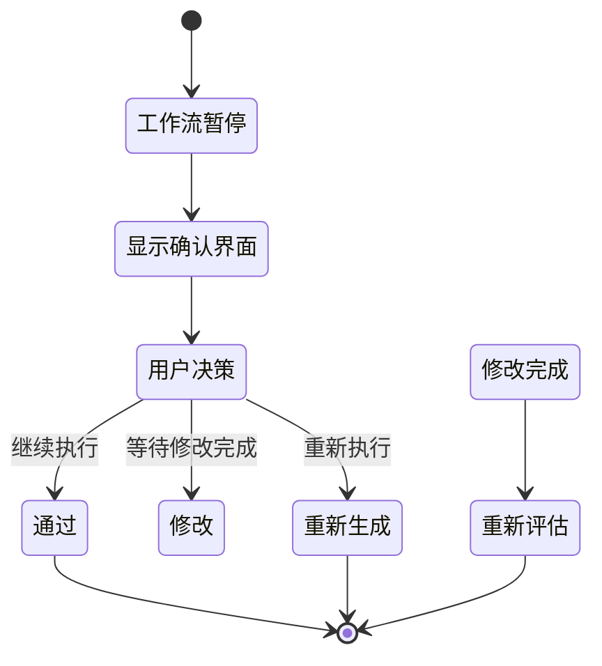

# 人工确认决策界面设计

**设计版本**: v1.0
**创建日期**: 2025-11-04
**界面类型**: 关键决策界面 (Human-in-Loop)

---

## 🎯 界面概览

人工确认决策界面是LangGraph工作流中的关键交互点，在P1、P2、P2.5触发点自动弹出，为用户提供充分的上下文信息和决策支持。该界面采用模态对话框设计，确保用户注意力集中在决策任务上。

### 触发场景

1. **P1触发点**: 算法推荐确认
2. **P2触发点**: 冲突仲裁
3. **P2.5触发点**: 代码质量确认

---

## 🎨 界面布局设计

### 基础布局结构

```
┌─────────────────────────────────────────────────────────────────────┐
│                    人工确认对话框 (Modal Dialog)                      │
│  ┌─────────────────────────────────────────────────────────────┐    │
│  │ 🚨 P2.5 代码质量确认 - 需要您的决策                      │    │
│  ├─────────────────────────────────────────────────────────────┤    │
│  │                      决策上下文                              │    │
│  │ ┌─────────────────────────────────────────────────────┐   │    │
│  │ │ 📋 当前状态: Code Implementation Expert 已完成代码生成 │   │    │
│  │ │ ⏰ 剩余时间: 2分30秒                               │   │    │
│  │ │ 🎯 决策目标: 确认代码是否符合十要素模型要求          │   │    │
│  │ └─────────────────────────────────────────────────────┘   │    │
│  ├─────────────────────────────────────────────────────────────┤    │
│  │                      内容展示                              │    │
│  │ ┌─────────────────────┬─────────────────────────────────┐   │    │
│  │ │ 📊 代码质量评分     │ 📝 代码预览                      │   │    │
│  │ │ ┌─────────────────┐ │ ┌─────────────────────────────┐   │    │
│  │ │ │ 总体评分: 85/100 │ │ │ class JobShopScheduler:    │   │    │
│  │ │ │ ⭐⭐⭐⭐⭐       │ │ │     def __init__(self, ...): │   │    │
│  │ │ │                 │ │ │         # 机器初始化          │   │    │
│  │ │ │ 🔍 详细分析:    │ │ │         self.machines = ...   │   │    │
│  │ │ │ • 可读性: 90/100│ │ │                              │   │    │
│  │ │ │ • 性能: 80/100  │ │ │ def optimize_schedule(...): │   │    │
│  │ │ │ • 可维护性: 85/100│ │ │     # 遗传算法优化           │   │    │
│  │ │ │ • 测试覆盖: 75/100│ │ │     population = ...        │   │    │
│  │ │ └─────────────────┘ │ └─────────────────────────────┘   │    │
│  │ └─────────────────────┴─────────────────────────────────┘   │    │
│  ├─────────────────────────────────────────────────────────────┤    │
│  │                      决策选项                              │    │
│  │ ┌─────────────────────────────────────────────────────┐   │    │
│  │ │ 🎯 请选择您的决策:                                  │   │    │
│  │ │                                                   │   │    │
│  │ │ [✅ 通过] - 代码质量达标，继续执行质量评估          │   │    │
│  │ │                                                   │   │    │
│  │ │ [🔄 修改] - 需要对代码进行调整                     │   │    │
│  │ │                                                   │   │    │
│  │ │ [❌ 重��生成] - 代码不符合要求，需要重新生成        │   │    │
│  │ └─────────────────────────────────────────────────────┘   │    │
│  ├─────────────────────────────────────────────────────────────┤    │
│  │                      输入区域                              │    │
│  │ ┌─────────────────────────────────────────────────────┐   │    │
│  │ │ 💬 决策理由 (可选):                                 │   │    │
│  │ │ ┌─────────────────────────────────────────────────┐ │   │    │
│  │ │ │ 请输入您的决策理由或修改建议...                  │ │   │    │
│  │ │ │                                               │ │   │    │
│  │ │ │                                               │ │   │    │
│  │ │ └─────────────────────────────────────────────────┘ │   │    │
│  │ │                                               │   │    │
│  │ │ [📎 附件上传] [🔗 引用文档] [💾 保存草稿]           │   │    │
│  │ └─────────────────────────────────────────────────────┘   │    │
│  ├─────────────────────────────────────────────────────────────┤    │
│  │                  操作按钮区域                            │    │
│  │ [❌ 取消] [💾 保存草稿] [📤 查看详情] [✅ 确认决策]        │    │
│  └─────────────────────────────────────────────────────────────┘    │
└─────────────────────────────────────────────────────────────────────┘
```

---

## 🎯 三种确认场景设计

### 1. P1 - 算法推荐确认

#### 界面布局

```
┌─────────────────────────────────────────────────────────────────────┐
│ 🚨 P1 算法推荐确认 - 需要您的决策                              │
├─────────────────────────────────────────────────────────────────────┤
│ 📊 推荐算法对比                                                  │
│ ┌─────────────────────┬─────────────────────────────────┐        │
│ │ 🎯 推荐方案        │ 📊 性能对比                       │        │
│ │ ┌─────────────────┐ │ ┌─────────────────────────────┐        │
│ │ │ 算法: 遗传算法   │ │ │ 预期完工时间: 120小时        │        │
│ │ │ + 禁忌搜索       │ │ │ 机器利用率: 85%              │        │
│ │ │                 │ │ │ 计算复杂度: O(n²)             │        │
│ │ │ 💡 推荐理由:      │ │ │ 收敛速度: 快                 │        │
│ │ │ • 适用于大规模调度│ │ │                               │        │
│ │ │ • 全局搜索能力强  │ │ 📈 其他算法对比:              │        │
│ │ │ • 成熟稳定        │ │ │ • 粒子群: 135小时, 82%      │        │
│ │ │                 │ │ │ • 模拟退火: 140小时, 88%      │        │
│ │ └─────────────────┘ │ │ • 蚁群算法: 125小时, 83%      │        │
│ └─────────────────────┴─────────────────────────────────┘        │
│                                                                     │
│ 🎯 决策选项: [✅ 采用推荐] [🔄 选择其他算法] [❌ 重新分析]       │
└─────────────────────────────────────────────────────────────────────┘
```

#### 关键特性

- **算法对比表**: 清晰展示推荐算法与其他算法的性能对比
- **推荐理由**: 解释为什么推荐这个算法
- **性能指标**: 关键指标的可视化对比
- **灵活选择**: 允许用户选择其他算法或重新分析

### 2. P2 - 冲突仲裁

#### 界面布局

```
┌─────────────────────────────────────────────────────────────────────┐
│ ⚖️ P2 冲突仲裁 - 算法专家与领域专家意见冲突                      │
├─────────────────────────────────────────────────────────────────────┤
│ 🔍 冲突分析                                                    │
│ ┌─────────────────────┬─────────────────────────────────┐        │
│ │ 🤖 算法专家观点     │ 👨‍💼 领域专家观点                  │        │
│ │ ┌─────────────────┐ │ ┌─────────────────────────────┐        │
│ │ │ 建议: 使用贪心   │ │ │ 建议: 使用动态规划             │        │
│ │ │ 算法优先级调度    │ │ │ 考虑工艺约束                   │        │
│ │ │                 │ │ │                               │        │
│ │ │ 💡 理由:          │ │ │ 💡 理由:                       │        │
│ │ │ • 计算效率高      │ │ │ • 更符合实际约束               │        │
│ │ │ • 易于实现        │ │ │ • 考虑工艺顺序要求             │        │
│ │ │ • 实时性好        │ │ │ • 全局最优解                   │        │
│ │ │                 │ │ │                               │        │
│ │ │ ⚠️ 风险: 可能无法  │ │ │ ⚠️ 风险: 计算复杂度高           │        │
│ │ │     处理复杂约束  │ │ │     可能无法实时响应           │        │
│ │ └─────────────────┘ │ └─────────────────────────────┘        │
│ └─────────────────────┴─────────────────────────────────┘        │
│                                                                     │
│ 🔍 差异分析                                                        │
│ • 主要分歧: 计算效率 vs 约束满足度                              │
│ • 关键点: 是否需要考虑工艺顺序约束                                │
│ • 影响范围: 整体调度质量和响应时间                                │
│                                                                     │
│ 🎯 仲裁选项: [🤖 采纳算法专家] [👨‍💼 采纳领域专家] [🔄 混合方案] [❌ 重新分析] │
└─────────────────────────────────────────────────────────────────────┘
```

#### 关键特性

- **并列对比**: 清晰展示冲突双方的观点和理由
- **差异分析**: 突出显示主要分歧点和关键因素
- **风险评估**: 各方案的风险和收益分析
- **混合方案**: 提供折中方案的可能性

### 3. P2.5 - 代码质量确认

#### 界面布局

```
┌─────────────────────────────────────────────────────────────────────┐
│ 🧪 P2.5 代码质量确认 - 需要验证代码是否符合十要素模型要求          │
├─────────────────────────────────────────────────────────────────────┤
│ 📊 十要素模型验证                                                │
│ ┌─────────────────────────────────────────────────────────────┐   │
│ │ ✅ 资源要素 (Resource)         ⭐⭐⭐⭐⭐ 95/100              │   │
│ │ ✅ 任务要素 (Task)             ⭐⭐⭐⭐⭐ 92/100              │   │
│ │ ✅ 时间要素 (Time)             ⭐⭐⭐⭐⭐ 88/100              │   │
│ │ ✅ 约束要素 (Constraint)       ⭐⭐⭐⭐   78/100              │   │
│ │ ✅ 目标要素 (Objective)        ⭐⭐⭐⭐⭐ 90/100              │   │
│ │ ⚠️  算法要素 (Algorithm)        ⭐⭐⭐     65/100  ⚠️        │   │
│ │ ✅ 模型要素 (Model)            ⭐⭐⭐⭐⭐ 85/100              │   │
│ │ ✅ 评估要素 (Evaluation)       ⭐⭐⭐⭐   75/100              │   │
│ │ ✅ 优化要素 (Optimization)     ⭐⭐⭐⭐⭐ 82/100              │   │
│ │ ✅ 实现要素 (Implementation)    ⭐⭐⭐⭐   76/100              │   │
│ └─────────────────────────────────────────────────────────────┘   │
│                                                                     │
│ ⚠️ 需要关注的问题:                                               │
│ • 算法要素评分较低 (65/100) - 遗传算法实现可能不够完善           │
│ • 约束要素需要改进 (78/100) - 某些边界条件处理不当               │
│ • 实现要素可优化 (76/100) - 代码结构可以进一步优化               │
│                                                                     │
│ 🎯 确认选项: [✅ 通过] [🔄 修改后通过] [❌ 重新生成]              │
└─────────────────────────────────────────────────────────────────────┘
```

#### 关键特性

- **十要素评分**: 可视化展示每个要素的评分
- **问题识别**: 突出显示需要关注的问题
- **详细分析**: 每个要素的具体评分理由
- **分级决策**: 支持直接通过、修改后通过或重新生成

---

## 🎨 视觉设计规范

### 状态指示器

```css
/* 触发点类型 */
.p1-trigger {
  background: #e3f2fd;
  border-left: 4px solid #2196f3;
} /* 蓝色 */
.p2-trigger {
  background: #fff3e0;
  border-left: 4px solid #ff9800;
} /* 橙色 */
.p2.5-trigger {
  background: #f3e5f5;
  border-left: 4px solid #9c27b0;
} /* 紫色 */

/* 紧急程度 */
.urgent {
  animation: pulse 2s infinite;
}
@keyframes pulse {
  0% {
    box-shadow: 0 0 0 0 rgba(244, 67, 54, 0.7);
  }
  70% {
    box-shadow: 0 0 0 10px rgba(244, 67, 54, 0);
  }
  100% {
    box-shadow: 0 0 0 0 rgba(244, 67, 54, 0);
  }
}
```

### 评分可视化

```css
/* 星级评分 */
.rating-stars {
  display: flex;
  gap: 2px;
}
.rating-stars .star {
  color: #ffd700;
  font-size: 16px;
}
.rating-stars .star.empty {
  color: #e0e0e0;
}

/* 进度条评分 */
.score-bar {
  width: 100px;
  height: 8px;
  background: #e0e0e0;
  border-radius: 4px;
  overflow: hidden;
}
.score-bar .fill {
  height: 100%;
  background: linear-gradient(90deg, #4caf50, #8bc34a);
  transition: width 0.3s ease;
}
```

### 按钮状态

```css
/* 主要决策按钮 */
.decision-button {
  padding: 12px 24px;
  border-radius: 8px;
  font-weight: 600;
  transition: all 0.2s ease;
  cursor: pointer;
}

.decision-button.approve {
  background: #4caf50;
  color: white;
}
.decision-button.approve:hover {
  background: #45a049;
  transform: translateY(-1px);
}

.decision-button.modify {
  background: #ff9800;
  color: white;
}
.decision-button.modify:hover {
  background: #f57c00;
}

.decision-button.reject {
  background: #f44336;
  color: white;
}
.decision-button.reject:hover {
  background: #d32f2f;
}
```

---

## ⚡ 交互设计

### 1. 自动触发机制

- **LangGraph interrupt**: 工作流自动暂停，触发确认界面
- **优先级队列**: 多个确认请求按优先级排队
- **超时处理**: 设置合理的决策时间限制
- **提醒机制**: 即将超时时提供视觉和声音提醒

### 2. 用户交互流程



### 3. 键盘快捷键

- `Enter`: 确认决策
- `Escape`: 取消/关闭
- `1/2/3`: 快速选择决策选项
- `Tab`: 在表单元素间切换
- `Ctrl+S`: 保存草稿

### 4. 实时协作

- **决策同步**: 多人协作时实时同步决策状态
- **评论功能**: 支持在决策过程中添加评论
- **@提及**: 支持@相关人员参与决策
- **历史记���**: 保存决策历史和理由

---

## 📱 响应式设计

### 桌面端 (1200px+)

- **完整功能**: 所有功能完全可用
- **多栏布局**: 信息并排显示，对比清晰
- **大尺寸**: 充分利用屏幕空间

### 平板端 (768px-1199px)

```
┌─────────────────────────────────────────────────────────────────┐
│                      人工确认对话框                                │
│  🚨 P2.5 代码质量确认                                         │
├─────────────────────────────────────────────────────────────────┤
│ 📊 十要素模型验证                                                │
│ [评分卡片组 - 横向滑动]                                        │
├─────────────────────────────────────────────────────────────────┤
│ 📝 代码预览                                                    │
│ [可滚动的代码展示区域]                                         │
├─────────────────────────────────────────────────────────────────┤
│ 🎯 决策选项                                                    │
│ [✅ 通过] [🔄 修改] [❌ 重新生成]                               │
└─────────────────────────────────────────────────────────────────┘
```

### 移动端 (<768px)

```
┌─────────────────────────────────────────┐
│           人工确认 (P2.5)              │
│  🚨 代码质量确认 - 2分钟内决策        │
├─────────────────────────────────────────┤
│ 📊 总体评分: 76/100 ⭐⭐⭐⭐           │
│ ⚠️ 算法要素需要改进                   │
├─────────────────────────────────────────┤
│ 📝 关键问题预览                      │
│ • 遗传算法实现不够完善                │
│ • 约束条件处理不当                    │
├─────────────────────────────────────────┤
│ 🎯 快速决策                          │
│ [✅ 通过] [🔄 修改] [❌ 重来]          │
├─────────────────────────────────────────┤
│ [📋 查看详情] [💾 保存草稿]            │
└─────────────────────────────────────────┘
```

---

## 🔧 技术实现要点

### 1. React组件结构

```typescript
interface HumanInLoopDialogProps {
  trigger: HumanInLoopTrigger;
  onDecision: (decision: Decision) => void;
  onCancel: () => void;
  onSaveDraft: (draft: Draft) => void;
}

const HumanInLoopDialog: React.FC<HumanInLoopDialogProps> = ({
  trigger,
  onDecision,
  onCancel,
  onSaveDraft
}) => {
  // 组件实现
  return (
    <Modal>
      <Header />
      <TriggerContext />
      <ContentDisplay />
      <DecisionOptions />
      <InputArea />
      <ActionButtons />
    </Modal>
  );
};
```

### 2. 状态管理

```typescript
interface HumanInLoopState {
  currentTrigger: HumanInLoopTrigger | null;
  decisionDraft: Draft | null;
  isLoading: boolean;
  timeRemaining: number;
  selectedOption: DecisionOption | null;
  userInput: string;
}
```

### 3. 与LangGraph集成

```typescript
// LangGraph interrupt处理
const handleInterrupt = async (interrupt: Interrupt) => {
  const trigger = parseInterrupt(interrupt);
  showDecisionDialog(trigger);
};

// 决策提交
const submitDecision = async (decision: Decision) => {
  await updateWorkflowState(decision);
  resumeWorkflow();
};
```

---

## 📋 用户体验验证

### 可用性测试要点

- **决策效率**: 用户能在2分钟内完成决策
- **信息充分**: 用户认为提供了足够的上下文信息
- **操作直观**: 新用户无需培训就能完成操作
- **错误恢复**: 用户能轻松撤销或修改决策

### A/B测试方案

- **界面布局**: 三栏 vs 两栏布局
- **信息密度**: 详细 vs 简化展示
- **决策流程**: 一步到位 vs 分步引导
- **视觉设计**: 不同颜色方案的效果

### 性能指标

- **响应时间**: 界面打开 < 1秒
- **交互延迟**: 用户操作响应 < 200ms
- **数据加载**: 内容加载 < 2秒
- **内存使用**: 对话框内存占用 < 50MB

---

**下一步**: 设计智能体交互界面
