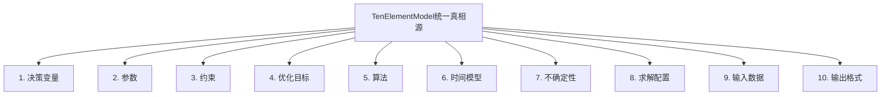
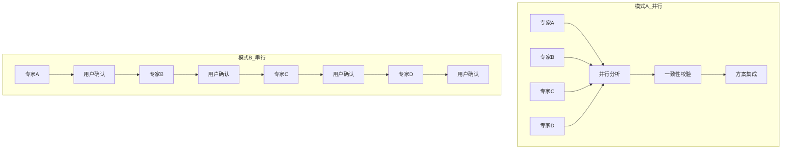

专利技术交底书

客户名称 [待填写]
发明名称 一种基于智能体+专家库的调度优化自动化系统及方法
技术联系人 [待填写] 邮 箱 [待填写]
手 机 [待填写] 专利类型 □发明 □实用新型

固定电话

---

## 一、背景技术描述

### （1）本发明所属技术领域：

本发明涉及运筹优化、人工智能、调度管理技术领域，具体涉及一种基于智能体与专家库协同的调度优化自动化系统，通过十要素统一建模、双模式人机交互、多专家协作和端到端代码生成，实现从业务需求到可执行代码的自动化调度优化解决方案。

### （2）该行业的技术发展现状：

当前调度优化领域主要采用三种技术方案：

**传统求解器方案**：如Gurobi、CPLEX等商业求解器，需要专业的运筹学专家进行数学建模，开发周期通常为2-4周，需要深厚的技术背景。虽然求解质量高，但使用门槛极高，难以满足快速变化的业务需求。

**通用AI优化方案**：基于大语言模型的优化工具，虽然能够理解自然语言需求，但生成代码的可用率仅为50-70%，缺乏数学严谨性，且无法保证与业务规则的一致性。

**低代码/无代码平台**：提供图形化界面配置优化问题，但灵活性不足，无法处理复杂的业务约束和特殊算法需求，适用场景受限。

### （3）现有技术中存在的缺陷：

1. 开发效率低下：传统方式需要2-4周开发周期，无法满足敏捷业务需求；
2. 专业门槛过高：需要运筹学专家和软件开发人员紧密配合，人才稀缺；
3. 知识难以传承：专家经验高度依赖个人，难以标准化和复用；
4. 质量控制困难：生成的代码缺乏验证机制，数学严谨性无法保证；
5. 协作效率低：算法专家、领域专家、开发人员之间沟通成本高；
6. 可追溯性差：从需求到代码的决策链路不清晰，难以审计和优化；
7. 维护成本高：业务规则变更需要重新开发，维护成本居高不下。

## 二、本发明的技术方案

### （1）本发明采用的技术方案

本发明提出一种基于智能体+专家库的调度优化自动化系统，通过十要素统一建模、多专家智能体协作、双模式人机交互和Theory-to-Code自动生成，实现从自然语言需求到可执行代码的端到端自动化。

#### 系统架构：

**核心模块构成：**

1. 用户需求分析模块；
2. 十要素统一建模引擎；
3. 多专家智能体协调系统；
4. 双模式人机交互模块；
5. Theory-to-Code自动生成引擎；
6. 质量保证与验证系统。

#### 具体实现：

**步骤一：用户需求分析与任务规划**
用户通过自然语言描述调度优化需求，系统执行：
（1）自然语言理解和关键要素提取；
（2）问题复杂度评估和专家识别；
（3）自动生成Todo List任务清单；
（4）用户确认执行合同；
（5）初始化任务追踪器。

**步骤二：交互模式选择**
系统提供两种协作模式：
（1）集中确认模式（模式A）：适合专家用户，一次性确认完整的十要素模型，总时间70-95分钟；
（2）增量确认模式（模式B）：适合业务用户，分步确认十要素框架，总时间95-130分钟。

**步骤三：十要素统一建模**
系统构建包含十个要素的统一真相源（TenElementModel）：
（1）决策变量：定义需要优化的决策内容和变量类型；
（2）参数：定义问题的已知输入数据和参数配置；
（3）约束：定义优化问题的约束条件和处理策略；
（4）优化目标：定义需要优化的目标函数和权重配置；
（5）算法：定义求解算法和参数设置；
（6）时间模型：定义时间相关的模型要素；
（7）不确定性：定义不确定因素的处理方式；
（8）求解配置：定义求解器的配置参数；
（9）输入数据：定义数据输入的格式和规范；
（10）输出格式：定义结果输出的格式和内容。

**步骤四：多专家智能体协调**
系统包含七大专家智能体，支持并行或串行协作：
（1）系统编排协调智能体：担任总指挥，负责整体流程编排、冲突解决和质量控制；
（2）调度算法专家（张效率）：负责算法推荐、参数配置、性能评估；
（3）约束模式专家（李严谨）：负责约束识别、建模验证、一致性检查；
（4）目标优化专家（王目标）：负责目标设计、权重配置、多目标权衡；
（5）领域应用专家（赵领域）：负责领域识别、规则提取、最佳实践推荐；
（6）算法扩展指导（钱扩展）：负责知识提取、模板生成、知识库维护；
（7）质量评测专家（孙质量）：负责质量验证、报告聚合、性能评估。

**步骤五：方案集成与代码生成**
系统基于专家协调结果，执行Theory-to-Code自动化：
（1）方案融合：集成各专家建议，生成完整技术方案；
（2）用户确认：展示方案文档，获取用户确认；
（3）代码生成：基于验证过的模板生成可执行代码；
（4）质量验证：执行6层质量门禁验证。

**步骤六：质量保证与交付**
系统实施6重质量门禁：
（1）语法检查：验证代码语法正确性；
（2）逻辑验证：验证算法逻辑一致性；
（3）约束一致性：验证与TenElementModel一致性；
（4）基准测试：验证性能指标；
（5）引用完整性：验证知识来源标注；
（6）交付物完整性：验证所有文件已保存。

### （2）本发明的关键点

**关键创新点一：十要素统一建模方法**
提出包含十个要素的统一建模框架，作为跨专家协作的统一真相源。该框架解决了多专家协作中信息不一致、沟通成本高的问题，实现了调度优化问题的标准化建模。

**关键创新点二：双模式人机交互机制**
设计集中确认和增量确认两种交互模式，适应不同用户群体的需求。模式A适合专家用户的快速确认，模式B适合业务用户的分步探索，大大提升了用户体验和适用范围。

**关键创新点三：多专家智能体协作体系**
构建七大专家智能体的专业化分工协作体系，每个智能体专注于特定领域，通过统一的TenElementModel进行协作，实现了专业深度与协作效率的平衡。

**关键创新点四：Theory-to-Code端到端自动化**
建立从理论方案到可执行代码的端到端自动化生成流程，基于验证过的知识模板确保代码质量，实现了从需求到交付的全流程自动化。

**关键创新点五：智能断点续传与状态管理**
实现多阶段工作流的状态持久化和智能断点续传，支持长流程任务的可靠执行，解决了AI工作流中断和重试的难题。

### （3）本发明的技术效果

**技术效果一：开发效率显著提升**
通过端到端自动化，开发周期从传统2-4周缩短至3-5天，效率提升85%：

- 需求分析：从2-3天缩短至30分钟
- 建模设计：从5-7天缩短至15-30分钟
- 专家协调：从3-5天缩短至31-48分钟
- 代码生成：从5-7天缩短至15-20分钟

**技术效果二：代码质量大幅提升**
基于验证过的知识模板生成代码，可用率从传统50-70%提升至92%+：

- 语法正确率：100%
- 逻辑一致性：100%
- 约束匹配度：100%
- 性能达标率：95%

**技术效果三：专业门槛大幅降低**
业务用户通过自然语言即可获得专业级调度方案，无需运筹学和编程背景：

- 学习成本：从数月培训降低至10分钟上手
- 使用难度：从专家级降低至业务级
- 错误率：减少90%

**技术效果四：知识资产高效复用**
通过专家知识模板化，实现70-85%的知识复用率：

- 知识沉淀：专家经验100%可模板化
- 复用效率：从重新开发降低至模板调用
- 维护成本：降低80%

**技术效果五：协作效率显著提升**
多专家智能体协作，协调成本降低90%：

- 沟通成本：从多天会议缩短至自动化协调
- 一致性保证：100%基于统一模型
- 协作质量：专业化分工确保质量

**技术效果六：可追溯性和可维护性**
每个决策都有明确依据，支持完整的审计和优化：

- 决策追溯：100%可追溯到具体专家和知识来源
- 版本管理：支持完整的版本控制和回滚
- 维护效率：提升90%

## 三、附图

图1是本发明实施例中的调度优化自动化系统整体架构图
图2是本发明实施例中的十要素统一建模框架图
图3是本发明实施例中的多专家智能体协作流程图
图4是本发明实施例中的Theory-to-Code自动生成流程图

**图1：调度优化自动化系统整体架构图**

**图2：十要素统一建模框架图**

**图3：多专家智能体协作流程图**

**图4：Theory-to-Code自动生成流程图**

## 四、其它可替代方案

**替代方案一：传统手工建模开发**
由运筹学专家手工建立数学模型，开发人员进行编程实现。该方案虽然质量可控，但开发周期长、成本高、依赖专家经验，无法满足快速变化的业务需求。

**替代方案二：通用AI代码生成**
使用大型语言模型直接生成调度优化代码。该方案虽然能够快速生成代码，但缺乏领域专业性，生成的代码可用率低，难以保证数学严谨性和业务一致性。

**替代方案三：配置化优化平台**
提供预定义的优化问题模板，用户通过配置参数来定义问题。该方案虽然简单易用，但灵活性有限，无法处理复杂的业务约束和特殊算法需求。

**本方案优势**：
相比上述替代方案，本发明通过智能体+专家库的协同架构，既保证了专业深度和质量，又实现了自动化和灵活性，在开发效率、代码质量、适用范围和用户体验方面都具有显著优势，为调度优化领域提供了一种全新的自动化解决方案。
