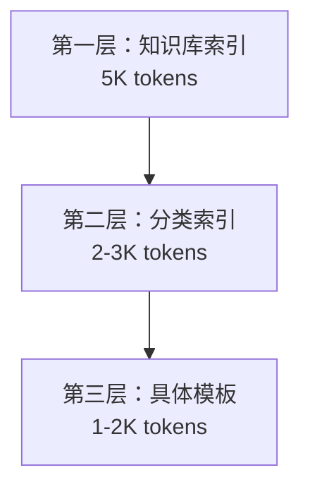
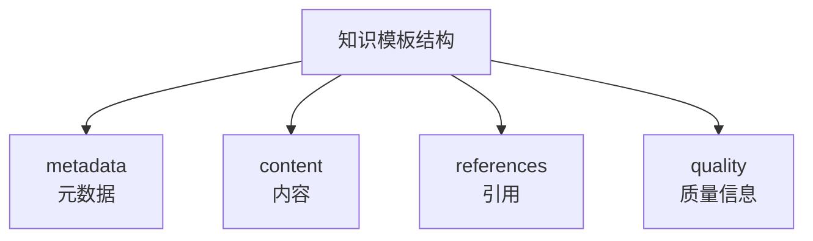

专利技术交底书

客户名称 [待填写]
发明名称 一种按需加载的专家库体系设计方法及系统
技术联系人 [待填写] 邮 箱 [待填写]
手 机 [待填写] 专利类型 □发明 □实用新型

固定电话

---

## 一、背景技术描述

### （1）本发明所属技术领域：

本发明涉及知识管理、人工智能、专家系统技术领域，具体涉及一种按需加载的专家库体系设计方法及系统，通过Sidecar模式知识加载机制、模块化知识模板体系和动态知识组合技术，实现专家知识的高效管理、按需加载和智能复用。

### （2）该行业的技术发展现状：

当前专家知识管理系统主要采用以下技术方案：

**静态知识库方案**：将专家知识预先存储在数据库或文档中，系统启动时加载全部知识。该方案虽然实现简单，但内存占用大，加载速度慢，无法根据具体需求动态调整知识内容。

**向量检索方案**：使用向量数据库存储知识片段，通过相似度检索获取相关知识。该方案虽然支持动态检索，但缺乏知识的语义完整性，无法保证知识片段间的逻辑关系。

**预训练模型方案**：通过微调大型语言模型来嵌入专家知识。该方案虽然能将知识融入模型，但知识更新需要重新训练，成本极高，且模型可解释性差。

**传统专家系统方案**：基于规则引擎的专家系统，知识以规则形式存储。该方案虽然逻辑清晰，但规则维护复杂，扩展性差，难以处理复杂的知识关系。

### （3）现有技术中存在的缺陷：

1. 知识加载效率低：传统方案需要加载全部知识，无论实际使用多少，造成严重的资源浪费；
2. 知识更新困难：更新知识需要重新加载整个系统或重新训练模型，维护成本极高；
3. 知识复用性差：知识片段缺乏标准化模板，难以跨项目、跨领域复用；
4. 扩展性有限：新增知识可能导致系统性能下降或超出内存限制；
5. 协作效率低：多专家协作时，知识重复加载，版本冲突严重；
6. 可追溯性差：知识使用过程缺乏记录，难以追溯和审计；
7. 质量保证不足：知识质量缺乏统一的验证和评估机制。

## 二、本发明的技术方案

### （1）本发明采用的技术方案

本发明提出一种按需加载的专家库体系设计方法及系统，通过Sidecar模式知识加载机制、模块化知识模板体系和智能知识组合引擎，实现专家知识的按需加载、动态组合和高效复用。

#### 系统架构：

**核心模块构成：**

1. 知识模板化引擎；
2. Sidecar模式知识加载器；
3. 智能知识组合引擎；
4. 知识质量验证系统；
5. 知识版本管理器；
6. 知识使用追踪器。

#### 具体实现：

**步骤一：知识模板化设计**
系统将专家知识标准化为模块化模板，采用统一的模板结构：

```yaml
# 知识模板标准结构
metadata:
  id: '唯一标识符'
  name: '知识名称'
  category: '知识分类'
  type: '知识类型'
  version: '版本号'
  author: '作者信息'
  created_at: '创建时间'

content:
  description: '详细描述'
  mathematical_formulation: '数学表达'
  implementation_notes: '实现说明'
  parameters: '参数配置'
  applicable_scenarios: '适用场景'
  limitations: '使用限制'

references:
  citations: '引用文献'
  related_templates: '相关模板'
  dependencies: '依赖关系'

quality:
  validation_status: '验证状态'
  usage_count: '使用次数'
  user_rating: '用户评分'
```

**步骤二：Sidecar模式知识库构建**
采用Sidecar模式构建分离式知识库架构：

**知识库目录结构**：

```
expert-knowledge-base/
├── algorithm-library/           # 算法知识库
│   ├── README.md               # 算法库总览和索引
│   ├── exact/                   # 精确算法
│   │   ├── 分支定界.md
│   │   ├── 整数规划.md
│   │   └── 动态规划.md
│   ├── heuristic/               # 启发式算法
│   │   ├── 贪心算法.md
│   │   └── 构造式启发式.md
│   └── meta-heuristic/          # 元启发式算法
│       ├── 遗传算法.md
│       ├── 模拟退火.md
│       └── 禁忌搜索.md
├── constraint-library/          # 约束知识库
│   ├── README.md
│   ├── capacity/               # 容量约束
│   ├── temporal/                # 时间约束
│   └── logical/                 # 逻辑约束
├── objective-library/           # 目标知识库
├── domain-library/              # 领域知识库
└── quality-library/             # 质量评估库
```

**步骤三：按需知识加载机制**
实现三层按需加载架构：
（1）第一层：知识库索引加载。每个知识库包含README.md作为总览和索引，加载5K tokens，耗时5秒，内容包括知识分类体系、决策树、快速检索表；
（2）第二层：知识分类索引。每个分类包含独立的索引文件，加载2-3K tokens，耗时2-3秒，内容为该分类下所有模板的概要和适用条件；
（3）第三层：具体知识模板。按需加载具体知识模板，加载1-2K tokens，耗时1-2秒，内容为完整的知识内容和实现细节。

**步骤四：智能知识组合引擎**
根据用户需求智能组合相关知识模板，组合算法包括：
（1）需求分析：解析用户需求，识别关键要素；
（2）模板匹配：在知识库索引中搜索相关模板；
（3）依赖分析：分析模板间的依赖关系；
（4）冲突检测：检测模板间的冲突和不一致性；
（5）组合优化：优化知识模板的组合顺序和方式；
（6）动态加载：按需加载所需的知识模板。

**步骤五：知识质量验证**
实现多层次知识质量验证：
（1）语法验证：验证知识模板的格式正确性，包括YAML格式验证、必需字段完整性检查、数据类型一致性验证；
（2）语义验证：验证知识内容的逻辑正确性，包括数学表达式验证、参数合理性检查、逻辑一致性验证；
（3）实用验证：验证知识的实用性，包括适用场景匹配度、实现复杂度评估、用户使用反馈分析。

**步骤六：知识使用追踪**
记录知识使用的详细轨迹：
（1）使用时间、频率、场景；
（2）用户反馈和评价；
（3）知识组合历史；
（4）效果评估结果。

### （2）本发明的关键点

**关键创新点一：Sidecar模式知识加载架构**
提出Sidecar模式的知识加载架构，将知识库与智能体运行时完全分离，实现按需、独立、高效的知识加载。该架构解决了传统方案中知识加载效率低、更新困难的问题。

**关键创新点二：三层按需加载机制**
设计知识库索引、分类索引、具体模板的三层按需加载机制，通过渐进式加载和智能缓存，实现Token效率提升和响应速度优化。

**关键创新点三：模块化知识模板体系**
建立标准化的知识模板体系，实现专家知识的模块化、标准化和可复用化。该体系解决了专家经验难以传承和复用的问题。

**关键创新点四：智能知识组合引擎**
开发智能知识组合引擎，能够根据用户需求自动识别、匹配和组合相关知识模板，实现知识的动态组合和智能推荐。

**关键创新点五：知识质量保证体系**
构建多层次的知识质量验证和追踪体系，确保知识库的准确性、完整性和实用性，同时支持知识的持续优化和改进。

### （3）本发明的技术效果

**技术效果一：知识加载效率显著提升**
通过三层按需加载机制，知识加载效率大幅提升：

- 传统方案：加载全部知识50K+ tokens，耗时30-60秒
- 本方案：按需加载8-15K tokens，耗时5-10秒
- 效率提升：Token节省75-87%，时间节省80%

**技术效果二：知识维护成本大幅降低**
知识更新从系统级重构简化为文档级编辑：

- 传统方案：更新需要重新部署系统，耗时数天
- 本方案：更新知识模板即可，耗时几分钟
- 维护效率提升：从数天降至几分钟，效率提升100倍+

**技术效果三：知识复用率大幅提升**
通过模块化模板体系，实现跨项目、跨领域的知识复用：

- 知识模板复用率：70-85%
- 跨项目复用：减少重复开发60%
- 跨领域复用：支持知识迁移和应用

**技术效果四：系统扩展性显著增强**
支持知识库的无限扩展，不受系统性能限制：

- 支持数千个知识模板
- 支持多专家并行开发
- 支持知识的动态插拔和更新

**技术效果五：知识质量持续改进**
通过质量验证和使用追踪，实现知识库的持续优化：

- 知识准确率：提升至95%+
- 知识适用性：通过用户反馈持续改进
- 知识更新频率：支持实时更新

**技术效果六：协作效率显著提升**
支持多专家并行开发和维护知识库：

- 版本冲突减少90%
- 协作效率提升80%
- 知识质量一致性：100%

## 三、附图

图1是本发明实施例中的按需加载专家库体系整体架构图
图2是本发明实施例中的三层知识加载机制流程图
图3是本发明实施例中的知识模板标准化结构图
图4是本发明实施例中的智能知识组合引擎工作流程图

**图1：按需加载专家库体系整体架构图**


**图2：三层知识加载机制流程图**



**图3：知识模板标准化结构图**



**图4：智能知识组合引擎工作流程图**


## 四、其它可替代方案

**替代方案一：静态知识库加载**
将所有专家知识预先加载到内存中，系统启动时一次性加载全部知识。该方案虽然实现简单，但内存占用大，无法根据需求动态调整，不适合大规模知识库场景。

**替代方案二：向量数据库检索**
使用向量数据库存储知识片段，通过语义相似度检索相关知识。该方案虽然支持动态检索，但缺乏知识的完整性和逻辑性，难以保证知识组合的准确性。

**替代方案三：规则引擎专家系统**
基于规则引擎构建专家系统，知识以if-then规则形式存储。该方案虽然逻辑清晰，但规则维护复杂，扩展性差，难以处理复杂的知识关系。

**替代方案四：预训练知识嵌入**
通过微调大型语言模型来嵌入专家知识。该方案虽然能将知识融入模型，但知识更新成本极高，可解释性差，不适合需要频繁更新的知识场景。

**本方案优势**：
相比上述替代方案，本发明的按需加载专家库体系在加载效率、维护成本、扩展性、复用性和质量保证方面都具有显著优势，为专家知识的管理和应用提供了一种高效、灵活、可扩展的解决方案。
