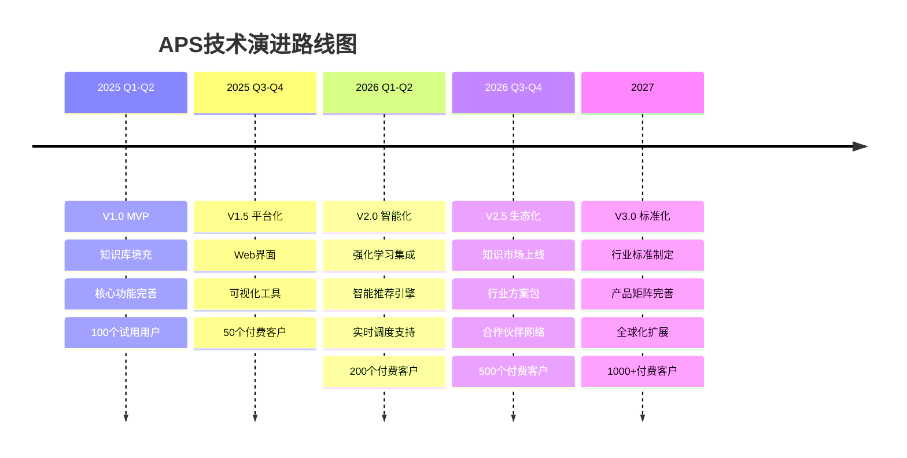

# 十五、未来发展路线图

## 15.1 短期规划 (3-6个月)

**核心目标**：完善知识库，提升易用性

```yaml
知识库建设 (优先级P0):
  ✓ 算法库: 填充至30+算法模板
    - 精确算法: 10个 (分支定界、动态规划、MILP等)
    - 启发式: 12个 (贪心、局部搜索、构造式等)
    - 元启发式: 8个 (GA、SA、TS、PSO、ACO等)

  ✓ 约束库: 填充至40+约束模板
    - 时间约束: 12个
    - 容量约束: 8个
    - 空间约束: 6个
    - 逻辑约束: 8个
    - 业务规则: 6个

  ✓ 领域库: 填充至20+领域模板
    - 物流: 6个
    - 制造: 5个
    - 服务: 4个
    - 项目: 3个
    - 供应链: 2个

产品功能增强:
  - Web界面开发 (替代CLI)
  - 可视化十要素模型编辑器
  - 交互式方案对比工具
  - 实时执行进度展示

质量提升:
  - 代码可用率: 92% → 95%
  - Phase执行时间: 优化20%
  - Token效率: 提升15%
```

---

## 15.2 中期规划 (6-12个月)

**核心目标**：平台化，生态建设

```yaml
AI能力增强: ✓ 智能需求理解
  - 支持语音输入
  - 多轮对话澄清
  - 自动提取关键信息

  ✓ 方案推荐引擎
  - 基于历史案例推荐
  - 相似问题匹配
  - 性能预测模型

数据能力: ✓ 执行数据分析
  - 使用模式分析
  - 知识模板热度统计
  - 性能基准数据库

  ✓ 持续优化
  - A/B测试框架
  - 自动参数调优
  - 知识质量评估

生态建设: ✓ 知识市场
  - 用户贡献知识模板
  - 模板评分与认证
  - 激励机制

  ✓ 合作伙伴计划
  - 认证咨询顾问
  - ISV集成支持
  - 联合解决方案
```

---

## 15.3 长期愿景 (12-24个月)

**核心目标**：行业标准，AI原生调度平台

```yaml
技术创新: ✓ 强化学习集成
  - 自适应算法选择
  - 参数自动调优
  - 持续性能提升

  ✓ 大模型增强
  - 更强的需求理解
  - 代码生成能力提升至98%
  - 自然语言交互

  ✓ 实时调度
  - 流式数据处理
  - 在线优化算法
  - 秒级响应

产品矩阵: ✓ APS Core (当前产品)
  - 通用调度优化平台

  ✓ APS Studio (新产品)
  - 可视化建模工具
  - 拖拽式工作流设计
  - 低代码/无代码

  ✓ APS Cloud (新产品)
  - 分布式求解引擎
  - 弹性计算资源
  - 大规模问题支持

  ✓ APS Edge (新产品)
  - 边缘端轻量化部署
  - 离线求解能力
  - IoT设备集成

行业解决方案包: ✓ 智慧物流方案包
  - 预集成物流领域知识
  - 车辆路径优化套件
  - 仓储管理集成

  ✓ 智能制造方案包
  - MES系统集成
  - 生产排程优化
  - 设备维护管理

  ✓ 服务业方案包
  - 人员排班优化
  - 客户服务调度
  - 资源预约管理

愿景目标:
  - 成为AI原生调度优化的行业标准
  - 知识库规模: 1000+模板
  - 覆盖行业: 20+
  - 解决问题: 100万+实例
```

---

## 15.4 技术演进路径



---

# 十六、竞争优势与差异化

## 16.1 vs 传统优化软件

| 维度         | 传统软件 (如Gurobi/CPLEX)  | APS智能体系统            |
| ------------ | -------------------------- | ------------------------ |
| **易用性**   | 需要建模专家，学习曲线陡峭 | 自然语言输入，AI自动建模 |
| **开发效率** | 2-4周手工建模和编码        | 70-130分钟自动生成       |
| **知识传承** | 依赖个人经验，难以沉淀     | 知识模板化，持续积累     |
| **适应性**   | 换场景需重新开发           | 知识模块重组，快速适配   |
| **交付物**   | 代码                       | 代码+文档+可追溯性       |

---

## 16.2 vs 其他AI Agent平台

| 维度         | 通用Agent平台          | APS专业平台          |
| ------------ | ---------------------- | -------------------- |
| **专业性**   | 通用能力，缺乏领域深度 | 调度优化领域深度专精 |
| **知识库**   | 无专业知识库           | 7大专家库，100+模板  |
| **质量保证** | 缺乏质量门禁           | 6层质量门禁验证      |
| **可追溯性** | 黑盒决策               | 完整引用链，可审计   |
| **代码质量** | 50-70%可用率           | 92%可用率            |
| **工作流**   | 简单对话               | Phase 0-4结构化流程  |

---

## 16.3 核心壁垒

```yaml
技术壁垒: ✓ Agent as Doc理念及实现
  ✓ Sidecar模式知识加载机制
  ✓ Theory-to-Code自动化引擎
  ✓ 状态持久化与智能续传

知识壁垒: ✓ 7大专家知识库体系
  ✓ 100+验证过的知识模板
  ✓ 50+行业案例积累
  ✓ 调度优化领域专业性

数据壁垒: ✓ 用户使用模式数据
  ✓ 性能基准数据库
  ✓ 问题-方案匹配数据
  ✓ 持续优化反馈循环

生态壁垒: ✓ 认证咨询顾问网络
  ✓ ISV合作伙伴
  ✓ 开源社区贡献者
  ✓ 企业客户案例
```

---

## 16.4 核心竞争优势总结

### 1. 技术创新优势

**"Agent as Doc"理念** - 业界首创

- 智能体作为知识文档的动态加载器
- Token效率提升 75-87%
- 知识维护效率提升 10倍
- 支持知识持续积累和演进

**Theory-to-Code 全链路自动化**

- 需求 → 建模 → 代码的完整自动化
- 92%代码直接可用率
- 完整文档和测试自动生成

### 2. 专业深度优势

**7大专家智能体体系**

- 领域/约束/目标/算法/扩展/质量/编排
- 100+验证过的知识模板
- 调度优化领域专精

**TenElementModel统一真相源**

- 10要素覆盖调度问题全要素
- 跨专家协作的统一语言
- 100%可追溯性

### 3. 质量保证优势

**6层质量门禁**

- 语法/逻辑/一致性/引用/基准/交付物
- 质量分数量化评估
- Guardrails强约束策略

**状态持久化 + 智能续传**

- 业界首创断点续传能力
- 支持长流程任务
- 团队协作友好

### 4. 用户体验优势

**Human-in-the-Loop 5级触发**

- 关键决策点人机协作
- P0-P4灵活控制
- 用户参与感强

**双模式交互系统**

- 模式A: 专家用户快速高效
- 模式B: 业务用户渐进式引导
- 适配不同用户群体

**Todo List + 偏离检测**

- 任务偏离率降低67%
- 全程可见可控
- 需求遗漏率降低80%

### 5. 业务价值优势

**开发效率提升 85%**

- 3-4周 → 3-5天
- 专家时间节省95%

**成本降低 90%+**

- 人力成本降低94.5%
- 试错成本降低90%
- 维护成本降低70%

**知识资产盘活**

- 70-85%可模板化复用
- 知识提取效率提升85%
- 组织知识持续积累

---

## 结语

APS调度智能体系统代表了AI+运筹优化的新范式，通过"Agent as Doc"理念和模块化知识库架构，实现了专家经验的标准化、知识的持续积累和调度优化能力的民主化。

我们的愿景是：**让每个企业都能拥有专业级的调度优化能力**。

---

**文档版本**: V1.0
**最后更新**: 2025-10-29
**维护团队**: APS Product Team
