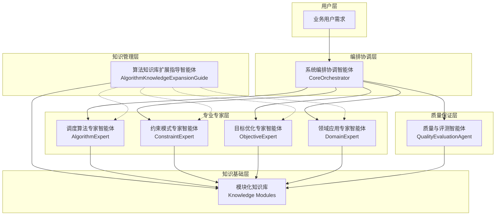

# 智能体团队架构总览 - V4.2 模块化架构 + Todo & Human-in-the-Loop

## 🆕 V4.2 新增功能 (2025-10-14)

### 📋 Todo List 任务规划机制

**Phase 0: 任务规划** - 在执行前建立"执行合同"

- 自动生成结构化任务清单
- 实时追踪任务执行状态
- 偏离检测与纠正 (相似度阈值: 0.60)

### 🤝 Human-in-the-Loop 人机交互机制

**五级触发规则** - 关键决策点用户确认

- P0: Todo List 强制要求 (user_confirmation_needed=true)
- P1: 置信度过低 (confidence < 0.70)
- P2: 专家建议冲突
- P3: 能力缺口
- P4: 用户主动暂停

**标准化交互模板** - 7个场景覆盖

- 需求澄清、领域确认、约束确认、目标权重
- 冲突仲裁、能力缺口

### 🔄 V4.2 增强工作流

```yaml
V4.2 完整工作流:
  用户需求
      ↓
  Phase 0: 任务规划 (🆕)
      ├─ TodoGenerator 生成任务清单
      ├─ 用户确认 Todo List (执行合同)
      └─ 初始化 TodoTracker
      ↓
  Phase 1: 需求分析
      ├─ 需求澄清交互 (🆕 P1触发)
      ├─ TodoTracker 追踪执行
      └─ 偏离检测 (🆕)
      ↓
  Phase 1.5: 十要素建模
      ├─ 生成 TenElementModel
      ├─ 用户确认 (🆕 P0触发)
      └─ 置信度提升 0.82→0.95
      ↓
  Phase 2-3: 专家协调
      ├─ 领域确认交互 (🆕 P0触发)
      ├─ 约束确认交互 (🆕 P0触发)
      ├─ 目标权重交互 (🆕 P0触发)
      ├─ 冲突仲裁 (🆕 P2触发)
      └─ 能力缺口处理 (🆕 P3触发)
      ↓
  Phase 4: 方案集成
      ├─ 方案融合
      ├─ 一致性检查
      └─ TodoTracker 追踪
      ↓
  Phase 5: 质量保证
      ├─ 质量门禁验证
      ├─ QE 聚合报告
      └─ Todo 完成度检查 (🆕)
```

### 📊 V4.2 预期效果

- **任务链偏离率**: 降低 67% (15% → 5%)
- **关键决策确认率**: 提升至 95%+
- **整体置信度**: 提升 +15.9% (0.82 → 0.95)
- **用户满意度**: 预计提升 25%

**完整示例**: [`examples/v4.2_todo_and_interaction_demo.md`](../../../examples/v4.2_todo_and_interaction_demo.md)

---

## 🎯 团队使命与理念

**核心使命**: 基于"Agent as Doc"理念，构建模板化智能体团队，实现调度优化领域专家知识的数字化、模块化和动态组合

**设计理念**: 智能体 = 知识文档化载体，专业能力 = 模板化知识模块，工作流程 = 知识模板调用机制

## 🏗️ 团队架构体系

### 七大核心智能体架构图



### 产品架构完美映射

```yaml
产品四库架构 → 智能体七专家架构: 算法模板库 → @调度算法专家智能体
  约束模式库 → @约束模式专家智能体
  目标函数库 → @目标优化专家智能体
  领域模板库 → @领域应用专家智能体
  核心编排器 → @系统编排协调智能体
  知识管理 → @算法知识库扩展指导智能体 (新增)
  验证评估 → @质量与评测智能体 + tools/validation/aggregator.py（统一聚合）
```

## 📋 智能体职责与调用矩阵

| 智能体                                                     | 角色定位       | 调用方式                             | 核心知识模板             | 协作关系                   |
| ---------------------------------------------------------- | -------------- | ------------------------------------ | ------------------------ | -------------------------- |
| [@系统编排协调智能体](./系统编排协调智能体.md)             | 系统总指挥     | @系统编排协调智能体.需求理解         | 五阶段编排知识           | 协调所有专家               |
| [@调度算法专家智能体](./调度算法专家智能体.md)             | 算法技术专家   | @调度算法专家智能体.算法推荐         | 遗传算法、动态规划等     | 被扩展指导服务             |
| [@约束模式专家智能体](./约束模式专家智能体.md)             | 约束工程专家   | @约束模式专家智能体.约束识别         | 时间窗、容量等约束知识   | 被扩展指导服务             |
| [@目标优化专家智能体](./目标优化专家智能体.md)             | 优化理论专家   | @目标优化专家智能体.目标建模         | 成本最小化等优化知识     | 被扩展指导服务             |
| [@领域应用专家智能体](./领域应用专家智能体.md)             | 业务领域专家   | @领域应用专家智能体.场景识别         | 车辆调度等领域知识       | 被扩展指导服务             |
| [@算法知识库扩展指导智能体](./算法知识库扩展指导智能体.md) | 知识库架构师   | @算法知识库扩展指导智能体.兼容性分析 | 算法资产模板化改造       | 为专家提供扩展服务         |
| [@质量与评测智能体](./质量与评测智能体.md)                 | 验证与评估聚合 | @质量与评测智能体.统一验证           | 语法/逻辑/约束/基准/报告 | 为编排与各专家提供统一验证 |

## 🔄 V4.1 模块化实例化机制

### 增强版五阶段知识组装流程（含十要素建模与统一验证门）

```yaml
阶段1_需求分析:
  主导: @系统编排协调智能体.需求理解
  协作: @算法知识库扩展指导智能体.能力评估 (按需)
  知识依赖: [@需求解析模板, @场景识别模板]
  输出: 标准化需求模型 + 能力缺口分析

阶段1.5_十要素建模:
  主导: @系统编排协调智能体.十要素建模
  知识依赖: [@知识模块库/建模模块/十要素建模流程.md, @知识模块库/建模模块/时间模型.md, @知识模块库/建模模块/不确定性建模.md]
  输出: TenElementModel（统一真相源，含时间/不确定性）

阶段2_专家协调:
  主导: @系统编排协调智能体.专家编排
  协作: @算法知识库扩展指导智能体.扩展策略 (按需)
  知识依赖: [@协作协议模板, @编排策略模板]
  输出: 专家协作计划 + 扩展需求计划

阶段3_知识组装:
  主导: @各专家智能体.知识模板
  协作: @算法知识库扩展指导智能体.模块化改造 (按需)
  知识依赖: [@算法模板, @约束模板, @目标模板, @领域模板]
  输出: 定制化解决方案 + 新增知识模板

阶段4_方案集成:
  主导: @系统编排协调智能体.方案整合
  协作: @算法知识库扩展指导智能体.集成协调 (按需)
  知识依赖: [@集成优化模板, @质量保证模板]
  输出: 完整解决方案 + 知识库更新

阶段5_质量保证:
  主导: @系统编排协调智能体.质量评估
  协作: @质量与评测智能体.统一验证, @算法知识库扩展指导智能体.标准验证 (按需)
  知识依赖: [@验证模板, @评估模板, 《docs/agents/技术规范/验证与评估聚合接口规范.md》]
  工具: python tools/validation/aggregator.py --in input.json --out report.json
  门禁: 无 @引用 或 QE 聚合 level≠pass → 退回补齐或升级裁决
  输出: 经过验证的最终方案 + 知识库优化建议 + 验证报告
```

## 💡 V4.1 架构特性要点

### 1. 知识载体理念

- **智能体定位**: 专家知识的载体和组织者，而非技术实现系统
- **模板调用**: 通过@符号进行标准化知识调用
- **依赖管理**: 清晰的知识模板依赖关系
- **动态组合**: 基于需求的知识模块动态组装

### 2. 知识库自进化能力

- **算法资产盘活**: 将现有代码转化为知识模板
- **能力自我扩展**: 通过扩展指导智能体实现知识库自主扩展
- **标准化管理**: 统一的知识模块化改造标准
- **质量自我保证**: 内建的验证和质量保证机制

### 3. 协作模式创新

- **服务提供模式**: 扩展指导智能体为专家提供知识库扩展服务
- **按需协作**: 根据需求动态调用扩展服务
- **能力增强**: 通过知识库扩展持续增强专家能力
- **生态演进**: 形成可持续的知识生态系统

## 📁 团队文档组织（V4.1）

### 核心文档结构

```
智能体团队/
├── README.md                                    # 本文档 - 团队架构总览
├── 系统编排协调智能体.md                          # 系统总指挥官
├── 调度算法专家智能体.md                          # 算法技术专家
├── 约束模式专家智能体.md                          # 约束工程专家
├── 目标优化专家智能体.md                          # 优化理论专家
├── 领域应用专家智能体.md                          # 业务领域专家
├── 算法知识库扩展指导智能体.md                    # 知识库架构师 (新增)
├── 协作机制/                                   # 智能体协作知识
│   ├── 智能体协作协议.md                        # 协作标准知识
│   ├── Agent_as_Doc协作模式.md                 # Agent as Doc协作知识
│   └── 知识模块依赖调用框架.md                   # 依赖调用知识框架
├── 知识模块库/                                 # 四大知识模块库
│   ├── 算法模块/                               # 算法知识模块
│   ├── 约束模块/                               # 约束知识模块
│   ├── 目标模块/                               # 目标知识模块
│   ├── 领域模块/                               # 领域知识模块
│   └── 建模模块/                               # 十要素/时间/不确定性建模（新增）
├── 技术规范/
│   └── 验证与评估聚合接口规范.md                # QE统一接口规范（新增）
├── 质量与评测智能体.md                           # 统一验证聚合智能体（新增）
└── 实例化案例/                                 # 动态实例化知识演示
    └── 生鲜配送调度实例化案例.md                 # 完整实例化知识案例
```

## 🚀 使用指南

### 快速开始流程

```yaml
基础调用模式:
  单专家调用: @专家智能体名称.功能模块
  组合调用: @专家1.模块1 + @专家2.模块2
  实例化调用: @系统编排协调智能体.动态实例化[@场景需求]

知识库扩展模式:
  兼容性评估: @算法知识库扩展指导智能体.兼容性分析[@算法代码]
  模块化改造: @算法知识库扩展指导智能体.模块化改造[@算法代码]
  集成部署: @算法知识库扩展指导智能体.集成协调[@改造模板]

质量与评测模式:
  统一验证(本地/CI): python tools/validation/aggregator.py --in input.json --out report.json
  策略配置: options.policy.citations_required=true  # 启用@引用强制
  集成门禁: QE summary.level 必须为 pass，否则阻断集成
```

### 典型应用场景

#### 场景1: 标准调度问题求解（含十要素与QE）

```yaml
Step1: @系统编排协调智能体.需求理解[用户需求]
Step1.5: 调用 @知识模块库/建模模块/十要素建模流程.md 产出 TenElementModel
Step2: @领域应用专家智能体.场景识别[需求模型]
Step3: @调度算法专家智能体.算法推荐[场景特征]
Step4: @约束模式专家智能体.约束建模[问题约束]
Step5: @目标优化专家智能体.目标设计[优化目标]
Step6: @质量与评测智能体.统一验证 + QE聚合报告(level=pass)
```

#### 场景2: 算法资产集成扩展

```yaml
Step1: @算法知识库扩展指导智能体.兼容性分析[现有算法代码]
Step2: @算法知识库扩展指导智能体.扩展策略[兼容性报告]
Step3: @算法知识库扩展指导智能体.模块化改造[算法代码]
Step4: @算法知识库扩展指导智能体.标准验证[改造模板]
Step5: @算法知识库扩展指导智能体.集成协调[验证模板]
Step6: @质量与评测智能体.统一验证 + QE聚合报告(level=pass)
```

#### 场景3: 团队能力持续提升

```yaml
定期评估: @算法知识库扩展指导智能体.能力评估[当前知识库状态]
扩展规划: @算法知识库扩展指导智能体.扩展策略[评估结果]
批量改造: @算法知识库扩展指导智能体.模块化改造[算法资产清单]
系统集成: @系统编排协调智能体.知识库更新[扩展摘要]
质量门: @质量与评测智能体.统一验证[抽查样本]/建立性能基准
```

## 🎯 团队核心价值

### 知识资产价值

- **算法资产盘活**: 70-85%的现有算法可模板化复用
- **知识积累加速**: 新算法3-5天完成模板化 vs 传统3周开发
- **能力持续扩展**: 通过知识库扩展实现团队能力自我进化
- **标准化管理**: 统一的知识模块管理和质量保证

### 业务应用价值

- **响应速度提升**: 标准问题1天内给出解决方案
- **解决方案质量**: 基于验证模板，方案质量显著提升
- **适配能力增强**: 快速适配新业务场景和特殊需求
- **创新支撑能力**: 为算法创新提供坚实的知识基础

### 生态系统价值

- **可持续发展**: 知识库自我扩展和优化机制
- **开放协作**: 支持算法知识的开放贡献和共享
- **标准引领**: 建立调度算法领域的知识标准
- **生态建设**: 形成健康的算法知识生态系统

---

**团队版本**: V4.1 "Theory-to-Code + Guardrails"
**设计理念**: 知识载体、模板调用、动态组合、自我进化
**核心特征**: 七大专家协作、知识库自扩展、统一验证聚合、标准化管理
**最后更新**: 2025-10-10

**团队使命**: 构建可持续发展的调度算法专家知识生态系统
