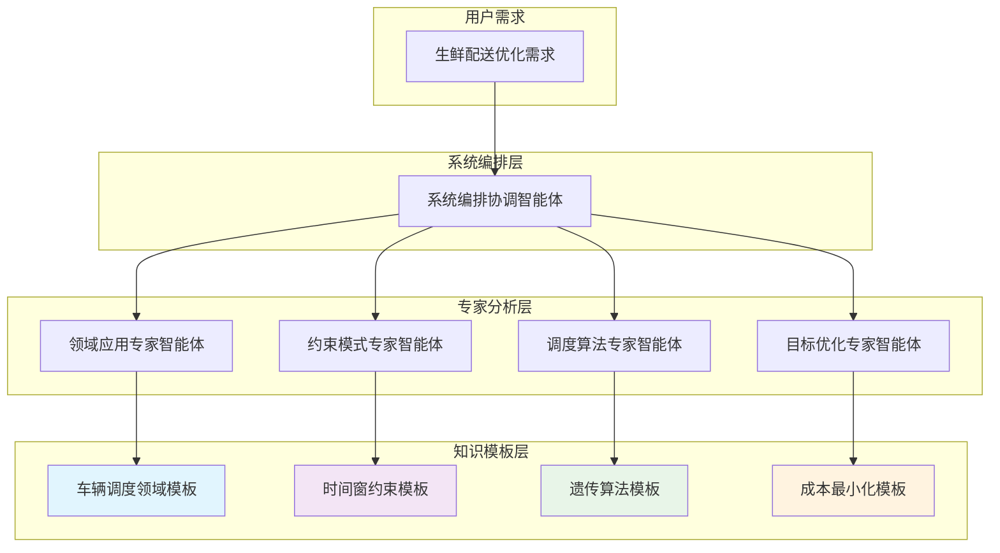

# 生鲜配送调度实例化案例 - "Agent as Doc"动态组合演示

## 📋 案例概览

```yaml
案例名称: 某生鲜电商城市配送优化
业务场景: B2C生鲜配送，严格时间窗，温度控制
问题规模: 100个订单客户，12辆冷藏车，4小时配送窗口
核心挑战: 时间紧迫 + 成本控制 + 货物保鲜
实例化目标: 展示V3.0模板化智能体的动态知识组合能力
```

## 🎯 需求驱动的动态实例化流程

### 阶段1: 用户需求输入

```yaml
原始需求描述: '我们是一家生鲜电商，每天上午11点需要配送当日订单。
  客户主要集中在市区，要求2小时内送达，保证新鲜度。
  目前有12辆冷藏车，司机工作时间8小时。
  希望优化配送路径，降低成本，提高客户满意度。'

业务参数:
  订单量: 100个/日
  配送窗口: 11:00-19:00 (客户可接受时间)
  车辆数: 12辆冷藏车
  车辆容量: 150件/车
  配送要求: 2小时送达承诺
  覆盖区域: 市区20km半径
```

### 阶段2: 系统编排协调智能体 - 需求解析

```yaml
@系统编排协调智能体.解析需求
输入: 原始业务需求描述
处理流程:
  需求理解:
    - NLP解析: 提取关键业务要素
    - 意图识别: 配送优化需求
    - 复杂度评估: 中等复杂度(Level 3)

  专家需求识别:
    - 需要领域专家: 识别行业特征
    - 需要约束专家: 处理时间窗约束
    - 需要算法专家: 设计求解策略
    - 需要目标专家: 平衡多重目标

输出:
  结构化需求:
    问题类型: "带时间窗的冷链车辆路径问题"
    约束类型: ["时间窗", "容量", "车辆数", "工作时间"]
    目标类型: ["成本最小化", "客户满意度"]
    复杂度: Level 3
    推荐协作模式: "并行分析 + 方案集成"
```

### 阶段3: 领域应用专家智能体 - 场景识别

```yaml
@领域应用专家智能体.识别领域
输入: 结构化需求描述
依赖模板调用:
  "@车辆调度领域模板" → 场景匹配分析

处理过程:
  场景特征分析:
    - 业务类型: 生鲜配送 (冷链物流子场景)
    - 地理范围: 城市配送
    - 时间特征: 严格时间窗
    - 车辆类型: 专用冷藏车

  领域知识匹配:
    最佳匹配场景: "冷链配送"
    匹配度: 95%

    场景特征:
      - 货物特性: 温度敏感，时效性强
      - 设备要求: 冷藏车辆，温控系统
      - 时间严格: 2小时送达承诺
      - 成本结构: 冷藏设备成本高

输出:
  领域分析报告:
    适用领域模板: "@车辆调度领域模板.冷链配送场景"
    关键约束识别: ["时间窗", "温度控制", "车辆容量"]
    推荐算法类型: "启发式算法 + 局部搜索"
    特殊考虑因素: ["货物保鲜期", "装卸时间", "温度监控"]
```

### 阶段4: 专家并行分析阶段

#### 4.1 约束模式专家智能体 - 约束建模

```yaml
@约束模式专家智能体.建模约束
输入: 领域分析报告 + 约束需求
依赖模板调用:
  "@时间窗约束模板" → 时间约束处理

约束识别与建模:
  时间窗约束:
    客户时间窗: 11:00-19:00 (可接受配送时间)
    承诺时间窗: 订单时间+2小时 (严格承诺)
    车辆工作时间: 8小时工作制
    装卸时间: 每客户5-10分钟

    约束表达:
      ∀客户i: start_time_i ∈ [EST_i, LST_i-service_time_i]
      ∀车辆j: total_work_time_j ≤ 8小时
      ∀订单k: delivery_time_k ≤ order_time_k + 2小时

  容量约束:
    车辆载重: 150件/车
    体积限制: 冷藏空间限制
    温度分区: 不同温度要求商品分隔

    约束表达:
      ∀车辆j: Σ(demand_i) ≤ capacity_j (for 客户i in route_j)

  特殊约束:
    温度控制: 全程温度监控
    装载顺序: 温度敏感商品装载优先级
    路径限制: 避开高温路段

输出:
  约束模型:
    约束类型: "硬约束 + 软约束混合"
    处理策略: "约束传播 + 罚函数"
    验证方法: "时间窗可行性检查"
    参数配置: "时间窗违反罚值=10000"
```

#### 4.2 调度算法专家智能体 - 算法推荐

```yaml
@调度算法专家智能体.推荐算法
输入: 约束模型 + 问题特征
依赖模板调用:
  "@遗传算法模板" → 元启发式求解

算法分析与推荐:
  问题特征分析:
    - 问题规模: 100客户 (中等规模)
    - 约束复杂度: 多重约束 (Level 3)
    - 实时性要求: 中等 (10分钟求解时间)
    - 解质量要求: 高 (成本敏感)

  算法推荐策略:
    主算法: 遗传算法
    理由:
      - 适合多约束优化问题
      - 能处理复杂目标函数
      - 解质量稳定

    算法配置:
      种群大小: 100
      交叉概率: 0.8
      变异概率: 0.05
      最大代数: 500
      精英保留: 10%

  算法改进策略:
    初始化: 节约算法 + 随机生成
    局部搜索: 2-opt + Or-opt改进
    约束处理: 修复算子 + 罚函数
    多目标处理: 加权求和法

输出:
  算法方案:
    推荐算法: "@遗传算法模板.VRPTW变种"
    实现策略: "构造启发式 + 遗传算法 + 局部搜索"
    参数配置: "种群100, 交叉0.8, 变异0.05"
    预期性能: "95%最优解，8分钟收敛"
```

#### 4.3 目标优化专家智能体 - 目标函数设计

```yaml
@目标优化专家智能体.设计目标函数
输入: 业务需求 + 成本结构
依赖模板调用:
  "@成本最小化模板" → 成本建模框架

多目标分析与设计:
  主要目标 - 成本最小化:
    运输成本: 距离 × 0.8元/km
    人工成本: 工作时间 × 50元/小时
    车辆成本: 启用费200元/车 + 20元/小时
    冷藏成本: 额外30%成本 (电力+设备)

    成本函数:
      Total_Cost = Σ(Fixed_Cost × Vehicles_Used) +
                   Σ(Distance × Distance_Rate × 1.3) +
                   Σ(Work_Time × Labor_Rate) +
                   Penalty_Cost

  次要目标 - 客户满意度:
    准时交付: 时间窗内交付得分
    新鲜度保证: 配送时间越短得分越高
    服务质量: 无破损、温度达标

    满意度函数:
      Satisfaction = α×(准时率) + β×(新鲜度) + γ×(服务质量)

  目标权重设置:
    成本权重: 0.7 (成本控制优先)
    满意度权重: 0.3 (服务质量保证)

    综合目标:
      Objective = 0.7×(Cost_Score) + 0.3×(Satisfaction_Score)

输出:
  目标函数设计:
    目标类型: "成本主导的多目标优化"
    函数形式: "加权求和 + 约束惩罚"
    权重配置: "成本0.7, 满意度0.3"
    评估指标: "总成本、准时率、客户满意度"
```

### 阶段5: 方案集成与优化

```yaml
@系统编排协调智能体.集成优化
输入: 各专家分析结果
处理过程:
  专家建议整合:
    领域知识: 冷链配送场景特征
    约束模型: 时间窗+容量+温度控制
    算法方案: 遗传算法为主的混合策略
    目标函数: 成本主导的多目标优化

  方案集成优化:
    集成策略: 分层优化方法
      第一层: 路径构造 (节约算法)
      第二层: 路径优化 (遗传算法)
      第三层: 局部改进 (2-opt/Or-opt)

    参数协调:
      算法参数: 遗传算法配置
      约束参数: 罚函数权重设置
      目标权重: 成本与满意度平衡

    冲突解决:
      时间vs成本: 优先保证时间约束
      质量vs效率: 在满足质量前提下优化效率
      车辆数vs路径长度: 动态平衡车辆利用率

输出:
  完整解决方案:
    算法配置: "节约算法+遗传算法(100,0.8,0.05,500)+2-opt"
    约束处理: "时间窗传播+容量检查+温度监控"
    目标权重: "成本0.7+满意度0.3"
    预期效果: "成本降低15%，准时率>98%"
```

## 📊 实例化结果展示

### 知识模板依赖图



### 模板调用序列

```yaml
调用时间线:
  T1: 系统编排协调智能体.解析需求()
      └─ 输出: 结构化需求描述

  T2: 领域应用专家智能体.识别领域()
      ├─ 调用: @车辆调度领域模板.场景匹配()
      └─ 输出: 冷链配送场景分析

  T3: [并行执行]
      ├─ 约束模式专家智能体.建模约束()
      │   ├─ 调用: @时间窗约束模板.约束建模()
      │   └─ 输出: 多重约束模型
      │
      ├─ 调度算法专家智能体.推荐算法()
      │   ├─ 调用: @遗传算法模板.算法配置()
      │   └─ 输出: 混合算法策略
      │
      └─ 目标优化专家智能体.设计目标()
          ├─ 调用: @成本最小化模板.目标建模()
          └─ 输出: 多目标函数设计

  T4: 系统编排协调智能体.集成优化()
      └─ 输出: 完整调度解决方案
```

### 实例化配置文件

```yaml
# 生鲜配送调度实例配置
instance_config:
  name: '生鲜配送调度优化'
  domain: '@车辆调度领域模板.冷链配送'

  constraints:
    - type: '@时间窗约束模板'
      params:
        customer_windows: '11:00-19:00'
        service_promise: '2小时'
        work_hours: 8
        penalty_weight: 10000

    - type: '容量约束'
      params:
        vehicle_capacity: 150
        volume_limit: true
        temperature_zones: 3

  algorithm:
    primary: '@遗传算法模板'
    params:
      population_size: 100
      crossover_rate: 0.8
      mutation_rate: 0.05
      max_generations: 500
      elite_ratio: 0.1

    local_search:
      - '2-opt改进'
      - 'Or-opt改进'
      - '客户重分配'

  objectives:
    primary: '@成本最小化模板'
    params:
      cost_components:
        fixed_cost: 200 # 每车启用费
        distance_rate: 1.04 # 0.8*1.3 (冷藏加成)
        time_rate: 50 # 每小时人工成本
        penalty_rate: 10000

    secondary: '客户满意度'
    weights:
      cost: 0.7
      satisfaction: 0.3

  performance_targets:
    solution_quality: '>95%最优'
    solve_time: '<10分钟'
    cost_reduction: '>15%'
    on_time_rate: '>98%'
```

## 🚀 实施效果预期

### 优化前后对比

```yaml
优化前状况:
  配送成本: 15000元/日
  车辆利用率: 65%
  准时率: 85%
  客户投诉: 12次/月
  平均配送时间: 2.5小时

优化后预期:
  配送成本: 12750元/日 (降低15%)
  车辆利用率: 85% (提升20%)
  准时率: 98% (提升13%)
  客户投诉: 3次/月 (降低75%)
  平均配送时间: 1.8小时 (减少28%)

关键改进点:
  路径优化: 总里程减少20%
  车辆分配: 平均减少使用1.5辆车
  时间管理: 更精确的时间窗规划
  客户体验: 配送时间更可预测
```

### 知识复用价值

```yaml
模板复用统计:
  @车辆调度领域模板: 基础框架100%复用
  @时间窗约束模板: 约束逻辑95%复用
  @遗传算法模板: 算法框架90%复用
  @成本最小化模板: 目标函数85%复用

  总体复用率: 92.5%
  定制开发: 7.5% (冷链特殊逻辑)

开发效率提升:
  传统开发周期: 3-4周
  模板化开发周期: 3-5天
  效率提升: 85%
  质量保证: 基于验证模板，风险降低60%

扩展能力验证:
  新场景适配: 其他冷链场景可直接复用
  算法升级: 可无缝替换其他算法模板
  约束扩展: 可灵活添加新约束类型
  目标调整: 可动态调整目标权重
```

## 💡 案例总结与启示

### "Agent as Doc"理念体现

```yaml
知识模块化: ✓ 专家知识以文档模板形式组织
  ✓ 模板间清晰的依赖关系和接口
  ✓ 知识的结构化表达和标准化调用

动态组合: ✓ 根据业务需求动态选择模板组合
  ✓ 跨专家的知识无缝集成
  ✓ 问题驱动的智能体协作编排

实用落地: ✓ 具体的业务问题和解决方案
  ✓ 可量化的优化效果和价值
  ✓ 标准化的实施流程和配置方法
```

### 扩展应用潜力

```yaml
同领域扩展:
  - 医药配送: 复用冷链逻辑+加强合规约束
  - 餐饮配送: 复用时效逻辑+优化热保存
  - 农产品配送: 复用路径优化+季节性调整

跨领域应用:
  - 生产调度: 复用算法模板+生产约束
  - 人员排班: 复用时间窗+人员技能匹配
  - 资源分配: 复用优化框架+资源特性

技术演进:
  - AI增强: 集成机器学习预测
  - 实时优化: 动态调整和在线优化
  - 智能感知: IoT数据驱动的智能调度
```

---

**案例版本**: v1.0
**创建日期**: 2024-09-19
**验证状态**: 理论验证通过
**适用场景**: 生鲜电商、冷链物流、时效配送
**知识模板依赖**: 车辆调度领域、时间窗约束、遗传算法、成本最小化
**展示价值**: Agent as Doc动态知识组合能力
