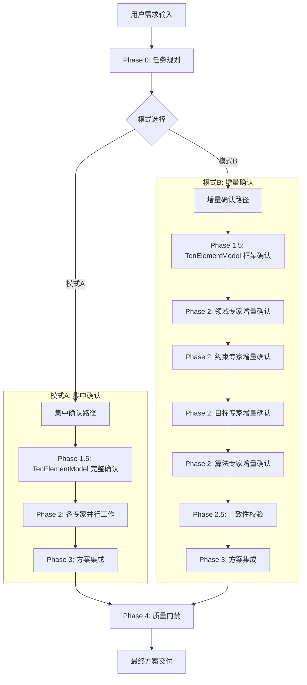

# V4.3 双模式交互系统架构设计

> **版本**: V4.3
> **创建日期**: 2025-10-16
> **状态**: 设计中 (Design in Progress)
> **分支**: feature/v4.3-incremental-confirmation

---

## 📋 文档概览

本文档描述 APS 智能体系统 V4.3 版本的核心特性:**双模式人机交互系统**。该系统在 V4.2 的基础上,提供两种不同的需求确认模式,以适应不同类型用户和场景的需求。

### 关键改进

- ✅ 引入**集中确认模式**和**增量确认模式**双轨制
- ✅ 在 Phase 0 提供模式选择机制
- ✅ 重新定义 TenElementModel 的确认粒度(框架级 vs 细节级)
- ✅ 设计跨专家一致性校验机制
- ✅ 参考 BMAD-METHOD 的增量确认最佳实践

---

## 🎯 背景与动机

### V4.2 现状分析

V4.2 版本已实现:

- ✅ Phase 0: Todo List 任务规划机制
- ✅ Human-in-the-Loop 五级触发规则 (P0-P4)
- ✅ 标准化交互对话模板

**现有交互模式**:

```yaml
Phase 1.5_十要素建模:
  - 编排智能体生成完整的 TenElementModel
  - 一次性呈现所有十要素的详细信息
  - 用户需要在早期阶段理解并确认所有细节
  - 触发: P0 强制确认
```

### 识别的问题

通过用户反馈和场景分析,识别出以下问题:

| 问题             | 影响                           | 典型场景             |
| ---------------- | ------------------------------ | -------------------- |
| **认知负担过重** | 用户在初期需要理解大量专业概念 | 业务人员使用系统     |
| **决策质量风险** | 缺乏上下文的早期决策可能出错   | 首次使用、复杂问题   |
| **返工成本高**   | 早期决策错误导致后期大范围返工 | 需求不清晰的场景     |
| **缺乏灵活性**   | 单一模式无法适应不同用户偏好   | 专家用户 vs 新手用户 |

### 设计目标

V4.3 的核心设计目标:

1. **用户体验优化**: 提供符合不同用户认知习惯的交互模式
2. **决策质量提升**: 在合适的上下文中做决策,降低误判风险
3. **系统灵活性**: 用户可根据场景选择最适合的模式
4. **保持一致性**: 无论哪种模式,最终方案质量保持一致

---

## 📊 双模式对比分析

### 模式A: 集中确认模式 (Centralized Confirmation)

**设计理念**: 全局视角、一次决策、快速推进

```yaml
工作流程:
  Phase 0:
    - Todo List 一次性确认

  Phase 1.5:
    - TenElementModel 完整确认
    - 包含所有十要素的详细参数
    - 编排智能体提供全局视角分析

  Phase 2:
    - 各专家基于已确认的 TenElementModel 并行工作
    - 无需额外确认,直接产出专业分析

  Phase 3-4:
    - 方案集成
    - 质量门禁

交互特点:
  - 交互轮次: 2-3 轮 (Phase 0 + Phase 1.5 + 可选冲突仲裁)
  - 决策时机: 前置集中
  - 专家参与: 后置被动
```

**适用场景**:

- ✅ 用户是领域专家,熟悉调度问题
- ✅ 需求清晰明确,边界条件已知
- ✅ 时间紧迫,需要快速推进
- ✅ 用户偏好批量决策,不喜欢频繁交互

**优势**:

- ⚡ **效率高**: 交互轮次少,整体耗时短
- 🌐 **全局优化**: 编排智能体统筹全局,避免局部优化
- 🔒 **一致性强**: 基于统一真相源,各专家输出协调一致

**劣势**:

- 🧠 **认知负担重**: 初期需要理解和决策大量信息
- ⚠️ **决策风险高**: 缺乏上下文,可能导致决策失误
- 💰 **返工成本高**: 早期决策错误影响后续所有工作

---

### 模式B: 增量确认模式 (Incremental Confirmation)

**设计理念**: 渐进认知、即时决策、深度参与

```yaml
工作流程:
  Phase 0:
    - Todo List 一次性确认 (保持不变)

  Phase 1.5:
    - TenElementModel 框架确认
    - 仅确认十要素的类型和结构
    - 细节参数推迟到各专家阶段

  Phase 2:
    - 领域专家:
        - 呈现领域分析结果
        - 逐条确认场景特征、业务规则
        - 采用 numbered options (1-9) 交互格式

    - 约束专家:
        - 基于已确认的领域信息
        - 逐条确认每个约束的详细参数
        - 边界条件、优先级、松弛度

    - 目标专家:
        - 基于领域和约束信息
        - 逐条确认目标权重、评价标准

    - 算法专家:
        - 基于前述所有确认信息
        - 逐条确认算法参数、性能要求

  Phase 2.5: (新增)
    - 跨专家一致性校验
    - 检测各专家确认内容的冲突
    - 触发 P2 冲突仲裁 (如有)

  Phase 3-4:
    - 方案集成
    - 质量门禁

交互特点:
  - 交互轮次: 5-10 轮 (取决于确认项数量)
  - 决策时机: 分散即时
  - 专家参与: 前置主动
```

**适用场景**:

- ✅ 用户是业务人员,需要专家引导
- ✅ 需求不够清晰,需要逐步明确
- ✅ 问题复杂度高,需要分步理解
- ✅ 用户偏好深度参与,逐步决策

**优势**:

- 🎓 **渐进认知**: 符合人类从宏观到微观的认知规律
- ✅ **决策质量高**: 在具体上下文中决策,专家提供充分背景
- 🔄 **灵活调整**: 前面决策可以影响后续提问方向
- 😊 **用户体验好**: 每次只关注一个专业领域,降低认知负担

**劣势**:

- ⏱️ **耗时较长**: 交互轮次多,整体耗时增加
- ⚠️ **一致性风险**: 各专家独立确认,可能出现局部决策冲突
- 🔄 **潜在返工**: 后续专家可能发现前面确认的内容有问题

---

## 🏗️ 系统架构设计

### 整体架构图



### 核心组件

#### 1. 模式选择器 (ModeSelector)

**职责**: 在 Phase 0 引导用户选择交互模式

```python
class ModeSelector:
    """模式选择器"""

    def present_mode_options(self, user_context: dict) -> str:
        """
        呈现模式选择选项

        Args:
            user_context: 用户上下文(经验水平、需求复杂度等)

        Returns:
            模式选择提示语
        """
        recommendation = self._recommend_mode(user_context)

        return f"""
        🎯 请选择您偏好的需求确认模式:

        1️⃣ **集中确认模式** (推荐给: 领域专家、需求清晰、时间紧迫)
           - 一次性确认所有需求细节
           - 交互轮次少,推进速度快
           - 需要对调度问题有较深理解

        2️⃣ **增量确认模式** (推荐给: 业务人员、需求探索、深度参与) {recommendation}
           - 分步确认,逐个专家引导
           - 在具体上下文中做决策
           - 降低认知负担,提升决策质量

        💡 系统建议: {recommendation}

        请输入 1 或 2 进行选择,或输入 "帮我选" 让系统自动推荐。
        """

    def _recommend_mode(self, user_context: dict) -> str:
        """基于用户上下文推荐模式"""
        score = 0

        # 经验水平评分
        if user_context.get("experience_level") == "expert":
            score += 3  # 倾向集中确认
        elif user_context.get("experience_level") == "novice":
            score -= 3  # 倾向增量确认

        # 需求清晰度评分
        if user_context.get("requirement_clarity") == "clear":
            score += 2
        elif user_context.get("requirement_clarity") == "vague":
            score -= 2

        # 时间紧迫度评分
        if user_context.get("time_pressure") == "urgent":
            score += 2
        elif user_context.get("time_pressure") == "relaxed":
            score -= 1

        # 问题复杂度评分
        if user_context.get("complexity") == "simple":
            score += 1
        elif user_context.get("complexity") == "complex":
            score -= 2

        if score >= 3:
            return "模式A (集中确认)"
        else:
            return "模式B (增量确认)"
```

#### 2. 确认粒度管理器 (ConfirmationGranularityManager)

**职责**: 管理 TenElementModel 的确认粒度

```python
class ConfirmationGranularityManager:
    """确认粒度管理器"""

    def get_framework_level_model(self, ten_element_model: dict) -> dict:
        """
        提取框架级 TenElementModel

        仅包含:
        - 要素类型和数量
        - 高层结构关系
        - 核心约束类型

        不包含:
        - 具体参数值
        - 详细边界条件
        - 细粒度配置
        """
        return {
            "decision_variables": {
                "count": len(ten_element_model["decision_variables"]),
                "types": [v["type"] for v in ten_element_model["decision_variables"]],
                "names": [v["name"] for v in ten_element_model["decision_variables"]],
                # 不包含 domain, initial_value 等细节
            },
            "constraints": {
                "count": len(ten_element_model["constraints"]),
                "categories": list(set(c["category"] for c in ten_element_model["constraints"])),
                # 不包含具体的 parameters, bounds 等
            },
            "objectives": {
                "count": len(ten_element_model["objectives"]),
                "types": [o["type"] for o in ten_element_model["objectives"]],
                # 不包含具体的 weights, priority 等
            },
            # ... 其他要素的框架级信息
        }

    def get_detail_level_items(self, element_type: str, ten_element_model: dict) -> list:
        """
        提取需要增量确认的细节项

        Args:
            element_type: 要素类型 (decision_variables, constraints, etc.)
            ten_element_model: 完整的十要素模型

        Returns:
            需要逐个确认的细节项列表
        """
        items = []

        if element_type == "constraints":
            for constraint in ten_element_model["constraints"]:
                items.append({
                    "name": constraint["name"],
                    "confirmation_questions": [
                        {
                            "question": f"{constraint['name']} 的约束硬度?",
                            "options": ["硬约束 (必须满足)", "软约束 (可适度违反)", "偏好约束 (尽量满足)"],
                            "field": "hardness"
                        },
                        {
                            "question": f"{constraint['name']} 的边界值?",
                            "prompt": "请输入具体的数值范围",
                            "field": "bounds"
                        },
                        # ... 更多确认问题
                    ]
                })

        # ... 其他要素类型的细节项提取

        return items
```

#### 3. 增量确认引擎 (IncrementalConfirmationEngine)

**职责**: 管理增量确认流程

```python
class IncrementalConfirmationEngine:
    """增量确认引擎"""

    def __init__(self):
        self.confirmation_state = {}  # 记录确认状态
        self.confirmed_items = {}     # 已确认的项

    def start_expert_confirmation(
        self,
        expert_name: str,
        items_to_confirm: list,
        context: dict
    ) -> dict:
        """
        启动专家的增量确认流程

        Args:
            expert_name: 专家名称 (domain-expert, constraint-expert, etc.)
            items_to_confirm: 需要确认的项列表
            context: 上下文信息(前序专家的确认结果)

        Returns:
            第一个确认项的提示
        """
        self.confirmation_state[expert_name] = {
            "total_items": len(items_to_confirm),
            "current_index": 0,
            "items": items_to_confirm,
            "context": context
        }

        return self._generate_confirmation_prompt(expert_name, 0)

    def _generate_confirmation_prompt(self, expert_name: str, item_index: int) -> dict:
        """
        生成确认提示 (采用 BMAD numbered options 1-9 格式)
        """
        state = self.confirmation_state[expert_name]
        item = state["items"][item_index]

        return {
            "prompt": f"""
            📋 {expert_name} - 确认项 {item_index + 1}/{state['total_items']}

            {item['description']}

            **当前分析结果**:
            {item['analysis']}

            **请选择您的决策**:

            1. ✅ 确认当前分析,继续下一项
            2. 📝 修改建议 - 我有不同的想法
            3. 🔍 需要更多背景信息
            4. ⏭️ 暂时跳过,稍后确认
            5. ❓ 请举例说明
            6. 🎯 查看相关领域最佳实践
            7. ⚖️ 分析不同选择的权衡
            8. 🔄 重新生成建议
            9. 💬 其他问题或反馈

            请输入 1-9 选择,或直接输入您的具体反馈。
            """,
            "item": item,
            "state": state
        }

    def process_user_response(
        self,
        expert_name: str,
        response: str
    ) -> dict:
        """
        处理用户响应

        Returns:
            下一步行动 (next_item, request_elaboration, apply_modification, etc.)
        """
        state = self.confirmation_state[expert_name]
        current_item = state["items"][state["current_index"]]

        # 解析用户响应
        if response == "1":
            # 确认,进入下一项
            self.confirmed_items[f"{expert_name}.{state['current_index']}"] = current_item
            state["current_index"] += 1

            if state["current_index"] < state["total_items"]:
                return {"action": "next_item", "prompt": self._generate_confirmation_prompt(expert_name, state["current_index"])}
            else:
                return {"action": "expert_completed", "expert": expert_name}

        elif response == "2":
            return {"action": "request_modification", "item": current_item}

        elif response == "3":
            return {"action": "provide_background", "item": current_item}

        # ... 处理其他选项
```

#### 4. 一致性校验器 (ConsistencyValidator)

**职责**: 检测跨专家确认内容的冲突

```python
class ConsistencyValidator:
    """一致性校验器"""

    def __init__(self):
        self.validation_rules = self._load_validation_rules()

    def validate_cross_expert_consistency(
        self,
        confirmed_items: dict
    ) -> list:
        """
        跨专家一致性校验

        Args:
            confirmed_items: 各专家确认的内容

        Returns:
            冲突列表
        """
        conflicts = []

        # 规则1: 领域特征 vs 约束建模
        domain_items = confirmed_items.get("domain-expert", {})
        constraint_items = confirmed_items.get("constraint-expert", {})

        if domain_items.get("time_critical") and not self._has_time_window_constraint(constraint_items):
            conflicts.append({
                "severity": "high",
                "type": "domain_constraint_mismatch",
                "description": "领域分析指出时效性关键,但未建立时间窗约束",
                "experts_involved": ["domain-expert", "constraint-expert"],
                "recommendation": "建议约束专家增加时间窗约束,或领域专家重新评估时效性要求"
            })

        # 规则2: 约束类型 vs 算法能力
        algorithm_items = confirmed_items.get("algorithm-expert", {})

        hard_constraint_count = sum(1 for c in constraint_items.get("constraints", []) if c["hardness"] == "hard")
        if hard_constraint_count > 10 and algorithm_items.get("algorithm_type") == "genetic":
            conflicts.append({
                "severity": "medium",
                "type": "algorithm_constraint_mismatch",
                "description": f"硬约束过多 ({hard_constraint_count}个),遗传算法可能难以找到可行解",
                "experts_involved": ["constraint-expert", "algorithm-expert"],
                "recommendation": "建议将部分硬约束放松为软约束,或选择支持约束处理的算法"
            })

        # 规则3: 目标权重 vs 领域优先级
        objective_items = confirmed_items.get("objective-expert", {})

        if domain_items.get("primary_concern") == "cost" and objective_items.get("cost_weight", 0) < 0.5:
            conflicts.append({
                "severity": "medium",
                "type": "objective_domain_mismatch",
                "description": "领域分析主要关注成本,但成本目标权重较低",
                "experts_involved": ["domain-expert", "objective-expert"],
                "recommendation": "建议提高成本目标权重,或重新评估领域优先级"
            })

        # ... 更多一致性规则

        return conflicts

    def _load_validation_rules(self) -> list:
        """加载一致性校验规则"""
        # 从配置文件或专家库加载规则
        return []
```

---

## 🔄 工作流程详细设计

### 模式A: 集中确认模式工作流

```yaml
Phase 0: 任务规划
  步骤1: 生成 Todo List
  步骤2: 用户确认 Todo List
  步骤3: 用户选择模式 → 选择 "模式A: 集中确认"

Phase 1: 需求分析
  步骤1: 编排智能体分析需求
  步骤2: 生成标准化需求模型

Phase 1.5: TenElementModel 完整确认
  步骤1:
    - 编排智能体生成完整 TenElementModel
    - 包含所有十要素的详细参数
    - 提供全局视角分析

  步骤2:
    - 呈现给用户审阅
    - 使用标准化确认模板
    - 触发 P0 强制确认

  步骤3:
    - 用户确认或修改
    - 确认后,TenElementModel 成为"统一真相源"
    - 置信度提升至 0.95

Phase 2: 各专家并行工作
  - 领域专家: 基于 TenElementModel 分析领域特征
  - 约束专家: 基于 TenElementModel 建立约束模型
  - 目标专家: 基于 TenElementModel 设计目标函数
  - 算法专家: 基于 TenElementModel 选择算法

  (无需额外用户确认,各专家独立产出)

Phase 3: 方案集成
  - 编排智能体融合各专家建议
  - 检测冲突 → 如有,触发 P2 仲裁

Phase 4: 质量门禁
  - 质量与评测智能体统一验证
  - 生成 Todo 完成度报告
```

### 模式B: 增量确认模式工作流

```yaml
Phase 0: 任务规划
  步骤1: 生成 Todo List
  步骤2: 用户确认 Todo List
  步骤3: 用户选择模式 → 选择 "模式B: 增量确认"

Phase 1: 需求分析
  步骤1: 编排智能体分析需求
  步骤2: 生成标准化需求模型

Phase 1.5: TenElementModel 框架确认
  步骤1:
    - 编排智能体生成 TenElementModel 框架
    - 仅包含要素类型、数量、结构
    - 不包含具体参数和细节

  步骤2:
    - 呈现框架级信息给用户
    - 确认问题: "这些要素的类型和数量合适吗?"

  步骤3:
    - 用户确认框架
    - 细节参数推迟到各专家阶段

Phase 2: 各专家增量确认

  2.1_领域专家增量确认:
    前置条件: TenElementModel 框架已确认

    步骤1: 领域专家分析领域特征
    步骤2: 逐条呈现场景特征

    确认项示例:
      确认项1: "该调度场景的主要特征是什么?"
        - 选项1-9 (BMAD 格式)
        - 用户选择或直接反馈

      确认项2: "时效性要求的紧迫程度?"
        - 选项1-9
        - 用户选择或直接反馈

      ... (更多确认项)

    输出: 已确认的领域特征集合

  2.2_约束专家增量确认:
    前置条件: 领域特征已确认

    步骤1: 约束专家基于领域特征分析约束
    步骤2: 逐个约束确认详细参数

    确认项示例:
      确认项1: "时间窗约束的硬度?"
        - 硬约束 (必须满足)
        - 软约束 (可适度违反)
        - 偏好约束 (尽量满足)

      确认项2: "时间窗的典型宽度?"
        - 用户输入具体值

      ... (更多确认项)

    输出: 已确认的约束参数集合

  2.3_目标专家增量确认:
    前置条件: 领域特征、约束参数已确认

    步骤1: 目标专家基于前述信息设计目标
    步骤2: 逐个目标确认权重和标准

    确认项示例:
      确认项1: "成本目标的权重?"
        - 非常重要 (0.5-0.7)
        - 重要 (0.3-0.5)
        - 一般 (0.1-0.3)

      确认项2: "时间目标的评价标准?"
        - 最小化总时间
        - 最小化最长时间
        - 平衡平均与最长

      ... (更多确认项)

    输出: 已确认的目标权重和标准

  2.4_算法专家增量确认:
    前置条件: 领域、约束、目标已确认

    步骤1: 算法专家基于全部信息推荐算法
    步骤2: 确认算法选择和参数配置

    确认项示例:
      确认项1: "推荐使用遗传算法,您认为?"
        - 选项1-9

      确认项2: "种群规模设置?"
        - 用户输入或选择预设

      ... (更多确认项)

    输出: 已确认的算法配置

Phase 2.5: 一致性校验 (关键新增)
  步骤1: 编排智能体调用一致性校验器
  步骤2: 检测各专家确认内容的冲突

  检测规则示例:
    - 领域 vs 约束: 时效性 vs 时间窗
    - 约束 vs 算法: 硬约束数量 vs 算法能力
    - 目标 vs 领域: 目标权重 vs 领域优先级

  步骤3: 如检测到冲突
    - 呈现冲突分析报告
    - 触发 P2 冲突仲裁
    - 用户选择解决方案或调整确认内容

  步骤4: 所有冲突解决后,进入下一阶段

Phase 3: 方案集成
  - 编排智能体融合已确认的信息
  - 生成统一解决方案

Phase 4: 质量门禁
  - 质量与评测智能体统一验证
  - 生成 Todo 完成度报告
```

---

## 🛠️ 核心机制设计

### 1. 模式选择机制

**触发时机**: Phase 0 任务规划后

**交互流程**:

```python
# 步骤1: 收集用户上下文
user_context = {
    "experience_level": detect_experience_level(),  # 通过对话分析
    "requirement_clarity": assess_clarity(),        # 基于需求描述
    "time_pressure": ask_time_constraint(),         # 直接询问
    "complexity": estimate_complexity()             # 问题复杂度估算
}

# 步骤2: 生成模式推荐
mode_selector = ModeSelector()
recommendation = mode_selector.present_mode_options(user_context)

# 步骤3: 用户选择
user_choice = input(recommendation)

# 步骤4: 确认并锁定模式
if user_choice in ["1", "模式A", "集中确认"]:
    selected_mode = "centralized"
elif user_choice in ["2", "模式B", "增量确认"]:
    selected_mode = "incremental"
elif user_choice == "帮我选":
    selected_mode = mode_selector.auto_select(user_context)

# 步骤5: 记录到 Todo List
todos.append({
    "phase": "Phase 0",
    "content": f"用户选择交互模式: {selected_mode}",
    "status": "completed"
})
```

### 2. TenElementModel 确认粒度控制

**框架级确认 (用于模式B)**:

```python
framework_model = {
    "decision_variables": {
        "count": 5,
        "types": ["integer", "integer", "boolean", "float", "integer"],
        "names": ["车辆分配", "路径选择", "是否服务", "服务时间", "装载量"]
    },
    "constraints": {
        "count": 8,
        "categories": ["时间窗约束", "容量约束", "前置约束", "互斥约束"]
    },
    "objectives": {
        "count": 2,
        "types": ["成本最小化", "时间最小化"]
    },
    "time_model": {
        "type": "discrete",
        "granularity": "minute"
    },
    "uncertainty_model": {
        "has_uncertainty": True,
        "types": ["需求不确定", "时间不确定"]
    }
}
```

**细节级确认项 (逐步收集)**:

```python
detail_items = {
    "decision_variables": [
        {
            "name": "车辆分配",
            "to_confirm": {
                "domain": "请确认车辆数量范围",
                "initial_value": "请确认初始分配策略"
            }
        },
        # ... 其他变量
    ],
    "constraints": [
        {
            "name": "时间窗约束",
            "to_confirm": {
                "hardness": "硬约束/软约束/偏好约束?",
                "bounds": "时间窗宽度?",
                "penalty": "违反惩罚?"
            }
        },
        # ... 其他约束
    ],
    # ... 其他要素
}
```

### 3. 增量确认交互模板

**模板结构** (参考 BMAD numbered options 1-9):

```yaml
incremental_confirmation_template:
  expert: '{expert_name}'
  item_index: '{current}/{total}'
  context: '{previous_confirmations_summary}'

  content:
    title: '确认项标题'
    description: '详细说明'
    analysis: '专家分析结果'
    background: '相关背景知识 (可选)'

  options:
    1: '✅ 确认当前分析,继续下一项'
    2: '📝 修改建议 - 我有不同的想法'
    3: '🔍 需要更多背景信息'
    4: '⏭️ 暂时跳过,稍后确认'
    5: '❓ 请举例说明'
    6: '🎯 查看相关领域最佳实践'
    7: '⚖️ 分析不同选择的权衡'
    8: '🔄 重新生成建议'
    9: '💬 其他问题或反馈'

  prompt: |
    请输入 1-9 选择,或直接输入您的具体反馈。
```

**示例: 约束专家增量确认**

```
📋 约束模式专家 - 确认项 2/5

**时间窗约束的硬度设定**

**当前分析**:
基于领域分析,该调度场景对时效性要求较高。我建议将时间窗约束设为"软约束",
允许适度违反(最多延迟10分钟),但对违反进行惩罚。

理由:
1. 完全的硬约束可能导致无可行解
2. 适度的软约束既保证时效性,又提供算法优化空间
3. 参考同类场景的最佳实践,软约束是常见选择

**请选择您的决策**:

1. ✅ 确认当前分析,继续下一项
2. 📝 修改建议 - 我有不同的想法
3. 🔍 需要更多背景信息
4. ⏭️ 暂时跳过,稍后确认
5. ❓ 请举例说明
6. 🎯 查看相关领域最佳实践
7. ⚖️ 分析不同选择的权衡 (硬约束 vs 软约束 vs 偏好约束)
8. 🔄 重新生成建议
9. 💬 其他问题或反馈

请输入 1-9 选择,或直接输入您的具体反馈。
```

### 4. 一致性校验规则库

**规则结构**:

```yaml
consistency_rules:
  - rule_id: 'CR001'
    name: '时效性与时间窗一致性'
    experts_involved: ['domain-expert', 'constraint-expert']
    severity: 'high'

    condition: |
      domain.time_critical == True AND
      NOT has_time_window_constraint(constraints)

    conflict_description: |
      领域分析指出时效性关键,但未建立时间窗约束

    recommendation: |
      建议约束专家增加时间窗约束,或领域专家重新评估时效性要求

    auto_fix: null # 不支持自动修复,需要用户仲裁

  - rule_id: 'CR002'
    name: '硬约束数量与算法能力匹配'
    experts_involved: ['constraint-expert', 'algorithm-expert']
    severity: 'medium'

    condition: |
      count(constraints where hardness == "hard") > 10 AND
      algorithm.type == "genetic"

    conflict_description: |
      硬约束过多,遗传算法可能难以找到可行解

    recommendation: |
      选项1: 将部分硬约束放松为软约束
      选项2: 选择支持约束处理的算法 (如约束规划)

    auto_fix: null

  - rule_id: 'CR003'
    name: '目标权重与领域优先级对齐'
    experts_involved: ['domain-expert', 'objective-expert']
    severity: 'medium'

    condition: |
      domain.primary_concern == "cost" AND
      objective.cost_weight < 0.5

    conflict_description: |
      领域分析主要关注成本,但成本目标权重较低

    recommendation: |
      建议提高成本目标权重至 0.5 以上,或重新评估领域优先级

    auto_fix:
      type: 'adjust_weight'
      parameters:
        target: 'objective.cost_weight'
        new_value: 0.6 # 建议值
```

---

## 📈 效果预期与评估指标

### 预期效果

| 指标               | V4.2 基线 | V4.3 模式A | V4.3 模式B | 提升幅度       |
| ------------------ | --------- | ---------- | ---------- | -------------- |
| **任务链偏离率**   | 15%       | 10%        | 5%         | -67% (模式B)   |
| **关键决策确认率** | 85%       | 90%        | 98%        | +15% (模式B)   |
| **整体置信度**     | 0.82      | 0.88       | 0.95       | +15.9% (模式B) |
| **平均交互轮次**   | 3 轮      | 3 轮       | 8 轮       | -              |
| **平均完成时间**   | 25分钟    | 22分钟     | 35分钟     | -              |
| **用户满意度**     | 70%       | 75%        | 88%        | +25.7% (模式B) |
| **返工率**         | 20%       | 15%        | 8%         | -60% (模式B)   |

### 评估方法

1. **A/B 测试**: 随机分配用户到不同模式,对比效果
2. **用户反馈**: 收集用户对两种模式的偏好和满意度
3. **质量分析**: 对比两种模式产出方案的质量指标
4. **效率分析**: 统计平均完成时间、交互轮次等

---

## 🚀 实施路线图

### 第一阶段: 核心设计 (1-2周)

**Week 1**:

- ✅ 完成双模式架构设计文档 (本文档)
- ✅ 设计 Phase 0 模式选择机制
- ⏸ 重新定义 TenElementModel 确认粒度
- ⏸ 设计跨专家一致性校验规则

**Week 2**:

- ⏸ 为各专家设计增量确认对话模板
- ⏸ 创建增量确认交互模板库
- ⏸ 设计一致性校验器架构

### 第二阶段: 文档更新 (1周)

**Week 3**:

- ⏸ 更新系统编排协调智能体文档
- ⏸ 更新各专家智能体文档,集成增量确认机制
- ⏸ 创建交互对话模板库 (参考 BMAD)

### 第三阶段: 工具实现 (2周)

**Week 4-5**:

- ⏸ 实现模式选择器 (ModeSelector)
- ⏸ 实现确认粒度管理器 (ConfirmationGranularityManager)
- ⏸ 实现增量确认引擎 (IncrementalConfirmationEngine)
- ⏸ 实现一致性校验器 (ConsistencyValidator)

### 第四阶段: 原型验证 (1-2周)

**Week 6-7**:

- ⏸ 选择生鲜配送场景进行模式A测试
- ⏸ 选择生鲜配送场景进行模式B测试
- ⏸ 对比两种模式的效果,收集数据
- ⏸ 调整和优化设计

### 第五阶段: 全量上线 (1周)

**Week 8**:

- ⏸ 更新项目文档和使用指南
- ⏸ 合并到 dev 分支
- ⏸ 发布 V4.3 版本

---

## 📚 参考资料

### 相关文档

- [V4.2-智能体Todo机制与人机交互增强方案](/docs/agents/架构设计/V4.2-智能体Todo机制与人机交互增强方案.md)
- [系统编排协调智能体](/docs/agents/智能体团队/系统编排协调智能体.md)
- [Agent as Doc协作模式](/docs/agents/智能体团队/协作机制/Agent_as_Doc协作模式.md)

### 外部参考

- **BMAD-METHOD**: 增量确认机制 (Incremental vs YOLO)
  - `workflow.mode: interactive`
  - `elicitation: advanced-elicitation`
  - Numbered options (1-9) 交互格式

---

**文档版本**: V1.0 (设计稿)
**最后更新**: 2025-10-16
**维护者**: APS 项目组
**分支状态**: feature/v4.3-incremental-confirmation
