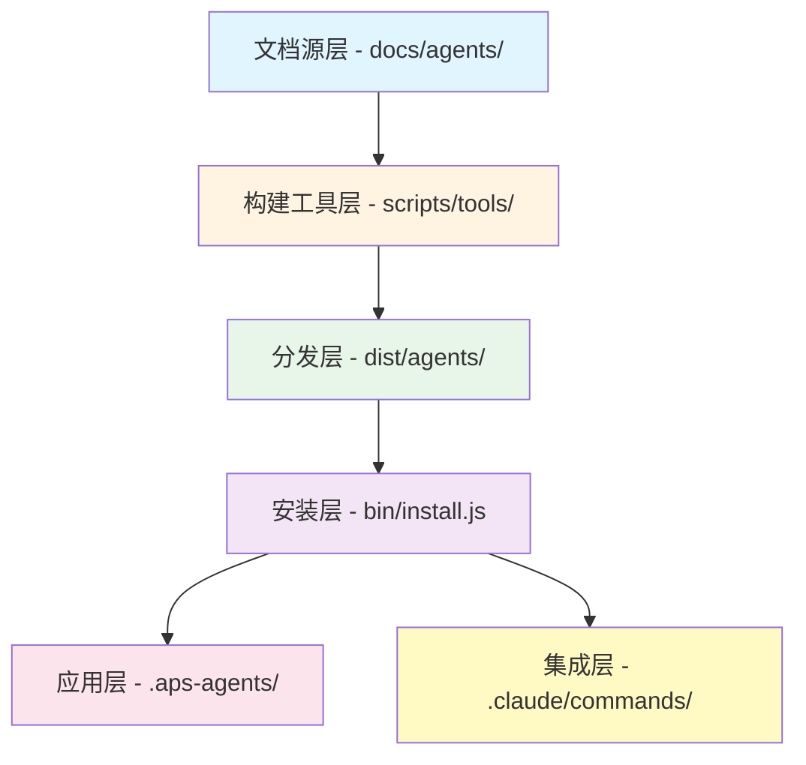
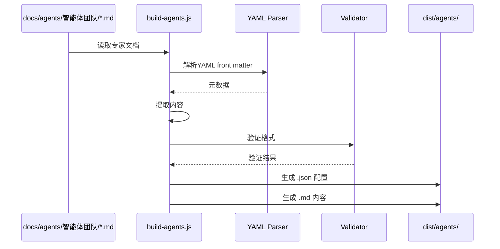
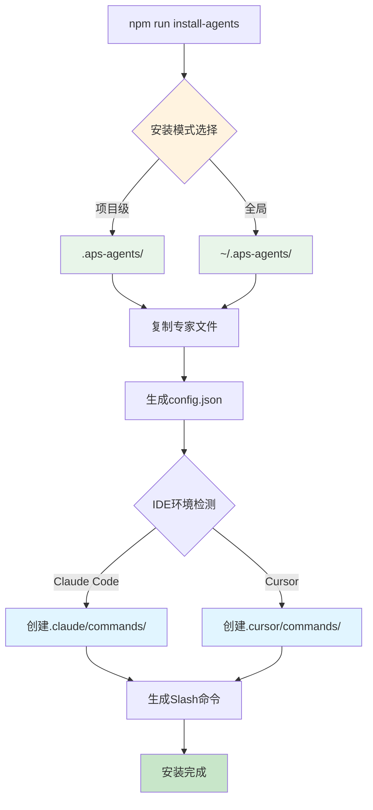
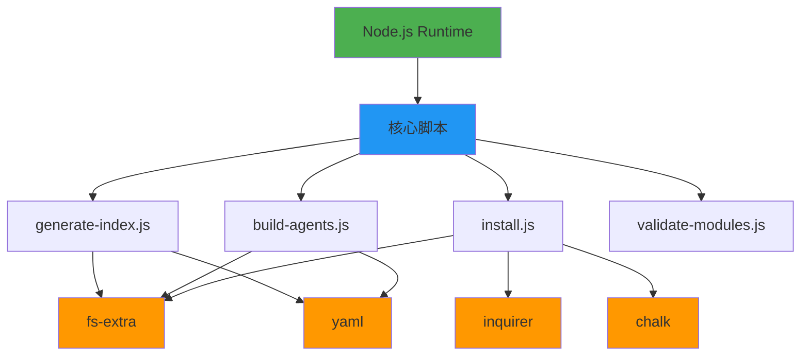
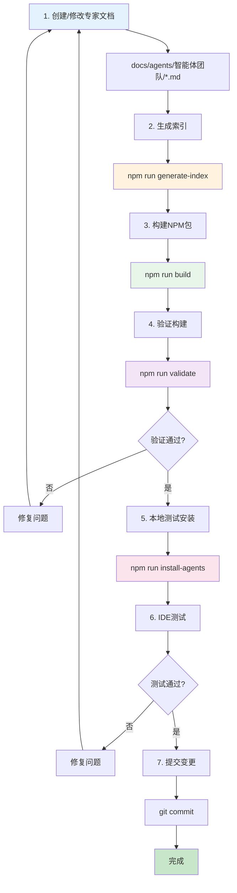

# 专家库文档工程化架构

## 📋 文档信息

| 项目         | 内容                                         |
| ------------ | -------------------------------------------- |
| **文档标题** | APS Scheduling Agents - 专家库文档工程化架构 |
| **架构版本** | V4.1 "Knowledge Factory"                     |
| **创建日期** | 2025-10-04                                   |
| **最后更新** | 2025-10-04                                   |
| **架构师**   | Winston (Architect Agent)                    |
| **状态**     | 活跃开发                                     |

## 📖 变更记录

| 日期       | 版本  | 描述                            | 作者    |
| ---------- | ----- | ------------------------------- | ------- |
| 2025-10-04 | 1.0.0 | 初始版本 - 专家库工程化架构文档 | Winston |

---

## 🎯 架构概述

### 1.1 系统定位

**APS Scheduling Agents** 是一个基于 **Agent as Document** 理念的专家知识库工程化系统，实现了从文档源到工程化项目、再到IDE集成的完整工程化流程。

### 1.2 核心价值

- **📚 知识文档化**：将调度算法专家知识组织为结构化文档
- **🔄 工程化转换**：自动将文档转换为可分发的NPM包
- **📦 标准化分发**：遵循bmad-method模式的安装和分发规范
- **🔌 IDE无缝集成**：支持Claude Code、Cursor等主流AI编码工具

### 1.3 设计理念

| 理念                  | 说明                       | 实现方式                     |
| --------------------- | -------------------------- | ---------------------------- |
| **Agent as Doc**      | 智能体即文档，文档即智能体 | 专家能力通过Markdown文档定义 |
| **Theory to Code**    | 理论知识直接指导代码生成   | V4.0架构支持可执行化文档     |
| **Knowledge Factory** | 知识工厂式模块化生产       | V4.1模块化架构，87%文件精简  |
| **bmad Pattern**      | 遵循bmad-method设计模式    | 隐藏目录安装、IDE命令集成    |

---

## 🏗️ 总体架构

### 2.1 架构层次



### 2.2 系统组件

| 层次              | 目录/组件            | 职责                     | 技术栈             |
| ----------------- | -------------------- | ------------------------ | ------------------ |
| **L1 - 文档源**   | `docs/agents/`       | 专家知识库文档管理       | Markdown + YAML    |
| **L2 - 构建工具** | `scripts/`, `tools/` | 文档转换、索引生成、验证 | Node.js            |
| **L3 - 分发层**   | `dist/agents/`       | NPM包分发格式            | JSON + Markdown    |
| **L4 - 安装层**   | `bin/install.js`     | 项目/全局安装逻辑        | Node.js + Inquirer |
| **L5 - 应用层**   | `.aps-agents/`       | 安装后的专家库           | 运行时资源         |
| **L6 - 集成层**   | `.claude/commands/`  | IDE Slash命令            | IDE配置文件        |

---

## 📚 文档组织规范

### 3.1 文档源目录结构

```
docs/agents/
├── README.md                          # 专家库总览
├── EXPERT_FORMAT_STANDARD.md          # 专家文档格式规范
│
├── 智能体团队/                         # 核心专家智能体
│   ├── README.md
│   ├── 调度算法专家智能体.md           # V4.0 完整版
│   ├── 调度算法专家智能体.md      # V4.1 模块化版
│   ├── 约束模式专家智能体.md
│   ├── 目标优化专家智能体.md
│   ├── 领域应用专家智能体.md
│   ├── 系统编排协调智能体.md
│   └── 算法知识库扩展指导智能体.md
│
├── 专家库/                            # V4.1 技能库模块
│   ├── 模块文件模板.md                # 模块标准模板
│   ├── 调度算法专家库/
│   │   ├── 精确算法/
│   │   │   ├── 分支定界法.md
│   │   │   ├── 动态规划.md
│   │   │   └── 整数规划.md
│   │   ├── 启发式算法/
│   │   │   ├── 贪心算法.md
│   │   │   ├── 局部搜索.md
│   │   │   └── 构造启发式.md
│   │   ├── 元启发式算法/
│   │   │   ├── 遗传算法.md
│   │   │   ├── 模拟退火.md
│   │   │   └── 蚁群算法.md
│   │   ├── 混合算法/
│   │   │   └── 精确启发式混合.md
│   │   └── 基础知识/
│   │       └── 算法复杂度分析.md
│   ├── 约束模式专家库/
│   ├── 目标函数专家库/
│   └── 领域应用专家库/
│
├── 架构设计/                          # 架构设计文档
│   ├── V4.0横向扩展能力设计文档.md
│   ├── V4.1模块化架构设计文档.md
│   ├── V4.1实施总结.md
│   ├── V4.1迁移指南.md
│   ├── V4.1-Node.js工具链迁移报告.md
│   ├── 专家库Agent设计哲学.md
│   └── 专家库文档工程化架构.md      # 本文档
│
├── 技术规范/
│   ├── 动态Agent实例化机制.md
│   └── 知识库模块化接口规范.md
│
└── 使用指南/
    └── 模板化Agent使用指南.md
```

### 3.2 文档命名规范

| 文档类型     | 命名规范                      | 示例                           |
| ------------ | ----------------------------- | ------------------------------ |
| **核心专家** | `{专家角色}智能体.md`         | `调度算法专家智能体.md`        |
| **版本变体** | `{专家角色}智能体_V{版本}.md` | `调度算法专家智能体.md`        |
| **技能模块** | `{技能名称}.md`               | `遗传算法.md`, `时间窗约束.md` |
| **架构文档** | `{描述}.md`                   | `V4.1模块化架构设计文档.md`    |

### 3.3 文档元数据规范 (YAML Front Matter)

每个专家文档必须包含YAML front matter：

```yaml
---
expert_name: 调度算法专家智能体
expert_id: algorithm-expert
version: 4.1.0
category: theory-design
layer: 1
last_updated: 2025-10-04
architecture: Knowledge-Factory
dependencies:
  - type: library
    name: 调度算法专家库
    path: 专家库/调度算法专家库
status: active
supported_ides:
  - claude-code
  - cursor
  - windsurf
---
```

### 3.4 V4.0 vs V4.1 架构差异

#### V4.0 "Theory-to-Code" 架构

**特点**：

- ✅ 智能体 = 完整的知识文档
- ✅ 单文件包含所有专业知识
- ⚠️ 文件规模大（3000+ 行）
- ⚠️ 扩展需修改主文件

**文件结构**：

```markdown
# 调度算法专家智能体.md (3000+ 行)

├── 角色定义
├── 核心能力
├── 工作流程
├── 算法模板1 (完整内容)
├── 算法模板2 (完整内容)
├── ... (所有算法)
└── 质量标准
```

#### V4.1 "Knowledge Factory" 架构

**特点**：

- ✅ 主文件精简 87% (400行)
- ✅ 模块化技能库
- ✅ 按需加载知识模块
- ✅ 扩展只需添加新文件

**文件结构**：

```markdown
# 调度算法专家智能体.md (400 行)

├── 角色定义
├── 核心能力框架
├── 工作流程
└── 技能库索引
└── 引用: @专家库/调度算法专家库/\*_/_.md

# 专家库/调度算法专家库/元启发式算法/遗传算法.md (600 行)

├── 算法概述
├── 理论基础
├── 实现步骤
├── 参数配置
└── 应用场景
```

**核心优势对比**：

| 维度       | V4.0       | V4.1       | 提升           |
| ---------- | ---------- | ---------- | -------------- |
| 主文件大小 | 3000+ 行   | 400 行     | **87% 精简**   |
| Token消耗  | 全量加载   | 按需加载   | **81% 节省**   |
| 扩展方式   | 修改主文件 | 添加新文件 | **零冲突**     |
| 协作能力   | 串行编辑   | 并行开发   | **多人协作**   |
| 自动化程度 | 手工维护   | 自动索引   | **90% 自动化** |

---

## 🔄 工程化转换流程

### 4.1 构建流程架构


### 4.2 核心构建工具

#### 4.2.1 `generate-index.js` - 专家库索引生成器

**功能**：

- 自动扫描 `docs/agents/专家库/` 目录
- 生成每个专家库的完整索引
- 更新主文件中的技能库引用

**执行方式**：

```bash
# 生成所有专家库索引
npm run generate-index

# 预览单个专家库索引
npm run generate-index:preview
```

**生成的索引格式**：

```markdown
## 📚 调度算法专家库索引

### 精确算法 (3 个模块)

- @专家库/调度算法专家库/精确算法/分支定界法.md
- @专家库/调度算法专家库/精确算法/动态规划.md
- @专家库/调度算法专家库/精确算法/整数规划.md

### 启发式算法 (3 个模块)

- @专家库/调度算法专家库/启发式算法/贪心算法.md
- @专家库/调度算法专家库/启发式算法/局部搜索.md
- @专家库/调度算法专家库/启发式算法/构造启发式.md

### 元启发式算法 (3 个模块)

- @专家库/调度算法专家库/元启发式算法/遗传算法.md
- @专家库/调度算法专家库/元启发式算法/模拟退火.md
- @专家库/调度算法专家库/元启发式算法/蚁群算法.md

**📊 统计信息**

- 总模块数: 12
- 分类数: 5
- 最后更新: 2025-10-04
```

#### 4.2.2 `build-agents.js` - 文档格式转换器

**功能**：

- 将 `docs/agents/智能体团队/*.md` 转换为标准格式
- 生成 `.json` 配置文件和 `.md` 内容文件
- 输出到 `dist/agents/` 目录
- 遵循 bmad-method 分发规范

**关键配置**：

```javascript
// scripts/build-agents.js
const config = {
  sourceDir: '../docs/agents/智能体团队',
  targetDir: '../aps-scheduling-agents/dist/agents',
  templateDir: 'templates',
  validationEnabled: true,
};
```

**转换流程**：



**生成的文件格式**：

**配置文件** (`调度算法专家智能体.json`):

```json
{
  "expert_name": "调度算法专家智能体",
  "expert_id": "algorithm-expert",
  "version": "4.1.0",
  "category": "theory-design",
  "layer": 1,
  "command": "/aps-algorithm",
  "dependencies": [
    {
      "type": "library",
      "name": "调度算法专家库",
      "path": "专家库/调度算法专家库"
    }
  ],
  "supported_ides": ["claude-code", "cursor", "windsurf"]
}
```

**内容文件** (`调度算法专家智能体.md`):

```markdown
# 调度算法专家智能体

## 角色定义

[完整的专家角色描述]

## 核心能力

[能力框架定义]

## 技能库索引

[自动生成的库索引]

## 工作流程

[操作流程说明]
```

#### 4.2.3 其他核心工具

| 工具                    | 功能                       | 执行命令                   |
| ----------------------- | -------------------------- | -------------------------- |
| **split-modules.js**    | 将V4.0单文件拆分为V4.1模块 | `npm run split-modules`    |
| **validate-modules.js** | 验证模块完整性和引用正确性 | `npm run validate-modules` |
| **update-refs.js**      | 批量更新模块引用路径       | `npm run update-refs`      |

### 4.3 构建执行流程

**完整构建命令**：

```bash
# 1. 生成所有专家库索引
npm run generate-index

# 2. 构建NPM包
npm run build

# 3. 验证构建结果
npm run validate
```

**构建输出**：

```
aps-scheduling-agents/dist/agents/
├── config.json                           # 全局配置
├── templates/                            # 模板目录
├── 调度算法专家智能体.json
├── 调度算法专家智能体.md
├── 调度算法专家智能体.json
├── 调度算法专家智能体.md
├── 约束模式专家智能体.json
├── 约束模式专家智能体.md
├── 目标优化专家智能体.json
├── 目标优化专家智能体.md
├── 领域应用专家智能体.json
├── 领域应用专家智能体.md
├── 系统编排协调智能体.json
├── 系统编排协调智能体.md
├── 算法知识库扩展指导智能体.json
└── 算法知识库扩展指导智能体.md
```

**全局配置** (`config.json`):

```json
{
  "version": "4.0",
  "type": "theory-to-code",
  "build_time": "2025-10-04T06:50:10.705Z",
  "experts": [
    {
      "name": "调度算法专家智能体",
      "category": "theory-design",
      "layer": 1
    },
    {
      "name": "调度算法专家智能体",
      "category": "expert-agent",
      "layer": 1
    }
  ],
  "architecture": {
    "layers": {
      "1": "theory-design",
      "2": "implementation",
      "3": "quality-assurance"
    },
    "workflow": "theory → implementation → quality → deployment"
  }
}
```

---

## 📦 NPM包分发规范

### 5.1 包结构设计

遵循 **bmad-method** 标准模式：

```
aps-scheduling-agents/
├── package.json              # NPM包配置
├── README.md                 # 包说明文档
├── INSTALL.md               # 安装指南
├── LICENSE                  # 开源协议
│
├── bin/                     # 可执行脚本
│   └── install.js           # 安装脚本（核心）
│
├── dist/                    # 分发目录（发布到NPM）
│   └── agents/              # 专家文件
│       ├── config.json
│       ├── *.json           # 专家配置
│       ├── *.md             # 专家内容
│       └── templates/       # 模板文件
│
├── scripts/                 # 辅助脚本
│   └── validate.js
│
└── docs/                    # 包文档
    └── usage-guide.md
```

### 5.2 package.json 配置

**核心字段**：

```json
{
  "name": "aps-scheduling-agents",
  "version": "1.0.0",
  "description": "Professional Scheduling Algorithm Expert Agents - V4.0 Theory-to-Code Architecture",

  "main": "bin/install.js",

  "bin": {
    "aps-scheduling-agents": "bin/install.js"
  },

  "scripts": {
    "install-agents": "node bin/install.js",
    "build": "npm run build-v4.1",
    "build-v4.1": "npm run generate-index && node ../scripts/build-agents.js",
    "generate-index": "node ../tools/generate-index.js --all",
    "validate": "node scripts/validate.js"
  },

  "keywords": ["scheduling", "algorithms", "optimization", "agent-as-doc", "ai-agents", "claude-code", "cursor"],

  "aps-agents": {
    "version": "4.0.0",
    "architecture": "Theory-to-Code",
    "core-agents": ["system-orchestrator", "algorithm-expert", "constraint-expert", "objective-expert", "domain-expert"],
    "expansion-agents": ["algorithm-knowledge-expansion-guide"],
    "supported-ides": ["claude-code", "cursor", "windsurf"]
  },

  "files": ["bin/", "dist/", "templates/", "docs/", "scripts/", "README.md", "LICENSE"],

  "dependencies": {
    "chalk": "^4.1.2",
    "fs-extra": "^11.0.0",
    "inquirer": "^8.2.6",
    "yaml": "^2.8.1"
  }
}
```

### 5.3 NPM发布流程

```bash
# 1. 构建包
npm run build

# 2. 验证包内容
npm run validate

# 3. 发布到NPM (未来)
npm publish
```

---

## 🔧 安装机制设计

### 6.1 安装架构



### 6.2 安装脚本核心逻辑 (`bin/install.js`)

**功能模块**：

```javascript
class ApsAgentInstaller {
  constructor() {
    this.projectDir = process.cwd();
    this.homeDir = os.homedir();
    this.installDir = null; // 项目级安装路径
    this.globalInstallDir = null; // 全局安装路径
  }

  // 1. 安装模式选择
  async selectInstallMode() {
    const answers = await inquirer.prompt([
      {
        type: 'list',
        name: 'mode',
        message: '选择安装模式：',
        choices: [
          { name: '项目级安装 (推荐)', value: 'project' },
          { name: '全局安装', value: 'global' },
        ],
      },
    ]);
    return answers.mode;
  }

  // 2. IDE环境检测
  detectIDEEnvironment() {
    const ides = {
      claudeCode: fs.existsSync(path.join(this.projectDir, '.claude')),
      cursor: fs.existsSync(path.join(this.projectDir, '.cursor')),
    };
    return ides;
  }

  // 3. 复制专家文件
  async copyAgentFiles() {
    const sourceDir = path.join(__dirname, '../dist/agents');
    const targetDir = path.join(this.installDir, 'agents');

    await fs.copy(sourceDir, targetDir);
  }

  // 4. 生成配置文件
  async generateConfig() {
    const config = {
      version: '4.0',
      installMode: this.mode,
      installPath: this.installDir,
      installTime: new Date().toISOString(),
      environment: this.ides,
      experts: {
        systemOrchestrator: { enabled: true, command: '/aps-orchestrator' },
        algorithmExpert: { enabled: true, command: '/aps-algorithm' },
        // ...
      },
    };

    await fs.writeJson(path.join(this.installDir, 'config.json'), config, { spaces: 2 });
  }

  // 5. 创建IDE命令
  async createIDECommands() {
    if (this.ides.claudeCode) {
      await this.createClaudeCodeCommands();
    }
    if (this.ides.cursor) {
      await this.createCursorCommands();
    }
  }

  // 6. Claude Code命令映射
  async createClaudeCodeCommands() {
    const commandsDir = path.join(this.projectDir, '.claude', 'commands');
    await fs.ensureDir(commandsDir);

    const commandMappings = {
      系统编排协调智能体: 'aps-orchestrator',
      调度算法专家智能体: 'aps-algorithm',
      约束模式专家智能体: 'aps-constraint',
      目标优化专家智能体: 'aps-objective',
      领域应用专家智能体: 'aps-domain',
      算法知识库扩展指导智能体: 'aps-expansion',
    };

    for (const [expertName, commandName] of Object.entries(commandMappings)) {
      const sourceFile = path.join(this.installDir, 'agents', `${expertName}.md`);
      const commandFile = path.join(commandsDir, `${commandName}.md`);

      if (await fs.pathExists(sourceFile)) {
        await fs.copy(sourceFile, commandFile);
      }
    }
  }
}
```

### 6.3 安装执行流程

**交互式安装**：

```bash
$ npm run install-agents

🚀 APS Scheduling Agents - 安装向导

? 选择安装模式：
❯ 项目级安装 (推荐)
  全局安装

? 选择IDE环境：
 ✓ Claude Code
 ✓ Cursor

? 选择要安装的专家：
 ✓ 系统编排协调智能体
 ✓ 调度算法专家智能体
 ✓ 约束模式专家智能体
 ✓ 目标优化专家智能体
 ✓ 领域应用专家智能体
 ✓ 算法知识库扩展指导智能体

⏳ 开始安装...
  ✓ 专家智能体文件已复制
  ✓ Claude Code命令已注册 (.claude/commands)
  ✓ Cursor命令已注册 (.cursor/commands)
  ✓ 配置文件已生成

✅ 安装完成！

📁 智能体已安装到: /project/.aps-agents
📋 配置文件: /project/.aps-agents/config.json

🎯 下一步:
  - Claude Code: 使用 /aps-orchestrator 调用智能体
  - Cursor: 使用 @aps-orchestrator 调用智能体
```

**自动化安装**：

```bash
$ npm run install-agents -- --auto

🚀 APS Scheduling Agents - 自动安装模式

📦 安装模式: 项目级
📍 安装路径: /project/.aps-agents
🎯 IDE环境: Claude Code + Cursor
👥 专家智能体: 全部安装 (6个核心专家)

⏳ 开始安装...
  ✓ 专家智能体文件已复制
  ✓ Claude Code命令已注册 (.claude/commands)
  ✓ 配置文件已生成

✅ 安装完成！
```

### 6.4 安装后目录结构

**项目级安装**：

```
project/
├── .aps-agents/                    # 隐藏安装目录
│   ├── config.json                 # 安装配置
│   ├── agents/                     # 专家文件
│   │   ├── config.json
│   │   ├── 系统编排协调智能体.json
│   │   ├── 系统编排协调智能体.md
│   │   ├── 调度算法专家智能体.json
│   │   ├── 调度算法专家智能体.md
│   │   ├── ... (其他专家)
│   │   └── dist/                   # V4.0兼容
│   │       └── *.md                # 旧版专家文件
│   └── templates/                  # 模板文件
│
└── .claude/                        # Claude Code集成
    └── commands/                   # Slash命令
        ├── aps-orchestrator.md
        ├── aps-algorithm.md
        ├── aps-constraint.md
        ├── aps-objective.md
        ├── aps-domain.md
        └── aps-expansion.md
```

**安装配置** (`.aps-agents/config.json`):

```json
{
  "version": "4.0",
  "installMode": "project",
  "installPath": "/usr/src/workspace/project/.aps-agents",
  "installTime": "2025-10-04T06:50:34.685Z",
  "environment": {
    "claudeCode": true,
    "cursor": true
  },
  "experts": {
    "systemOrchestrator": {
      "enabled": true,
      "name": "系统编排协调智能体",
      "command": "/aps-orchestrator"
    },
    "algorithmExpert": {
      "enabled": true,
      "name": "调度算法专家智能体",
      "command": "/aps-algorithm"
    },
    "constraintExpert": {
      "enabled": true,
      "name": "约束模式专家智能体",
      "command": "/aps-constraint"
    },
    "objectiveExpert": {
      "enabled": true,
      "name": "目标优化专家智能体",
      "command": "/aps-objective"
    },
    "domainExpert": {
      "enabled": true,
      "name": "领域应用专家智能体",
      "command": "/aps-domain"
    },
    "algorithmExpansionGuide": {
      "enabled": true,
      "name": "算法知识库扩展指导智能体",
      "command": "/aps-expansion"
    }
  }
}
```

---

## 🔌 IDE集成规范

### 7.1 Claude Code集成

#### 7.1.1 Slash命令机制

Claude Code通过 `.claude/commands/` 目录识别自定义命令：

```
.claude/
└── commands/
    ├── aps-orchestrator.md      # /aps-orchestrator
    ├── aps-algorithm.md         # /aps-algorithm
    ├── aps-constraint.md        # /aps-constraint
    ├── aps-objective.md         # /aps-objective
    ├── aps-domain.md            # /aps-domain
    └── aps-expansion.md         # /aps-expansion
```

#### 7.1.2 命令文件格式

每个命令文件 = 专家智能体完整内容：

```markdown
# 调度算法专家智能体

## 角色定义

我是调度算法专家智能体，专注于...

## 核心能力

1. 算法分析与选择
2. 算法实现指导
   ...

## 技能库索引

### 精确算法

- @专家库/调度算法专家库/精确算法/分支定界法.md
  ...

## 工作流程

...
```

#### 7.1.3 命令使用方式

**在Claude Code中调用**：

```
用户: /aps-algorithm 帮我分析这个车辆路径问题

Claude: [加载调度算法专家角色]
作为调度算法专家，让我来分析这个车辆路径问题...

需要具体了解哪类算法？
1. 精确算法 (@专家库/.../分支定界法.md)
2. 启发式算法 (@专家库/.../贪心算法.md)
3. 元启发式算法 (@专家库/.../遗传算法.md)
```

### 7.2 命令映射规范

**中文专家名 → 英文命令名**：

| 专家智能体 (中文)        | 命令名 (英文)    | Slash命令           |
| ------------------------ | ---------------- | ------------------- |
| 系统编排协调智能体       | aps-orchestrator | `/aps-orchestrator` |
| 调度算法专家智能体       | aps-algorithm    | `/aps-algorithm`    |
| 约束模式专家智能体       | aps-constraint   | `/aps-constraint`   |
| 目标优化专家智能体       | aps-objective    | `/aps-objective`    |
| 领域应用专家智能体       | aps-domain       | `/aps-domain`       |
| 算法知识库扩展指导智能体 | aps-expansion    | `/aps-expansion`    |

**命名原则**：

- 前缀: `aps-` (项目标识)
- 主体: 专家角色英文简称
- 格式: kebab-case (小写+连字符)

### 7.3 Cursor集成 (待实现)

**@ 命令机制**：

```
.cursor/
└── commands/
    └── ... (类似Claude Code结构)
```

**使用方式**：

```
用户: @aps-algorithm 分析问题

Cursor: [加载专家角色]
```

### 7.4 多IDE支持策略

| IDE             | 集成方式   | 配置目录            | 命令前缀 | 状态      |
| --------------- | ---------- | ------------------- | -------- | --------- |
| **Claude Code** | Slash命令  | `.claude/commands/` | `/`      | ✅ 已实现 |
| **Cursor**      | @ 命令     | `.cursor/commands/` | `@`      | 🚧 规划中 |
| **Windsurf**    | 自定义命令 | `.windsurf/agents/` | `/`      | 🚧 规划中 |
| **Trae**        | Agent插件  | `.trae/plugins/`    | -        | 📋 待调研 |

---

## 🛠️ 技术栈

### 8.1 核心技术

| 技术           | 版本       | 用途       | 选型理由                  |
| -------------- | ---------- | ---------- | ------------------------- |
| **Node.js**    | ≥14.0.0    | 运行时环境 | 跨平台、生态丰富、NPM集成 |
| **JavaScript** | ES6+       | 脚本语言   | 简单高效、异步支持        |
| **Markdown**   | CommonMark | 文档格式   | 可读性强、IDE原生支持     |
| **YAML**       | 1.2        | 元数据格式 | 结构化配置、易于解析      |
| **JSON**       | -          | 配置格式   | 标准化、工具支持好        |

### 8.2 NPM依赖

#### 生产依赖

```json
{
  "chalk": "^4.1.2", // 终端彩色输出
  "fs-extra": "^11.0.0", // 增强文件系统操作
  "inquirer": "^8.2.6", // 交互式命令行
  "markdown-it": "^14.1.0", // Markdown解析器
  "yaml": "^2.8.1" // YAML解析器
}
```

#### 开发依赖

```json
{
  "eslint": "^8.0.0", // 代码质量检查
  "jest": "^29.0.0" // 单元测试框架
}
```

### 8.3 工具链架构



---

## 🔄 开发工作流

### 9.1 完整开发流程



### 9.2 常用开发命令

#### 索引管理

```bash
# 生成所有专家库索引
npm run generate-index

# 预览调度算法专家库索引（不写入文件）
npm run generate-index:preview
```

#### 构建与验证

```bash
# 完整构建流程
npm run build                     # = npm run build-v4.1

# 分步执行
npm run generate-index            # 1. 生成索引
node ../scripts/build-agents.js   # 2. 构建

# 验证构建结果
npm run validate
```

#### 模块化工具

```bash
# 将V4.0单文件拆分为V4.1模块
npm run split-modules
npm run split-modules:preview     # 预览模式

# 验证模块完整性
npm run validate-modules          # 验证所有
npm run validate-modules:single   # 验证单个专家库

# 批量更新引用路径
npm run update-refs:discover      # 发现引用
npm run update-refs:preview       # 预览变更
npm run update-refs               # 执行更新
```

#### 安装测试

```bash
# 交互式安装
npm run install-agents

# 自动化安装（CI/CD）
npm run install-agents -- --auto

# 指定安装模式
npm run install-agents -- --mode project
npm run install-agents -- --mode global
```

### 9.3 Git工作流

```bash
# 1. 功能分支开发
git checkout -b feature/new-algorithm-module

# 2. 创建新算法模块
vim docs/agents/专家库/调度算法专家库/元启发式算法/新算法.md

# 3. 生成索引
npm run generate-index

# 4. 构建并验证
npm run build
npm run validate

# 5. 测试安装
npm run install-agents -- --auto

# 6. 提交变更
git add docs/agents/专家库/调度算法专家库/元启发式算法/新算法.md
git add docs/agents/智能体团队/调度算法专家智能体.md  # 索引更新
git commit -m "feat: 添加新算法模块到调度算法专家库"

# 7. 推送并创建PR
git push origin feature/new-algorithm-module
```

### 9.4 持续集成 (CI/CD)

**.github/workflows/build-and-test.yml** (规划):

```yaml
name: Build and Test

on:
  push:
    branches: [main, develop]
  pull_request:
    branches: [main]

jobs:
  build:
    runs-on: ubuntu-latest

    steps:
      - uses: actions/checkout@v3

      - name: Setup Node.js
        uses: actions/setup-node@v3
        with:
          node-version: '18'

      - name: Install dependencies
        working-directory: ./aps-scheduling-agents
        run: npm install

      - name: Generate indexes
        run: npm run generate-index

      - name: Build package
        run: npm run build

      - name: Validate build
        run: npm run validate

      - name: Test installation
        run: npm run install-agents -- --auto --test
```

---

## 📊 质量保证

### 10.1 验证检查清单

#### 文档质量检查

- [ ] YAML front matter 完整且格式正确
- [ ] 专家角色定义清晰
- [ ] 技能库索引自动生成且准确
- [ ] 模块引用路径正确 (@专家库/...)
- [ ] Markdown格式符合规范
- [ ] 中文内容准确无误

#### 构建质量检查

- [ ] `dist/agents/config.json` 生成正确
- [ ] 每个专家有对应的 `.json` 和 `.md` 文件
- [ ] 文件命名遵循规范
- [ ] 模板文件正确复制
- [ ] 无多余文件

#### 安装质量检查

- [ ] `.aps-agents/` 目录结构正确
- [ ] `.aps-agents/config.json` 配置完整
- [ ] `.claude/commands/` 命令文件生成
- [ ] 命令映射正确（中文名→英文命令）
- [ ] 所有专家可正常调用

### 10.2 自动化验证

**validate.js** 核心逻辑:

```javascript
const validateBuild = async () => {
  const checks = {
    configExists: checkConfigFile(),
    expertsComplete: checkExpertFiles(),
    templatesValid: checkTemplateFiles(),
    namingConvention: checkNaming(),
    yamlValid: checkYamlFrontMatter(),
  };

  const results = await Promise.all(Object.values(checks));

  if (results.every((r) => r.passed)) {
    console.log('✅ 验证通过 - 所有检查项合格');
    process.exit(0);
  } else {
    console.error('❌ 验证失败 - 请修复以下问题:');
    results
      .filter((r) => !r.passed)
      .forEach((r) => {
        console.error(`  - ${r.message}`);
      });
    process.exit(1);
  }
};
```

---

## 🎯 最佳实践

### 11.1 文档编写

#### V4.1模块化专家文档

**主文件** (400行精简版):

```markdown
---
expert_name: 调度算法专家智能体
expert_id: algorithm-expert
version: 4.1.0
architecture: Knowledge-Factory
---

# 调度算法专家智能体

## 🎯 角色定义

[简洁的角色描述，200字以内]

## 🧠 核心能力框架

[能力索引，不展开具体内容]

1. 算法分析与选择
2. 算法实现指导
3. 性能优化建议

## 📚 技能库索引

[自动生成，勿手工编辑]

### 精确算法 (3 个模块)

- @专家库/调度算法专家库/精确算法/分支定界法.md
  ...

## 🔄 工作流程

[标准化流程，引用技能库模块]
```

**技能模块** (600行深度知识):

```markdown
---
module_name: 遗传算法
category: 元启发式算法
expert: 调度算法专家
version: 1.0.0
---

# 遗传算法

## 📖 理论基础

[完整的理论讲解]

## 💡 核心思想

[算法核心原理]

## 🔧 实现步骤

[详细的实现指导]

## 🎛️ 参数配置

[参数说明和调优建议]

## 📊 应用场景

[实际应用案例]

## 💻 代码模板

[可执行的代码示例]
```

### 11.2 构建优化

#### 增量构建

```javascript
// 仅构建变更的专家
const changedExperts = detectChanges();
for (const expert of changedExperts) {
  await buildSingleExpert(expert);
}
```

#### 并行构建

```javascript
// 并行处理多个专家
await Promise.all(experts.map((expert) => buildSingleExpert(expert)));
```

### 11.3 版本管理

#### 语义化版本

```
主版本.次版本.修订号

4.1.0
│ │ │
│ │ └─ 修订号：Bug修复、文案修正
│ └─── 次版本：新增模块、功能增强（向后兼容）
└───── 主版本：架构升级（V4.0 → V4.1）
```

#### 变更日志

**CHANGELOG.md**:

```markdown
# 变更日志

## [4.1.0] - 2025-03-20

### 新增

- 模块化架构，主文件精简87%
- 自动索引生成工具
- V4.0到V4.1迁移工具

### 改进

- Token消耗降低81%
- 多人协作零冲突

## [4.0.0] - 2025-02-15

### 新增

- Theory-to-Code架构
- 6个核心专家智能体
- bmad-method模式集成
```

---

## 🔮 未来规划

### 12.1 短期目标 (Q1 2025)

- [x] V4.1模块化架构实施
- [x] 工具链Node.js迁移
- [x] bmad-method模式对齐
- [ ] Cursor IDE集成
- [ ] 自动化测试覆盖
- [ ] CI/CD流程建立

### 12.2 中期目标 (Q2-Q3 2025)

- [ ] NPM公开发布
- [ ] Windsurf IDE支持
- [ ] 在线文档站点
- [ ] 社区贡献指南
- [ ] 多语言支持（英文）

### 12.3 长期愿景

- [ ] 智能体市场集成
- [ ] 跨项目专家库共享
- [ ] 自动化专家推荐
- [ ] 智能体协作编排可视化
- [ ] 知识库AI自动扩展

---

## 📚 参考资料

### 13.1 相关文档

| 文档           | 路径                                                 | 说明               |
| -------------- | ---------------------------------------------------- | ------------------ |
| V4.1架构设计   | `docs/agents/架构设计/V4.1模块化架构设计文档.md`     | 模块化架构详细设计 |
| V4.1实施总结   | `docs/agents/架构设计/V4.1实施总结.md`               | 实施过程和成果     |
| V4.1迁移指南   | `docs/agents/架构设计/V4.1迁移指南.md`               | V4.0到V4.1迁移步骤 |
| Agent设计哲学  | `docs/agents/架构设计/专家库Agent设计哲学.md`        | 设计理念和原则     |
| 工具链迁移报告 | `docs/agents/架构设计/V4.1-Node.js工具链迁移报告.md` | Node.js迁移详情    |
| 专家格式规范   | `docs/agents/EXPERT_FORMAT_STANDARD.md`              | 文档格式标准       |

### 13.2 外部参考

- [bmad-method](https://github.com/cyanheads/bmad-method) - Agent工程化参考项目
- [Claude Code Documentation](https://docs.claude.ai/claude-code) - Claude Code使用文档
- [NPM Documentation](https://docs.npmjs.com/) - NPM包管理文档

---

## 📞 联系方式

**项目维护**：APS Algorithm Platform Team
**邮箱**：aps-team@algorithm-platform.com
**GitHub**：https://github.com/algorithm-platform/aps-scheduling-agents
**问题反馈**：https://github.com/algorithm-platform/aps-scheduling-agents/issues

---

**文档生成**: Winston (Architect Agent) @ APS Project
**架构版本**: V4.1 "Knowledge Factory"
**最后更新**: 2025-10-04
