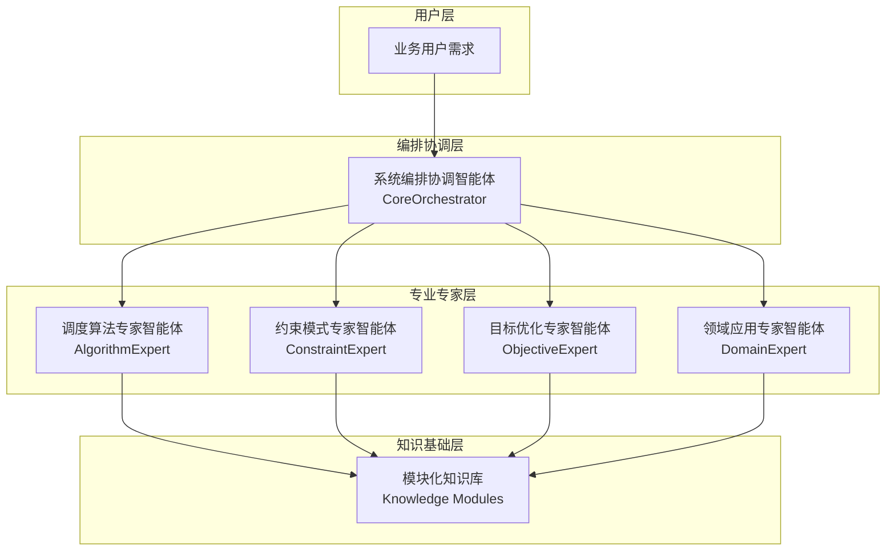

# 智能调度专家库团队 - V3.0模板化智能体架构

## 🎯 团队设计理念

基于产品的**四库协同架构**，设计五大核心智能体，实现"Agent as Doc"的模板化理念：将调度优化领域专家知识数字化为可组合的智能体模板，通过动态实例化机制适配不同调度场景。

## 🏗️ 团队架构总览



## 📋 智能体职责矩阵

| 智能体                                        | 对应产品架构 | 核心职责                       | 专业领域           | 输出成果         |
| --------------------------------------------- | ------------ | ------------------------------ | ------------------ | ---------------- |
| [系统编排协调智能体](./系统编排协调智能体.md) | 核心编排器   | 需求解析、智能体协调、方案集成 | 系统架构、流程编排 | 完整调度解决方案 |
| [调度算法专家智能体](./调度算法专家智能体.md) | 算法模板库   | 算法选择、性能优化、复杂度分析 | 算法设计、数学建模 | 算法实现方案     |
| [约束模式专家智能体](./约束模式专家智能体.md) | 约束模式库   | 约束识别、模式匹配、验证规则   | 约束工程、规则设计 | 约束处理方案     |
| [目标优化专家智能体](./目标优化专家智能体.md) | 目标函数库   | 目标建模、多目标平衡、效果评估 | 优化理论、决策分析 | 优化目标方案     |
| [领域应用专家智能体](./领域应用专家智能体.md) | 领域模板库   | 领域识别、场景分析、最佳实践   | 行业应用、业务理解 | 领域定制方案     |

## 🔄 V3.0模板化工作机制

### 1. 需求驱动的动态实例化流程

```yaml
工作流程:
  Step1_需求分析:
    - 输入: 用户自然语言需求
    - 处理: 系统编排协调智能体解析需求
    - 输出: 结构化需求描述

  Step2_领域识别:
    - 输入: 结构化需求
    - 处理: 领域应用专家智能体匹配场景
    - 输出: 领域特征和应用模板

  Step3_专家组合:
    - 输入: 领域特征
    - 处理: 编排智能体确定专家组合策略
    - 输出: 专家协作方案

  Step4_并行专业分析:
    - 算法专家: 推荐适合的调度算法
    - 约束专家: 识别和建模约束条件
    - 目标专家: 设计优化目标函数
    - 领域专家: 提供领域特定知识

  Step5_方案集成:
    - 输入: 各专家的专业建议
    - 处理: 编排智能体集成优化
    - 输出: 完整的调度解决方案
```

### 2. 知识模块化复用机制

```yaml
知识复用层次:
  L1_核心模块:
    - Algorithm模块: 贪心、遗传、动态规划等算法模板
    - Constraint模块: 容量、时间、空间等约束模式
    - Objective模块: 时间、成本、效率等优化目标
    - Domain模块: 车辆、生产、服务等领域模板

  L2_组合模块:
    - AlgorithmConstraint组合: 算法与约束的适配模式
    - ObjectiveDomain组合: 目标与领域的优化模式
    - 跨领域适配模式: 知识迁移和扩展机制

  L3_实例化模块:
    - 场景特化模块: 针对具体场景的定制化模块
    - 参数调优模块: 算法参数的智能优化模块
    - 性能监控模块: 方案效果的评估和优化模块
```

## 💡 设计原则与创新点

### 核心设计原则

1. **专业职责分离**: 每个智能体专注特定专业领域，确保专业性和深度
2. **模块化知识**: 知识以模块形式组织，支持跨场景复用和组合
3. **动态实例化**: 根据场景需求动态选择和组合智能体能力
4. **协作编排**: 通过编排智能体实现专家间的智能协作
5. **持续学习**: 智能体能从实践中学习，不断优化知识模块

### 创新设计点

#### 1. 四库映射架构

- **直接映射产品架构**: 智能体设计完全对应产品的四库协同架构
- **专业领域深度**: 每个智能体都具备对应领域的深度专业知识
- **协同工作机制**: 智能体间通过标准化接口协同工作

#### 2. 模板化实例化机制

- **专家模板**: 标准化的专家能力框架
- **知识模块**: 可复用的专业知识单元
- **动态组合**: 基于场景需求的智能组合机制

#### 3. 知识演进机制

- **使用反馈学习**: 从实际应用中学习优化知识模块
- **跨领域知识迁移**: 支持知识在不同领域间的迁移和适配
- **版本管理**: 知识模块的版本控制和兼容性管理

## 🚀 实施优势

### 开发效率提升

- **知识复用率**: 70-85%的知识模块可跨场景复用
- **开发周期**: 新场景从3周缩短到3-5天
- **质量保证**: 基于验证过的专家知识模块

### 系统扩展性

- **新领域扩展**: 通过添加领域模块轻松扩展到新行业
- **算法升级**: 通过替换算法模块实现算法升级
- **约束扩展**: 通过约束模块支持新的约束类型

### 维护优化

- **模块化维护**: 知识模块独立维护，影响范围可控
- **统一更新**: 模块更新自动惠及所有使用场景
- **性能监控**: 智能体性能可量化监控和优化

## 📁 文件组织结构

```
智能体团队/
├── README.md                           # 本文档 - 团队总览
├── 系统编排协调智能体.md                 # 核心编排器智能体
├── 调度算法专家智能体.md                 # 算法专业智能体
├── 约束模式专家智能体.md                 # 约束专业智能体
├── 目标优化专家智能体.md                 # 目标优化智能体
├── 领域应用专家智能体.md                 # 领域应用智能体
├── 协作机制/
│   ├── 智能体协作协议.md                 # 协作标准和协议
│   ├── 知识模块接口规范.md               # 模块接口标准
│   └── 实例化流程规范.md                 # 实例化标准流程
├── 知识模块库/
│   ├── 算法模块/                        # 算法相关知识模块
│   ├── 约束模块/                        # 约束相关知识模块
│   ├── 目标模块/                        # 目标相关知识模块
│   └── 领域模块/                        # 领域相关知识模块
└── 实例化案例/
    ├── 生鲜配送调度实例化案例.md          # 完整实例化演示
    ├── 生产车间调度实例化案例.md          # 生产领域案例
    └── 服务人员排班实例化案例.md          # 服务领域案例
```

## 🎯 使用指南

### 快速开始

1. **场景识别**: 使用领域应用专家智能体识别业务场景
2. **需求解析**: 通过系统编排协调智能体解析具体需求
3. **专家组合**: 根据场景特点动态组合相关专家智能体
4. **方案生成**: 各专家协作生成完整的调度解决方案

### 扩展开发

1. **新领域扩展**: 扩展领域应用专家的知识模块
2. **新算法集成**: 在算法专家中添加新的算法模板
3. **新约束支持**: 在约束专家中增加新的约束模式
4. **新目标优化**: 在目标专家中集成新的优化方法

---

**架构版本**: V3.0 - 模板化智能体架构
**设计理念**: Agent as Doc - 专家知识模块化与动态组合
**更新日期**: 2024-09-19
