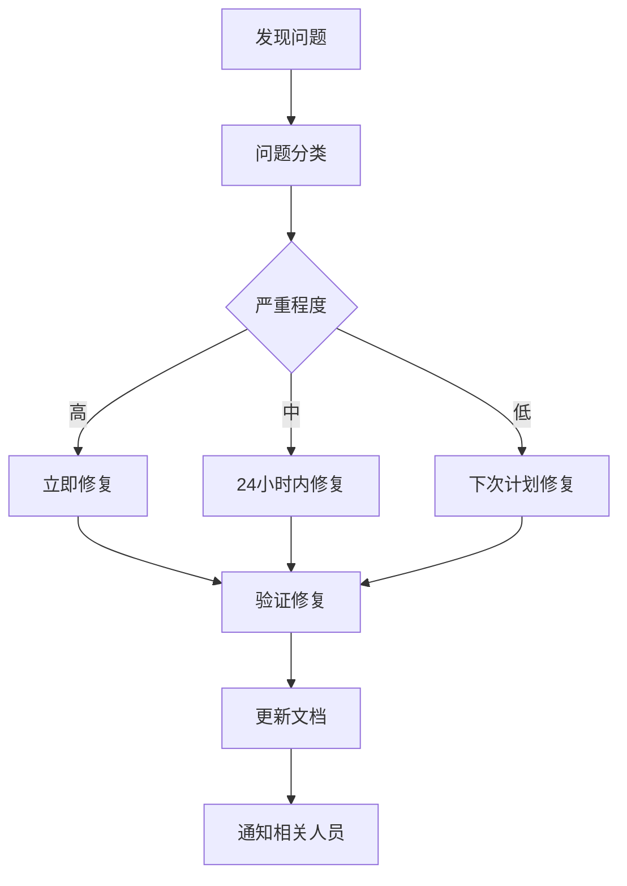

# 📖 专家库文档规范说明

## 📋 文档信息

- **版本**: v1.0.0
- **创建日期**: 2024-09-01
- **最后更新**: 2024-09-01
- **维护团队**: 专家库团队
- **文档类型**: 开发规范指南

## 🎯 概述

本文档定义了专家库系统中技术专家库和业务专家库的文档编写规范，确保文档格式统一、内容完整、维护高效。

## 📚 文档分类体系

### 🔬 技术专家库文档类型

#### 1. 算法模板文档 (`algorithm_template.md`)

**用途**: 定义算法实现规范和参数配置
**维护频率**: 月度/季度
**责任人**: 算法工程师

**标准格式**:

````markdown
---
# YAML Front Matter 元数据
algorithm_id: 'greedy_assignment'
algorithm_name: '贪心分配算法'
category: 'heuristic'
complexity: 'O(n*m)'
stability: 'stable'
version: '1.0.0'
last_updated: '2024-09-01'
maintainer: 'algorithm_team'
tags: ['greedy', 'assignment', 'optimization']
---

# 算法名称

## 🎯 算法概述

**适用场景**: [详细描述]
**核心思想**: [算法原理]
**优势**: [算法优点]
**局限性**: [使用限制]

## 📊 适用性评估

### 问题特征匹配

- **任务规模**: [规模范围] ✅/❌
- **实时性要求**: [高/中/低] ✅/❌
- **最优性要求**: [精确/近似] ✅/❌
- **计算资源**: [有限/充足] ✅/❌

### 性能指标

- **时间复杂度**: O(n\*m)
- **空间复杂度**: O(n+m)
- **近似比**: [如适用]
- **收敛速度**: [快/中/慢]

## ⚙️ 算法参数

### 核心参数

```yaml
algorithm_parameters:
  strategy: 'value_efficiency'
  selection_criteria: 'weighted_score'
  constraint_handling: 'penalty'
  optimization_direction: 'minimize'

weights:
  efficiency: 0.4
  priority: 0.3
  cost: 0.3
```
````

## 🏗️ 代码结构模板

### 核心类定义

```python
class AlgorithmName:
    def __init__(self, parameters: Dict[str, Any]):
        # 参数初始化
        pass

    def solve(self, tasks: List, resources: List, constraints: List) -> Solution:
        # 算法主逻辑
        pass
```

## 🔗 集成接口

### 输入接口

- `tasks: List[Task]` - 任务列表
- `resources: List[Resource]` - 资源列表
- `constraints: List[Constraint]` - 约束条件

### 输出接口

- `solution: Solution` - 调度解
- `objective_value: float` - 目标函数值
- `execution_time: float` - 执行时间

## 🧪 LLM生成指导

### 系统提示词模板

```
你需要实现一个{算法名称}，用于解决{问题类型}。

算法要求：
1. 采用 {策略} 策略
2. 优化目标：{目标函数}
3. 时间复杂度控制在 {复杂度} 以内

[详细实现指导...]
```

## 🧪 测试用例

### 标准测试场景

```python
def test_algorithm():
    # 测试用例1: 基本功能
    # 测试用例2: 边界条件
    # 测试用例3: 性能基准
    pass
```

## 📊 基准测试结果

| 测试场景 | 数据规模 | 执行时间 | 内存使用 | 解质量 |
| -------- | -------- | -------- | -------- | ------ |
| 小规模   | 100任务  | 0.1s     | 10MB     | 95%    |
| 中规模   | 1000任务 | 1.2s     | 50MB     | 92%    |
| 大规模   | 5000任务 | 8.5s     | 200MB    | 89%    |

## 🔄 更新日志

### v1.0.0 (2024-09-01)

- 初始版本创建
- 基础算法模板定义

````

#### 2. 约束模式文档 (`constraint_template.md`)
**用途**: 定义约束检查逻辑和参数配置
**维护频率**: 季度
**责任人**: 约束建模专家

**标准格式**:
```markdown
---
constraint_id: "capacity_constraint"
constraint_name: "容量约束"
constraint_type: "hard_constraint"
priority: "high"
complexity: "O(1)"
version: "1.0.0"
domains: ["logistics", "manufacturing", "service"]
---

# 约束名称

## 🎯 约束定义
**约束类型**: 硬约束/软约束
**约束描述**: [详细描述约束逻辑]
**业务含义**: [约束的业务意义]

## 📊 匹配条件
### 触发关键词
- [关键词1], [关键词2], [关键词3]
- [相关术语1], [相关术语2]

### 应用场景
- [场景1描述]
- [场景2描述]
- [场景3描述]

## ⚙️ 约束参数
```yaml
constraint_parameters:
  capacity_type: "weight"
  capacity_unit: "kg"
  max_capacity: 1000
  utilization_threshold: 0.95

validation_rules:
  strict_mode: true
  allow_overflow: false
  penalty_factor: 1000
````

## 🔍 约束检查逻辑

```python
def validate_constraint(resource: Resource, task: Task) -> ConstraintResult:
    # 约束检查实现
    pass
```

## 🧪 LLM集成提示

### 约束检查提示词

```
在实现调度算法时，必须包含{约束名称}检查：

约束规则：
- [规则1]
- [规则2]

检查逻辑：
1. [步骤1]
2. [步骤2]
3. [步骤3]
```

## 🧪 测试用例

### 约束验证测试

```python
def test_constraint():
    # 测试满足约束的情况
    # 测试违反约束的情况
    # 测试边界条件
    pass
```

````

#### 3. 目标函数文档 (`objective_template.md`)
**用途**: 定义优化目标和权重配置
**维护频率**: 季度
**责任人**: 优化专家

#### 4. 领域模板文档 (`domain_template.md`)
**用途**: 定义领域特征和实体模型
**维护频率**: 季度
**责任人**: 领域专家

### 🏢 业务专家库文档类型

#### 1. 业务场景文档 (`scenario_template.md`)
**用途**: 定义具体业务场景和规则
**维护频率**: 周度
**责任人**: 业务分析师

**标准格式**:
```markdown
---
scenario_id: "fresh_delivery"
scenario_name: "生鲜配送调度"
industry: "retail"
business_domain: "logistics"
complexity_level: "high"
update_frequency: "weekly"
version: "2.1.0"
last_updated: "2024-09-01"
maintainer: "business_team"
priority: "high"
---

# 业务场景名称

## 🏪 业务背景
**行业**: [所属行业]
**业务场景**: [场景描述]
**核心挑战**: [主要难点]
**业务价值**: [解决该场景的价值]

## 📊 场景特征
### 业务指标
- **规模指标**: [数据规模描述]
- **时效要求**: [时间要求]
- **质量标准**: [质量指标]
- **成本控制**: [成本要求]

### 关键约束
```yaml
business_constraints:
  [约束类型1]:
    [参数1]: [值1]
    [参数2]: [值2]

  [约束类型2]:
    [参数1]: [值1]
    [参数2]: [值2]
````

## 🎯 优化目标

### 主要目标

1. **目标1**: [描述和指标]
2. **目标2**: [描述和指标]
3. **目标3**: [描述和指标]

### 目标权重配置

```yaml
objective_weights:
  [目标1]: 0.4
  [目标2]: 0.3
  [目标3]: 0.2
  [目标4]: 0.1
```

## 🔧 业务规则

### 分配规则

- [规则1描述]
- [规则2描述]
- [规则3描述]

### 特殊处理规则

```yaml
special_rules:
  [规则类型1]:
    condition: [触发条件]
    action: [处理动作]

  [规则类型2]:
    condition: [触发条件]
    action: [处理动作]
```

## 📋 数据模型

### 核心实体结构

```yaml
[实体名称]_schema:
  [字段1]: [类型] # [描述]
  [字段2]: [类型] # [描述]
  [嵌套对象]:
    [子字段1]: [类型]
    [子字段2]: [类型]
```

## 🎯 成功指标

### KPI定义

```yaml
success_metrics:
  operational:
    [指标1]: '[目标值]'
    [指标2]: '[目标值]'

  quality:
    [指标1]: '[目标值]'
    [指标2]: '[目标值]'

  financial:
    [指标1]: '[目标值]'
    [指标2]: '[目标值]'
```

## 💼 典型案例

### 案例1: [案例名称]

**背景**: [案例背景]
**挑战**: [面临的挑战]
**解决方案**: [采用的方案]
**效果**: [取得的效果]

## 🧪 LLM场景提示

### 场景上下文提示词

```
你需要为{业务场景}生成调度算法，具体要求：

业务背景：
- [背景1]
- [背景2]

关键约束：
- [约束1]
- [约束2]

优化目标：
- [目标1] (权重{权重})
- [目标2] (权重{权重})

特殊规则：
- [规则1]
- [规则2]

请生成适合此场景的专业调度算法实现。
```

## 🔄 更新记录

### v2.1.0 (2024-09-01)

- [变更内容1]
- [变更内容2]
- [变更内容3]

### v2.0.0 (2024-08-15)

- [重大变更1]
- [重大变更2]

````

#### 2. 约束规则文档 (`business_constraint_template.md`)
**用途**: 定义业务特定的约束规则
**维护频率**: 双周
**责任人**: 业务专家

#### 3. 参数配置文档 (`parameter_template.md`)
**用途**: 定义业务参数和配置项
**维护频率**: 周度
**责任人**: 参数分析师

## 📝 文档编写规范

### 1. YAML Front Matter 规范
所有专家库文档必须包含YAML Front Matter元数据：

```yaml
---
# 必填字段
id: "unique_identifier"           # 唯一标识符
name: "显示名称"                  # 显示名称
type: "algorithm|constraint|objective|domain|scenario|rule|parameter"
version: "1.0.0"                 # 语义化版本号
last_updated: "2024-09-01"       # 最后更新日期
maintainer: "team_name"          # 维护团队

# 推荐字段
category: "分类标签"             # 分类
priority: "high|medium|low"      # 优先级
complexity: "high|medium|low"    # 复杂度
stability: "stable|beta|alpha"   # 稳定性
tags: ["tag1", "tag2", "tag3"]   # 标签列表

# 可选字段
dependencies: ["dep1", "dep2"]   # 依赖关系
related_docs: ["doc1", "doc2"]   # 相关文档
deprecated: false                # 是否废弃
experimental: false              # 是否实验性
---
````

### 2. 内容结构规范

#### 标题层级规范

- `#` 一级标题：文档标题（仅一个）
- `##` 二级标题：主要章节
- `###` 三级标题：子章节
- `####` 四级标题：详细说明

#### 必需章节（技术专家库）

1. **概述** (`## 🎯 概述`)
2. **适用性评估** (`## 📊 适用性评估`)
3. **参数配置** (`## ⚙️ 参数配置`)
4. **代码模板** (`## 🏗️ 代码模板`)
5. **集成接口** (`## 🔗 集成接口`)
6. **LLM指导** (`## 🧪 LLM生成指导`)

#### 必需章节（业务专家库）

1. **业务背景** (`## 🏪 业务背景`)
2. **场景特征** (`## 📊 场景特征`)
3. **优化目标** (`## 🎯 优化目标`)
4. **业务规则** (`## 🔧 业务规则`)
5. **数据模型** (`## 📋 数据模型`)
6. **成功指标** (`## 🎯 成功指标`)

### 3. 格式规范

#### 代码块规范

- 使用语言标识符：`python, `yaml, ```json
- 代码注释必须清晰易懂
- 示例代码必须可运行

#### 表格规范

- 使用Markdown表格格式
- 表头必须明确
- 数据对齐统一

#### 链接规范

- 内部链接使用相对路径
- 外部链接使用完整URL
- 链接描述要有意义

### 4. 内容质量要求

#### 准确性要求

- 技术内容必须经过验证
- 业务信息必须与实际一致
- 示例代码必须可执行
- 数据指标必须真实

#### 完整性要求

- 所有必需章节完整
- 参数说明详细
- 示例覆盖全面
- 边界情况考虑

#### 可读性要求

- 语言简洁明了
- 逻辑结构清晰
- 专业术语定义
- 适当的图表说明

## 🔍 文档验证规范

### 1. 格式验证

```python
# 自动化格式检查脚本
def validate_document_format(file_path):
    # 检查YAML Front Matter
    # 检查必需章节
    # 检查代码块格式
    # 检查表格格式
    pass
```

### 2. 内容验证

```yaml
validation_checklist:
  metadata:
    - YAML格式正确
    - 必填字段完整
    - 版本号符合规范
    - 更新日期准确

  structure:
    - 标题层级合理
    - 必需章节完整
    - 内容组织逻辑
    - 代码示例有效

  quality:
    - 内容准确完整
    - 语言清晰易懂
    - 专业术语准确
    - 链接有效可访问
```

### 3. 版本控制规范

```yaml
version_control:
  branching:
    main: 稳定版本
    develop: 开发版本
    feature/*: 功能分支
    hotfix/*: 紧急修复

  commit_message:
    format: '[类型](范围): 简短描述'
    types: ['feat', 'fix', 'docs', 'style', 'refactor', 'test']

  review_process:
    technical_docs: 算法工程师审核
    business_docs: 业务专家审核
    format_check: 自动化脚本检查
```

## 🛠️ 工具和流程

### 1. 文档编写工具

- **编辑器**: VSCode + Markdown插件
- **预览**: Markdown Preview Enhanced
- **格式化**: Prettier
- **版本控制**: Git + GitHub/GitLab

### 2. 自动化工具

```python
# 文档生成工具
def generate_template(doc_type, parameters):
    # 根据文档类型生成模板
    pass

# 格式验证工具
def validate_format(file_path):
    # 验证文档格式
    pass

# 内容检查工具
def check_content_quality(file_path):
    # 检查内容质量
    pass
```

### 3. 发布流程


## 📊 质量指标和监控

### 文档质量指标

```yaml
quality_metrics:
  completeness:
    required_sections: 100%
    metadata_fields: 95%
    code_examples: 90%

  accuracy:
    technical_verification: 100%
    business_validation: 95%
    link_validity: 98%

  maintainability:
    update_frequency: 符合计划
    response_time: < 48小时
    consistency: 95%
```

### 使用情况监控

- 文档访问频率
- 搜索查询分析
- 用户反馈收集
- 错误报告跟踪

## 🔄 维护和更新

### 定期维护任务

```yaml
maintenance_schedule:
  daily:
    - 检查新提交的文档
    - 处理用户反馈
    - 修复发现的问题

  weekly:
    - 更新业务专家库
    - 检查链接有效性
    - 同步版本变更

  monthly:
    - 评审技术专家库
    - 优化文档结构
    - 更新工具和流程

  quarterly:
    - 全面质量审核
    - 架构优化评估
    - 团队培训更新
```

### 应急处理流程



---

**使用说明**: 本规范为专家库文档编写的官方标准，所有文档维护人员必须严格遵守。如有疑问或建议，请联系架构团队。
