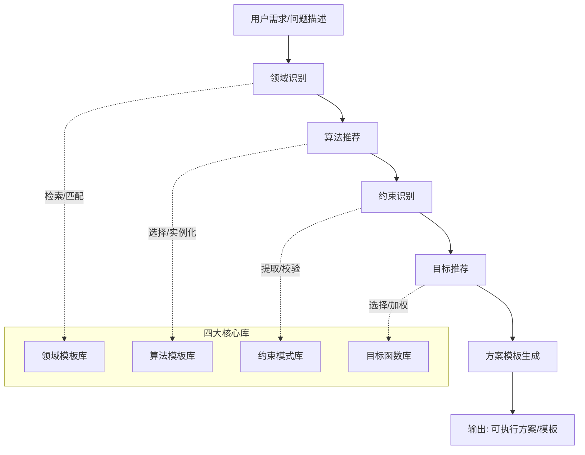
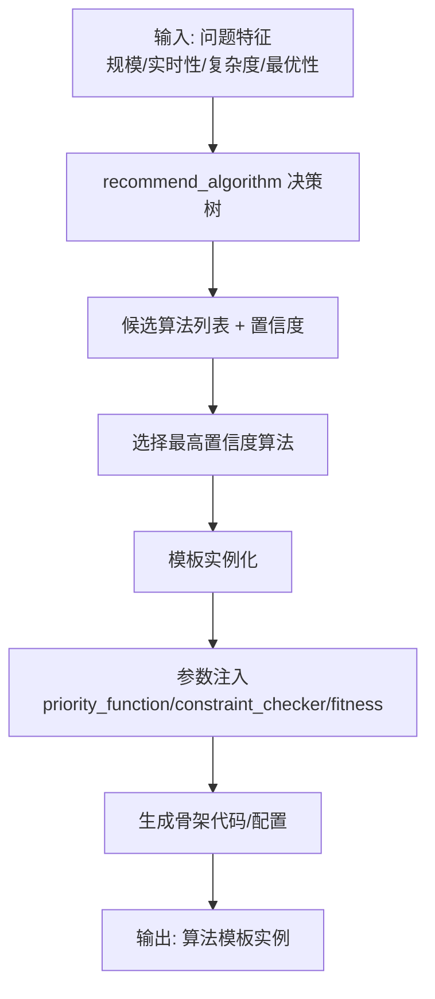
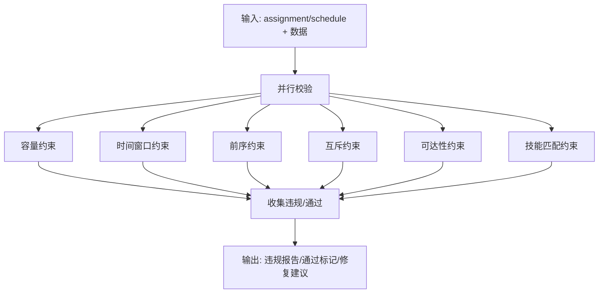
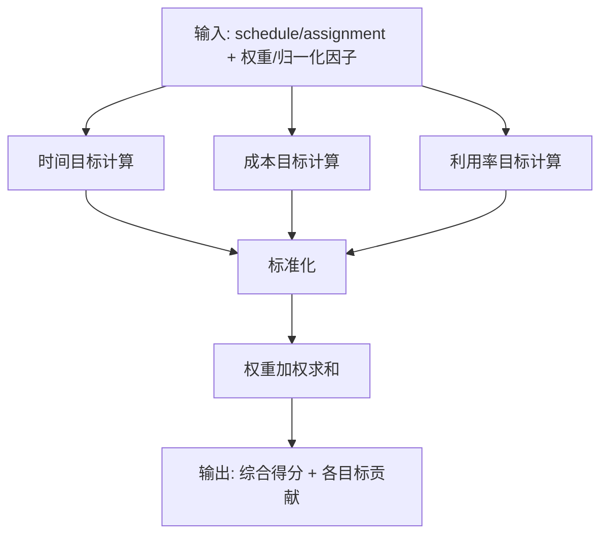
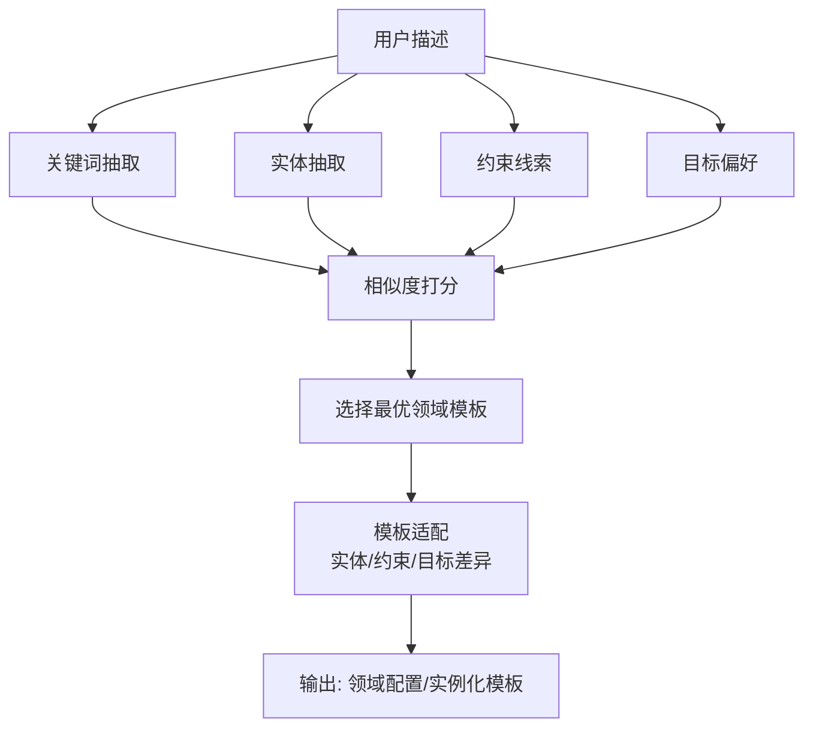
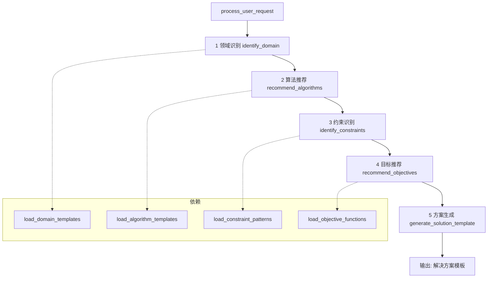
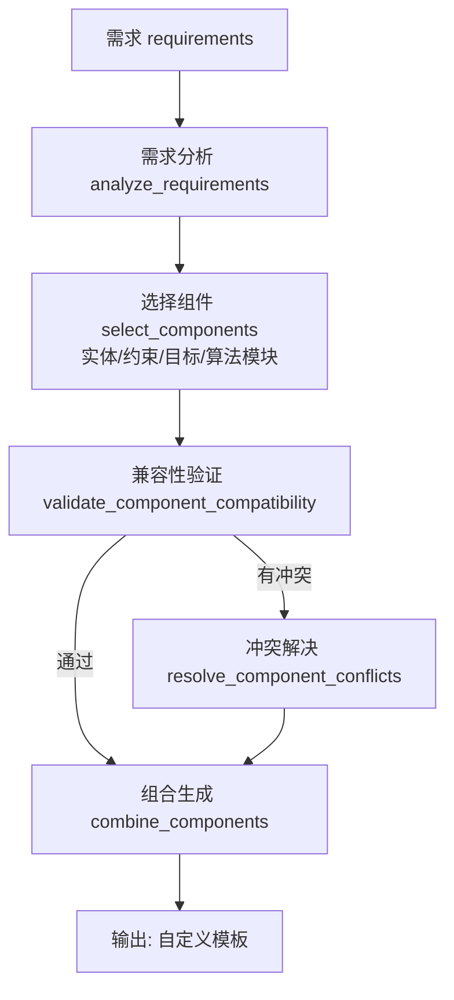
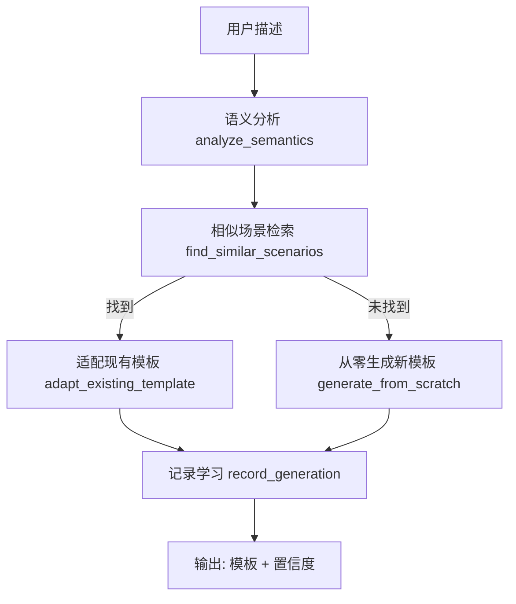
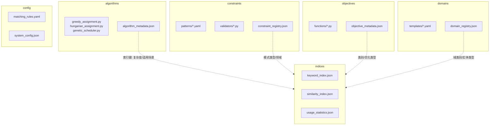
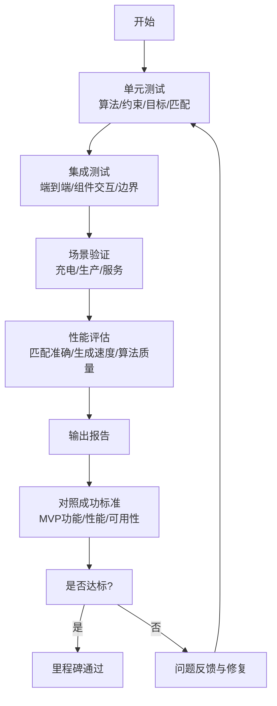

# 调度算法专家库详细设计方案

## 摘要

本文档详细阐述了调度算法专家库的设计思路、组件构成和实施策略。专家库作为智能调度系统的知识核心，通过四大核心库（算法模板库、约束模式库、目标函数库、领域模板库）的协同工作，实现从用户需求到调度算法的自动化生成。本方案采用分层设计+模块化组合+智能匹配的融合策略，确保系统既能快速验证可行性，又具备良好的扩展性。

## 1. 专家库核心理念

### 1.1 设计哲学

专家库的设计遵循"菜谱大全"的理念：

```
智能调度系统 = 智能餐厅
专家库 = 菜谱大全 + 做菜方法 + 食材规则 + 评判标准
用户需求 = 客人点菜
生成算法 = 自动生成菜谱和做菜流程
```

### 1.2 核心价值

- **知识复用**: 将专家经验转化为可重复使用的模式
- **智能匹配**: 根据问题特征自动推荐最适合的解决方案
- **快速生成**: 从需求分析到算法实现的时间从周级缩短到分钟级
- **质量保证**: 基于验证过的模板和模式，确保生成算法的可靠性

## 2. 专家库四大核心组件

### 2.1 算法模板库：做菜方法大全

#### 2.1.1 组件作用

**核心功能**: 存储不同的"做菜方法"，告诉系统用什么方式来解决调度问题。

**通俗类比**:

- 就像厨师有炒、煮、蒸、烤等不同做菜方法
- 不同的调度问题需要不同的算法"做法"

#### 2.1.2 MVP阶段算法选择

选择3个最具代表性的算法，覆盖不同复杂度和应用特点：

```python
mvp_algorithm_templates = {
    # 1. 贪心分配算法 - 最常用、最稳定
    "greedy_assignment": {
        "complexity": "O(n*m)",
        "description": "按优先级逐一分配，简单高效",
        "适用场景": "实时调度、中小规模问题、约束相对简单",
        "算法特点": {
            "优点": ["执行速度快", "逻辑简单易懂", "内存占用少"],
            "缺点": ["可能非全局最优", "对优先级设计敏感"],
            "适合问题规模": "10-1000个任务"
        },
        "实际类比": "排队就餐 - 先来先服务，简单直接",
        "典型应用": ["外卖配送", "充电排队", "简单任务分配"],
        "模板参数": {
            "priority_function": "优先级计算函数（可自定义）",
            "constraint_checker": "约束检查器（可插拔）",
            "objective_evaluator": "目标函数评估器"
        }
    },

    # 2. 匈牙利算法 - 精确解、双边匹配
    "hungarian_assignment": {
        "complexity": "O(n³)",
        "description": "最优二分匹配，保证全局最优解",
        "适用场景": "需要最优解、双边匹配问题、成本敏感",
        "算法特点": {
            "优点": ["保证全局最优", "理论基础扎实", "结果稳定"],
            "缺点": ["计算复杂度高", "只适用于特定问题结构"],
            "适合问题规模": "10-500个任务"
        },
        "实际类比": "相亲配对 - 找到最完美的一对一匹配",
        "典型应用": ["工人-任务最优匹配", "机器-订单最优分配", "最小成本分配"],
        "模板参数": {
            "cost_matrix": "成本矩阵定义",
            "constraint_preprocessing": "约束预处理",
            "solution_validator": "解的合法性验证"
        }
    },

    # 3. 遗传算法 - 复杂约束、近似解
    "genetic_scheduler": {
        "complexity": "O(generations × population × evaluation)",
        "description": "进化算法，通过模拟自然选择寻找近似最优解",
        "适用场景": "复杂约束、多目标优化、大规模问题",
        "算法特点": {
            "优点": ["处理复杂约束", "支持多目标优化", "较强的全局搜索能力"],
            "缺点": ["运行时间较长", "参数调节复杂", "结果有随机性"],
            "适合问题规模": "100-10000个任务"
        },
        "实际类比": "试错改进 - 像反复调整菜谱，一代比一代好",
        "典型应用": ["复杂生产调度", "多约束路径规划", "人员排班优化"],
        "模板参数": {
            "population_size": "种群大小（通常20-100）",
            "mutation_rate": "变异概率（通常0.01-0.1）",
            "crossover_rate": "交叉概率（通常0.6-0.9）",
            "fitness_function": "适应度函数（自定义）"
        }
    }
}
```

#### 2.1.3 算法选择决策树

```python
def recommend_algorithm(problem_characteristics):
    """基于问题特征推荐算法"""

    scale = problem_characteristics.get('task_count', 100)
    real_time = problem_characteristics.get('real_time_required', False)
    complexity = problem_characteristics.get('constraint_complexity', 'simple')
    optimality = problem_characteristics.get('optimality_required', 'good')

    recommendations = []

    # 决策逻辑
    if real_time and scale <= 1000:
        recommendations.append(('greedy_assignment', 0.9))

    if optimality == 'optimal' and scale <= 500 and complexity == 'simple':
        recommendations.append(('hungarian_assignment', 0.95))

    if complexity == 'complex' or scale > 1000:
        recommendations.append(('genetic_scheduler', 0.8))

    if scale <= 100:
        recommendations.append(('greedy_assignment', 0.85))
        recommendations.append(('hungarian_assignment', 0.8))

    # 返回按置信度排序的推荐
    return sorted(recommendations, key=lambda x: x[1], reverse=True)
```

### 2.2 约束模式库：做菜规则大全

#### 2.2.1 组件作用

**核心功能**: 存储各种"不能违反的规则"，就像做菜时的注意事项。

**通俗类比**:

- 就像做菜有"油温不能太高"、"盐不能放太多"等规则
- 调度有"容量不能超限"、"时间不能冲突"等约束

#### 2.2.2 六大核心约束模式

```python
mvp_constraint_patterns = {
    # 1. 容量约束 - 最基础、最常见
    "capacity_constraint": {
        "pattern_type": "resource_limit",
        "description": "资源容量不能超过上限",
        "生活类比": "锅的大小限制 - 一个锅最多能炒几个菜",
        "数学表达": "∑(需求量 × 分配变量) ≤ 资源容量",
        "代码模板": """
def check_capacity_constraint(assignment, demands, capacities):
    '''检查容量约束是否满足'''
    violations = []
    for resource_id, capacity in capacities.items():
        assigned_tasks = assignment.get(resource_id, [])
        total_demand = sum(demands.get(task, 0) for task in assigned_tasks)
        if total_demand > capacity:
            violations.append({
                'resource': resource_id,
                'demand': total_demand,
                'capacity': capacity,
                'overload': total_demand - capacity
            })
    return len(violations) == 0, violations
        """,
        "应用场景": {
            "车辆调度": "载重限制、乘客数量限制",
            "生产调度": "机器产能限制、仓库容量限制",
            "人员调度": "工时限制、技能人数限制",
            "服务调度": "服务能力限制、并发数限制"
        },
        "参数配置": {
            "capacity_type": "容量类型（重量/体积/数量/时间）",
            "soft_constraint": "是否允许少量超载（软约束）",
            "penalty_function": "超载惩罚函数"
        }
    },

    # 2. 时间窗口约束 - 最实用
    "time_window_constraint": {
        "pattern_type": "temporal_limit",
        "description": "任务必须在指定时间窗口内完成",
        "生活类比": "营业时间限制 - 只能在规定时间内做菜",
        "数学表达": "最早时间 ≤ 开始时间 ≤ 最晚时间 - 持续时间",
        "代码模板": """
def check_time_window_constraint(schedule, time_windows):
    '''检查时间窗口约束是否满足'''
    violations = []
    for task_id, task_schedule in schedule.items():
        if task_id not in time_windows:
            continue

        start_time = task_schedule.get('start_time')
        duration = task_schedule.get('duration', 0)
        end_time = start_time + duration

        earliest, latest = time_windows[task_id]

        if start_time < earliest or end_time > latest:
            violations.append({
                'task': task_id,
                'scheduled_start': start_time,
                'scheduled_end': end_time,
                'allowed_window': (earliest, latest),
                'violation_type': 'early' if start_time < earliest else 'late'
            })
    return len(violations) == 0, violations
        """,
        "应用场景": {
            "配送服务": "客户指定的收货时间窗口",
            "医院排班": "医生的工作时间、手术室使用时间",
            "生产计划": "原料供应时间、设备维护窗口",
            "会议安排": "参与者的可用时间段"
        },
        "参数配置": {
            "window_type": "硬窗口/软窗口",
            "early_penalty": "提前完成的惩罚",
            "late_penalty": "延迟完成的惩罚"
        }
    },

    # 3. 前序约束 - 逻辑依赖
    "precedence_constraint": {
        "pattern_type": "logical_dependency",
        "description": "某些任务必须在其他任务之前/之后执行",
        "生活类比": "做菜步骤顺序 - 必须先洗菜再炒菜",
        "数学表达": "任务i完成时间 ≤ 任务j开始时间（对于所有i→j依赖）",
        "代码模板": """
def check_precedence_constraint(schedule, precedence_rules):
    '''检查前序约束是否满足'''
    violations = []
    for predecessor, successor in precedence_rules:
        if predecessor not in schedule or successor not in schedule:
            continue

        pred_end = schedule[predecessor].get('end_time')
        succ_start = schedule[successor].get('start_time')

        if pred_end > succ_start:
            violations.append({
                'predecessor': predecessor,
                'successor': successor,
                'pred_end_time': pred_end,
                'succ_start_time': succ_start,
                'violation_gap': pred_end - succ_start
            })
    return len(violations) == 0, violations
        """,
        "应用场景": {
            "生产制造": "工艺流程顺序、装配顺序",
            "项目管理": "任务依赖关系、里程碑顺序",
            "物流配送": "取货必须在送货之前",
            "软件开发": "编译依赖、测试顺序"
        },
        "参数配置": {
            "dependency_type": "强依赖/弱依赖",
            "transition_time": "任务间转换时间",
            "dependency_graph": "依赖关系图"
        }
    },

    # 4. 互斥约束 - 资源冲突
    "mutual_exclusion_constraint": {
        "pattern_type": "resource_conflict",
        "description": "某些任务不能同时使用相同资源",
        "生活类比": "不能同时进行的操作 - 同一个炉子不能同时炒两个菜",
        "数学表达": "对于冲突任务i,j: xi + xj ≤ 1",
        "代码模板": """
def check_mutual_exclusion_constraint(schedule, exclusion_groups):
    '''检查互斥约束是否满足'''
    violations = []

    for group in exclusion_groups:
        # 检查同一时间是否有多个互斥任务
        time_conflicts = {}
        for task in group:
            if task not in schedule:
                continue
            start = schedule[task].get('start_time')
            end = schedule[task].get('end_time')

            # 检查与已记录任务的时间重叠
            for recorded_task, (rec_start, rec_end) in time_conflicts.items():
                if not (end <= rec_start or start >= rec_end):  # 有重叠
                    violations.append({
                        'conflicting_tasks': [task, recorded_task],
                        'time_overlap': (max(start, rec_start), min(end, rec_end))
                    })

            time_conflicts[task] = (start, end)

    return len(violations) == 0, violations
        """,
        "应用场景": {
            "设备调度": "独占设备、单用户设备",
            "人员安排": "一个人不能同时在两个地方",
            "会议室预约": "同一时间只能有一个会议",
            "车辆调度": "一辆车不能同时服务多个订单"
        },
        "参数配置": {
            "exclusion_level": "完全互斥/部分互斥",
            "conflict_resolution": "冲突解决策略",
            "priority_rules": "优先级规则"
        }
    },

    # 5. 距离/可达性约束 - 地理限制
    "reachability_constraint": {
        "pattern_type": "spatial_limit",
        "description": "基于距离或可达性的约束",
        "生活类比": "送餐范围限制 - 超过5公里不配送",
        "数学表达": "distance(资源, 任务位置) ≤ 最大服务半径",
        "代码模板": """
def check_reachability_constraint(assignment, distances, max_ranges):
    '''检查可达性约束是否满足'''
    violations = []

    for resource, assigned_tasks in assignment.items():
        max_range = max_ranges.get(resource, float('inf'))

        for task in assigned_tasks:
            distance = distances.get((resource, task), 0)
            if distance > max_range:
                violations.append({
                    'resource': resource,
                    'task': task,
                    'distance': distance,
                    'max_range': max_range,
                    'excess_distance': distance - max_range
                })

    return len(violations) == 0, violations
        """,
        "应用场景": {
            "配送服务": "配送半径、续航里程限制",
            "维修服务": "技师服务范围、工具运输距离",
            "通信网络": "信号覆盖范围、连接距离",
            "应急响应": "响应时间内可达范围"
        },
        "参数配置": {
            "distance_metric": "欧几里得距离/曼哈顿距离/实际路径",
            "range_type": "固定半径/动态范围",
            "connectivity_check": "连通性验证"
        }
    },

    # 6. 技能匹配约束 - 能力要求
    "skill_matching_constraint": {
        "pattern_type": "capability_requirement",
        "description": "资源必须具备执行任务所需的技能/能力",
        "生活类比": "厨师专长 - 做川菜的厨师不一定会做西餐",
        "数学表达": "required_skills(任务) ⊆ available_skills(资源)",
        "代码模板": """
def check_skill_matching_constraint(assignment, task_requirements, resource_capabilities):
    '''检查技能匹配约束是否满足'''
    violations = []

    for resource, assigned_tasks in assignment.items():
        resource_skills = set(resource_capabilities.get(resource, []))

        for task in assigned_tasks:
            required_skills = set(task_requirements.get(task, []))
            missing_skills = required_skills - resource_skills

            if missing_skills:
                violations.append({
                    'resource': resource,
                    'task': task,
                    'required_skills': list(required_skills),
                    'available_skills': list(resource_skills),
                    'missing_skills': list(missing_skills)
                })

    return len(violations) == 0, violations
        """,
        "应用场景": {
            "人员调度": "专业技能、资质要求、经验水平",
            "设备分配": "设备兼容性、功能要求",
            "软件系统": "系统权限、功能模块",
            "医疗服务": "医生专科、设备操作资质"
        },
        "参数配置": {
            "skill_hierarchy": "技能层次结构",
            "skill_level": "技能等级要求",
            "substitution_rules": "技能替代规则"
        }
    }
}
```

### 2.3 目标函数库：评判标准大全

#### 2.3.1 组件作用

**核心功能**: 存储各种"好坏的评判标准"，告诉系统什么样的方案算好。

**通俗类比**:

- 就像评判做菜好坏的标准：快（上菜速度）、省（食材成本）、好（口味质量）
- 调度也有不同的评判标准：时间、成本、效率、公平性等

#### 2.3.2 四大核心目标函数

```python
mvp_objective_functions = {
    # 1. 时间最小化 - 最常见的优化目标
    "minimize_total_time": {
        "category": "time_optimization",
        "description": "最小化总完成时间、等待时间或周转时间",
        "生活类比": "最快上菜 - 让客人等待时间最短",
        "数学公式": "minimize ∑(completion_time[i] + wait_time[i] + travel_time[i])",
        "代码模板": """
def calculate_total_time_objective(schedule, weights=None):
    '''计算总时间目标函数值'''
    if weights is None:
        weights = {'completion': 1.0, 'wait': 1.0, 'travel': 0.5}

    total_time = 0
    components = {'completion': 0, 'wait': 0, 'travel': 0}

    for task_id, task_info in schedule.items():
        completion_time = task_info.get('completion_time', 0)
        wait_time = task_info.get('wait_time', 0)
        travel_time = task_info.get('travel_time', 0)

        components['completion'] += completion_time
        components['wait'] += wait_time
        components['travel'] += travel_time

    # 加权求和
    total_time = sum(weights[comp] * value for comp, value in components.items())

    return total_time, components
        """,
        "变体类型": {
            "makespan": "最小化最大完成时间（瓶颈时间）",
            "average_waiting": "最小化平均等待时间",
            "total_delay": "最小化总延迟时间",
            "flow_time": "最小化流程总时间"
        },
        "应用场景": {
            "外卖配送": "配送时间最短",
            "医院排班": "病人等待时间最短",
            "生产调度": "生产周期最短",
            "客服系统": "响应时间最短"
        },
        "权重因子": {
            "urgency": "任务紧急程度权重",
            "priority": "任务优先级权重",
            "customer_level": "客户等级权重"
        }
    },

    # 2. 成本最小化 - 最实用的经济目标
    "minimize_total_cost": {
        "category": "cost_optimization",
        "description": "最小化总运营成本、资源使用成本",
        "生活类比": "最省食材费 - 用最便宜的方法做同样的菜",
        "数学公式": "minimize ∑(运营成本[i,j] × 分配变量[i,j] + 固定成本[j])",
        "代码模板": """
def calculate_total_cost_objective(assignment, cost_structure):
    '''计算总成本目标函数值'''
    total_cost = 0
    cost_breakdown = {
        'variable_cost': 0,    # 变动成本
        'fixed_cost': 0,       # 固定成本
        'penalty_cost': 0,     # 惩罚成本
        'opportunity_cost': 0   # 机会成本
    }

    # 变动成本计算
    for resource, tasks in assignment.items():
        for task in tasks:
            var_cost = cost_structure.get('variable', {}).get((task, resource), 0)
            cost_breakdown['variable_cost'] += var_cost

    # 固定成本计算
    used_resources = set(assignment.keys())
    for resource in used_resources:
        fixed_cost = cost_structure.get('fixed', {}).get(resource, 0)
        cost_breakdown['fixed_cost'] += fixed_cost

    # 惩罚成本（延迟、超载等）
    penalties = cost_structure.get('penalties', {})
    cost_breakdown['penalty_cost'] = sum(penalties.values())

    total_cost = sum(cost_breakdown.values())
    return total_cost, cost_breakdown
        """,
        "成本类型": {
            "transportation_cost": "运输成本（距离×单价）",
            "labor_cost": "人力成本（工时×薪酬）",
            "equipment_cost": "设备使用成本",
            "inventory_cost": "库存持有成本",
            "penalty_cost": "违约惩罚成本"
        },
        "应用场景": {
            "物流配送": "运输成本最小化",
            "生产计划": "生产成本最小化",
            "人员排班": "人力成本最小化",
            "云计算": "计算资源成本最小化"
        },
        "成本结构": {
            "fixed_costs": "固定成本项",
            "variable_costs": "变动成本项",
            "step_costs": "阶梯成本项"
        }
    },

    # 3. 资源利用率最大化 - 效率导向
    "maximize_utilization": {
        "category": "efficiency_optimization",
        "description": "最大化资源利用率，平衡负载分配",
        "生活类比": "设备最忙碌 - 炉子、厨师都不能闲着",
        "数学公式": "maximize ∑(使用时间[j] / 总可用时间[j]) / 资源数量",
        "代码模板": """
def calculate_utilization_objective(assignment, resource_capacities, time_horizon):
    '''计算资源利用率目标函数值'''
    utilization_scores = {}
    total_utilization = 0

    for resource, capacity in resource_capacities.items():
        assigned_tasks = assignment.get(resource, [])
        used_capacity = len(assigned_tasks)  # 简化：任务数量

        # 计算利用率（0-1之间）
        utilization = min(used_capacity / capacity, 1.0) if capacity > 0 else 0
        utilization_scores[resource] = utilization
        total_utilization += utilization

    # 计算平均利用率
    avg_utilization = total_utilization / len(resource_capacities) if resource_capacities else 0

    # 计算负载均衡度（方差越小越好）
    utilizations = list(utilization_scores.values())
    balance_score = 1.0 - (np.var(utilizations) if utilizations else 0)

    return avg_utilization, {
        'individual_utilization': utilization_scores,
        'average_utilization': avg_utilization,
        'balance_score': balance_score
    }
        """,
        "利用率类型": {
            "time_utilization": "时间利用率（工作时间/总时间）",
            "capacity_utilization": "容量利用率（使用量/总容量）",
            "skill_utilization": "技能利用率（技能使用/技能拥有）",
            "equipment_utilization": "设备利用率"
        },
        "应用场景": {
            "制造业": "设备利用率最大化",
            "医院": "医生、病床利用率最大化",
            "运输": "车辆利用率最大化",
            "数据中心": "服务器利用率最大化"
        },
        "平衡因子": {
            "load_balancing": "负载均衡权重",
            "fairness": "公平性权重",
            "efficiency": "效率权重"
        }
    },

    # 4. 多目标权衡 - 综合优化
    "weighted_multi_objective": {
        "category": "multi_criteria_optimization",
        "description": "多个目标的加权组合优化",
        "生活类比": "综合评判 - 既要快、又要省、还要好",
        "数学公式": "minimize ∑(权重[i] × 标准化目标值[i])",
        "代码模板": """
def calculate_weighted_multi_objective(schedule, assignment, weights, normalization_factors):
    '''计算加权多目标函数值'''

    # 计算各个子目标
    objectives = {}

    # 时间目标
    time_obj, _ = calculate_total_time_objective(schedule)
    objectives['time'] = time_obj / normalization_factors.get('time', 1.0)

    # 成本目标
    cost_obj, _ = calculate_total_cost_objective(assignment, {})
    objectives['cost'] = cost_obj / normalization_factors.get('cost', 1.0)

    # 利用率目标（转为最小化：1 - 利用率）
    util_obj, _ = calculate_utilization_objective(assignment, {}, 24)
    objectives['utilization'] = (1.0 - util_obj) / normalization_factors.get('utilization', 1.0)

    # 加权求和
    weighted_sum = 0
    objective_contributions = {}

    for obj_name, obj_value in objectives.items():
        weight = weights.get(obj_name, 0)
        contribution = weight * obj_value
        weighted_sum += contribution
        objective_contributions[obj_name] = {
            'raw_value': obj_value,
            'weight': weight,
            'contribution': contribution
        }

    return weighted_sum, {
        'total_score': weighted_sum,
        'objectives': objective_contributions,
        'weights_used': weights
    }
        """,
        "常用权重组合": {
            "balanced": {"time": 0.4, "cost": 0.4, "utilization": 0.2},
            "cost_focused": {"time": 0.2, "cost": 0.7, "utilization": 0.1},
            "speed_focused": {"time": 0.7, "cost": 0.2, "utilization": 0.1},
            "efficiency_focused": {"time": 0.3, "cost": 0.2, "utilization": 0.5}
        },
        "应用场景": {
            "企业运营": "成本、效率、质量平衡",
            "供应链": "时间、成本、服务水平平衡",
            "项目管理": "时间、成本、质量三角平衡",
            "资源分配": "效率、公平、满意度平衡"
        },
        "权重调节": {
            "interactive_tuning": "交互式权重调节",
            "pareto_analysis": "帕累托前沿分析",
            "sensitivity_analysis": "敏感性分析"
        }
    }
}
```

### 2.4 领域模板库：菜系模板大全

#### 2.4.1 组件作用

**核心功能**: 存储不同"菜系"的特点和常用搭配，提供现成的解决方案框架。

**通俗类比**:

- 就像川菜、粤菜、西餐等不同菜系有各自的特色和做法
- 不同的调度领域有各自的特点和常见模式

#### 2.4.2 三大核心领域模板

```python
mvp_domain_templates = {
    # 1. 车辆调度模板 - 最具代表性
    "vehicle_scheduling": {
        "domain_category": "transportation_logistics",
        "description": "移动资源（车辆、人员、设备）的调度优化",
        "生活类比": "外卖配送系统 - 安排骑手给客户送餐",

        "典型实体结构": {
            "mobile_resources": {
                "vehicles": "车辆（卡车、轿车、电动车）",
                "drivers": "司机（技能、工时、位置）",
                "equipment": "车载设备（GPS、冷链、装卸设备）"
            },
            "fixed_locations": {
                "depots": "仓库/停车场（起始点）",
                "stations": "充电站/加油站（补给点）",
                "service_points": "服务点（目标点）"
            },
            "tasks": {
                "transport_orders": "运输订单（货物、时间要求）",
                "maintenance_tasks": "维护任务（定期检查）",
                "charging_requests": "充电需求（电量、时间）"
            }
        },

        "常见决策变量": {
            "vehicle_assignment": "x[vehicle][order] = 车辆是否承接订单",
            "route_planning": "route[vehicle] = 车辆行驶路径序列",
            "timing_schedule": "start_time[task] = 任务开始时间",
            "resource_allocation": "allocation[vehicle][resource] = 资源分配"
        },

        "典型约束集合": [
            {
                "constraint": "vehicle_capacity",
                "description": "车辆载重/体积/乘客数量限制",
                "priority": "high"
            },
            {
                "constraint": "fuel_range",
                "description": "续航里程/电量限制",
                "priority": "high"
            },
            {
                "constraint": "time_windows",
                "description": "客户指定的服务时间窗口",
                "priority": "medium"
            },
            {
                "constraint": "driver_regulations",
                "description": "司机工作时间、休息时间规定",
                "priority": "high"
            },
            {
                "constraint": "route_feasibility",
                "description": "路径可行性（道路限制、交通规则）",
                "priority": "medium"
            }
        ],

        "常见优化目标": [
            {
                "objective": "minimize_travel_distance",
                "description": "最小化总行驶距离",
                "weight": 0.3
            },
            {
                "objective": "minimize_fuel_cost",
                "description": "最小化燃料/电力成本",
                "weight": 0.3
            },
            {
                "objective": "maximize_vehicle_utilization",
                "description": "最大化车辆利用率",
                "weight": 0.2
            },
            {
                "objective": "minimize_customer_waiting",
                "description": "最小化客户等待时间",
                "weight": 0.2
            }
        ],

        "真实应用案例": {
            "food_delivery": {
                "场景": "外卖配送",
                "特点": "高频次、小订单、时效性强",
                "主要约束": "配送时间、配送范围",
                "主要目标": "配送时间最短、订单完成率最高"
            },
            "freight_transport": {
                "场景": "货运物流",
                "特点": "大宗货物、长距离、成本敏感",
                "主要约束": "载重限制、司机工时",
                "主要目标": "运输成本最低、车辆利用率最高"
            },
            "electric_vehicle_charging": {
                "场景": "电动车充电调度",
                "特点": "电量约束、充电时间长",
                "主要约束": "电量可达性、充电桩容量",
                "主要目标": "等待时间最短、充电效率最高"
            }
        },

        "推荐算法组合": {
            "small_scale": "hungarian_assignment + greedy_routing",
            "medium_scale": "greedy_assignment + local_optimization",
            "large_scale": "genetic_scheduler + clustering"
        }
    },

    # 2. 生产调度模板 - 最经典的调度场景
    "production_scheduling": {
        "domain_category": "manufacturing_operations",
        "description": "生产线、机器、工件的制造调度优化",
        "生活类比": "餐厅后厨 - 安排厨师用不同灶台做不同菜品",

        "典型实体结构": {
            "production_resources": {
                "machines": "生产设备（数控机床、装配线）",
                "operators": "操作工人（技能等级、班次）",
                "tools": "工具设备（模具、刀具、辅助设备）"
            },
            "materials": {
                "raw_materials": "原材料（库存、供应时间）",
                "work_in_progress": "在制品（半成品、中间件）",
                "finished_goods": "成品（质量、数量、交期）"
            },
            "production_tasks": {
                "production_jobs": "生产订单（产品、数量、交期）",
                "setup_operations": "换线作业（准备时间、清洁）",
                "maintenance_tasks": "设备维护（定期保养、故障维修）"
            }
        },

        "常见决策变量": {
            "job_assignment": "x[job][machine] = 工件在哪台机器上加工",
            "operation_sequence": "sequence[machine] = 机器上的作业顺序",
            "timing_variables": "start_time[job], completion_time[job]",
            "setup_decisions": "setup[machine][job1][job2] = 是否需要换线"
        },

        "典型约束集合": [
            {
                "constraint": "machine_capacity",
                "description": "机器产能限制、并发数限制",
                "priority": "high"
            },
            {
                "constraint": "precedence_relations",
                "description": "工艺顺序、装配顺序",
                "priority": "high"
            },
            {
                "constraint": "setup_times",
                "description": "换线时间、准备时间",
                "priority": "medium"
            },
            {
                "constraint": "due_dates",
                "description": "订单交付期限",
                "priority": "high"
            },
            {
                "constraint": "resource_availability",
                "description": "原料供应、工人班次、工具可用性",
                "priority": "medium"
            }
        ],

        "常见优化目标": [
            {
                "objective": "minimize_makespan",
                "description": "最小化生产周期（最晚完工时间）",
                "weight": 0.4
            },
            {
                "objective": "minimize_tardiness",
                "description": "最小化订单延期",
                "weight": 0.3
            },
            {
                "objective": "maximize_throughput",
                "description": "最大化产出量",
                "weight": 0.2
            },
            {
                "objective": "minimize_inventory",
                "description": "最小化在制品库存",
                "weight": 0.1
            }
        ],

        "真实应用案例": {
            "job_shop_scheduling": {
                "场景": "车间作业调度",
                "特点": "多品种小批量、工艺路线复杂",
                "主要约束": "设备能力、工艺顺序",
                "主要目标": "生产周期最短、准时交货率最高"
            },
            "flow_shop_scheduling": {
                "场景": "流水线调度",
                "特点": "大批量生产、固定工艺路线",
                "主要约束": "生产节拍、缓存区容量",
                "主要目标": "产量最大、设备利用率最高"
            },
            "batch_processing": {
                "场景": "批处理调度",
                "特点": "化工、食品等批量生产",
                "主要约束": "批量大小、处理时间",
                "主要目标": "设备利用率最高、切换成本最低"
            }
        },

        "推荐算法组合": {
            "small_scale": "hungarian_assignment + earliest_due_date",
            "medium_scale": "genetic_scheduler + priority_rules",
            "large_scale": "greedy_assignment + local_search"
        }
    },

    # 3. 服务调度模板 - 最灵活的调度场景
    "service_scheduling": {
        "domain_category": "service_operations",
        "description": "人员、服务资源的调度分配和排班优化",
        "生活类比": "医院排班 - 安排医生护士的工作时间和科室分配",

        "典型实体结构": {
            "human_resources": {
                "staff": "服务人员（技能、经验、可用时间）",
                "teams": "服务团队（协作关系、职责分工）",
                "supervisors": "管理人员（监督、协调、决策）"
            },
            "service_facilities": {
                "service_centers": "服务中心（医院、维修站、客服中心）",
                "equipment": "服务设备（医疗设备、维修工具）",
                "locations": "服务地点（客户现场、分支机构）"
            },
            "service_demands": {
                "service_requests": "服务请求（紧急程度、技能要求）",
                "appointments": "预约服务（固定时间、特定人员）",
                "maintenance_schedules": "定期维护（周期性、可调整）"
            }
        },

        "常见决策变量": {
            "staff_assignment": "x[staff][service] = 人员服务分配",
            "work_schedule": "schedule[staff][time_slot] = 工作安排",
            "resource_allocation": "allocation[resource][service] = 资源分配",
            "shift_planning": "shift[staff][day] = 班次安排"
        },

        "典型约束集合": [
            {
                "constraint": "staff_skills",
                "description": "人员技能匹配、资质要求",
                "priority": "high"
            },
            {
                "constraint": "working_hours",
                "description": "工作时间限制、休息时间要求",
                "priority": "high"
            },
            {
                "constraint": "service_windows",
                "description": "服务时间窗口、客户可用时间",
                "priority": "medium"
            },
            {
                "constraint": "travel_time",
                "description": "人员在不同地点间的移动时间",
                "priority": "medium"
            },
            {
                "constraint": "equipment_availability",
                "description": "服务设备的可用性和兼容性",
                "priority": "medium"
            }
        ],

        "常见优化目标": [
            {
                "objective": "minimize_response_time",
                "description": "最小化服务响应时间",
                "weight": 0.3
            },
            {
                "objective": "maximize_customer_satisfaction",
                "description": "最大化客户满意度",
                "weight": 0.3
            },
            {
                "objective": "minimize_labor_cost",
                "description": "最小化人力成本",
                "weight": 0.2
            },
            {
                "objective": "balance_workload",
                "description": "平衡工作负荷分配",
                "weight": 0.2
            }
        ],

        "真实应用案例": {
            "hospital_scheduling": {
                "场景": "医院排班调度",
                "特点": "7×24小时、专业技能要求高、紧急性强",
                "主要约束": "医生资质、工作时间、紧急响应",
                "主要目标": "医疗质量最高、成本最低、覆盖完整"
            },
            "field_service_scheduling": {
                "场景": "现场维修服务",
                "特点": "地理分散、技能专业、时间窗口",
                "主要约束": "技师技能、交通时间、客户时间窗口",
                "主要目标": "响应时间最短、成本最低、客户满意度最高"
            },
            "call_center_scheduling": {
                "场景": "客服中心排班",
                "特点": "呼叫量波动、多技能要求、服务水平目标",
                "主要约束": "人员技能、班次规则、服务水平协议",
                "主要目标": "服务水平达标、人力成本最低、员工满意度高"
            }
        },

        "推荐算法组合": {
            "small_scale": "hungarian_assignment + shift_optimization",
            "medium_scale": "genetic_scheduler + constraint_programming",
            "large_scale": "greedy_assignment + tabu_search"
        }
    }
}
```

## 3. 专家库协同工作机制

### 3.1 四库协同流程

专家库的四个组件按照以下流程协同工作：

```python
class ExpertLibraryOrchestrator:
    def __init__(self):
        self.domain_templates = load_domain_templates()
        self.algorithms = load_algorithm_templates()
        self.constraints = load_constraint_patterns()
        self.objectives = load_objective_functions()

    def process_user_request(self, user_description):
        """处理用户请求的完整流程"""

        # 第1步：领域识别 (领域模板库)
        domain_match = self.identify_domain(user_description)
        print(f"识别领域: {domain_match['domain_type']}")

        # 第2步：算法推荐 (算法模板库)
        algorithm_candidates = self.recommend_algorithms(domain_match, user_description)
        print(f"推荐算法: {[alg['name'] for alg in algorithm_candidates]}")

        # 第3步：约束识别 (约束模式库)
        constraint_matches = self.identify_constraints(user_description, domain_match)
        print(f"识别约束: {[cons['name'] for cons in constraint_matches]}")

        # 第4步：目标确定 (目标函数库)
        objective_recommendation = self.recommend_objectives(user_description, domain_match)
        print(f"推荐目标: {objective_recommendation['primary_objective']}")

        # 第5步：方案生成
        solution_template = self.generate_solution_template(
            domain_match, algorithm_candidates[0],
            constraint_matches, objective_recommendation
        )

        return solution_template

    def identify_domain(self, user_description):
        """领域识别算法"""
        domain_scores = {}

        for domain_name, domain_template in self.domain_templates.items():
            score = self.calculate_domain_similarity(user_description, domain_template)
            domain_scores[domain_name] = score

        best_domain = max(domain_scores, key=domain_scores.get)
        return {
            'domain_type': best_domain,
            'confidence': domain_scores[best_domain],
            'template': self.domain_templates[best_domain]
        }
```

### 3.2 智能匹配算法

```python
def calculate_domain_similarity(self, user_description, domain_template):
    """计算用户描述与领域模板的相似度"""

    # 关键词匹配 (40%)
    keyword_score = self.keyword_matching_score(user_description, domain_template)

    # 实体匹配 (30%)
    entity_score = self.entity_matching_score(user_description, domain_template)

    # 约束模式匹配 (20%)
    constraint_score = self.constraint_pattern_score(user_description, domain_template)

    # 目标匹配 (10%)
    objective_score = self.objective_matching_score(user_description, domain_template)

    total_score = (0.4 * keyword_score + 0.3 * entity_score +
                   0.2 * constraint_score + 0.1 * objective_score)

    return total_score

def keyword_matching_score(self, description, template):
    """关键词匹配评分"""
    # 构建领域关键词字典
    domain_keywords = self.build_keyword_dict(template)

    # 提取用户描述中的关键词
    user_keywords = self.extract_keywords(description)

    # 计算匹配度
    matches = sum(1 for keyword in user_keywords if keyword in domain_keywords)
    return matches / len(user_keywords) if user_keywords else 0
```

## 4. 融合策略的渐进式实施方案

### 4.1 策略组合概述

本方案采用**三策略融合**的渐进式实施方法：

```python
implementation_strategy = {
    "phase_1_foundation": {
        "duration": "2-4周",
        "primary_strategy": "分层模板设计",
        "secondary_strategy": "模块化组合（基础版）",
        "goal": "用最少的模板覆盖最多场景",
        "success_criteria": "成功处理3种典型调度场景"
    },

    "phase_2_expansion": {
        "duration": "1-3个月",
        "primary_strategy": "模块化组合设计",
        "secondary_strategy": "分层模板设计（细化）",
        "goal": "灵活组合应对新场景",
        "success_criteria": "处理10+种调度场景变体"
    },

    "phase_3_intelligence": {
        "duration": "3-6个月",
        "primary_strategy": "智能模板匹配与生成",
        "secondary_strategy": "持续优化策略1+2",
        "goal": "自动处理未知场景",
        "success_criteria": "90%未知场景自动处理成功"
    }
}
```

### 4.2 第一阶段：分层模板基础（MVP）

#### 4.2.1 核心任务

```python
phase_1_deliverables = {
    "week_1_2": {
        "tier1_templates": {
            "deliverable": "3个一级模板的完整实现",
            "components": [
                "resource_allocation_template.py",
                "sequential_processing_template.py",
                "routing_optimization_template.py"
            ],
            "validation": "每个模板至少处理1个真实场景"
        },

        "basic_matching": {
            "deliverable": "关键词匹配系统",
            "components": ["keyword_extractor.py", "template_matcher.py"],
            "validation": "匹配准确率 > 80%"
        }
    },

    "week_3_4": {
        "constraint_modules": {
            "deliverable": "6个约束模式的实现",
            "components": ["constraint_checker.py", "violation_analyzer.py"],
            "validation": "约束检查正确率 > 95%"
        },

        "objective_calculators": {
            "deliverable": "4个目标函数的实现",
            "components": ["objective_functions.py", "multi_objective_handler.py"],
            "validation": "目标函数计算准确性验证"
        }
    },

    "week_5_6": {
        "integration_testing": {
            "deliverable": "端到端集成测试",
            "test_scenarios": ["充电调度", "生产调度", "服务调度"],
            "success_criteria": "每个场景生成可执行算法"
        },

        "performance_evaluation": {
            "deliverable": "性能评估报告",
            "metrics": ["匹配准确率", "生成速度", "算法质量"],
            "baseline": "与手工编写算法对比"
        }
    }
}
```

#### 4.2.2 技术实现架构

```python
class MVPExpertLibrary:
    """MVP阶段的专家库实现"""

    def __init__(self):
        # 核心数据结构
        self.tier1_templates = self.load_tier1_templates()
        self.constraint_patterns = self.load_constraint_patterns()
        self.objective_functions = self.load_objective_functions()
        self.domain_templates = self.load_domain_templates()

        # 匹配组件
        self.keyword_matcher = KeywordMatcher()
        self.similarity_calculator = SimilarityCalculator()
        self.template_recommender = TemplateRecommender()

        # 构建索引
        self.build_search_indices()

    def load_tier1_templates(self):
        """加载第一层模板"""
        return {
            "resource_allocation": ResourceAllocationTemplate(),
            "sequential_processing": SequentialProcessingTemplate(),
            "routing_optimization": RoutingOptimizationTemplate()
        }

    def build_search_indices(self):
        """构建快速查询索引"""
        self.keyword_index = {}
        self.constraint_index = {}
        self.algorithm_index = {}

        # 构建关键词索引
        for template_name, template in self.tier1_templates.items():
            keywords = template.get_keywords()
            for keyword in keywords:
                if keyword not in self.keyword_index:
                    self.keyword_index[keyword] = []
                self.keyword_index[keyword].append(template_name)

    def recommend_solution(self, user_description):
        """推荐解决方案的主入口"""

        # 第1步：解析用户描述
        parsed_requirements = self.parse_user_requirements(user_description)

        # 第2步：匹配领域模板
        domain_match = self.match_domain_template(parsed_requirements)

        # 第3步：推荐算法模板
        algorithm_recommendation = self.recommend_algorithm_template(
            domain_match, parsed_requirements
        )

        # 第4步：识别约束模式
        constraint_recommendations = self.identify_constraint_patterns(
            parsed_requirements, domain_match
        )

        # 第5步：推荐目标函数
        objective_recommendation = self.recommend_objective_function(
            parsed_requirements, domain_match
        )

        # 第6步：生成解决方案
        solution = self.generate_solution_template(
            domain_match,
            algorithm_recommendation,
            constraint_recommendations,
            objective_recommendation
        )

        return solution
```

### 4.3 第二阶段：模块化组合扩展

#### 4.3.1 组合架构设计

```python
class ModularCombinationEngine:
    """模块化组合引擎"""

    def __init__(self):
        self.base_components = self.load_base_components()
        self.combination_rules = self.load_combination_rules()
        self.validation_engine = ComponentValidationEngine()

    def load_base_components(self):
        """加载基础组件库"""
        return {
            "entity_types": {
                "mobile_resources": ["vehicles", "people", "robots", "drones"],
                "fixed_resources": ["stations", "machines", "facilities", "servers"],
                "abstract_tasks": ["orders", "jobs", "requests", "processes"]
            },

            "constraint_modules": {
                "capacity_module": CapacityConstraintModule(),
                "temporal_module": TemporalConstraintModule(),
                "spatial_module": SpatialConstraintModule(),
                "logical_module": LogicalConstraintModule()
            },

            "objective_modules": {
                "time_optimization": TimeOptimizationModule(),
                "cost_optimization": CostOptimizationModule(),
                "efficiency_optimization": EfficiencyOptimizationModule(),
                "quality_optimization": QualityOptimizationModule()
            },

            "algorithm_modules": {
                "assignment_algorithms": AssignmentAlgorithmModule(),
                "scheduling_algorithms": SchedulingAlgorithmModule(),
                "routing_algorithms": RoutingAlgorithmModule()
            }
        }

    def generate_custom_template(self, requirements):
        """根据需求动态生成自定义模板"""

        # 分析需求特征
        requirement_analysis = self.analyze_requirements(requirements)

        # 选择合适的组件
        selected_components = self.select_components(requirement_analysis)

        # 验证组件兼容性
        compatibility_check = self.validate_component_compatibility(selected_components)

        if not compatibility_check.is_valid:
            # 组件冲突解决
            selected_components = self.resolve_component_conflicts(
                selected_components, compatibility_check.conflicts
            )

        # 组合生成模板
        custom_template = self.combine_components(selected_components)

        return custom_template
```

### 4.4 第三阶段：智能匹配与生成

#### 4.4.1 智能匹配系统

```python
class IntelligentTemplateSystem:
    """智能模板系统"""

    def __init__(self):
        self.knowledge_base = ScenarioKnowledgeBase()
        self.similarity_engine = SemanticSimilarityEngine()
        self.template_generator = AutoTemplateGenerator()
        self.learning_system = ContinuousLearningSystem()

    def handle_unknown_scenario(self, user_description):
        """处理未知场景"""

        # 第1步：语义理解
        semantic_analysis = self.similarity_engine.analyze_semantics(user_description)

        # 第2步：相似场景检索
        similar_scenarios = self.knowledge_base.find_similar_scenarios(
            semantic_analysis, similarity_threshold=0.7
        )

        if similar_scenarios:
            # 有相似场景，进行模板适配
            base_template = similar_scenarios[0]['template']
            adapted_template = self.adapt_existing_template(
                base_template, user_description, semantic_analysis
            )
            confidence = "high"
        else:
            # 无相似场景，生成新模板
            new_template = self.template_generator.generate_from_scratch(
                user_description, semantic_analysis
            )
            adapted_template = new_template
            confidence = "medium"

        # 第3步：用户反馈学习
        self.learning_system.record_generation(
            user_description, adapted_template, confidence
        )

        return adapted_template, confidence

    def adapt_existing_template(self, base_template, user_description, semantic_analysis):
        """适配现有模板"""

        adaptation_plan = {
            "entity_adaptations": self.identify_entity_differences(
                base_template, semantic_analysis
            ),
            "constraint_adaptations": self.identify_constraint_differences(
                base_template, semantic_analysis
            ),
            "objective_adaptations": self.identify_objective_differences(
                base_template, semantic_analysis
            )
        }

        adapted_template = self.apply_adaptations(base_template, adaptation_plan)
        return adapted_template
```

## 5. 数据结构与存储方案

### 5.1 核心数据结构设计

```python
# 专家库核心数据结构
expert_library_schema = {
    "algorithms": {
        "structure": "nested_dict",
        "keys": ["algorithm_name", "properties"],
        "storage": "JSON + Python Class",
        "indexing": ["complexity", "suitable_for", "problem_type"]
    },

    "constraints": {
        "structure": "pattern_library",
        "keys": ["pattern_name", "pattern_type", "code_template"],
        "storage": "YAML + Code Templates",
        "indexing": ["pattern_type", "domain", "complexity"]
    },

    "objectives": {
        "structure": "function_library",
        "keys": ["function_name", "category", "formula"],
        "storage": "JSON + Python Functions",
        "indexing": ["category", "optimization_type", "domain"]
    },

    "domains": {
        "structure": "hierarchical_templates",
        "keys": ["domain_name", "entities", "typical_patterns"],
        "storage": "YAML + Metadata",
        "indexing": ["domain_category", "entity_types", "keywords"]
    }
}
```

### 5.2 文件组织结构

```
expert_library/
├── algorithms/
│   ├── greedy_assignment.py
│   ├── hungarian_assignment.py
│   ├── genetic_scheduler.py
│   └── algorithm_metadata.json
├── constraints/
│   ├── patterns/
│   │   ├── capacity_constraint.yaml
│   │   ├── time_window_constraint.yaml
│   │   └── ...
│   ├── validators/
│   │   ├── capacity_validator.py
│   │   └── ...
│   └── constraint_registry.json
├── objectives/
│   ├── functions/
│   │   ├── time_objectives.py
│   │   ├── cost_objectives.py
│   │   └── ...
│   └── objective_metadata.json
├── domains/
│   ├── templates/
│   │   ├── vehicle_scheduling.yaml
│   │   ├── production_scheduling.yaml
│   │   └── service_scheduling.yaml
│   └── domain_registry.json
├── indices/
│   ├── keyword_index.json
│   ├── similarity_index.json
│   └── usage_statistics.json
└── config/
    ├── matching_rules.yaml
    └── system_config.json
```

## 6. 验证与评估方案

### 6.1 功能验证计划

```python
validation_plan = {
    "unit_testing": {
        "algorithm_templates": "每个算法模板的独立功能测试",
        "constraint_patterns": "约束检查的正确性测试",
        "objective_functions": "目标函数计算的准确性测试",
        "domain_matching": "领域匹配的准确性测试"
    },

    "integration_testing": {
        "end_to_end_flow": "从用户描述到算法生成的完整流程测试",
        "component_interaction": "四个库之间的交互测试",
        "edge_case_handling": "边界情况和异常处理测试"
    },

    "scenario_validation": {
        "charging_scheduling": "电动车充电调度场景验证",
        "production_planning": "生产计划调度场景验证",
        "service_rostering": "服务人员排班场景验证"
    },

    "performance_evaluation": {
        "matching_accuracy": "模板匹配准确率 > 85%",
        "generation_speed": "算法生成时间 < 30秒",
        "algorithm_quality": "生成算法性能与专家算法比较"
    }
}
```

### 6.2 成功标准定义

```python
success_criteria = {
    "mvp_phase": {
        "functional": {
            "template_coverage": "3个核心模板覆盖60%常见场景",
            "matching_accuracy": "领域识别准确率 > 80%",
            "constraint_detection": "约束识别准确率 > 85%",
            "objective_recommendation": "目标推荐合理性 > 90%"
        },

        "performance": {
            "response_time": "用户请求响应时间 < 10秒",
            "algorithm_generation": "算法生成成功率 > 90%",
            "code_correctness": "生成代码语法正确率 = 100%"
        },

        "usability": {
            "user_satisfaction": "用户满意度 > 4.0/5.0",
            "learning_curve": "新用户上手时间 < 30分钟",
            "error_handling": "错误信息清晰度 > 85%"
        }
    }
}
```

## 7. 总结与下步计划

### 7.1 设计方案总结

本设计方案通过"菜谱大全"的理念，将调度算法专家库设计为四个核心组件的协同系统：

1. **算法模板库**：提供不同复杂度的"做菜方法"
2. **约束模式库**：定义各种"做菜规则"和限制条件
3. **目标函数库**：建立"评判标准"体系
4. **领域模板库**：提供"菜系模板"和场景框架

通过分层设计+模块化组合+智能匹配的融合策略，实现从简单关键词匹配到智能语义理解的渐进式发展。

### 7.2 核心优势

- **实用性**：基于真实调度场景的抽象，不是玩具示例
- **可扩展性**：分层架构便于后续功能扩展
- **智能化**：从规则匹配逐步发展到智能生成
- **可验证性**：明确的成功标准和验证方案

### 7.3 下步实施计划

**立即开始（第1-2周）**：

1. 实现3个一级模板的基础数据结构
2. 开发关键词匹配系统
3. 构建约束检查框架

**近期目标（第3-6周）**：

1. 完成6个约束模式和4个目标函数
2. 实现端到端的算法生成流程
3. 完成3个验证场景的测试

**中期规划（2-6个月）**：

1. 扩展到10+个领域模板
2. 实现模块化组合功能
3. 开发智能匹配基础功能

这个设计方案为智能调度算法专家库的建设提供了完整的蓝图，既保证了MVP阶段的快速验证，又为长期发展奠定了坚实基础。

## 附录：专家库流程图（Mermaid）

### B1. 四库协同总览



### B2. 算法模板库：选择与生成流程



### B3. 约束模式库：校验流程



### B4. 目标函数库：评估与多目标加权



### B5. 领域模板库：匹配与适配



### B6. 编排器 Orchestrator 端到端



### B7. 模块化组合引擎流程



### B8. 智能模板系统：未知场景处理



### B9. 数据存储与索引架构



### B10. 验证与评估计划流程


