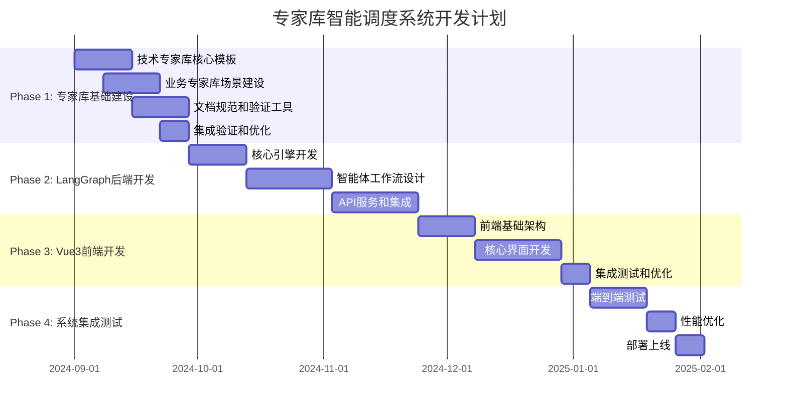

# 🚀 开发工作流程指南

## 📋 文档信息

- **版本**: v1.0.0
- **创建日期**: 2024-09-01
- **最后更新**: 2024-09-01
- **维护团队**: 项目管理团队
- **文档类型**: 开发流程指南

## 🎯 概述

本文档定义了专家库智能调度系统的完整开发工作流程，包括三个核心模块的开发计划、团队协作机制和质量保证流程。

## 📊 总体开发时间线



## 🔧 Phase 1: 专家库基础建设 (6周)

### Week 1-2: 技术专家库核心模板

**目标**: 建立技术专家库的核心框架和模板

**主要任务**:

- [ ] 设计算法模板库结构
- [ ] 创建5个核心算法模板（贪心、遗传、退火、动态规划、启发式）
- [ ] 建立约束模式库框架
- [ ] 定义10个常用约束模式（容量、时间窗口、优先级、资源、路径等）
- [ ] 创建目标函数库结构
- [ ] 制定技术文档格式规范

**交付物**:

- 算法模板文档 × 5
- 约束模式文档 × 10
- 目标函数模板 × 3
- 技术文档规范 v1.0

**验收标准**:

- [ ] 所有模板通过格式验证
- [ ] 代码示例可执行
- [ ] 参数配置完整
- [ ] LLM提示词模板有效

### Week 3-4: 业务专家库场景建设

**目标**: 建立业务专家库的典型场景和规则

**主要任务**:

- [ ] 建立业务场景库结构
- [ ] 创建3个典型业务场景（生鲜配送、制造调度、服务调度）
- [ ] 设计行业约束规则库
- [ ] 配置业务参数和KPI指标库
- [ ] 制定业务文档维护流程

**交付物**:

- 业务场景文档 × 3
- 约束规则库 × 1
- 参数配置库 × 1
- 业务文档规范 v1.0

**验收标准**:

- [ ] 场景描述完整准确
- [ ] 业务规则逻辑清晰
- [ ] KPI指标可量化
- [ ] 文档格式规范统一

### Week 5-6: 文档规范和验证工具

**目标**: 建立文档质量保证机制

**主要任务**:

- [ ] 开发文档格式验证工具
- [ ] 实现内容质量检查机制
- [ ] 建立版本控制流程
- [ ] 测试双层专家库协同机制
- [ ] 优化文档结构和检索性能

**交付物**:

- 文档验证工具 v1.0
- 质量检查脚本
- 版本控制规范
- 性能优化报告

**验收标准**:

- [ ] 验证工具功能完整
- [ ] 检查覆盖率 ≥ 95%
- [ ] 性能满足要求
- [ ] 流程文档完整

## 🤖 Phase 2: LangGraph后端开发 (8周)

### Week 7-8: 核心引擎开发

**目标**: 实现专家库解析和处理核心引擎

**主要任务**:

- [ ] 实现专家库文档解析引擎
- [ ] 开发Markdown文档加载器
- [ ] 建立模板处理和验证机制
- [ ] 设计智能体状态管理系统
- [ ] 实现缓存和性能优化

**技术栈**:

- Python 3.11+
- FastAPI框架
- Pydantic数据验证
- asyncio异步处理

**交付物**:

- 文档解析引擎 v1.0
- 模板处理器 v1.0
- 状态管理系统 v1.0
- 单元测试覆盖率 ≥ 90%

**验收标准**:

- [ ] 解析准确率 ≥ 99%
- [ ] 处理性能 < 500ms
- [ ] 内存使用 < 200MB
- [ ] 错误处理完善

### Week 9-11: 智能体工作流设计

**目标**: 实现LangGraph智能体工作流

**主要任务**:

- [ ] 实现6个核心智能体节点
  - 需求理解智能体
  - 领域识别智能体
  - 算法推荐智能体
  - 约束识别智能体
  - 目标确定智能体
  - 代码生成智能体
- [ ] 设计条件路由和错误处理
- [ ] 集成专家库查询和推荐逻辑
- [ ] 开发提示词生成和优化模块

**技术栈**:

- LangGraph框架
- LangChain集成
- OpenAI/Claude API
- Redis缓存

**交付物**:

- 智能体节点 × 6
- 工作流图定义
- 路由逻辑实现
- 提示词生成器

**验收标准**:

- [ ] 工作流执行成功率 ≥ 95%
- [ ] 智能体响应时间 < 2s
- [ ] 提示词质量评分 ≥ 85%
- [ ] 错误恢复机制有效

### Week 12-14: API服务和集成

**目标**: 构建完整的API服务和外部集成

**主要任务**:

- [ ] 构建FastAPI应用和路由
- [ ] 实现会话管理和权限控制
- [ ] 开发实时流式输出功能
- [ ] 集成OpenAI/Claude等LLM服务
- [ ] 实现监控和日志记录系统
- [ ] 部署Docker容器化方案

**技术栈**:

- FastAPI + Uvicorn
- PostgreSQL数据库
- Redis会话存储
- Docker容器化
- Prometheus监控

**交付物**:

- REST API v1.0
- 会话管理系统
- 监控日志系统
- Docker部署方案

**验收标准**:

- [ ] API响应时间 < 2s
- [ ] 并发支持 ≥ 100用户
- [ ] 系统可用性 ≥ 99.5%
- [ ] 安全机制完整

## 🎨 Phase 3: Vue3前端开发 (6周)

### Week 15-16: 前端基础架构

**目标**: 搭建Vue3前端应用基础框架

**主要任务**:

- [ ] 搭建Vue3 + TypeScript + Pinia项目
- [ ] 设计UI组件库和设计系统
- [ ] 实现路由管理和全局状态管理
- [ ] 集成API服务调用和错误处理
- [ ] 配置开发环境和构建工具

**技术栈**:

- Vue3 + Composition API
- TypeScript
- Pinia状态管理
- Vue Router 4
- Element Plus UI库
- Vite构建工具

**交付物**:

- 前端项目架构
- UI组件库 v1.0
- 路由配置
- API服务封装

**验收标准**:

- [ ] 项目结构清晰规范
- [ ] 组件复用率 ≥ 80%
- [ ] TypeScript覆盖率 ≥ 90%
- [ ] 构建性能优良

### Week 17-19: 核心界面开发

**目标**: 实现系统核心功能界面

**主要任务**:

- [ ] 专家库管理界面
  - 技术专家库管理
  - 业务专家库管理
  - 文档编辑器
- [ ] 算法生成界面
  - 需求输入向导
  - 进度跟踪界面
  - 结果展示界面
- [ ] 系统管理界面
  - 用户权限管理
  - 系统设置
  - 监控仪表盘

**交付物**:

- 专家库管理模块
- 算法生成模块
- 系统管理模块
- 响应式设计适配

**验收标准**:

- [ ] 界面美观易用
- [ ] 交互流程顺畅
- [ ] 响应式适配完整
- [ ] 无障碍访问支持

### Week 20: 集成测试和优化

**目标**: 前后端集成和用户体验优化

**主要任务**:

- [ ] 前后端接口联调
- [ ] 用户体验优化
- [ ] 性能调优和缓存策略
- [ ] 浏览器兼容性测试
- [ ] 用户培训材料准备

**交付物**:

- 集成测试报告
- 性能优化报告
- 兼容性测试报告
- 用户手册 v1.0

**验收标准**:

- [ ] 端到端功能正常
- [ ] 页面加载时间 < 3s
- [ ] 主流浏览器兼容
- [ ] 用户反馈积极

## 🔗 Phase 4: 系统集成测试 (4周)

### Week 21-22: 端到端测试

**目标**: 全系统功能和性能测试

**主要任务**:

- [ ] 功能测试覆盖
- [ ] 性能压力测试
- [ ] 安全漏洞扫描
- [ ] 数据备份恢复测试
- [ ] 灾难恢复演练

### Week 23: 性能优化

**目标**: 系统性能调优

**主要任务**:

- [ ] 数据库查询优化
- [ ] 缓存策略调整
- [ ] CDN配置优化
- [ ] 负载均衡配置

### Week 24: 部署上线

**目标**: 生产环境部署

**主要任务**:

- [ ] 生产环境配置
- [ ] 监控告警设置
- [ ] 用户培训实施
- [ ] 上线发布

## 👥 团队协作机制

### 🔬 专家库团队协作

#### 技术专家库团队

```yaml
团队组成:
  - 算法工程师 (2人)
  - 约束建模专家 (1人)
  - 优化专家 (1人)
  - 领域专家 (1人)

协作方式:
  - 周度同步会议
  - 文档交叉审核
  - 技术方案讨论
  - 质量标准制定

工作流程: 1. 需求分析和规划
  2. 模板设计和编写
  3. 同行评审和优化
  4. 测试验证和发布
```

#### 业务专家库团队

```yaml
团队组成:
  - 业务分析师 (2人)
  - 行业专家 (3人)
  - 参数分析师 (1人)
  - 质量保证专员 (1人)

协作方式:
  - 双周业务评审
  - 客户需求调研
  - 行业最佳实践收集
  - 场景验证测试

工作流程: 1. 业务场景调研
  2. 规则参数定义
  3. 文档编写维护
  4. 效果验证反馈
```

### ⚙️ 技术开发团队协作

#### 后端开发协作

```yaml
开发模式: Scrum敏捷开发
迭代周期: 2周一个Sprint
团队规模: 4人 (1架构师 + 3工程师)

日常协作:
  - 每日站会 (15分钟)
  - Sprint计划会议
  - 代码评审机制
  - 结对编程实践

技术实践:
  - TDD测试驱动开发
  - CI/CD持续集成
  - 代码质量门禁
  - 技术债务管理
```

#### 前端开发协作

```yaml
开发模式: 组件化开发
设计协作: 设计师-开发者协作
团队规模: 3人 (1UI设计师 + 2前端工程师)

协作工具:
  - Figma设计稿协作
  - Storybook组件库
  - Git分支管理
  - 代码规范检查

质量保证:
  - 组件单元测试
  - E2E自动化测试
  - 视觉回归测试
  - 无障碍访问测试
```

### 🔄 跨团队协作机制

#### 沟通机制

```yaml
定期会议:
  - 周一全员同步会 (30分钟)
  - 周三技术分享会 (60分钟)
  - 周五回顾总结会 (45分钟)
  - 月度项目评审会 (120分钟)

沟通渠道:
  - Slack即时通讯
  - 飞书文档协作
  - GitHub讨论区
  - 邮件正式通知

协作工具:
  - Jira项目管理
  - Confluence知识库
  - GitLab代码管理
  - Figma设计协作
```

#### 交付协调

```yaml
接口定义:
  - API接口规范优先
  - 前后端并行开发
  - Mock数据支持
  - 联调测试计划

依赖管理:
  - 依赖关系图维护
  - 阻塞问题升级
  - 风险提前识别
  - 应急方案准备
```

## 📊 质量保证流程

### 代码质量标准

```yaml
代码规范:
  python:
    - PEP 8编码规范
    - Black代码格式化
    - Pylint静态检查
    - MyPy类型检查

  typescript:
    - ESLint规则检查
    - Prettier格式化
    - TypeScript严格模式
    - Vue官方风格指南

测试要求:
  单元测试覆盖率: ≥ 90%
  集成测试覆盖率: ≥ 80%
  E2E测试覆盖率: ≥ 70%
  性能测试: 关键路径全覆盖
```

### 文档质量标准

```yaml
技术文档:
  - API文档自动生成
  - 代码注释覆盖率 ≥ 80%
  - 架构设计文档完整
  - 部署运维文档详细

专家库文档:
  - 格式规范验证 100%
  - 内容准确性审核
  - 版本变更记录
  - 使用反馈收集
```

### 发布质量门禁

```yaml
发布前检查:
  - 所有测试通过
  - 代码审核完成
  - 安全扫描通过
  - 性能基准达标
  - 文档更新同步

发布流程: 1. 功能分支合并
  2. 自动化测试执行
  3. 预发环境验证
  4. 生产环境部署
  5. 监控告警确认
```

## 🎯 里程碑和验收标准

### Phase 1里程碑: 专家库建设完成

**验收标准**:

- [ ] 技术专家库: 5类算法 + 10种约束 + 3类目标函数
- [ ] 业务专家库: 3个典型场景 + 完整业务规则库
- [ ] 文档质量: 格式验证100%，内容准确性≥95%
- [ ] 协同机制: 双层专家库协同工作正常
- [ ] 性能指标: 文档检索<500ms，解析准确率≥99%

### Phase 2里程碑: LangGraph后端完成

**验收标准**:

- [ ] 智能体工作流: 6个节点协同工作，成功率≥95%
- [ ] API服务: 响应时间<2s，并发支持≥100用户
- [ ] LLM集成: 代码生成成功率≥90%，质量评分≥85%
- [ ] 系统稳定性: 可用性≥99.5%，错误恢复机制有效
- [ ] 监控完整性: 日志记录完善，监控指标全面

### Phase 3里程碑: Vue3前端完成

**验收标准**:

- [ ] 功能完整性: 专家库管理+算法生成+系统管理
- [ ] 用户体验: 界面美观，交互流畅，响应式适配
- [ ] 性能指标: 页面加载<3s，操作响应<1s
- [ ] 兼容性: 主流浏览器100%兼容
- [ ] 无障碍: WCAG 2.1 AA标准合规

### Phase 4里程碑: 系统上线完成

**验收标准**:

- [ ] 端到端测试: 核心流程100%通过
- [ ] 性能测试: 满足预期负载要求
- [ ] 安全测试: 通过安全扫描，无高危漏洞
- [ ] 用户培训: 培训材料完整，用户反馈积极
- [ ] 生产部署: 监控告警正常，系统稳定运行

## 🚨 风险管理和应急预案

### 主要风险识别

```yaml
技术风险:
  - LangGraph框架学习成本高
  - LLM API稳定性依赖
  - 大规模数据处理性能
  - 前后端集成复杂度

资源风险:
  - 团队人员变动
  - 关键技能人员不足
  - 外部依赖延期
  - 预算超支风险

业务风险:
  - 需求变更频繁
  - 专家库质量不达标
  - 用户接受度低
  - 竞品压力增大
```

### 应急预案

```yaml
技术应急:
  - 备选技术方案准备
  - 核心功能降级策略
  - 数据备份恢复机制
  - 外部服务故障处理

团队应急:
  - 关键岗位备份培养
  - 外部专家咨询渠道
  - 任务重新分配预案
  - 加班和外包支持

进度应急:
  - 功能优先级排序
  - 并行开发策略
  - 快速原型验证
  - 分阶段交付计划
```

## 📈 成功指标和监控

### 项目成功指标

```yaml
交付指标:
  - 按时交付率: 100%
  - 质量达标率: ≥95%
  - 预算控制: ±10%以内
  - 功能完整度: 100%

技术指标:
  - 系统可用性: ≥99.5%
  - 响应时间: <2s
  - 代码质量分: ≥85分
  - 测试覆盖率: ≥85%

业务指标:
  - 用户满意度: ≥4.5/5.0
  - 专家库使用率: ≥80%
  - 算法生成成功率: ≥90%
  - 系统采用率: ≥70%
```

### 持续监控机制

```yaml
项目监控:
  - 周度进度跟踪
  - 月度质量评估
  - 季度成本分析
  - 实时风险预警

技术监控:
  - 系统性能监控
  - 错误日志分析
  - 用户行为统计
  - 资源使用分析
```

---

**使用说明**: 本指南为项目开发的官方流程标准，所有团队成员必须严格遵守。如需调整流程或遇到问题，请及时上报项目管理团队。
