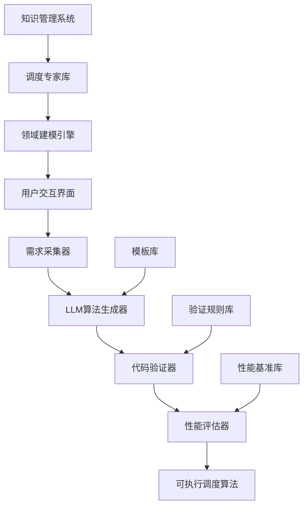
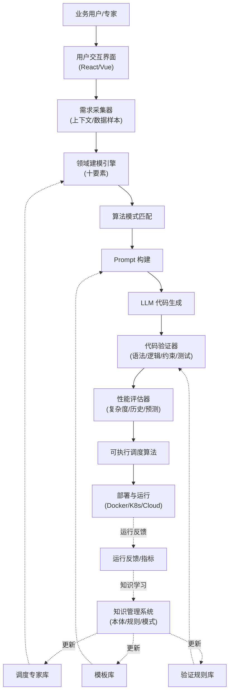
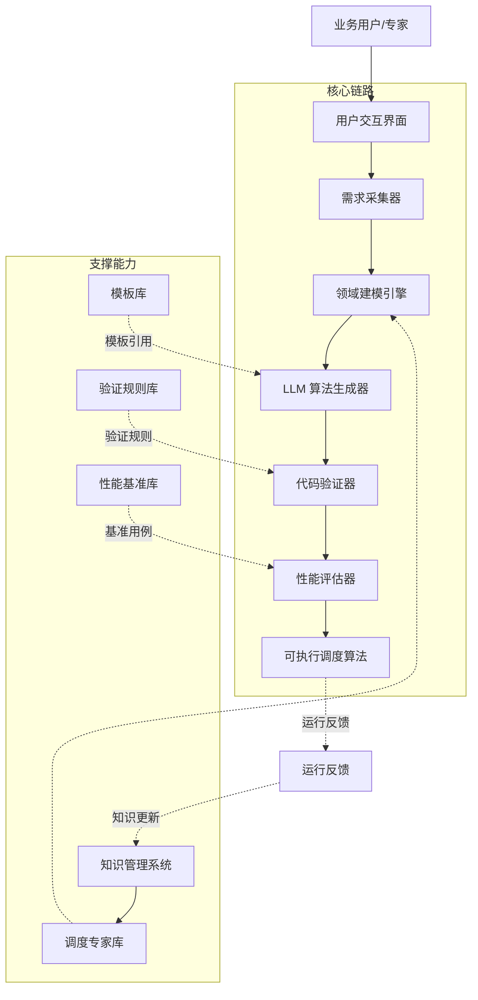
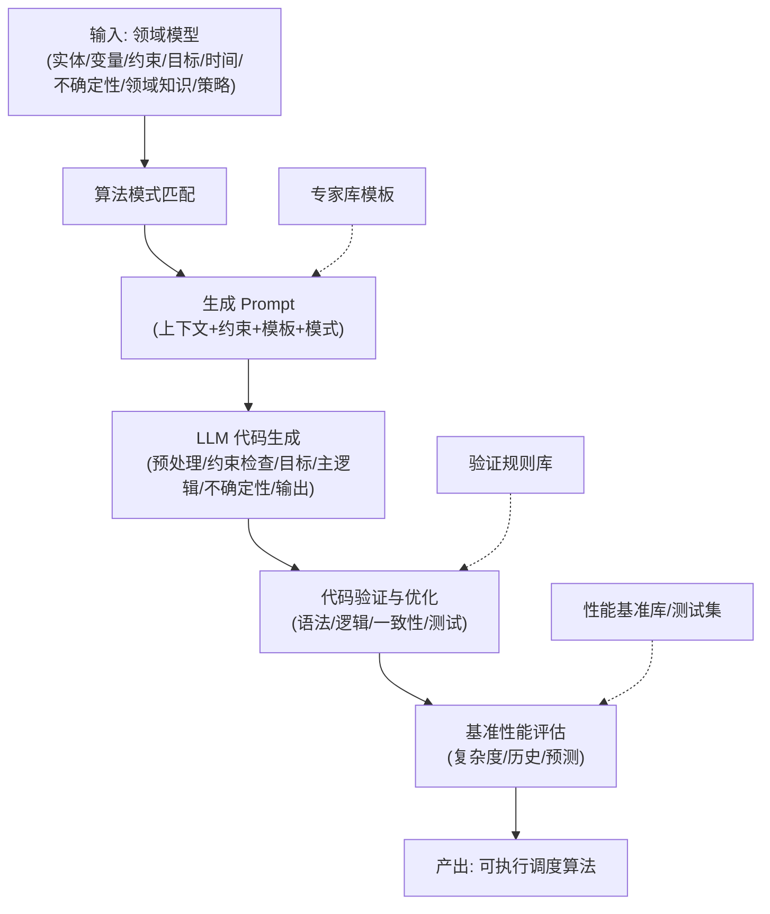
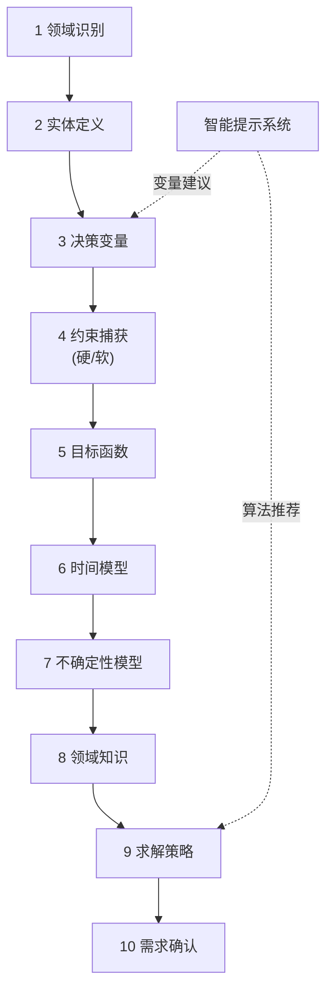
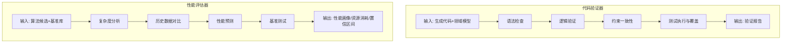
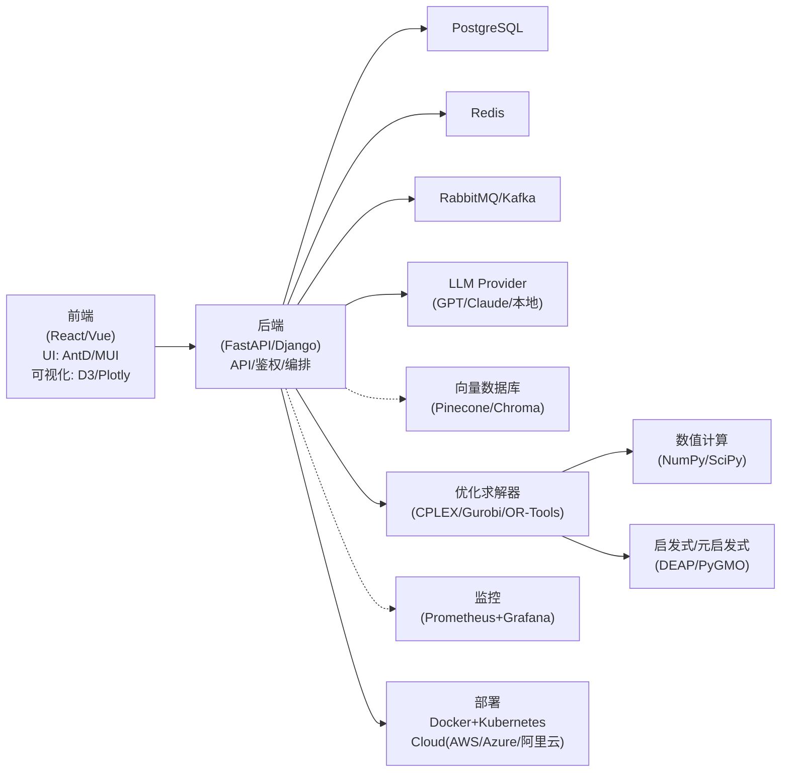
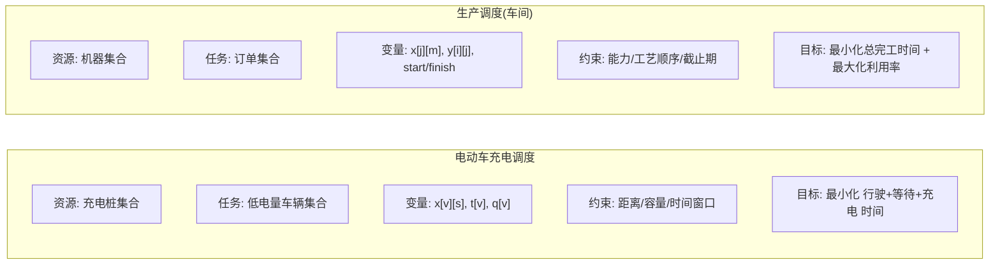

# 智能调度算法专家库系统设计方案

## 摘要

本文档提出了一个基于大模型的智能调度算法专家库系统设计方案。该系统通过抽象调度问题的通用模式，构建专家知识库，结合用户交互式建模，实现调度算法的自动生成。从传统的五要素调度模型深化为十要素完整建模框架，为各类调度场景提供智能化的算法解决方案。

## 1. 背景与动机

### 1.1 问题现状

当前调度算法开发面临以下挑战：

- **开发周期长**：从需求分析到算法实现通常需要数周到数月
- **专业门槛高**：需要深厚的运筹学和算法设计经验
- **重复造轮子**：相似的调度场景重复开发类似的算法
- **维护成本高**：业务变化时需要重新设计和实现算法
- **知识传承难**：专家经验难以标准化和复用

### 1.2 解决思路

通过构建**智能调度算法专家库系统**，实现：

- **知识抽象化**：将调度领域专家经验抽象为可复用的知识模式
- **交互式建模**：通过对话方式引导用户完成领域建模
- **自动算法生成**：基于大模型能力自动生成可执行的调度算法
- **快速迭代**：支持需求变化时的快速算法调整和优化

## 2. 调度问题抽象模型

### 2.1 传统五要素模型

经典的调度问题可以抽象为五个核心要素：

```
调度问题 = {资源集合, 任务集合, 决策变量, 约束集合, 目标函数}
```

#### 要素说明：

- **资源集合**：可用于执行任务的实体（机器、车辆、人员等）
- **任务集合**：需要被调度和执行的工作项
- **决策变量**：优化过程中需要确定的变量（分配关系、时间安排等）
- **约束集合**：必须满足的限制条件
- **目标函数**：衡量调度方案优劣的评价标准

### 2.2 十要素完整建模框架

深入分析后，我们发现完整的调度问题建模需要十个核心要素：

```
调度问题 = {
    资源集合,     # 可用资源
    任务集合,     # 待处理任务
    决策变量,     # 优化变量
    参数集合,     # 问题参数
    约束集合,     # 限制条件
    目标函数,     # 优化目标
    时间模型,     # 时间特性
    不确定性模型, # 随机因素
    领域知识,     # 专业规则
    求解策略      # 算法特征
}
```

#### 新增要素详解：

**参数集合**：定义决策变量之间的数值关系

- 成本参数：travel_cost, resource_cost, penalty_rate
- 容量参数：resource_capacity, task_demand, buffer_size
- 性能参数：processing_rate, efficiency_factor, quality_factor

**时间模型**：时间不仅是变量，更是基础维度

- 时间表示：连续时间、离散时间、事件驱动
- 时间范围：有限期、无限期、滚动期
- 时间约束：前序关系、时间窗口、周期性、同步性

**不确定性模型**：处理现实世界的随机性

- 随机参数：需求波动、处理时间变化、资源故障
- 建模方法：随机规划、鲁棒优化、模糊规划
- 求解策略：在线算法、场景方法、自适应算法

**领域知识**：标准数学模型无法捕获的专业规则

- 业务规则：优先级规则、兼容性约束、操作规范
- 专家启发式：问题分解策略、冲突解决经验
- 上下文因素：法规要求、安全协议、文化因素

**求解策略**：问题特征决定求解方法选择

- 精确方法：线性规划、整数规划、动态规划
- 启发式方法：贪心算法、局部搜索、构造算法
- 元启发式：遗传算法、模拟退火、禁忌搜索

## 3. 调度专家库系统架构

### 3.1 总体架构



### 3.2 核心组件设计

#### 3.2.1 调度专家库

专家库采用层次化知识表示结构：

```yaml
expert_library:
  # 算法模式库
  algorithm_patterns:
    - name: 'greedy_assignment'
      complexity: 'O(n*m)'
      suitable_for: ['real_time', 'small_scale']
      template: 'greedy_scheduler_template.py'

    - name: 'hungarian_method'
      complexity: 'O(n³)'
      suitable_for: ['optimal_solution', 'bipartite_matching']
      template: 'hungarian_template.py'

    - name: 'genetic_algorithm'
      complexity: 'O(generations * population * fitness)'
      suitable_for: ['complex_constraints', 'large_scale']
      template: 'ga_template.py'

  # 约束类型库
  constraint_types:
    - name: 'capacity_constraint'
      description: '资源容量限制'
      validation_function: 'check_capacity_feasibility'
      penalty_function: 'capacity_penalty'

    - name: 'time_window_constraint'
      description: '时间窗口约束'
      validation_function: 'check_time_window'
      penalty_function: 'time_penalty'

  # 目标函数库
  objective_functions:
    - name: 'minimize_total_time'
      formula: 'sum(travel_time + wait_time + service_time)'
      weight_factors: ['urgency', 'distance', 'efficiency']

    - name: 'maximize_utilization'
      formula: 'resource_usage / total_capacity'
      balance_factors: ['fairness', 'load_balancing']

  # 领域模板库
  domain_templates:
    vehicle_scheduling:
      entities: ['vehicles', 'stations', 'routes']
      typical_constraints: ['fuel_range', 'capacity', 'time_windows']
      common_objectives: ['minimize_distance', 'minimize_time']

    manufacturing:
      entities: ['jobs', 'machines', 'operators']
      typical_constraints: ['precedence', 'resource_capacity']
      common_objectives: ['minimize_makespan', 'maximize_throughput']
```

#### 3.2.2 领域建模引擎

采用对话式交互完成领域建模：

```python
class DomainModelingEngine:
    def __init__(self):
        self.conversation_flow = [
            self.identify_domain,        # 领域识别
            self.define_entities,        # 实体定义
            self.capture_constraints,    # 约束捕获
            self.specify_objectives,     # 目标确定
            self.model_uncertainty,      # 不确定性建模
            self.capture_domain_knowledge, # 领域知识获取
            self.select_solution_strategy, # 求解策略选择
            self.confirm_requirements    # 需求确认
        ]

    def identify_domain(self):
        """领域识别阶段"""
        questions = [
            "您要解决什么类型的调度问题？",
            "涉及的主要资源是什么？(车辆/机器/人员/...)",
            "需要分配的任务性质是什么？",
            "是实时调度还是离线规划？"
        ]
        return self.interactive_dialog(questions)

    def capture_constraints(self, entities):
        """约束捕获阶段"""
        questions = [
            "有哪些硬性限制条件？(必须满足)",
            "有哪些软性偏好？(尽量满足)",
            "是否有时间相关的约束？",
            "是否有资源容量限制？",
            "是否存在任务间的依赖关系？"
        ]
        return self.constraint_elicitation(questions, entities)
```

#### 3.2.3 LLM算法生成器

基于大模型的智能代码生成：

```python
class AlgorithmGenerator:
    def __init__(self, expert_library, llm_client):
        self.expert_library = expert_library
        self.llm = llm_client

    def generate_algorithm(self, domain_model):
        # 1. 算法模式匹配
        suitable_patterns = self.match_algorithm_patterns(domain_model)

        # 2. 构建生成提示
        prompt = self.build_generation_prompt(domain_model, suitable_patterns)

        # 3. LLM代码生成
        generated_code = self.llm.generate_code(prompt)

        # 4. 代码验证和优化
        validated_code = self.validate_and_optimize(generated_code, domain_model)

        return validated_code

    def build_generation_prompt(self, domain_model, patterns):
        return f"""
        # 调度算法生成任务

        ## 领域模型
        实体: {domain_model.entities}
        决策变量: {domain_model.decision_variables}
        约束: {domain_model.constraints}
        目标: {domain_model.objectives}
        时间模型: {domain_model.temporal_model}
        不确定性: {domain_model.uncertainty_model}

        ## 推荐算法模式
        {patterns}

        ## 专家库模板
        {self.expert_library.get_relevant_templates(domain_model)}

        请基于以上信息生成完整的调度算法代码，包括：
        1. 数据预处理函数
        2. 约束检查函数
        3. 目标函数计算
        4. 主调度逻辑
        5. 不确定性处理
        6. 结果输出格式

        代码要求：
        - 使用Python实现
        - 结构清晰，注释完整
        - 包含错误处理
        - 考虑性能优化
        """
```

### 3.3 多场景调度模式对比

#### 3.3.1 电动车充电调度

```python
problem_formulation = {
    "resources": "充电桩集合",
    "tasks": "低电量车辆集合",
    "decision_variables": {
        "assignment": "x[v][s] = 车辆v是否使用充电桩s",
        "start_time": "t[v] = 车辆v开始充电时间",
        "charge_amount": "q[v] = 车辆v充电量"
    },
    "constraints": [
        "距离可达性: range[v] >= distance[v][s]",
        "充电桩容量: sum(x[v][s]) <= capacity[s]",
        "时间窗口: earliest[s] <= t[v] <= latest[s]"
    ],
    "objective": "minimize(行驶时间 + 等待时间 + 充电时间)",
    "uncertainty": "需求到达的随机性、交通状况变化",
    "domain_knowledge": "高峰期充电策略、电池特性、地理限制"
}
```

#### 3.3.2 生产调度

```python
problem_formulation = {
    "resources": "生产机器集合",
    "tasks": "生产订单集合",
    "decision_variables": {
        "assignment": "x[j][m] = 工件j是否在机器m上加工",
        "sequence": "y[i][j] = 工件i是否在工件j之前加工",
        "timing": "start_time[j], completion_time[j]"
    },
    "constraints": [
        "机器能力: capability[m] >= requirement[j]",
        "工艺顺序: precedence[i][j] 前序关系",
        "截止日期: completion_time[j] <= deadline[j]"
    ],
    "objective": "minimize(总完工时间) + maximize(设备利用率)",
    "uncertainty": "设备故障、需求变更、质量问题",
    "domain_knowledge": "工艺路线、设备特性、质量要求"
}
```

## 4. 用户交互流程设计

### 4.1 交互式建模流程

```python
# 示例对话流程
conversation_example = {
    "step_1_domain_identification": {
        "ai": "您好！请告诉我您要解决什么调度问题？",
        "user": "我需要为物流配送车辆安排路线和时间",
        "ai": "明白！这是车辆路径规划问题。涉及车辆、配送点、货物，对吗？"
    },

    "step_2_entity_definition": {
        "ai": "请描述您的车辆有哪些重要属性？",
        "user": "载重限制、续航里程、当前位置、司机工作时间",
        "ai": "配送任务有什么特点？",
        "user": "重量、体积、配送地址、时间窗口要求"
    },

    "step_3_decision_variables": {
        "ai": "您需要决定什么？分配关系还是时间安排？",
        "user": "需要决定哪辆车去哪些地点，什么时间到达",
        "ai": "明白，需要路径分配和时间调度变量"
    },

    "step_4_constraint_capture": {
        "ai": "有哪些必须遵守的限制条件？",
        "user": "载重不超限、时间窗口内到达、司机不超时",
        "ai": "有软性偏好吗？",
        "user": "减少总行驶距离、平衡各车辆工作量"
    },

    "step_5_uncertainty_modeling": {
        "ai": "是否存在不确定因素？",
        "user": "交通拥堵、临时订单、客户取消",
        "ai": "推荐使用鲁棒优化处理交通不确定性"
    },

    "step_6_algorithm_generation": {
        "ai": "基于需求，推荐改进贪心算法+局部优化。生成中...",
        "result": "完整的车辆路径调度算法代码"
    }
}
```

### 4.2 智能提示系统

```python
class IntelligentPromptSystem:
    def suggest_decision_variables(self, entities, domain):
        """基于实体和领域智能推荐决策变量"""
        suggestions = []

        if "vehicles" in entities and "locations" in entities:
            suggestions.append({
                "type": "binary_matrix",
                "name": "route_assignment",
                "meaning": "车辆是否经过某条路线"
            })

        if "time_windows" in domain.constraints:
            suggestions.append({
                "type": "continuous_vector",
                "name": "arrival_time",
                "meaning": "到达各地点的时间"
            })

        return suggestions

    def recommend_algorithms(self, problem_characteristics):
        """基于问题特征推荐算法"""
        if problem_characteristics.size == "small" and problem_characteristics.quality == "optimal":
            return ["integer_programming", "branch_and_bound"]
        elif problem_characteristics.real_time and problem_characteristics.size == "large":
            return ["greedy_heuristics", "local_search"]
        else:
            return ["genetic_algorithm", "simulated_annealing"]
```

## 5. 技术实现方案

### 5.1 系统技术栈

```yaml
technology_stack:
  backend:
    framework: 'FastAPI / Django'
    database: 'PostgreSQL + Redis'
    message_queue: 'RabbitMQ / Kafka'

  ai_integration:
    llm_provider: 'OpenAI GPT-4 / Claude / 本地模型'
    embedding: 'text-embedding-ada-002'
    vector_database: 'Pinecone / Chroma'

  algorithm_runtime:
    optimization: 'CPLEX / Gurobi / OR-Tools'
    numerical: 'NumPy / SciPy'
    heuristics: 'DEAP / PyGMO'

  frontend:
    framework: 'React / Vue.js'
    visualization: 'D3.js / Plotly'
    ui_library: 'Ant Design / Material-UI'

  deployment:
    containerization: 'Docker + Kubernetes'
    cloud_platform: 'AWS / Azure / 阿里云'
    monitoring: 'Prometheus + Grafana'
```

### 5.2 核心算法实现

#### 5.2.1 代码验证框架

```python
class CodeValidator:
    def __init__(self):
        self.syntax_checker = PythonSyntaxChecker()
        self.logic_verifier = LogicVerifier()
        self.performance_tester = PerformanceTester()

    def validate(self, generated_code, domain_model):
        validation_results = {}

        # 1. 语法检查
        validation_results['syntax'] = self.syntax_checker.check(generated_code)

        # 2. 逻辑验证
        validation_results['logic'] = self.logic_verifier.verify(
            generated_code, domain_model
        )

        # 3. 约束一致性检查
        validation_results['constraints'] = self.check_constraint_consistency(
            generated_code, domain_model.constraints
        )

        # 4. 性能基准测试
        validation_results['performance'] = self.performance_tester.benchmark(
            generated_code, domain_model.test_cases
        )

        return validation_results

    def check_constraint_consistency(self, code, constraints):
        """检查生成的代码是否正确实现了所有约束"""
        implemented_constraints = self.extract_constraints_from_code(code)
        missing_constraints = set(constraints) - set(implemented_constraints)

        return {
            'implemented': implemented_constraints,
            'missing': missing_constraints,
            'consistency_score': len(implemented_constraints) / len(constraints)
        }
```

#### 5.2.2 性能预测模型

```python
class PerformancePredictor:
    def __init__(self):
        self.complexity_analyzer = ComplexityAnalyzer()
        self.historical_data = HistoricalPerformanceDB()

    def predict_performance(self, algorithm_type, problem_size, constraints_count):
        """预测算法在给定问题规模下的性能"""

        # 理论复杂度分析
        theoretical_complexity = self.complexity_analyzer.analyze(algorithm_type)

        # 基于历史数据的实际性能预测
        similar_cases = self.historical_data.find_similar_cases(
            algorithm_type, problem_size, constraints_count
        )

        empirical_performance = self.interpolate_performance(similar_cases)

        return {
            'theoretical_complexity': theoretical_complexity,
            'predicted_runtime': empirical_performance['runtime'],
            'predicted_memory': empirical_performance['memory'],
            'confidence_interval': empirical_performance['confidence']
        }
```

### 5.3 知识管理系统

#### 5.3.1 知识表示

```python
class KnowledgeBase:
    def __init__(self):
        self.ontology = SchedulingOntology()
        self.rule_engine = RuleEngine()
        self.pattern_library = PatternLibrary()

    def add_domain_knowledge(self, domain, knowledge_item):
        """添加领域特定知识"""
        structured_knowledge = self.ontology.structure(knowledge_item)
        self.pattern_library.index(structured_knowledge)

        if knowledge_item.type == "rule":
            self.rule_engine.add_rule(structured_knowledge)

    def query_relevant_knowledge(self, problem_context):
        """根据问题上下文查询相关知识"""
        relevant_patterns = self.pattern_library.search(problem_context)
        applicable_rules = self.rule_engine.match_rules(problem_context)

        return {
            'patterns': relevant_patterns,
            'rules': applicable_rules,
            'confidence_scores': self.calculate_relevance_scores(
                relevant_patterns, applicable_rules, problem_context
            )
        }
```

#### 5.3.2 知识学习与更新

```python
class KnowledgeLearningSystem:
    def __init__(self):
        self.feedback_analyzer = FeedbackAnalyzer()
        self.pattern_miner = PatternMiner()
        self.knowledge_updater = KnowledgeUpdater()

    def learn_from_usage(self, algorithm_instance, performance_feedback):
        """从使用反馈中学习"""

        # 分析反馈模式
        feedback_patterns = self.feedback_analyzer.extract_patterns(
            algorithm_instance, performance_feedback
        )

        # 挖掘新的知识模式
        new_patterns = self.pattern_miner.mine_patterns(feedback_patterns)

        # 更新知识库
        for pattern in new_patterns:
            if pattern.confidence > 0.8:  # 高置信度模式
                self.knowledge_updater.add_pattern(pattern)
            elif pattern.conflicts_with_existing():
                self.knowledge_updater.flag_for_review(pattern)
```

## 6. 实现挑战与解决方案

### 6.1 主要挑战

#### 6.1.1 复杂约束的形式化表示

**挑战**：用户描述的约束往往是自然语言，需要转换为数学形式

**解决方案**：约束描述语言(CDL)

```python
constraint_dsl = """
CONSTRAINT capacity_limit:
    FOR EACH vehicle v:
        sum(task.weight for task in v.assigned_tasks) <= v.max_capacity

CONSTRAINT time_window:
    FOR EACH task t:
        t.start_time >= t.earliest_start AND
        t.end_time <= t.latest_end

CONSTRAINT precedence:
    FOR EACH task_pair (i, j) WHERE precedence_required(i, j):
        completion_time[i] <= start_time[j]
```

#### 6.1.2 算法性能可预测性

**挑战**：生成算法的性能难以预先评估

**解决方案**：多层次性能模型

```python
performance_models = {
    "theoretical": {
        "greedy": lambda n, m: (n * m, "O(n*m)"),
        "genetic": lambda n, g, p: (n * g * p, "O(n*g*p)"),
        "exact": lambda n: (2**n, "O(2^n)")
    },

    "empirical": {
        "small_scale": "基于历史数据的回归模型",
        "large_scale": "基于采样的估算模型",
        "real_time": "基于在线学习的预测模型"
    },

    "hybrid": "理论模型 + 经验修正 + 机器学习预测"
}
```

#### 6.1.3 代码质量保证

**挑战**：自动生成的代码质量难以保证

**解决方案**：多层验证机制

```python
class QualityAssurance:
    def __init__(self):
        self.validators = [
            SyntaxValidator(),      # 语法正确性
            LogicValidator(),       # 逻辑一致性
            PerformanceValidator(), # 性能合理性
            SecurityValidator(),    # 安全性检查
            TestValidator()         # 测试覆盖率
        ]

    def validate_generated_code(self, code, requirements):
        validation_report = {}

        for validator in self.validators:
            result = validator.validate(code, requirements)
            validation_report[validator.name] = result

            if result.status == "FAILED" and result.critical:
                return self.trigger_regeneration(code, result.issues)

        return validation_report
```

### 6.2 技术难点解决

#### 6.2.1 大模型幻觉问题

**问题**：LLM可能生成看似合理但实际错误的代码

**解决策略**：

1. **模板约束**：基于验证过的算法模板生成
2. **多轮验证**：生成-验证-修正的迭代过程
3. **专家审核**：关键算法由专家最终审核
4. **测试驱动**：先生成测试用例，再生成算法

#### 6.2.2 领域知识集成

**问题**：如何有效整合不同领域的专业知识

**解决策略**：

1. **本体建模**：构建领域本体和知识图谱
2. **规则引擎**：支持if-then规则的动态执行
3. **知识众包**：建立专家贡献和审核机制
4. **持续学习**：从实际使用中学习和更新知识

## 7. 商业价值与应用前景

### 7.1 直接经济价值

#### 7.1.1 成本节约

- **开发时间**：从数周缩短到数小时，提升效率10-50倍
- **人力成本**：减少对高级算法工程师的依赖
- **维护成本**：业务变化时快速调整，避免重新开发

#### 7.1.2 质量提升

- **算法质量**：基于专家知识和验证过的模板
- **一致性**：标准化的建模和实现流程
- **可靠性**：多层验证机制保证代码质量

### 7.2 应用场景

#### 7.2.1 企业内部应用

- **制造企业**：生产计划与车间调度
- **物流企业**：配送路径与仓储调度
- **服务企业**：人员排班与资源分配
- **能源企业**：设备调度与负荷分配

#### 7.2.2 咨询服务

- **管理咨询**：为客户快速交付定制调度方案
- **软件服务**：调度算法即服务(Scheduling-as-a-Service)
- **行业解决方案**：垂直行业的专业调度系统

#### 7.2.3 教育培训

- **高校教学**：运筹学与算法设计教学平台
- **企业培训**：调度优化的内训系统
- **在线教育**：调度算法的可视化学习工具

### 7.3 市场前景

全球调度优化软件市场预计将从2023年的15亿美元增长到2030年的35亿美元，年复合增长率约13%。智能调度算法专家库系统有望占据其中的重要份额。

## 8. 实施路线图

### 8.1 第一阶段：MVP验证（3-6个月）

**目标**：验证核心概念可行性

**主要任务**：

- 构建基础专家库（5-10个经典算法模板）
- 实现简单的用户交互流程
- 集成基础LLM代码生成能力
- 开发核心验证机制
- 完成2-3个典型场景的验证

**关键里程碑**：

- 成功生成可执行的调度算法
- 用户反馈验证系统易用性
- 性能测试证明算法有效性

### 8.2 第二阶段：功能完善（6-12个月）

**目标**：构建完整的产品功能

**主要任务**：

- 扩展专家库覆盖10+领域
- 优化用户交互体验和智能提示
- 增强代码验证和自动优化能力
- 开发性能预测和比较功能
- 集成主流优化求解器
- 建立知识管理和学习系统

**关键里程碑**：

- 支持主要调度场景类型
- 算法生成质量达到专家水平
- 系统稳定性和可扩展性验证

### 8.3 第三阶段：生产就绪（12-18个月）

**目标**：实现商业化部署

**主要任务**：

- 构建完整的测试和质量保证体系
- 实现算法性能自动调优
- 开发企业级管理和监控功能
- 集成主流开发工具链
- 建立商业模式和服务体系
- 进行大规模用户测试和反馈优化

**关键里程碑**：

- 通过企业级安全和合规认证
- 建立稳定的商业化运营模式
- 获得标杆客户和成功案例

## 9. 总结与展望

### 9.1 创新价值

智能调度算法专家库系统代表了调度理论、人工智能和软件工程的深度融合，具有以下创新价值：

1. **理论创新**：从五要素到十要素的完整调度建模框架
2. **技术创新**：基于大模型的算法自动生成技术
3. **应用创新**：调度算法的民主化和普惠化
4. **商业创新**：算法即服务的新型商业模式

### 9.2 预期影响

#### 9.2.1 对调度领域的影响

- **降低技术门槛**：非专业人员也能获得高质量调度算法
- **加速创新**：快速原型和迭代促进算法创新
- **知识传承**：专家经验的标准化和可复用

#### 9.2.2 对相关产业的影响

- **制造业**：提升生产效率和资源利用率
- **物流业**：优化配送网络和降低运营成本
- **服务业**：改善资源配置和服务质量

### 9.3 未来发展方向

1. **多模态交互**：支持语音、图像等多种交互方式
2. **实时自适应**：动态环境下的在线算法调整
3. **知识图谱**：构建更丰富的调度领域知识图谱
4. **联邦学习**：多方协作的分布式知识学习
5. **量子计算**：探索量子算法在调度优化中的应用

智能调度算法专家库系统不仅是一个技术创新项目，更是推动调度优化技术普及和应用的重要基础设施。通过系统的设计和实施，我们有望在调度算法领域实现重要突破，为各行各业的效率提升贡献重要价值。

## 附录：架构与流程图

### A1. 00-端到端流程



### A2. 01-总体架构



### A3. 02-算法生成流程



### A4. 03-领域建模流程（十要素）



### A5. 04-验证与性能评估



### A6. 06-部署与技术栈视图



### A7. 07-典型场景结构（示例）


