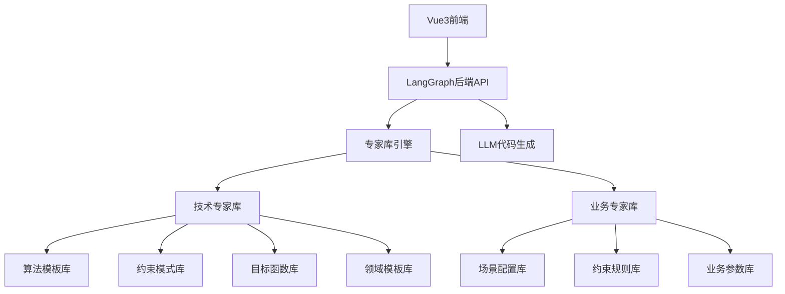
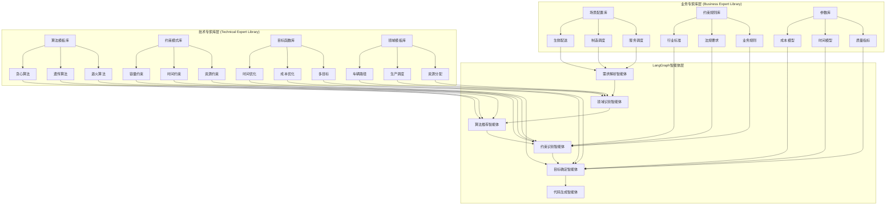
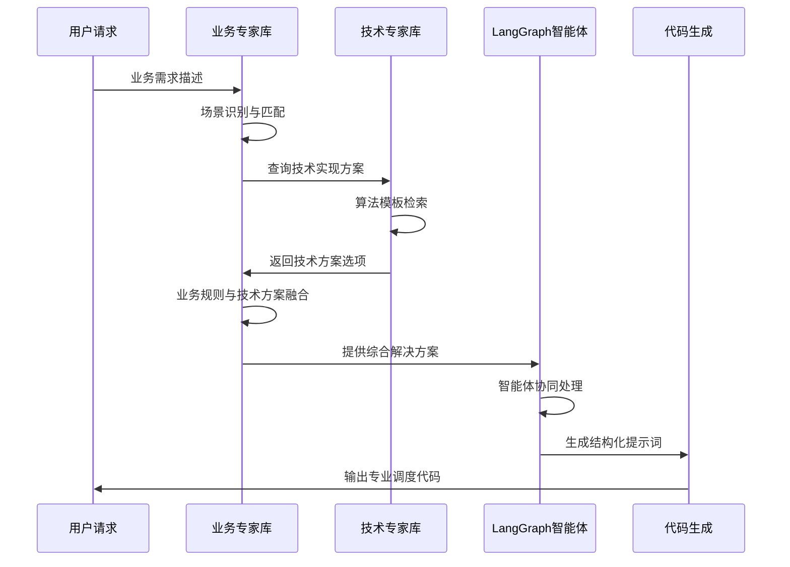

# 🏗️ 专家库智能调度系统 - 系统架构设计方案

## 📋 文档信息

- **版本**: v1.0.0
- **创建日期**: 2024-09-01
- **最后更新**: 2024-09-01
- **维护团队**: 系统架构团队
- **文档类型**: 系统架构设计

## 🎯 总体架构概览

基于专家库系统设计，采用**技术专家库 + 业务专家库**双层架构，支持模块化开发和维护。



## 📊 模块化拆分方案

### 1️⃣ 专家库文档模块 (Expert Library Documentation)

#### 1.1 技术专家库 (Technical Expert Library)

**特点**: 相对稳定，变化频率低，面向技术实现

**模块结构**:

```
expert_library_docs/
├── technical/                     # 技术专家库
│   ├── algorithms/                # 算法模板库
│   │   ├── README.md             # 算法模板规范说明
│   │   ├── greedy/               # 贪心算法类
│   │   │   ├── template.md       # 算法模板定义
│   │   │   ├── parameters.md     # 参数配置规范
│   │   │   └── examples.md       # 实现示例
│   │   ├── genetic/              # 遗传算法类
│   │   ├── simulated_annealing/  # 模拟退火类
│   │   └── dynamic_programming/  # 动态规划类
│   │
│   ├── constraints/              # 约束模式库
│   │   ├── README.md            # 约束模式规范
│   │   ├── capacity/            # 容量约束
│   │   ├── time_window/         # 时间窗口约束
│   │   ├── precedence/          # 优先级约束
│   │   └── resource/            # 资源约束
│   │
│   ├── objectives/              # 目标函数库
│   │   ├── README.md           # 目标函数规范
│   │   ├── time_minimization/  # 时间最小化
│   │   ├── cost_minimization/  # 成本最小化
│   │   ├── utilization_max/    # 利用率最大化
│   │   └── multi_objective/    # 多目标优化
│   │
│   ├── domains/                # 领域模板库
│   │   ├── README.md          # 领域模板规范
│   │   ├── vehicle_routing/   # 车辆路径规划
│   │   ├── production_scheduling/ # 生产调度
│   │   ├── service_scheduling/    # 服务调度
│   │   └── resource_allocation/   # 资源分配
│   │
│   └── system_prompts/        # 系统提示词模板
│       ├── code_generation/   # 代码生成提示词
│       ├── algorithm_selection/ # 算法选择提示词
│       └── validation/        # 验证提示词
```

#### 1.2 业务专家库 (Business Expert Library)

**特点**: 变化频繁，面向具体业务场景，需要经常维护

**模块结构**:

```
expert_library_docs/
├── business/                      # 业务专家库
│   ├── scenarios/                # 业务场景库
│   │   ├── README.md            # 场景配置规范
│   │   ├── fresh_delivery/      # 生鲜配送场景
│   │   │   ├── scenario.md      # 场景描述
│   │   │   ├── constraints.md   # 特有约束条件
│   │   │   ├── parameters.md    # 业务参数
│   │   │   └── examples.md      # 典型案例
│   │   ├── manufacturing/       # 制造业场景
│   │   ├── healthcare/          # 医疗场景
│   │   └── logistics/           # 物流场景
│   │
│   ├── constraint_rules/        # 约束规则库
│   │   ├── README.md           # 约束规则规范
│   │   ├── industry_standards/ # 行业标准约束
│   │   ├── regulatory/         # 法规约束
│   │   └── business_rules/     # 业务规则约束
│   │
│   ├── parameters/             # 业务参数库
│   │   ├── README.md          # 参数配置规范
│   │   ├── cost_models/       # 成本模型参数
│   │   ├── time_models/       # 时间模型参数
│   │   └── quality_metrics/   # 质量指标参数
│   │
│   └── templates/             # 业务模板库
│       ├── input_schemas/     # 输入数据模式
│       ├── output_formats/    # 输出格式模板
│       └── validation_rules/  # 业务验证规则
```

### 2️⃣ LangGraph后端模块 (Backend Intelligence Module)

**模块结构**:

```
langgraph_backend/
├── core/                       # 核心引擎
│   ├── expert_engine.py       # 专家库解析引擎
│   ├── document_loader.py     # 文档加载器
│   ├── template_processor.py  # 模板处理器
│   └── prompt_generator.py    # 提示词生成器
│
├── agents/                    # LangGraph智能体
│   ├── requirement_agent.py  # 需求理解智能体
│   ├── domain_agent.py       # 领域识别智能体
│   ├── algorithm_agent.py    # 算法推荐智能体
│   ├── constraint_agent.py   # 约束识别智能体
│   ├── objective_agent.py    # 目标确定智能体
│   └── generation_agent.py   # 代码生成智能体
│
├── workflows/                 # 工作流定义
│   ├── scheduling_workflow.py # 调度算法生成工作流
│   ├── optimization_workflow.py # 优化工作流
│   └── validation_workflow.py   # 验证工作流
│
├── api/                       # API接口层
│   ├── v1/                   # API版本1
│   │   ├── scheduling.py     # 调度相关API
│   │   ├── expert_library.py # 专家库管理API
│   │   └── generation.py     # 代码生成API
│   └── middleware/           # 中间件
│
├── services/                 # 业务服务层
│   ├── document_service.py   # 文档服务
│   ├── template_service.py   # 模板服务
│   ├── generation_service.py # 生成服务
│   └── validation_service.py # 验证服务
│
└── utils/                    # 工具类
    ├── document_parser.py    # 文档解析器
    ├── template_validator.py # 模板验证器
    └── code_formatter.py     # 代码格式化
```

### 3️⃣ Vue3前端模块 (Frontend Interface Module)

**模块结构**:

```
vue3_frontend/
├── src/
│   ├── views/                     # 页面视图
│   │   ├── ExpertLibraryManager/  # 专家库管理
│   │   │   ├── TechnicalLibrary.vue # 技术专家库管理
│   │   │   ├── BusinessLibrary.vue  # 业务专家库管理
│   │   │   └── DocumentEditor.vue   # 文档编辑器
│   │   ├── AlgorithmGenerator/     # 算法生成器
│   │   │   ├── RequirementInput.vue # 需求输入
│   │   │   ├── ProgressTracker.vue  # 进度跟踪
│   │   │   └── ResultViewer.vue     # 结果查看
│   │   └── Dashboard/              # 仪表盘
│   │
│   ├── components/               # 组件库
│   │   ├── ExpertLibrary/       # 专家库组件
│   │   │   ├── DocumentTree.vue # 文档树
│   │   │   ├── MarkdownEditor.vue # Markdown编辑器
│   │   │   └── TemplateForm.vue   # 模板表单
│   │   ├── Algorithm/           # 算法相关组件
│   │   │   ├── WorkflowViewer.vue # 工作流查看器
│   │   │   ├── ParameterEditor.vue # 参数编辑器
│   │   │   └── CodeViewer.vue      # 代码查看器
│   │   └── Common/              # 通用组件
│   │
│   ├── stores/                  # 状态管理
│   │   ├── expertLibrary.js    # 专家库状态
│   │   ├── algorithm.js        # 算法生成状态
│   │   └── user.js             # 用户状态
│   │
│   ├── services/               # 服务层
│   │   ├── expertLibraryApi.js # 专家库API
│   │   ├── algorithmApi.js     # 算法API
│   │   └── documentApi.js      # 文档API
│   │
│   └── utils/                  # 工具类
│       ├── markdownParser.js   # Markdown解析
│       ├── templateValidator.js # 模板验证
│       └── codeFormatter.js     # 代码格式化
```

## 🏗️ 分层架构设计



### 🔄 双层协同工作机制

#### 1. 分层职责定义

```yaml
技术专家库职责:
  维护频率: 低 (月度/季度更新)
  维护人员: 算法工程师、系统架构师
  内容类型:
    - 算法实现模板和参数配置
    - 通用约束模式和检查逻辑
    - 标准目标函数和优化策略
    - 领域抽象模型和接口定义
  稳定性要求: 高
  复用性: 跨场景复用

业务专家库职责:
  维护频率: 高 (周度/日常更新)
  维护人员: 业务分析师、产品经理、行业专家
  内容类型:
    - 具体业务场景和行业规则
    - 动态约束条件和业务参数
    - 个性化目标权重和KPI指标
    - 客户定制化需求和特殊规则
  灵活性要求: 高
  针对性: 场景特定优化
```

#### 2. 协同工作流程



## 🛠️ 技术栈选型

```yaml
专家库文档:
  格式: Markdown + YAML Front Matter
  版本控制: Git + GitHub/GitLab
  文档工具: MkDocs / VuePress
  验证工具: 自定义Python脚本

后端技术栈:
  语言: Python 3.11+
  框架: FastAPI + LangGraph
  数据库: PostgreSQL + Redis
  LLM: OpenAI GPT-4 / Anthropic Claude
  部署: Docker + Kubernetes
  监控: Prometheus + Grafana

前端技术栈:
  语言: TypeScript
  框架: Vue3 + Pinia + Vue Router
  UI组件: Element Plus / Ant Design Vue
  构建工具: Vite
  代码质量: ESLint + Prettier
  测试: Vitest + Playwright
```

## 🎯 设计原则和优势

### 设计原则

1. **分离关注点**: 技术实现与业务逻辑分离
2. **高内聚低耦合**: 模块内部紧密相关，模块间松散耦合
3. **可扩展性**: 支持新算法、新场景的快速接入
4. **可维护性**: 清晰的代码结构和文档规范
5. **可测试性**: 每个模块都可独立测试和验证

### 核心优势

1. **技术稳定性** - 技术专家库变化少，保证系统稳定性
2. **业务灵活性** - 业务专家库快速响应市场变化
3. **维护效率** - 分工明确，业务团队专注业务场景维护
4. **可扩展性** - 新增业务场景只需更新业务专家库
5. **质量保证** - 技术规范和业务逻辑分离，降低错误风险

## 📋 关键决策记录

### ADR-001: 双层专家库架构

**决策**: 采用技术专家库 + 业务专家库双层架构
**原因**: 技术实现相对稳定，业务场景变化频繁，分离管理提高维护效率
**后果**: 需要建立跨层协调机制，增加系统复杂度

### ADR-002: LangGraph作为智能体框架

**决策**: 选择LangGraph作为智能体编排框架
**原因**: 提供状态管理、条件路由、错误处理等企业级特性
**后果**: 学习成本较高，但提供更好的可观测性和调试能力

### ADR-003: Markdown作为专家库文档格式

**决策**: 使用Markdown + YAML Front Matter作为文档格式
**原因**: 人类可读性好，版本控制友好，工具生态完善
**后果**: 需要开发自定义验证工具确保格式规范

## 🔄 版本控制和更新策略

### 版本管理

- **主版本**: 架构重大变更
- **次版本**: 新功能模块添加
- **修订版本**: Bug修复和小优化

### 更新频率

- **技术专家库**: 月度评审，季度更新
- **业务专家库**: 周度更新，实时调整
- **系统代码**: 持续集成，月度发布

### 兼容性保证

- **向后兼容**: 新版本支持旧版本文档格式
- **平滑迁移**: 提供自动化迁移工具
- **版本标记**: 明确标识文档和API版本

## 📊 性能和扩展性设计

### 性能目标

- **API响应时间**: < 2秒
- **专家库查询延迟**: < 500ms
- **LLM代码生成时间**: < 30秒
- **系统可用性**: > 99.5%

### 扩展性设计

- **水平扩展**: 支持多实例负载均衡
- **存储扩展**: 支持分布式文件存储
- **缓存策略**: 多级缓存提高查询性能
- **异步处理**: 长时间任务异步执行

## 🔒 安全性和合规性

### 安全措施

- **身份认证**: JWT令牌认证
- **权限控制**: RBAC角色权限管理
- **数据加密**: 传输和存储加密
- **API限流**: 防止恶意请求攻击

### 合规要求

- **数据隐私**: 遵循GDPR数据保护规范
- **审计日志**: 完整的操作审计记录
- **备份恢复**: 定期数据备份和灾难恢复
- **监控告警**: 实时安全监控和威胁检测

## 📚 相关文档索引

### Agent系统文档

专家库Agent系统的完整文档位于 [`docs/agents/`](../agents/) 目录：

- **[Agent文档中心](../agents/README.md)** - Agent系统总览和快速开始指南
- **[核心架构设计](../agents/架构设计/智能调度专家库Agent架构设计.md)** - Agent as Doc架构详细设计
- **[技术规范](../agents/技术规范/)** - 各层级Agent的标准规范
- **[框架设计](../agents/框架设计/)** - 协作、安全、冲突解决等框架
- **[模板指南](../agents/模板指南/)** - Agent开发模板和使用指南
- **[实例示例](../agents/示例文档/)** - 典型Agent的完整实现示例

### 系统设计文档

- **[专家库设计](./专家库/)** - 传统专家库设计文档（已升级为Agent系统）
- **[技术文档](../技术文档/)** - 系统技术实现细节
- **[API文档](../API文档/)** - 系统API接口规范

---

**文档维护**: 本文档随系统演进持续更新，请确保使用最新版本进行开发工作。

**架构演进**: 系统已从传统专家库架构升级为Agent as Doc架构，详细设计请参考Agent文档中心。
