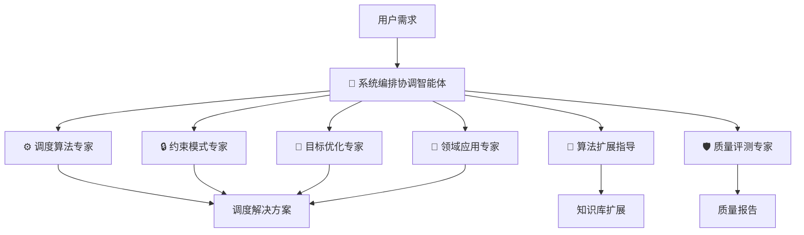

# Advanced Planning & Scheduling (APS) Module

**BMAD-CORE v6 模块 | Version 1.0.0-alpha**

> 基于"Agent as Doc"理念的调度优化智能体团队，采用模块化架构实现知识的动态组合

[]()
[]()
[]()

---

## 🎯 模块简介

APS (Advanced Planning & Scheduling) 是一个面向调度优化领域的专业模块，通过7个专家智能体的协作，提供从需求分析到代码生成的端到端调度问题求解能力。

### 核心特性

✨ **V4.3 双模式交互系统**

- 模式A：集中确认（20-25分钟，适合专家用户）
- 模式B：增量确认（30-40分钟，适合业务用户）

📋 **Todo List任务规划机制**

- Phase 0自动生成任务清单
- 用户确认形成"执行合同"
- 实时偏离检测（相似度<0.60触发）

🤝 **Human-in-the-Loop人机交互**

- 5级触发规则（P0-P4）
- 关键决策点用户确认
- 置信度提升至0.95

🔒 **强约束Guardrails策略**

- 仅使用：TenElementModel + @专家库 + @知识模块库
- 强制引用路径（citations_required: true）
- 能力缺口→报告→升级裁决

## 🏗️ 智能体架构

### 七大核心智能体



| 智能体           | 角色   | 核心职责                          | Token节省 |
| ---------------- | ------ | --------------------------------- | --------- |
| **系统编排协调** | 总指挥 | Phase 0-4编排、专家协调、质量决策 | -         |
| **调度算法专家** | 张效率 | 算法推荐、性能优化、代码生成      | 87% ↓     |
| **约束模式专家** | 李严谨 | 约束识别、建模、验证、修复        | 60% ↓     |
| **目标优化专家** | 王目标 | 目标识别、多目标优化、评估        | 67% ↓     |
| **领域应用专家** | 赵领域 | 领域识别、业务规则、领域适配      | 56% ↓     |
| **算法扩展指导** | 钱扩展 | 代码知识提取、模板生成、自动集成  | 62% ↓     |
| **代码实现专家** | 吴实现 | 十要素映射、代码生成、质量保证    | 75% ↓     |
| **质量评测专家** | 孙质量 | 语法/逻辑/一致性/基准验证         | -         |

## 🔄 V4.4 工作流程 (Phase 3.5分离架构)

### 完整Phase流程（0-4）

```yaml
Phase 0: 任务规划
  → TodoGenerator生成任务清单
  → 用户确认Todo List(执行合同)
  → 初始化TodoTracker
  预计: 5-8分钟

Phase 0.5: 双模式交互选择
  → 呈现模式A/B对比
  → 用户选择交互模式
  → 记录模式并初始化工作流
  预计: 2-3分钟

Phase 1: 需求分析
  → 需求理解
  → TodoTracker追踪执行
  → 偏离检测
  预计: 10-15分钟

Phase 1.5: 十要素建模
  模式A: 一次性确认完整TenElementModel (10-15分钟)
  模式B: 仅确认框架(类型/数量/名称) (5-8分钟)

Phase 2: 专家协调
  模式A: 所有专家并行分析(10-15分钟)
  模式B:
    - Phase 2.1: 领域专家增量确认 (5-8分钟)
    - Phase 2.2: 约束专家增量确认 (10-15分钟)
    - Phase 2.3: 目标专家增量确认 (8-12分钟)
    - Phase 2.4: 算法专家增量确认 (5-8分钟)
    - Phase 2.5: 跨专家一致性校验 (3-5分钟)

Phase 3: 方案集成
  → 技术方案设计与文档生成
  → 方案融合与一致性检查
  → P2触发(冲突仲裁)
  → 用户确认方案
  预计: 15-20分钟

Phase 3.5: 代码生成
  → 十要素建模验证
  → 代码实现专家主导开发
  → 代码质量保证与追溯
  → 交付物清单生成
  预计: 20-25分钟

Phase 4: 质量保证
  → 质量门禁验证
  → QE聚合报告(level=pass)
  → Todo完成度检查
  预计: 9-12分钟

总计时间:
  模式A: 82-117分钟
  模式B: 107-142分钟
```

## 📦 模块结构

```
bmad/aps/
├── agents/                    # 7个专家智能体
│   ├── orchestrator.md        # 系统编排协调智能体
│   ├── algorithm-expert.md    # 调度算法专家
│   ├── constraint-expert.md   # 约束模式专家
│   ├── objective-expert.md    # 目标优化专家
│   ├── domain-expert.md       # 领域应用专家
│   ├── extension-guide.md     # 算法扩展指导
│   └── quality-evaluator.md   # 质量评测专家
│
├── workflows/                 # 工作流程定义
│   ├── scheduling-orchestration/    # Phase 0-4完整流程
│   ├── todo-management/             # Todo List管理
│   ├── interaction-modes/           # 双模式交互
│   ├── phase-1-requirements/        # 需求分析
│   ├── phase-1.5-modeling/          # 十要素建模
│   ├── phase-2-coordination/        # 专家协调
│   ├── consistency-check/           # 一致性校验
│   ├── phase-3-integration/         # 方案集成
│   └── phase-4-quality/             # 质量保证
│
├── templates/                 # 专家知识库（Sidecar模式）
│   ├── orchestrator-library/  # 编排专家库
│   ├── algorithm-library/     # 算法专家库
│   ├── constraint-library/    # 约束专家库
│   ├── objective-library/     # 目标专家库
│   ├── domain-library/        # 领域专家库
│   ├── extension-library/     # 扩展专家库
│   └── quality-library/       # 质量专家库
│
├── tasks/                     # 单一操作任务
│   ├── show-todo-progress.md
│   ├── call-specialist.md
│   ├── capability-gap-report.md
│   └── ...
│
├── data/                      # 静态数据
│   ├── benchmarks/            # 性能基准
│   └── examples/              # 示例案例
│
├── _module-installer/         # 安装配置
│   ├── install-module-config.yaml
│   └── assets/
│
├── config.yaml                # 模块配置
└── README.md                  # 本文档
```

## 🚀 快速开始

### 安装模块

```bash
# 在BMAD-METHOD根目录
npm run install:bmad

# 选择模块时选择 "APS - Advanced Planning & Scheduling"
```

### 激活主编排器

```bash
# 在您的项目目录中
bmad aps

# 或直接调用
bmad orchestrator
```

### 典型使用场景

#### 场景1: 完整调度问题求解

```
1. 激活编排器: bmad aps
2. 选择命令: *start-scheduling
3. 系统引导: Phase 0 → 0.5 → 1 → 1.5 → 2 → 3 → 4
4. 获得输出: 可执行调度方案 + 代码 + 质量报告
```

#### 场景2: 专家咨询模式

```
# 直接调用特定专家
bmad algorithm-expert    # 算法咨询
bmad constraint-expert   # 约束分析
bmad domain-expert       # 领域适配
```

#### 场景3: 算法资产扩展

```
1. 激活扩展指导: bmad extension-guide
2. 选择命令: *analyze-code
3. 提供代码: 现有算法实现
4. 获得输出: 标准化知识模板 + 集成代码
```

## 💡 核心概念

### Agent as Doc理念

智能体是知识文档的载体，而非知识的替代者：

- 智能体 = 知识文档化载体
- 专业能力 = 模板化知识模块
- 工作流程 = 知识模板调用机制

### 模块化专家库

通过Sidecar模式加载专家知识：

```xml
<critical-actions>
  <i critical="MANDATORY">加载 COMPLETE 文件 templates/algorithm-library/README.md</i>
</critical-actions>
```

### TenElementModel (十要素模型)

统一真相源，包含调度问题的10个核心要素：

1. 决策变量
2. 参数
3. 约束
4. 优化目标
5. 算法
6. 时间模型
7. 不确定性
8. 求解配置
9. 输入数据
10. 输出格式

## 🔒 强约束策略（Guardrails）

### 允许的知识来源

```yaml
allowed_sources:
  - TenElementModel        # 十要素模型
  - @专家库/*              # 专家知识库
  - @知识模块库/*          # 通用知识模块
```

### 强制要求

- `citations_required: true` - 所有输出必须附@引用路径
- 禁止未经引用的推断与发挥
- 禁止超出职责边界的实现与决策
- 禁止虚构算法/约束/目标/领域规则

### 能力缺口处理

```
检测到缺口 → 输出"能力缺口报告" → 请求补齐模块或升级裁决
```

## 🤝 人机交互机制

### 5级触发规则

| 级别   | 触发条件          | 示例场景                                 |
| ------ | ----------------- | ---------------------------------------- |
| **P0** | Todo List强制要求 | 十要素建模、领域识别、约束确认、目标权重 |
| **P1** | 置信度 < 0.70     | 需求模糊、多种可能方案、缺少关键信息     |
| **P2** | 专家建议冲突      | 算法选择冲突、约束与目标矛盾             |
| **P3** | 能力缺口          | 特殊领域、罕见约束组合、创新性需求       |
| **P4** | 用户主动暂停      | 用户需要思考、咨询他人、准备补充信息     |

### 交互对话模板

- `@交互对话模板库/需求澄清模板.md`
- `@交互对话模板库/领域确认模板.md`
- `@交互对话模板库/约束确认模板.md`
- `@交互对话模板库/目标权重模板.md`
- `@交互对话模板库/冲突仲裁模板.md`
- `@交互对话模板库/能力缺口模板.md`

## 📊 性能指标

### V4.3 预期效果

- 任务偏离率降低: **67%** (15% → 5%)
- 关键决策确认率: **95%+**
- 整体置信度提升: **+15.9%** (0.82 → 0.95)
- 用户满意度提升: **25%**

### 模块化收益

- 主文件Token节省: **75-87%**
- 按需加载效率: **81%** Token减少
- 代码生成质量: **92%** 可用率（目标）
- 并行开发冲突: **零冲突**

### 业务价值

- 算法资产盘活: **70-85%** 可模板化复用
- 知识积累加速: **3-5天** vs 传统3周
- 响应速度提升: **1天内** 标准问题给出方案
- 创新支撑能力: 坚实的知识基础

## 🛠️ 配置选项

### config.yaml 核心配置

```yaml
# 编排模式
orchestration_mode: 'centralized' # centralized | incremental

# 质量门禁
quality_gates:
  syntax_check: true
  logic_verification: true
  constraint_consistency: true
  benchmark_evaluation: true
  citation_required: true

# 交互模式
interaction_modes:
  mode_a:
    name: '集中确认模式'
    estimated_time: '20-25分钟'
  mode_b:
    name: '增量确认模式'
    estimated_time: '30-40分钟'
```

## 📚 参考文档

### 原始架构文档

- [架构总结](../../调度产品设计草稿/架构总结.md)
- [智能体团队README](../../调度产品设计草稿/agents/智能体团队/README.md)

### 相关资源

- [BMM v6 Workflows Guide](../bmm/workflows/README.md)
- [Agent Architecture Reference](../bmb/workflows/create-agent/agent-architecture.md)
- [Module Structure Guide](../bmb/workflows/create-module/module-structure.md)

## 🤝 贡献指南

### 扩展新算法知识

1. 准备算法代码
2. 激活扩展指导智能体
3. 运行知识提取流程
4. 提交模板到专家库

### 添加新领域模板

1. 识别领域特征
2. 提取业务规则
3. 创建领域适配器
4. 更新领域专家库

## 📄 许可证

MIT License - 继承自BMAD-CORE项目

---

**模块版本**: V1.0.0-alpha
**架构版本**: V4.3 - 双模式交互系统
**BMAD-CORE**: v6-alpha
**最后更新**: 2025-10-20

**核心理念**: Agent as Doc | 模块化架构 | 知识驱动 | Theory-to-Code

---

<sub>Built with ❤️ for scheduling optimization community</sub>
