# 智能体协作流程详解

**完整的 Phase 0-4 工作流、交付物持久化与验证机制（已强化前置依赖验证）**

**更新日期**: 2025-10-29
**版本**: V4.3.1
**重大更新**: 为所有Phase添加强制前置依赖验证机制，防止状态文件缺失导致系统崩溃

---

## 目录

- [1. 协作流程总览](#1-协作流程总览)
- [2. Phase 0: 任务规划](#2-phase-0-任务规划)
- [3. Phase 0.5: 交互模式选择](#3-phase-05-交互模式选择)
- [4. Phase 1: 需求分析](#4-phase-1-需求分析)
- [5. Phase 1.5: 十要素建模](#5-phase-15-十要素建模)
- [6. Phase 2: 专家协调](#6-phase-2-专家协调)
- [7. Phase 3: 方案集成](#7-phase-3-方案集成)
- [8. Phase 4: 质量保证](#8-phase-4-质量保证)
- [9. 状态管理与依赖关系](#9-状态管理与依赖关系)
- [10. 验证机制详解](#10-验证机制详解)
- [11. 前置依赖验证机制（新增）](#11-前置依赖验证机制新增)

---

## 1. 协作流程总览

### 1.1 完整流程图（含前置依赖验证）

```mermaid
graph TD
    Start[用户输入需求] --> P0[Phase 0: 任务规划]
    P0 --> P0_Save[💾 保存 Phase 0 状态]
    P0_Save --> P0_Verify{验证 Phase 0 交付物}
    P0_Verify -->|失败| P0_Retry[重试保存 max 3次]
    P0_Retry --> P0_Verify
    P0_Verify -->|成功| P05_Check[🔒 验证 P0.5 前置依赖]

    P05_Check -->|验证失败| P05_Block[阻断流程]
    P05_Check -->|验证通过| P05[Phase 0.5: 模式选择]
    P05 --> P05_Save[💾 保存 Phase 0.5 状态]
    P05_Save --> P05_Verify{验证模式配置}
    P05_Verify -->|成功| P1_Check[🔒 验证 P1 前置依赖]

    P1_Check -->|验证失败| P1_Block[阻断流程]
    P1_Check -->|验证通过| P1[Phase 1: 需求分析]
    P1 --> P1_Save[💾 保存 Phase 1 状态]
    P1_Save --> P1_Verify{验证需求分析}
    P1_Verify -->|成功| P15_Check[🔒 验证 P1.5 前置依赖]

    P15_Check -->|验证失败| P15_Block[阻断流程]
    P15_Check -->|验证通过| P15[Phase 1.5: 十要素建模]
    P15 --> P15_Save[💾 保存 TenElementModel]
    P15_Save --> P15_Verify{验证十要素完整性}
    P15_Verify -->|成功| P2_Check[🔒 验证 P2 前置依赖]

    P2_Check -->|验证失败| P2_Block[阻断流程]
    P2_Check -->|验证通过| P2[Phase 2: 专家协调]
    P2 --> P2_Mode{模式选择}
    P2_Mode -->|模式A| P2A[4专家并行分析]
    P2_Mode -->|模式B| P2B[4专家串行分析]
    P2A --> P2_Consistency[一致性校验]
    P2B --> P2_Consistency
    P2_Consistency --> P2_Save[💾 保存 Phase 2 状态]
    P2_Save --> P3_Check[🔒 验证 P3 前置依赖]

    P3_Check -->|验证失败| P3_Block[阻断流程]
    P3_Check -->|验证通过| P3[Phase 3: 方案集成]
    P3 --> P3_Integration[方案融合]
    P3_Integration --> P3_Consistency[方案一致性检查]
    P3_Consistency --> P3_SaveDoc[💾 保存方案文档 7层验证MD+5层YAML]
    P3_SaveDoc --> P3_DocVerify{方案文档验证}
    P3_DocVerify -->|失败| P3_DocRetry[重试保存 max 3次]
    P3_DocRetry --> P3_DocVerify
    P3_DocVerify -->|成功| P3_UserConfirm[👤 用户确认方案]
    P3_UserConfirm --> P3_FinalVerify[🔍 方案文档终极验证]
    P3_FinalVerify --> P3_Code[💻 基于方案生成代码]
    P3_Code --> P3_SaveFiles[💾 保存所有交付物]
    P3_SaveFiles --> P3_Verify{验证交付物完整性}
    P3_Verify -->|失败| P3_FileRetry[重试保存 max 3次]
    P3_FileRetry --> P3_Verify
    P3_Verify -->|成功| P3_CodeCheck[🔍 代码-方案一致性验证]
    P3_CodeCheck --> P3_Save[💾 保存 Phase 3 状态]
    P3_Save --> P3_StateVerify{Phase 3状态验证}
    P3_StateVerify -->|失败| P3_StateRetry[重试保存 max 3次]
    P3_StateRetry --> P3_StateVerify
    P3_StateVerify -->|成功| P4_Check[🔒 验证 P4 前置依赖]

    P4_Check -->|验证失败| P4_Block[阻断流程]
    P4_Check -->|验证通过| P4[Phase 4: 质量保证]
    P4 --> P4_Gates[6层质量门禁]
    P4_Gates --> P4_Todo[Todo完成度检查]
    P4_Todo --> P4_Final{最终质量评估}
    P4_Final -->|pass| P4_Save[💾 保存 Phase 4 状态]
    P4_Save --> End[交付完成]
    P4_Final -->|fail| P4_Report[生成质量报告]
    P4_Report --> Block[阻断交付]
```



### 1.2 智能体协作矩阵（已更新）

| Phase         | 主导智能体        | 协作智能体 | 交付物数量     | 持久化文件                                                                          | 前置依赖验证      | 保存验证                                    | 总验证层级            |
| ------------- | ----------------- | ---------- | -------------- | ----------------------------------------------------------------------------------- | ----------------- | ------------------------------------------- | --------------------- |
| **Phase 0**   | Orchestrator      | -          | 3个            | phase_0_state.yaml                                                                  | ❌ 无（首个Phase） | ✅ 3次重试+5层验证                           | 2层（前置验证0+保存5） |
| **Phase 0.5** | Orchestrator      | -          | 3个            | phase_0_5_state.yaml                                                                | ✅ 验证P0          | ✅ 3次重试+5层验证                           | 3层（前置1+保存5）     |
| **Phase 1**   | Orchestrator      | -          | 3个            | phase_1_state.yaml                                                                  | ✅ 验证P0+P0.5     | ✅ 3次重试+5层验证                           | 3层（前置2+保存5）     |
| **Phase 1.5** | Orchestrator      | -          | 3个（1个关键） | phase_1_5_state.yaml                                                                | ✅ 验证P0+P0.5+P1  | ✅ 3次重试+5层验证                           | 4层（前置3+保存5）     |
| **Phase 2**   | Orchestrator      | 4专家      | 5个            | phase_2_state.yaml                                                                  | ✅ 验证P0-P1.5     | ✅ 3次重试+5层验证                           | 4层（前置4+保存5）     |
| **Phase 3**   | Orchestrator      | Algorithm  | 10个           | phase_3_state.yaml<br/>+ solution_document_*.md<br/>+ solution_data_*.yaml<br/>+ 代码文件 | ✅ 验证P0-P2       | ✅ 方案文档3次重试+7层验证MD+5层YAML<br/>✅ 状态文件3次重试+5层验证 | 5层（前置5+方案文档12+状态5） |
| **Phase 4**   | Quality Evaluator | -          | 3个            | phase_4_state.yaml                                                                  | ✅ 验证P0-P3       | ✅ 3次重试+5层验证<br/>✅ 全链完整性验证         | 7层（前置6+保存5+全链验证） |

**关键改进**：
- 🔒 **新增前置依赖验证列**：每个Phase（除P0外）开始前强制验证所有前置Phase状态文件
- ✅ **保存验证强化**：所有Phase状态保存后立即验证，失败自动重试3次（指数退避：1s, 5s, 10s）
- 🔥 **方案文档双重保障**：Phase 3方案文档采用最严格的7层Markdown验证+5层YAML验证
- 📈 **验证层级显著提升**：
  - Phase State文件：5层验证（exists → is_file → size_valid → readable → format_valid）
  - Solution Document Markdown：7层验证（+filename_valid + has_all_sections）
  - Solution Data YAML：5层验证（+has_required_keys）
- 🛡️ **三层防护机制**：
  1. 前置依赖验证（Phase开始前）
  2. 保存后验证+重试（状态文件保存时）
  3. Phase链完整性检查（Phase 4全链路验证）

---

## 2. Phase 0: 任务规划

### 2.1 流程详解

```yaml
Phase名称: Phase 0 - 任务规划
预计时间: 5-8分钟
主导智能体: Orchestrator
协作智能体: 无
目标: 生成用户确认的 Todo List 作为执行合同
```

#### 步骤 0.1: 需求理解与初步分析

**执行者**: Orchestrator

**输入**:
```yaml
inputs:
  - user_request: string  # 用户原始需求（自然语言）
  - context: object       # 可选的上下文信息
```

**处理过程**:
```python
def analyze_user_request(user_request, context):
    """
    需求理解和初步分析
    """
    # 1. NLP 解析用户需求
    parsed_request = nlp_parse(user_request)

    # 2. 识别关键要素
    key_elements = extract_elements(parsed_request)
    # - 问题类型（车辆路径、作业调度、排班等）
    # - 约束类型（时间窗、容量、依赖等）
    # - 优化目标（成本、时间、质量等）
    # - 问题规模（变量数量）

    # 3. 评估复杂度
    complexity = assess_complexity(key_elements)
    # Level 1-4

    # 4. 识别所需专家
    required_experts = identify_experts(key_elements)
    # [domain, constraint, objective, algorithm]

    return {
        "initial_understanding": parsed_request,
        "key_requirements": key_elements,
        "problem_domain": complexity.domain,
        "complexity_level": complexity.level,
        "required_experts": required_experts
    }
```

**输出**:
```yaml
outputs:
  initial_understanding:
    problem_type: "车辆路径问题 (VRP)"
    scale: "中等规模 (100客户, 12车辆)"
    time_sensitivity: "高 (2小时送达承诺)"

  key_requirements:
    - "100个客户订单需要配送"
    - "12辆冷藏车可用"
    - "2小时送达承诺"
    - "冷藏温度控制 2-8℃"
    - "成本最小化目标"

  problem_domain: "物流配送 - 冷链配送"
  complexity_level: 3
  required_experts: ["domain", "constraint", "objective", "algorithm"]
```

---

#### 步骤 0.2: 生成 Todo List

**执行者**: Orchestrator

**输入**:
```yaml
inputs:
  - initial_understanding: object  # 来自 0.1
  - key_requirements: array        # 来自 0.1
```

**处理过程**:
```python
def generate_todo_list(initial_understanding, key_requirements):
    """
    根据需求理解生成任务清单
    """
    todos = []

    # 1. Phase 0-1 基础任务（固定）
    todos.extend([
        "需求深入分析和澄清",
        "选择交互模式（模式A/模式B）",
    ])

    # 2. Phase 1.5 建模任务（固定）
    todos.append("构建十要素模型（TenElementModel）")

    # 3. Phase 2 专家协调任务（根据需求动态生成）
    if "domain" in required_experts:
        todos.append("领域专家识别业务场景和规则")
    if "constraint" in required_experts:
        todos.append("约束专家识别和建模约束条件")
    if "objective" in required_experts:
        todos.append("目标专家设计优化目标函数")
    if "algorithm" in required_experts:
        todos.append("算法专家推荐求解算法")

    todos.append("跨专家一致性校验")

    # 4. Phase 3 方案集成任务（固定）
    todos.extend([
        "集成专家建议形成完整方案",
        "生成可执行代码（Python）",
        "保存所有交付物到文件系统"
    ])

    # 5. Phase 4 质量保证任务（固定）
    todos.extend([
        "质量门禁验证（6层）",
        "Todo完成度检查",
        "交付最终方案和代码"
    ])

    # 6. 估算时间线
    timeline = estimate_timeline(todos, complexity_level, mode="auto")

    return {
        "todo_list": todos,
        "estimated_timeline": timeline
    }
```

**输出**:
```yaml
outputs:
  todo_list:
    - id: "T1"
      task: "需求深入分析和澄清"
      phase: "phase_1"
      estimated_time: "10-15分钟"
      status: "pending"

    - id: "T2"
      task: "选择交互模式（模式A/模式B）"
      phase: "phase_0_5"
      estimated_time: "2-3分钟"
      status: "pending"

    - id: "T3"
      task: "构建十要素模型（TenElementModel）"
      phase: "phase_1_5"
      estimated_time: "5-15分钟"
      status: "pending"

    - id: "T4"
      task: "领域专家识别冷链配送场景"
      phase: "phase_2"
      estimated_time: "5-8分钟"
      status: "pending"

    - id: "T5"
      task: "约束专家建模时间窗和容量约束"
      phase: "phase_2"
      estimated_time: "10-15分钟"
      status: "pending"

    - id: "T6"
      task: "目标专家设计成本优化函数"
      phase: "phase_2"
      estimated_time: "8-12分钟"
      status: "pending"

    - id: "T7"
      task: "算法专家推荐遗传算法"
      phase: "phase_2"
      estimated_time: "5-8分钟"
      status: "pending"

    - id: "T8"
      task: "跨专家一致性校验"
      phase: "phase_2"
      estimated_time: "3-5分钟"
      status: "pending"

    - id: "T9"
      task: "集成专家建议形成完整方案"
      phase: "phase_3"
      estimated_time: "8-10分钟"
      status: "pending"

    - id: "T10"
      task: "生成可执行Python代码"
      phase: "phase_3"
      estimated_time: "5-8分钟"
      status: "pending"

    - id: "T11"
      task: "保存所有交付物到文件系统"
      phase: "phase_3"
      estimated_time: "2-3分钟"
      status: "pending"

    - id: "T12"
      task: "质量门禁验证（6层）"
      phase: "phase_4"
      estimated_time: "8-10分钟"
      status: "pending"

    - id: "T13"
      task: "Todo完成度检查"
      phase: "phase_4"
      estimated_time: "1-2分钟"
      status: "pending"

    - id: "T14"
      task: "交付最终方案和代码"
      phase: "phase_4"
      estimated_time: "1分钟"
      status: "pending"

  estimated_timeline:
    total_min: "70分钟"
    total_max: "130分钟"
    breakdown:
      phase_0: "5-8分钟"
      phase_0_5: "2-3分钟"
      phase_1: "10-15分钟"
      phase_1_5: "5-15分钟"
      phase_2: "31-48分钟"
      phase_3: "15-21分钟"
      phase_4: "9-12分钟"
```

---

#### 步骤 0.3: 用户确认 Todo List

**执行者**: Orchestrator + User (Human-in-the-Loop)

**交互类型**: P0 级强制确认

**输入**:
```yaml
inputs:
  - todo_list: array
  - estimated_timeline: object
```

**交互对话模板** (`@交互对话模板库/Todo确认模板.md`):

```markdown
# 📋 任务清单确认

您好！基于您的需求，我已经生成了以下任务清单。这将作为我们的"执行合同"，
确保整个流程按计划进行。

## 任务清单（共 14 项）

### Phase 0-1: 需求理解 (12-18分钟)
- [T1] 需求深入分析和澄清 (10-15分钟)
- [T2] 选择交互模式（模式A/模式B）(2-3分钟)

### Phase 1.5: 建模 (5-15分钟)
- [T3] 构建十要素模型（TenElementModel）(5-15分钟)

### Phase 2: 专家协调 (31-48分钟)
- [T4] 领域专家识别冷链配送场景 (5-8分钟)
- [T5] 约束专家建模时间窗和容量约束 (10-15分钟)
- [T6] 目标专家设计成本优化函数 (8-12分钟)
- [T7] 算法专家推荐遗传算法 (5-8分钟)
- [T8] 跨专家一致性校验 (3-5分钟)

### Phase 3: 方案集成 (15-21分钟)
- [T9] 集成专家建议形成完整方案 (8-10分钟)
- [T10] 生成可执行Python代码 (5-8分钟)
- [T11] 保存所有交付物到文件系统 (2-3分钟)

### Phase 4: 质量保证 (9-12分钟)
- [T12] 质量门禁验证（6层）(8-10分钟)
- [T13] Todo完成度检查 (1-2分钟)
- [T14] 交付最终方案和代码 (1分钟)

## 预计总时间

- **最快**: 70分钟
- **最慢**: 130分钟
- **取决于**: 您选择的交互模式（模式A更快）

## 请确认

1. ✅ **确认并继续** - 按照此任务清单执行
2. 📝 **调整任务** - 需要修改某些任务
3. ❓ **需要说明** - 对某些任务有疑问

您的选择：
```

**用户响应处理**:
```python
def handle_user_confirmation(user_response):
    """
    处理用户对 Todo List 的确认响应
    """
    if user_response.choice == "confirm":
        return {
            "confirmed": True,
            "confirmed_todo_list": todo_list,
            "user_adjustments": None,
            "confirmation_time": datetime.now()
        }

    elif user_response.choice == "adjust":
        # 进入调整流程
        adjusted_list = adjust_todo_list(user_response.adjustments)
        # 递归再次确认
        return ask_confirmation(adjusted_list)

    elif user_response.choice == "clarify":
        # 提供说明后再次确认
        provide_clarification(user_response.questions)
        return ask_confirmation(todo_list)
```

**输出**:
```yaml
outputs:
  confirmed_todo_list: array  # 用户确认的任务清单
  user_adjustments: object    # 用户的调整（如果有）
  confirmation_time: datetime
  baseline_contract: object   # 作为基线的执行合同
```

---

#### 步骤 0.4: 初始化 TodoTracker

**执行者**: Orchestrator

**输入**:
```yaml
inputs:
  - confirmed_todo_list: array  # 来自 0.3
```

**处理过程**:
```python
def initialize_todo_tracker(confirmed_todo_list):
    """
    初始化 Todo 追踪器
    """
    tracker = {
        "baseline": confirmed_todo_list.copy(),
        "current": confirmed_todo_list.copy(),
        "completed": [],
        "deviation_history": [],
        "metrics": {
            "total_tasks": len(confirmed_todo_list),
            "completed_tasks": 0,
            "completion_rate": 0.0,
            "average_similarity": 1.0,
            "deviation_count": 0
        }
    }

    return {
        "tracker_initialized": True,
        "tracker_state": tracker,
        "baseline_contract": {
            "todo_list": confirmed_todo_list,
            "confirmed_at": datetime.now(),
            "user_signature": "confirmed"
        }
    }
```

**输出**:
```yaml
outputs:
  tracker_initialized: true
  tracker_state: object
  baseline_contract: object
```

---

#### 步骤 0.5: 💾 保存 Phase 0 状态

**执行者**: Orchestrator (自动)

**输入**:
```yaml
inputs:
  - confirmed_todo_list: array
  - baseline_contract: object
  - tracker_initialized: boolean
```

**保存内容**:
```yaml
# phase_0_state.yaml

metadata:
  phase_id: "phase_0"
  phase_name: "任务规划"
  created_at: "2025-10-29T10:00:00Z"
  mode: "not_selected_yet"
  user_name: "User"

# 核心交付物 1: 确认的 Todo List
confirmed_todo_list:
  - id: "T1"
    task: "需求深入分析和澄清"
    phase: "phase_1"
    estimated_time: "10-15分钟"
    status: "pending"
  # ... 其他任务

# 核心交付物 2: 基线合同
baseline_contract:
  todo_list: [...]  # 引用上面的列表
  confirmed_at: "2025-10-29T10:05:00Z"
  user_signature: "confirmed"
  hash: "sha256:abc123..."  # 用于后续验证

# 核心交付物 3: TodoTracker 初始状态
tracker_initialized: true
tracker_state:
  baseline: [...]
  current: [...]
  completed: []
  deviation_history: []
  metrics:
    total_tasks: 14
    completed_tasks: 0
    completion_rate: 0.0

# 验证信息
verification:
  saved_at: "2025-10-29T10:05:30Z"
  file_size: 4096
  checksum: "md5:def456..."
  all_fields_present: true
  validation_passed: true
```

**保存位置**:
```
{output_folder}/states/phase_0_state.yaml
{output_folder}/states/latest/phase_0_state.yaml  # 符号链接或副本
```

**验证机制**:
```python
def verify_phase_0_state(state_file):
    """
    验证 Phase 0 状态文件的完整性
    """
    checks = {
        "file_exists": os.path.exists(state_file),
        "file_readable": can_read_file(state_file),
        "yaml_valid": is_valid_yaml(state_file),
        "required_fields_present": check_required_fields(
            state_file,
            required_fields=[
                "confirmed_todo_list",
                "baseline_contract",
                "tracker_initialized"
            ]
        ),
        "todo_list_not_empty": len(state.confirmed_todo_list) > 0,
        "baseline_hash_valid": verify_hash(state.baseline_contract.hash)
    }

    all_passed = all(checks.values())

    if not all_passed:
        raise StateVerificationError(
            phase="phase_0",
            checks=checks,
            message="Phase 0 状态验证失败"
        )

    return {
        "verification_result": {
            "all_checks_passed": all_passed,
            "checks": checks,
            "verified_at": datetime.now()
        }
    }
```

**失败处理**:
```yaml
on_save_failure:
  max_retries: 3
  retry_delays: [1, 5, 10]  # 秒
  actions:
    retry_1: "重试保存（1秒后）"
    retry_2: "重试保存（5秒后）"
    retry_3: "重试保存（10秒后）"
    final_failure: "阻断流程，报告错误"

error_message_template: |
  ❌ Phase 0 状态保存失败

  错误原因: {error_reason}
  已重试次数: {retry_count}/3

  建议操作:
  1. 检查磁盘空间是否足够
  2. 检查文件权限
  3. 检查目录是否存在: {state_folder}

  如果问题持续，请联系技术支持。
```

---

### 2.2 Phase 0 交付物清单

| 交付物                  | 类型     | 格式        | 持久化 | 验证层级                        | 依赖者     |
| ----------------------- | -------- | ----------- | ------ | ------------------------------- | ---------- |
| **confirmed_todo_list** | 任务清单 | YAML Array  | ✅      | L1: 字段完整性<br/>L2: 非空检查 | Phase 1, 4 |
| **baseline_contract**   | 执行合同 | YAML Object | ✅      | L1: 字段完整性<br/>L2: Hash验证 | Phase 1, 4 |
| **tracker_initialized** | 状态标志 | Boolean     | ✅      | L1: 值检查                      | Phase 1    |

---

### 2.3 Phase 0 验证机制

#### 验证层级 1: 字段完整性检查

```python
required_fields = [
    "metadata.phase_id",
    "metadata.created_at",
    "confirmed_todo_list",
    "baseline_contract.todo_list",
    "baseline_contract.confirmed_at",
    "baseline_contract.hash",
    "tracker_initialized",
    "tracker_state"
]

def check_field_completeness(state):
    for field_path in required_fields:
        if not get_nested_value(state, field_path):
            return False, f"缺少字段: {field_path}"
    return True, "所有必需字段存在"
```

#### 验证层级 2: 业务逻辑验证

```python
def validate_phase_0_business_logic(state):
    checks = []

    # 检查1: Todo List 不为空
    if len(state.confirmed_todo_list) == 0:
        checks.append(("todo_not_empty", False, "Todo List 不能为空"))
    else:
        checks.append(("todo_not_empty", True, f"包含 {len(state.confirmed_todo_list)} 个任务"))

    # 检查2: 基线合同Hash一致性
    calculated_hash = calculate_hash(state.baseline_contract.todo_list)
    if calculated_hash != state.baseline_contract.hash:
        checks.append(("hash_consistency", False, "基线合同Hash不一致"))
    else:
        checks.append(("hash_consistency", True, "Hash验证通过"))

    # 检查3: Tracker初始化状态
    if not state.tracker_initialized:
        checks.append(("tracker_init", False, "TodoTracker未初始化"))
    else:
        checks.append(("tracker_init", True, "TodoTracker已初始化"))

    all_passed = all([check[1] for check in checks])
    return all_passed, checks
```

---

## 3. Phase 0.5: 交互模式选择

### 3.1 流程详解

```yaml
Phase名称: Phase 0.5 - 交互模式选择
预计时间: 2-3分钟
主导智能体: Orchestrator
协作智能体: 无
目标: 用户选择模式A或模式B，配置后续工作流
```

#### 步骤 0.5.1: 呈现模式对比

**执行者**: Orchestrator

**输入**:
```yaml
inputs:
  - problem_complexity: int  # 来自 Phase 0
  - user_profile: string     # 可选：专家/业务用户
```

**处理过程**:
```python
def present_interaction_modes(problem_complexity, user_profile=None):
    """
    呈现两种模式的对比信息
    """
    mode_comparison = {
        "mode_a": {
            "name": "集中确认模式",
            "description": "快速高效，全局视角，一次性确认",
            "estimated_time": "20-25分钟",
            "suitable_for": "专家用户、需求清晰、经验丰富",
            "pros": [
                "总时间更短 (70-95分钟)",
                "效率更高",
                "适合快速迭代"
            ],
            "cons": [
                "需要全局理解能力",
                "一次性确认压力大",
                "不适合需求探索"
            ],
            "workflow": {
                "phase_1_5": "一次性确认完整TenElementModel",
                "phase_2": "4专家并行分析 (10-15分钟)"
            }
        },
        "mode_b": {
            "name": "增量确认模式",
            "description": "渐进式，上下文丰富，分步确认",
            "estimated_time": "30-40分钟",
            "suitable_for": "业务用户、需求探索、需要引导",
            "pros": [
                "上下文更丰富",
                "渐进式理解",
                "降低认知负担"
            ],
            "cons": [
                "总时间更长 (95-130分钟)",
                "需要更多人机交互",
                "过程较繁琐"
            ],
            "workflow": {
                "phase_1_5": "仅确认框架（类型/数量/名称）",
                "phase_2": "4专家串行增量确认 (31-48分钟)"
            }
        }
    }

    # 根据用户画像推荐
    if user_profile == "expert":
        recommendation = "mode_a"
        reason = "您似乎对调度优化有一定了解，模式A会更高效"
    elif user_profile == "business":
        recommendation = "mode_b"
        reason = "模式B会提供更详细的引导，帮助您逐步理解"
    else:
        # 根据复杂度推荐
        if problem_complexity <= 2:
            recommendation = "mode_a"
            reason = "问题相对简单，模式A即可快速完成"
        else:
            recommendation = "mode_b"
            reason = "问题较复杂，模式B会提供更充分的确认"

    return {
        "mode_comparison": mode_comparison,
        "recommendation": {
            "mode": recommendation,
            "reason": reason
        }
    }
```

**输出**:
```yaml
outputs:
  mode_comparison: object  # 详细对比
  recommendation: object   # 系统推荐
```

---

#### 步骤 0.5.2: 用户选择交互模式

**执行者**: Orchestrator + User (Human-in-the-Loop)

**交互类型**: P0 级强制确认

**交互对话模板** (`@交互对话模板库/模式选择模板.md`):

```markdown
# 🎯 交互模式选择

在开始深入分析前，请选择适合您的交互模式：

## 模式 A：集中确认模式 ⚡

**特点**: 快速高效，全局视角
**适合**: 专家用户、需求清晰
**总时间**: 70-95分钟

### 工作流程
- Phase 1.5: 一次性确认完整的十要素模型
- Phase 2: 4位专家并行分析（10-15分钟）

### 优势
✅ 总时间最短
✅ 效率最高
✅ 适合快速迭代

### 劣势
⚠️ 需要全局理解能力
⚠️ 一次性确认压力较大

---

## 模式 B：增量确认模式 🔄

**特点**: 渐进式，上下文丰富
**适合**: 业务用户、需求探索
**总时间**: 95-130分钟

### 工作流程
- Phase 1.5: 仅确认框架（类型/数量/名称）
- Phase 2: 4位专家串行分析，每位专家单独确认
  - 2.1: 领域专家 (5-8分钟) + 确认
  - 2.2: 约束专家 (10-15分钟) + 确认
  - 2.3: 目标专家 (8-12分钟) + 确认
  - 2.4: 算法专家 (5-8分钟) + 确认

### 优势
✅ 上下文更丰富
✅ 渐进式理解
✅ 降低认知负担

### 劣势
⚠️ 总时间更长
⚠️ 需要更多人机交互

---

## 💡 系统推荐

基于您的问题特征，我们推荐：**模式 B - 增量确认模式**

原因：问题较复杂（Level 3），模式B会提供更充分的确认和引导。

---

## 请选择

1. **模式 A** - 集中确认（快速高效）
2. **模式 B** - 增量确认（渐进式引导）
3. **需要更多说明** - 我还有疑问

您的选择：
```

**用户响应处理**:
```python
def handle_mode_selection(user_response):
    """
    处理用户的模式选择
    """
    if user_response.choice in ["mode_a", "mode_b"]:
        return {
            "selected_mode": user_response.choice,
            "selection_time": datetime.now(),
            "user_reason": user_response.get("reason", None)
        }
    elif user_response.choice == "clarify":
        provide_mode_clarification(user_response.questions)
        return ask_mode_selection()  # 递归再次询问
```

**输出**:
```yaml
outputs:
  selected_mode: "mode_b"
  selection_time: "2025-10-29T10:08:00Z"
  user_reason: null
```

---

#### 步骤 0.5.3: 记录模式并初始化工作流

**执行者**: Orchestrator

**输入**:
```yaml
inputs:
  - selected_mode: string  # "mode_a" 或 "mode_b"
```

**处理过程**:
```python
def configure_workflow_mode(selected_mode):
    """
    根据选择的模式配置工作流
    """
    if selected_mode == "mode_a":
        workflow_config = {
            "mode": "mode_a",
            "phase_1_5_confirmation": "full_model",  # 完整模型确认
            "phase_2_execution": "parallel",         # 并行执行
            "phase_2_experts": ["domain", "constraint", "objective", "algorithm"],
            "phase_2_confirmation": "after_all",     # 所有专家完成后一次确认
            "estimated_total_time": "70-95分钟"
        }
    else:  # mode_b
        workflow_config = {
            "mode": "mode_b",
            "phase_1_5_confirmation": "framework_only",  # 仅确认框架
            "phase_2_execution": "sequential",           # 串行执行
            "phase_2_experts_order": [
                "domain",      # 先领域（5-8分钟）
                "constraint",  # 再约束（10-15分钟）
                "objective",   # 再目标（8-12分钟）
                "algorithm"    # 最后算法（5-8分钟）
            ],
            "phase_2_confirmation": "after_each",  # 每个专家后确认
            "estimated_total_time": "95-130分钟"
        }

    # 生成 Phase 计划
    phase_plan = generate_phase_plan(workflow_config)

    return {
        "workflow_configuration": workflow_config,
        "phase_plan": phase_plan
    }
```

**输出**:
```yaml
outputs:
  workflow_configuration:
    mode: "mode_b"
    phase_1_5_confirmation: "framework_only"
    phase_2_execution: "sequential"
    phase_2_experts_order: ["domain", "constraint", "objective", "algorithm"]
    phase_2_confirmation: "after_each"
    estimated_total_time: "95-130分钟"

  phase_plan:
    phase_1:
      estimated_time: "10-15分钟"
      confirmation_required: false

    phase_1_5:
      estimated_time: "5-8分钟"  # 仅框架确认
      confirmation_type: "framework_only"
      confirmation_required: true

    phase_2:
      estimated_time: "31-48分钟"
      execution_mode: "sequential"
      steps:
        - expert: "domain"
          estimated_time: "5-8分钟"
          confirmation_required: true
        - expert: "constraint"
          estimated_time: "10-15分钟"
          confirmation_required: true
        - expert: "objective"
          estimated_time: "8-12分钟"
          confirmation_required: true
        - expert: "algorithm"
          estimated_time: "5-8分钟"
          confirmation_required: true
        - step: "consistency_check"
          estimated_time: "3-5分钟"
          confirmation_required: false

    phase_3:
      estimated_time: "15-20分钟"
      confirmation_required: true

    phase_4:
      estimated_time: "9-12分钟"
      confirmation_required: false
```

---

#### 步骤 0.5.4: 💾 保存 Phase 0.5 状态

**保存内容**:
```yaml
# phase_0_5_state.yaml

metadata:
  phase_id: "phase_0_5"
  phase_name: "交互模式选择"
  created_at: "2025-10-29T10:10:00Z"
  depends_on: ["phase_0"]

# 核心交付物 1: 选择的模式
selected_mode: "mode_b"
selection_time: "2025-10-29T10:08:00Z"
user_reason: null

# 核心交付物 2: 工作流配置
workflow_configuration:
  mode: "mode_b"
  phase_1_5_confirmation: "framework_only"
  phase_2_execution: "sequential"
  phase_2_experts_order: ["domain", "constraint", "objective", "algorithm"]
  phase_2_confirmation: "after_each"
  estimated_total_time: "95-130分钟"

# 核心交付物 3: Phase 计划
phase_plan:
  phase_1:
    estimated_time: "10-15分钟"
    confirmation_required: false
    key_activities:
      - "需求深度理解"
      - "TodoTracker偏离检测"

  phase_1_5:
    estimated_time: "5-8分钟"  # 仅框架确认（模式B）
    confirmation_type: "framework_only"
    confirmation_required: true
    key_activities:
      - "构建TenElementModel框架"
      - "用户确认框架"

  phase_2:
    estimated_time: "31-48分钟"
    execution_mode: "sequential"
    steps:
      - expert: "domain"
        estimated_time: "5-8分钟"
        confirmation_required: true
      - expert: "constraint"
        estimated_time: "10-15分钟"
        confirmation_required: true
      - expert: "objective"
        estimated_time: "8-12分钟"
        confirmation_required: true
      - expert: "algorithm"
        estimated_time: "5-8分钟"
        confirmation_required: true
      - step: "consistency_check"
        estimated_time: "3-5分钟"
        confirmation_required: false

  phase_3:
    estimated_time: "15-20分钟"
    confirmation_required: true
    key_activities:
      - "方案融合"
      - "Theory-to-Code生成"
      - "交付物保存"

  phase_4:
    estimated_time: "9-12分钟"
    confirmation_required: false
    key_activities:
      - "6层质量门禁验证"
      - "Todo完成度检查"

# 验证信息
verification:
  saved_at: "2025-10-29T10:10:30Z"
  mode_valid: true
  configuration_complete: true
  validation_passed: true
```

---

### 3.2 Phase 0.5 交付物清单

| 交付物                     | 类型       | 格式        | 持久化 | 验证层级                          | 依赖者       |
| -------------------------- | ---------- | ----------- | ------ | --------------------------------- | ------------ |
| **selected_mode**          | 模式选择   | String      | ✅      | L1: 枚举值检查                    | Phase 1.5, 2 |
| **workflow_configuration** | 工作流配置 | YAML Object | ✅      | L1: 字段完整性<br/>L2: 配置一致性 | Phase 1.5, 2 |
| **phase_plan**             | 阶段计划   | YAML Object | ✅      | L1: 计划完整性                    | All Phases   |

---

## 7. Phase 3: 方案集成与代码生成

### 7.1 流程概述

```yaml
Phase名称: Phase 3 - 方案集成与代码生成
预计时间: 20-30分钟
主导智能体: Orchestrator
协作智能体: Algorithm Expert (代码生成)
目标: 融合专家建议生成完整方案，基于方案生成可执行代码
特殊性: 两阶段流程 - 方案集成 → 用户确认 → 代码生成
```

**Phase 3 的两阶段设计**：
- **阶段1**: 方案集成 (Step 3.0.1 - 3.4) - 生成完整的技术方案文档
- **阶段2**: 代码生成 (Step 3.5 - 3.7) - 基于用户确认的方案生成代码

**为什么分为两阶段**：
1. 方案是代码生成的"蓝图"，必须先确认
2. 用户可以在代码生成前审阅完整的技术方案
3. 方案文档是独立交付物，可用于人工实现或文档归档

---

### 7.2 阶段1：方案集成流程 (Step 3.0.1 - 3.4)

#### Step 3.0.1: 🔍 加载 Phase 1.5 状态 (TenElementModel)

**执行者**: Orchestrator

**前置依赖验证**:
```yaml
required_files:
  - phase_id: "phase_1_5"
    on_missing: "block_with_error"
    error_message: "❌ CRITICAL: Phase 1.5 TenElementModel 缺失！"
```

**加载内容**:
```yaml
inputs:
  - phase_id: "phase_1_5"
  - state_folder: "${config.state_management.state_folder}"
  - required: true
  - use_latest: true

outputs:
  - phase_1_5_state:
      state_data:
        ten_element_model: {...}  # 十要素模型
        model_baseline: {...}     # 模型基线
        model_hash: "..."         # 模型Hash
```

#### Step 3.0.2: 🔍 加载 Phase 2 状态 (专家分析)

**执行者**: Orchestrator

**加载内容**:
```yaml
inputs:
  - phase_id: "phase_2"
  - state_folder: "${config.state_management.state_folder}"
  - required: true

outputs:
  - phase_2_state:
      state_data:
        domain_analysis: {...}
        constraint_analysis: {...}
        objective_analysis: {...}
        algorithm_recommendations: {...}
        consistency_report: {...}
```

#### Step 3.1: 📋 方案融合（基于状态文件）

**执行者**: Orchestrator

**处理过程**:
```python
def integrate_solution(ten_element_model, expert_analyses):
    """
    融合 TenElementModel 和专家分析，生成完整方案

    输入:
      - ten_element_model: 从 Phase 1.5 状态文件加载
      - domain_analysis: 从 Phase 2 状态文件加载
      - constraint_analysis: 从 Phase 2 状态文件加载
      - objective_analysis: 从 Phase 2 状态文件加载
      - algorithm_recommendations: 从 Phase 2 状态文件加载

    输出:
      - integrated_solution: 完整方案对象（不含代码）
        包含6个技术章节:
          1. 问题定义与建模
          2. 领域适配方案
          3. 约束处理策略
          4. 目标优化策略
          5. 算法选择与配置
          6. 实现路线图
    """
    integrated_solution = {
        "metadata": {
            "version": "4.3",
            "phase": "phase_3",
            "created_at": datetime.now().isoformat(),
            "data_sources": {
                "ten_element_model": {
                    "source_file": "phase_1_5_state_latest.yaml",
                    "hash": ten_element_model['model_hash'],
                    "timestamp": phase_1_5_state.metadata.created_at
                },
                "expert_analyses": {
                    "source_file": "phase_2_state_latest.yaml",
                    "hash": calculate_hash(expert_analyses),
                    "timestamp": phase_2_state.metadata.created_at
                }
            }
        },
        "sections": {
            "1_problem_definition": build_problem_definition(ten_element_model),
            "2_domain_adaptation": build_domain_adaptation(domain_analysis),
            "3_constraint_strategy": build_constraint_strategy(constraint_analysis),
            "4_objective_strategy": build_objective_strategy(objective_analysis),
            "5_algorithm_selection": build_algorithm_selection(algorithm_recommendations),
            "6_implementation_roadmap": build_roadmap(ten_element_model, expert_analyses)
        }
    }

    return integrated_solution
```

**输出**:
```yaml
outputs:
  integrated_solution:
    metadata: {...}  # 包含数据来源追溯
    sections:
      1_problem_definition: {...}
      2_domain_adaptation: {...}
      3_constraint_strategy: {...}
      4_objective_strategy: {...}
      5_algorithm_selection: {...}
      6_implementation_roadmap: {...}
```

#### Step 3.2: ✅ 方案一致性检查

**执行者**: Orchestrator

**检查内容**:
- 方案与 TenElementModel 的一致性
- 各章节间的逻辑一致性
- 引用的完整性

#### Step 3.3: 💾 保存方案交付物（最严格验证）

**执行者**: Orchestrator

**🚨 这是整个流程中验证最严格的步骤**

**保存内容**:
1. **solution_document_{timestamp}.md** - Markdown格式的完整技术方案
2. **solution_data_{timestamp}.yaml** - YAML格式的结构化方案数据

**验证机制**:

##### Markdown文件（7层验证）：

| 层级 | 检查项                          | 失败后果     | 说明                               |
| ---- | ------------------------------- | ------------ | ---------------------------------- |
| L1   | 文件存在 (exists)               | 立即重试     | os.path.exists()                   |
| L2   | 是否为文件 (is_file)            | 立即重试     | os.path.isfile()                   |
| L3   | **文件名格式** (filename_valid) | **阻断流程** | 必须是 solution_document_*.md      |
| L4   | 文件大小 (size_valid)           | 立即重试     | min=1024 bytes（比Phase State更严） |
| L5   | 文件可读 (readable)             | 立即重试     | UTF-8编码                          |
| L6   | Markdown格式 (markdown_valid)   | 立即重试     | 以"# "开头且包含"##"                |
| L7   | **内容结构** (has_all_sections) | **阻断流程** | 必须包含全部7个必需章节            |

**L7 必需章节**:
```python
required_sections = [
    "## 1. 问题定义与建模",
    "## 2. 领域适配方案",
    "## 3. 约束处理策略",
    "## 4. 目标优化策略",
    "## 5. 算法选择与配置",
    "## 6. 实现路线图",
    "## 7. 附录: TenElementModel完整定义"
]
```

##### YAML文件（5层验证）：

| 层级 | 检查项                         | 说明                                                    |
| ---- | ------------------------------ | ------------------------------------------------------- |
| L1   | 文件存在 (exists)              | 基础检查                                                |
| L2   | 文件大小 (size_valid)          | min=100 bytes                                           |
| L3   | 文件可读 (readable)            | UTF-8编码                                               |
| L4   | YAML格式 (yaml_valid)          | yaml.safe_load()                                        |
| L5   | 必需键存在 (has_required_keys) | solution_metadata, solution_sections, ten_element_model |

**重试机制**:
```python
def save_solution_document_with_retry(file_path, content, max_retries=3):
    """
    保存方案文档，失败时自动重试

    重试策略:
      - 最大重试: 3次
      - 延迟: [1秒, 5秒, 10秒] (指数退避)
      - 每次重试前重新验证
    """
    retry_delays = [1, 5, 10]

    for attempt in range(max_retries):
        try:
            # 1. 保存文件
            with open(file_path, 'w', encoding='utf-8') as f:
                f.write(content)

            # 2. 立即验证（7层）
            verification = verify_markdown_saved_immediately(file_path)

            if verification["all_checks_passed"]:
                return {"success": True, "attempts": attempt + 1}
            else:
                raise ValueError(f"验证失败: {verification['checks']}")

        except Exception as e:
            if attempt < max_retries - 1:
                time.sleep(retry_delays[attempt])
            else:
                raise RuntimeError(f"保存失败（尝试{max_retries}次）: {e}")
```

**Workflow级验证**（4层检查）：
```yaml
post_action_verify:
  # 检查1: Markdown文件已保存
  - check: "verification_result.markdown_file.file_saved == true"
    on_fail: "block_and_retry"
    max_retries: 3

  # 检查2: 文件名格式正确
  - check: "file_metadata.markdown_file.file_name.startswith('solution_document_')"
    on_fail: "block_with_error"
    error_message: "文件名不符合规范（应为 solution_document_*.md）"

  # 检查3: 内容结构完整性（最关键！）
  - check: "verification_result.content_validation.has_required_sections == true"
    on_fail: "block_with_error"
    error_message: "方案文档缺少必需章节"

  # 检查4: YAML数据文件已保存
  - check: "verification_result.yaml_file.yaml_saved == true"
    on_fail: "block_and_retry"
    max_retries: 3
```

**输出**:
```yaml
outputs:
  solution_document_path: "aps-outputs/docs/solution_document_20251029_143530.md"
  solution_data_path: "aps-outputs/docs/solution_data_20251029_143530.yaml"
  solution_document_content: "# 调度优化方案\n..."
  verification_result:
    markdown_file:
      file_saved: true
      file_exists: true
      file_size: 15360
      content_validation:
        has_required_sections: true
        missing_sections: []
    yaml_file:
      yaml_saved: true
      yaml_path: "..."
      yaml_size: 4096
  file_metadata:
    markdown_file:
      file_name: "solution_document_20251029_143530.md"
      hash: "abc123..."
    yaml_file:
      file_name: "solution_data_20251029_143530.yaml"
      hash: "def456..."
```

#### Step 3.4: 👤 用户确认方案

**执行者**: Orchestrator + User

**交互类型**: P0 级强制确认

**展示内容**:
- 完整的方案文档路径
- 方案内容概要
- 一致性验证报告

**用户选择**:
1. ✅ **确认方案** - 进入代码生成阶段
2. 📝 **修改方案** - 返回调整
3. ❓ **需要说明** - 提供额外解释

**输出**:
```yaml
outputs:
  user_approved_solution: {...}  # 用户确认后的方案
  user_feedback: {...}           # 用户反馈
  approval_timestamp: "..."      # 确认时间戳
```

#### Step 3.4.5: 🔍 方案文档完整性终极验证

**执行者**: Orchestrator

**目的**: 代码生成前的最后一道防线

**验证内容**:
```yaml
verification_gate:
  critical: true
  checks:
    - "final_verification.markdown_exists == true"
    - "final_verification.yaml_exists == true"
    - "final_verification.has_all_sections == true"
    - "final_verification.all_checks_passed == true"
  on_fail: "block_with_error"
  error_message: |
    ❌ 方案文档验证失败，无法进入代码生成阶段！

    请确保以下文件存在且完整：
    1. solution_document_*.md (包含6个技术章节 + 附录)
    2. solution_data_*.yaml (包含完整方案对象)
```

---

### 7.3 阶段2：代码生成流程 (Step 3.5 - 3.7)

#### Step 3.5: 💻 基于方案生成代码

**执行者**: Algorithm Expert

**输入**:
```yaml
inputs:
  - user_approved_solution: {...}  # 用户确认的方案
  - ten_element_model: {...}       # TenElementModel
  - solution_document_path: "..."  # 方案文档路径（引用）
```

**生成内容**:
- 完整的Python实现代码
- 代码与方案的可追溯映射
- 代码引用标记

**输出**:
```yaml
outputs:
  implementation_code: {...}     # 生成的代码
  code_metadata: {...}           # 代码元数据
  code_traceability: {...}       # 代码与方案的映射
```

#### Step 3.6: 💾 保存所有交付物

**执行者**: Orchestrator

**保存内容**:
- 实现代码文件
- TenElementModel文件
- 代码追溯文件

**验证机制**: 3次重试+文件存在性验证

#### Step 3.6.5: 🔍 验证代码-方案一致性

**执行者**: Orchestrator

**验证内容**:
- 代码是否严格遵循方案
- 代码是否包含完整的引用标记
- 代码与方案的映射关系

**验证门禁**:
```yaml
verification_gate:
  critical: true
  check: "consistency_check_result.overall_status == 'PASS'"
  on_fail: "block_and_retry"
  max_retries: 3
  error_message: |
    ❌ 代码与方案不一致！

    发现的不一致: {inconsistencies_found}

    解决方案:
    - 修改代码使其严格遵循方案
    - 不允许偏离用户确认的方案
```

#### Step 3.7: ✅ 验证交付物完整性

**执行者**: Orchestrator

**验证内容**:
- 所有交付物已保存
- 文件格式正确
- 文件可读取

#### Step 3.9: 💾 保存 Phase 3 状态

**保存内容**:
```yaml
# phase_3_state.yaml

metadata:
  phase_id: "phase_3"
  phase_name: "方案集成与代码生成"
  created_at: "2025-10-29T15:00:00Z"
  depends_on: ["phase_0", "phase_0_5", "phase_1", "phase_1_5", "phase_2"]

state_data:
  # 核心交付物
  integrated_solution: {...}
  user_approved_solution: {...}
  solution_document_path: "aps-outputs/docs/solution_document_*.md"
  solution_data_path: "aps-outputs/docs/solution_data_*.yaml"
  implementation_code: {...}
  code_traceability: {...}
  consistency_validation: {...}
  saved_files: [...]
  deliverable_manifest: {...}
```

**验证机制**: 3次重试+5层验证

---

### 7.4 Phase 3 交付物清单

| 交付物                       | 类型           | 格式                | 持久化 | 验证层级                                                         | 依赖者  | 特殊性                   |
| ---------------------------- | -------------- | ------------------- | ------ | ---------------------------------------------------------------- | ------- | ------------------------ |
| **integrated_solution**      | 完整方案对象   | Python Dict         | ✅      | L1: 字段完整性<br/>L2: 章节完整性                                 | Phase 4 | 含6个技术章节            |
| **solution_document_path**   | 方案文档路径   | String              | ✅      | L1: 文件存在<br/>L2: 文件可读<br/>L3: 内容结构完整                | Phase 4 | 最关键的交付物           |
| **solution_document_content** | 方案文档内容   | Markdown            | ✅      | **7层验证**（最严格）                                             | 用户    | 独立技术文档             |
| **solution_data_path**       | 方案数据路径   | String              | ✅      | **5层验证**                                                       | 代码生成 | 支持独立代码生成         |
| **user_approved_solution**   | 确认后的方案   | Python Dict         | ✅      | L1: 包含用户确认时间戳                                            | Phase 4 | 用户签字版本             |
| **implementation_code**      | 实现代码       | Python Code         | ✅      | L1: 代码可解析<br/>L2: 引用完整                                   | Phase 4 | 可执行代码               |
| **code_traceability**        | 代码追溯映射   | YAML Object         | ✅      | L1: 映射完整性                                                    | Phase 4 | 代码↔方案映射             |
| **consistency_validation**   | 一致性验证报告 | YAML Object         | ✅      | L1: 验证结果 = PASS                                               | Phase 4 | 质量保证依据             |
| **saved_files**              | 文件清单       | Array               | ✅      | L1: 所有文件存在                                                  | Phase 4 | 交付物索引               |
| **deliverable_manifest**     | 交付物清单     | YAML Object         | ✅      | L1: 清单完整性                                                    | Phase 4 | 包含所有文件元数据       |

**Phase 3 交付物的特殊性**：
- **方案文档**采用最严格的验证（7层Markdown + 5层YAML）
- **双重文件格式**（Markdown用户可读 + YAML机器可读）
- **用户确认环节**（唯一在代码生成前需要用户确认的Phase）
- **代码-方案一致性验证**（防止幻觉）

---

## 11. 前置依赖验证机制（新增）

### 11.1 机制概述

**问题背景**：
在之前的版本中，只有Phase 0有完整的状态文件验证机制，其他Phase缺乏：
- ❌ 前置Phase状态文件存在性检查
- ❌ 前置Phase状态文件完整性验证
- ❌ 保存失败的自动重试机制

这导致了严重的系统崩溃风险：
- 如果Phase 1状态文件保存失败，Phase 1.5会尝试加载不存在的文件→系统崩溃
- 如果Phase 2状态文件损坏，Phase 3无法解析YAML→系统崩溃
- 缺少重试机制，磁盘临时错误会导致永久失败

**解决方案**：
**V4.3.1版本引入三层防护机制**：
1. **前置依赖验证**：每个Phase开始前强制验证所有依赖Phase
2. **保存后验证+重试**：状态文件保存后立即验证，失败自动重试3次
3. **Phase链完整性检查**：Phase 4执行全链路状态完整性验证

---

### 11.2 前置依赖验证流程

#### 验证步骤（每个Phase开始前）

```python
# 步骤 X.0-prerequisite-check: 验证Phase X的前置依赖

执行者: Orchestrator (自动)

验证流程:
  1. 获取Phase X的依赖列表 (PHASE_DEPENDENCIES[phase_X])
  2. 检查所有依赖Phase的状态文件是否存在
  3. 验证每个状态文件的完整性：
     - 文件大小 > 10 bytes
     - 文件可读（UTF-8编码）
     - YAML格式有效
     - 包含phase_id和state_data字段
     - phase_id匹配文件名
     - 包含所有必需交付物字段
  4. 生成验证报告
  5. 判定：all_prerequisites_valid == true

失败处理:
  - 任何前置状态文件缺失或无效 → 阻断当前Phase
  - 输出详细错误信息：
    * 缺失的Phase列表
    * 无效的Phase和错误原因
    * 恢复建议（从哪个Phase重新执行）

输出:
  - verification_report: 完整验证报告
  - all_prerequisites_valid: boolean
  - can_proceed: boolean
```

#### Phase依赖关系图

```yaml
PHASE_DEPENDENCIES:
  phase_0: []  # 第一个Phase，无依赖
  phase_0_5: [phase_0]
  phase_1: [phase_0, phase_0_5]
  phase_1_5: [phase_0, phase_0_5, phase_1]
  phase_2: [phase_0, phase_0_5, phase_1, phase_1_5]
  phase_3: [phase_0, phase_0_5, phase_1, phase_1_5, phase_2]
  phase_4: [phase_0, phase_0_5, phase_1, phase_1_5, phase_2, phase_3]
```

#### 必需交付物字段检查

```yaml
PHASE_REQUIRED_DELIVERABLES:
  phase_0:
    - confirmed_todo_list
    - baseline_contract
    - tracker_initialized

  phase_0_5:
    - selected_mode
    - workflow_configuration
    - phase_plan

  phase_1:
    - requirement_analysis
    - clarified_requirements
    - deviation_score

  phase_1_5:
    - ten_element_model
    - model_baseline
    - model_hash

  phase_2:
    - domain_analysis
    - constraint_analysis
    - objective_analysis
    - algorithm_recommendations
    - consistency_report

  phase_3:
    - integrated_solution
    - implementation_code
    - code_traceability
    - saved_files

  phase_4:
    - quality_report
    - gate_status
    - todo_completion_status
```

---

### 11.3 保存验证+重试机制

#### 原有问题

```python
# 旧版本：保存后不验证
def save_phase_state(phase_id, state_data):
    file_path = f"{state_folder}/{phase_id}_state.yaml"
    with open(file_path, 'w') as f:
        yaml.dump(state_data, f)
    # ❌ 没有验证文件是否成功保存！
    # ❌ 磁盘满、权限问题、I/O错误 → 文件保存失败但系统不知道
    return file_path
```

#### 新版本：保存+验证+重试

```python
# 新版本：带自动重试的保存验证
def save_state_with_retry(file_path, content, max_retries=3):
    """
    保存状态文件，失败时自动重试

    重试策略:
      - 最大重试次数: 3次
      - 重试延迟: [1秒, 5秒, 10秒] (指数退避)
      - 每次重试前验证失败原因

    验证检查:
      1. 文件存在 (os.path.exists)
      2. 文件类型 (os.path.isfile)
      3. 文件大小 (size > min_size)
      4. 文件可读 (open + read first char)
      5. 格式有效 (yaml.safe_load)

    失败处理:
      - 所有重试失败 → 抛出RuntimeError
      - 包含详细错误信息和恢复建议
      - 阻断workflow执行
    """

    retry_delays = [1, 5, 10]

    for attempt in range(max_retries):
        try:
            # 1. 调用Write工具保存文件
            with open(file_path, 'w', encoding='utf-8') as f:
                f.write(content)

            # 2. 立即验证
            verification = verify_file_saved_immediately(file_path)

            if verification["all_checks_passed"]:
                return {
                    "success": True,
                    "file_path": file_path,
                    "attempts": attempt + 1,
                    "verification": verification
                }
            else:
                raise ValueError(f"验证失败: {verification['checks']}")

        except Exception as e:
            if attempt < max_retries - 1:
                delay = retry_delays[attempt]
                print(f"⏳ {delay}秒后重试...")
                time.sleep(delay)
            else:
                raise RuntimeError(f"保存失败（尝试{max_retries}次）: {e}")
```

---

### 11.4 验证失败场景与恢复

#### 场景1: 前置状态文件缺失

**错误示例**：
```
❌ CRITICAL ERROR: 前置Phase状态文件缺失！

缺失的Phase: [phase_2]

当前要执行的Phase: phase_3
依赖的前置Phase: [phase_0, phase_0_5, phase_1, phase_1_5, phase_2]
已存在的Phase: [phase_0, phase_0_5, phase_1, phase_1_5]
缺失的Phase: [phase_2]

状态目录: aps-outputs/states/

可能原因:
1. Phase 2 尚未执行完成
2. Phase 2 执行时文件保存失败
3. 状态文件被误删除
4. 状态目录路径配置错误

解决方案:
- 请从 phase_2 重新开始执行工作流
- 或检查状态目录是否存在且有访问权限

⛔ 流程已阻断，无法继续执行 phase_3
```

**恢复步骤**：
1. 执行 Phase 2：`bmad aps` → 选择 `*start-from-phase` → 输入 `phase_2`
2. 或检查 `aps-outputs/states/` 目录是否存在且可写
3. 或从备份恢复状态文件（如有）

#### 场景2: 前置状态文件损坏

**错误示例**：
```
❌ CRITICAL ERROR: 前置Phase状态文件损坏或无效！

无效的Phase: [phase_1_5]

详细错误:
  - phase_1_5: YAML解析失败: mapping values are not allowed here

文件路径: aps-outputs/states/phase_1_5_state_latest.yaml
文件大小: 856 bytes

解决方案:
- 删除损坏的状态文件: rm aps-outputs/states/phase_1_5_state_*.yaml
- 从 phase_1_5 重新执行工作流

⛔ 流程已阻断，无法继续执行
```

**恢复步骤**：
1. 删除损坏文件：`rm aps-outputs/states/phase_1_5_state_*.yaml`
2. 重新执行 Phase 1.5：`bmad aps` → `*start-from-phase` → `phase_1_5`

#### 场景3: 状态文件保存失败（磁盘满）

**错误示例**：
```
❌ CRITICAL ERROR: 状态文件保存失败！

文件路径: aps-outputs/states/phase_2_state_20251029_143022.yaml
尝试次数: 3
最后错误: [Errno 28] No space left on device

可能原因:
1. 磁盘空间不足
2. 文件权限问题
3. 目录不存在或不可写
4. 文件系统故障

建议操作:
1. 检查磁盘剩余空间: df -h
2. 检查目录权限: ls -la aps-outputs/states/
3. 清理临时文件释放空间

⛔ 流程已阻断，无法继续执行。请解决上述问题后重新开始。
```

**恢复步骤**：
1. 检查磁盘空间：`df -h`
2. 如果磁盘满，清理空间：`rm -rf aps-outputs/old-runs/`
3. 重新执行当前Phase

---

### 11.5 验证机制对比（修复前 vs 修复后）

| 检查项                   | 修复前             | 修复后                  | 改进效果       |
| ------------------------ | ------------------ | ----------------------- | -------------- |
| **Phase 0验证**          | ✅ 完整验证         | ✅ 保持不变              | -              |
| **Phase 0.5-4验证**      | ❌ 缺失             | ✅ 完整验证              | 🔥 致命风险消除 |
| **前置依赖检查**         | ❌ 只有Phase 0      | ✅ 所有Phase（除P0）     | 🔥 阻止级联失败 |
| **保存失败重试**         | ❌ 无               | ✅ 3次重试+指数退避      | 🔥 容忍临时错误 |
| **文件存在性验证**       | ⚠️ 部分             | ✅ 所有保存操作          | ✅ 保证持久化   |
| **YAML格式验证**         | ⚠️ 部分             | ✅ 保存+加载时验证       | ✅ 防止损坏文件 |
| **必需字段验证**         | ❌ 缺失             | ✅ 加载时验证            | ✅ 保证业务逻辑 |
| **Phase链完整性**        | ❌ 缺失             | ✅ Phase 4全链验证       | ✅ 最终质量保证 |
| **方案文档Markdown保存** | ⚠️ 仅workflow级重试 | ✅ 任务级重试（7层验证） | 🔥 最严格保障   |
| **方案文档YAML保存**     | ⚠️ 仅workflow级重试 | ✅ 任务级重试（5层验证） | 🔥 数据完整性   |

**关键风险消除**：
- ❌ → ✅ **Phase 1状态缺失导致Phase 1.5崩溃** （已消除）
- ❌ → ✅ **Phase 2状态损坏导致Phase 3崩溃** （已消除）
- ❌ → ✅ **磁盘临时错误导致永久失败** （已容忍）
- ❌ → ✅ **缺少重试机制导致流程脆弱** （已强化）
- ❌ → ✅ **方案文档保存失败导致代码生成阻断** （已消除）
- ❌ → ✅ **方案文档内容结构不完整** （已检测）

---

### 11.6 源码实现文件

| 任务文件                          | 用途                    | 关键功能                                                                                                                                    |
| --------------------------------- | ----------------------- | ------------------------------------------------------------------------------------------------------------------------------------------- |
| **save-phase-state.md**           | 保存Phase状态到文件     | ✅ 新增：保存+验证+重试（3次）<br/>✅ 新增：指数退避（1s, 5s, 10s）<br/>✅ 新增：5层文件验证                                                   |
| **verify-phase-prerequisites.md** | 验证前置Phase状态       | 🆕 新增任务<br/>✅ 验证所有依赖Phase<br/>✅ 检查文件存在性+完整性<br/>✅ 验证必需交付物字段                                                     |
| **save-solution-document.md**     | 保存方案文档（Phase 3） | ✅ 新增：Markdown重试机制（3次，7层验证）<br/>✅ 新增：YAML重试机制（3次，5层验证）<br/>✅ 新增：内容结构完整性验证<br/>✅ 新增：文件名格式验证 |
| **load-phase-state.md**           | 加载Phase状态文件       | ✅ 已有：文件缺失阻断<br/>✅ 已有：格式验证                                                                                                   |
| **verify-state-integrity.md**     | 验证状态链完整性        | ✅ 已有：深度检查<br/>✅ 已有：Phase链连续性验证                                                                                              |

**Workflow集成**：
- `bmad/aps/workflows/scheduling-orchestration/workflow.yaml`
- 每个Phase（0.5-4）增加步骤 `X.0-prerequisite-check`
- 所有保存步骤增加 `post_action_verify` 和 `max_retries: 3`
- Phase 3 Step 3.3 方案文档保存增加4层 `post_action_verify` 检查

---

### 11.7 使用建议

#### 开发者

1. **新增Phase时**，必须：
   - 在 `PHASE_DEPENDENCIES` 中定义依赖关系
   - 在 `PHASE_REQUIRED_DELIVERABLES` 中定义必需字段
   - 在workflow中添加 `X.0-prerequisite-check` 步骤
   - 在Phase末尾添加 `save-phase-state` 步骤（带重试）

2. **修改交付物结构时**：
   - 更新 `PHASE_REQUIRED_DELIVERABLES`
   - 确保所有必需字段在保存前已赋值
   - 运行 `verify-state-integrity` 验证兼容性

3. **调试失败时**：
   - 查看 `verification_report` 中的详细错误
   - 检查 `phase_state_manifest.json` 中的保存历史
   - 使用 `verify-state-integrity --deep_check` 诊断

#### 用户

1. **流程被阻断时**：
   - 仔细阅读错误信息中的"解决方案"部分
   - 使用建议的恢复命令
   - 必要时从最早缺失的Phase重新执行

2. **预防性检查**：
   - 定期运行 `bmad aps` → `*verify-states` 检查状态完整性
   - 保持足够的磁盘空间（建议 > 1GB）
   - 不要手动修改 `aps-outputs/states/` 目录

---

### 11.8 方案文档重试机制（特殊说明）

**背景**：Phase 3 Step 3.3 除了保存Phase状态文件（YAML），还需要保存两个独立交付物：
1. `solution_document_{timestamp}.md` - 完整的技术方案文档（Markdown格式）
2. `solution_data_{timestamp}.yaml` - 结构化方案数据（YAML格式）

这两个文件是代码生成的前置依赖，任何保存失败都会阻断整个workflow。因此，它们需要**比Phase状态文件更严格的验证机制**。

#### 11.8.1 方案文档Markdown重试机制

**函数**: `save_solution_document_with_retry(file_path, markdown_content, max_retries=3)`

**验证层级**（7层，最严格）：

| 层级 | 检查项                          | 失败后果     | Phase State对比      |
| ---- | ------------------------------- | ------------ | -------------------- |
| L1   | 文件存在 (exists)               | 立即重试     | ✅ 相同               |
| L2   | 是否为文件 (is_file)            | 立即重试     | ✅ 相同               |
| L3   | **文件名格式** (filename_valid) | **阻断流程** | 🆕 新增               |
| L4   | 文件大小 (size_valid, min=1024) | 立即重试     | ✅ 更严格 (Phase: 50) |
| L5   | 文件可读 (readable)             | 立即重试     | ✅ 相同               |
| L6   | Markdown格式 (markdown_valid)   | 立即重试     | ✅ 相同               |
| L7   | **内容结构** (has_all_sections) | **阻断流程** | 🆕 新增               |

**L3 文件名格式验证**：
```python
# 防止生成错误文件（如 README.md 用户手册）
filename = os.path.basename(file_path)
if not filename.startswith("solution_document_"):
    raise ValueError("文件名不符合规范")
```

**L7 内容结构验证**：
```python
# 验证7个必需章节完整性
required_sections = [
    "## 1. 问题定义与建模",
    "## 2. 领域适配方案",
    "## 3. 约束处理策略",
    "## 4. 目标优化策略",
    "## 5. 算法选择与配置",
    "## 6. 实现路线图",
    "## 7. 附录: TenElementModel完整定义"
]
missing_sections = [s for s in required_sections if s not in content]
if missing_sections:
    raise ValueError(f"缺少必需章节: {missing_sections}")
```

**为什么需要7层验证**：
- 方案文档不是普通的状态文件，而是**技术设计文档**
- 内容结构不完整会导致代码生成器无法提取必要信息
- 文件名错误（如生成 README.md）会导致后续步骤找不到文件
- 比Phase状态（5层）更严格是合理的设计决策

#### 11.8.2 方案文档YAML重试机制

**函数**: `save_solution_data_yaml_with_retry(..., max_retries=3)`

**验证层级**（5层）：

| 层级 | 检查项                         | 说明                                                    |
| ---- | ------------------------------ | ------------------------------------------------------- |
| L1   | 文件存在 (exists)              | 基础检查                                                |
| L2   | 文件大小 (size_valid, min=100) | 防止空文件                                              |
| L3   | 文件可读 (readable)            | UTF-8编码                                               |
| L4   | YAML格式 (yaml_valid)          | 可解析                                                  |
| L5   | 必需键存在 (has_required_keys) | solution_metadata, solution_sections, ten_element_model |

**用途**：支持从方案文件独立生成代码（不依赖Phase链）

**L5 必需键验证**：
```python
required_keys = ["solution_metadata", "solution_sections", "ten_element_model"]
missing_keys = [k for k in required_keys if k not in yaml_data]
if missing_keys:
    raise ValueError(f"缺少必需键: {missing_keys}")
```

#### 11.8.3 Workflow集成

在 `workflow.yaml` Phase 3 Step 3.3 中，增加了4层 `post_action_verify` 检查：

```yaml
post_action_verify:
  # 核心检查1：Markdown文件已保存
  - check: "verification_result.markdown_file.file_saved == true"
    on_fail: "block_and_retry"
    max_retries: 3

  # 核心检查2：文件名格式正确
  - check: "file_metadata.markdown_file.file_name.startswith('solution_document_')"
    on_fail: "block_with_error"

  # 核心检查3：内容结构完整性（最关键！）
  - check: "verification_result.content_validation.has_required_sections == true"
    on_fail: "block_with_error"

  # 核心检查4：YAML数据文件已保存
  - check: "verification_result.yaml_file.yaml_saved == true"
    on_fail: "block_and_retry"
    max_retries: 3
```

**双重防护机制**：
- **任务级重试**（save-solution-document.md）：3次重试，指数退避，详细验证
- **workflow级验证**（workflow.yaml）：4层检查，任何失败阻断流程

这种双重防护确保方案文档100%可靠保存。

#### 11.8.4 与Phase State的对比

| 维度             | Phase State    | Solution Document           | 设计理由                           |
| ---------------- | -------------- | --------------------------- | ---------------------------------- |
| **验证层级**     | 5层            | 7层 (Markdown) / 5层 (YAML) | 方案文档是技术设计文档，需要更严格 |
| **重试策略**     | 3次，[1,5,10]s | 3次，[1,5,10]s              | 一致                               |
| **文件名验证**   | ❌ 无           | ✅ 有                        | 防止生成错误文件（README.md等）    |
| **内容结构验证** | ❌ 无           | ✅ 有（7个必需章节）         | 确保文档完整性                     |
| **最小文件大小** | 50 bytes       | 1024 bytes                  | 方案文档内容丰富，阈值更高         |
| **Workflow验证** | 1层            | 4层                         | 方案文档是代码生成前置依赖         |

**设计哲学**：
- Phase State：快速验证，保证基本完整性即可
- Solution Document：严格验证，确保内容结构完整，因为它是**人类可读的交付物**和**代码生成的输入**

---

## 继续...

由于内容非常详细，我需要分多个文件来写。让我继续创建 Phase 1-4 的详细流程文档。
